---
title: Mozgalica
level: Scratch 2
language: hr-HR
stylesheet: scratch
embeds: "*.png"
materials: ["Club Leader Resources/*"]
...

# Uvod { .intro }

U ovome projektu ćeš naučiti kako napraviti kviz u kojemu igrač treba odgovoriti na što više pitanja u 30 sekundi. 

<div class="scratch-preview">
  <iframe allowtransparency="true" width="485" height="402" src="http://scratch.mit.edu/projects/embed/42225768/?autostart=false" frameborder="0"></iframe>
  
</div>

# Korak 1: Izrada pitanja { .activity }

Krenimo s izradom pitanja.

## Zadatci { .check }

+ Otvori novi Scratch projekt i obriši lik mačke da dobiješ prazan projekt. Online Scratch nalazi se na adresi <a href="http://jumpto.cc/scratch-new">jumpto.cc/scratch-new</a>.

+ Odaberi lika i pozadinu za igru. Na primjer:

		

+ Kreiraj dvije nove varijable koje se zovu 'broj 1' {.blockdata} i broj 2 {.blockdata}. U njih će se spremiti dva broja koja će se pomnožiti.
	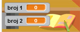

+ Za postavljanje varijabli na 'slučajan' {.blockoperators} broj između 2 i 12 dodaj svom liku sljedeće naredbe:

	```blocks
		kada je ⚑ kliknut
		postavi [broj 1 v] na (slučajni broj od (2) do (12))
		postavi [broj 2 v] na (slučajni broj od (2) do (12))

	```

+ Dodaj naredbe kojima ćeš igraču postaviti pitanje, omogućiti mu da upiše odgovor i provjeri je li odgovor točan:

	```blocks
		kada je ⚑ kliknut
		postavi [broj 1 v] na (slučajni broj od (2) do (12))
		postavi [broj 2 v] na (slučajni broj od (2) do (12))
		pitaj (spoji (broj 1) (spoji [x] (broj 2))) i čekaj
		ako <(odgovor) = ((broj 1) * (broj 2))> onda
   			govori [Točno! :)] (2) sekundi
		inače
   			govori [Netočno :(] (2) sekundi
		end
	```

+ Isprobaj projekt odgovarajući na jedno pitanje točno, a na drugo pogrešno.

+ Dodaj petlju `ponavljaj` {.blockcontrol} oko svoga kôda. Na taj način će igraču biti postavljeno više pitanja.

+ Koristeći varijablu 'vrijeme' {.blockdata} na pozornici napravi odbrojavanje vremena. Ako trebaš pomoć, potraži projekt  'Istjerivači duhova'. On sadrži naredbe kojima će se napraviti odbrojavanje (u koraku 5).

+ Ponovo isprobaj projekt - pitanja bi se trebala pojavljivati sve dok vrijeme ne istekne.

## Spremi projekt. { .save }

## Izazov: Promijena kostima {.challenge}
Možeš li promijeniti kostim lika tako da odgovara igračevu odgovoru?

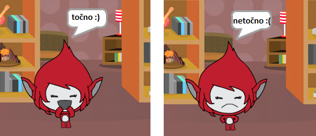

## Izazov: Dodavanje rezultata {.challenge}
Možeš li dodati rezultat svojoj igri? Možeš dodati bod za svaki točan odgovor. Želiš li otežati igru, možeš resetirati igračev rezultat na nulu čim odgovori pogrešno.

## Spremi promjene u projektu. { .save }

# Korak 2: Više igara { .activity .new-page}

Želiš li igrati igru više puta, možeš dodati gumb 'Pokreni'.

## Zadatci { .check }

+ Dodaj lik gumba iz biblioteke likova (možeš ga i nacrtati) na kojeg će igrač kliknuti kako bi pokrenuo novu igru. U kostimima dodaj na gumb tekst 'Pokreni' (ili 'Play', kako želiš)

	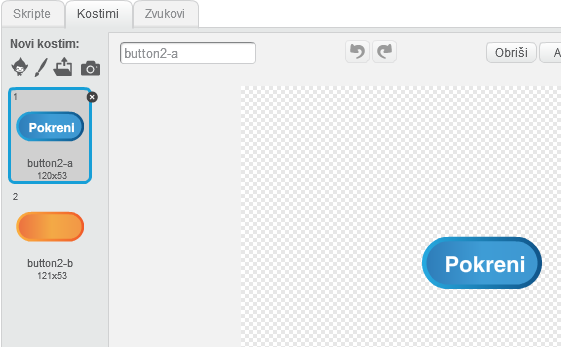

+ Gumbu dodaj sljedeće naredbe:

	```blocks
		kada je ⚑ kliknut
		prikaži

		kada je lik kliknut
		sakrij
		pošalji [kreni v]
	```

	Ovaj kôd će prikazati gumb 'Pokreni' kada se projekt pokrene. Kada igrač klikne na njega, gumb nestaje i šalje se poruka koja će pokrenuti igru.

+ Promijeni kôd svoga lika tako da igra počne kada on dobije poruku 'kreni' {.blockevents}, a ne kada je kliknuta zastavica.

	Zamijeni `kada je ⚑ kliknut` {.blockevents} kod s `Kada primim kreni` {.blockevents}.

	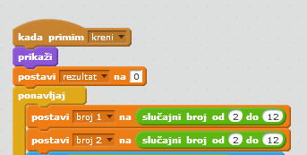

+ Klikni na zelenu zastavicu, a zatim na gumb 'Pokreni' i isprobaj program. Vidjet ćeš da igra ne počinje sve dok igrač ne pritisne gumb.

+ Primjećuješ li da odbrojavanje počinje kada se klikne zelena zastavica, a ne kada počne igra?

	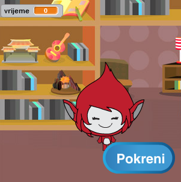

	Možeš li to popraviti?

+ Klikni na pozornicu i zamijeni naredbu `zaustavi sve` {.blockcontrol} porukom `kraj` {.blockevents}.

	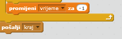

+ Dodaj sljedeće naredbe svome gumbu kako bi se na kraju igre ponovo prikazao.

	```blocks
		kada primim [kraj v]
		prikaži
	```

+ Sljedećim naredbama ćeš postići to da lik na kraju igre prestane postavljati pitanja:

	```blocks
		kada primim [kraj v]
		zaustavi [ostale skripte lika v]
	```

+ Isprobaj gumb 'Pokreni' tako što ćeš odigrati igricu nekoliko puta. Primjeti da se ponovno pojavi nakon svake igre. Kako bi ti testiranje bilo lakše, možeš skratiti trajanje igre.

	```blocks
		postavi [vrijeme v] na [10]
	```

+ Možeš čak i promijeniti izgled gumba kada miš prijeđe preko njega. 

	```blocks
		kada je ⚑ kliknut
		prikaži
		ponavljaj
   		ako <dodiruje [strelica miša v]?> onda
      			postavi efekt [riblje oko v] na (30)
   		inače
      			postavi efekt [riblje oko v] na (0)
   		end
		end
	```

	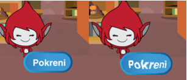

## Spremi promjene u projektu. { .save }

## Izazov: Početni zaslon {.challenge}
Možeš li dodati još jednu pozadinu na pozornicu? Ona bi trebala biti početni zaslon tvoje igre. Za promjenu pozadina koristiti naredbe `kada primim kreni` {.blockevents} i `kada primim kraj` {.blockevents}.

+ Također možeš prikazati ili sakriti svoga lika
+ Možeš prikazati ili sakriti i odbrojavanje koristeći ove naredbe:

	```blocks
		prikaži varijablu [vrijeme v]
	```

	```blocks
		sakrij varijablu [vrijeme v]
	```

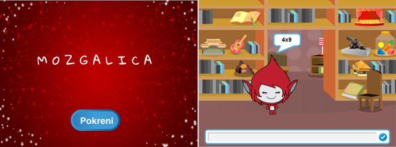

## Spremi promjene u projektu. { .save }

# Korak 3: Dodavanje grafike { .activity .new-page}

Umjesto da tvoj lik igraču samo govori 'Točno! :)' ili 'Netočno :(', možeš dodati i neku grafiku koja će mu pokazivati kako mu ide.

+ Dodaj novi lik iz knjižnice koji ima dva prikladna kostima - jedan za točan, a jedan za netočan rezultat. Možeš i dodati lik 'Button4', pa mu dodati još jedan kostim (na primjer Button 5-b). Promijeni ime lika u 'Rezultat'

	

+ Promijeni kôd lika 'Rezultat' tako da umjesto da samo govori igraču kako mu ide, šalje poruke `točno` {.blockevents} i `netočno` {.blockevents}. 

	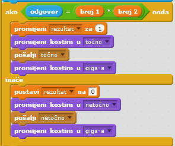

+ Sada možeš upotrijebiti ove poruke za prikazivanje 'kvačica' ili 'križić' kostima. Dodaj sljedeći kôd svom novom liku:

	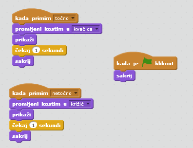	

+ Ponovo isprobaj igru. Trebaš vidjeti kvačicu svaki put kada je odgovor točan, a križić svaki put kada je pogrešan.

	

+ Primjećuješ li da su kôdovi za `kada primim točno` {.blockevents} i `kada primim netočno` {.blockevents} gotovo identični? Napravimo funkciju koja će olakšati promjene u kôdu.

	Odaberi lik 'Rezultat' i grupu naredbi `Više blokova` {.blockmoreblocks}. Klikni na gumb 'Napravi blok' i kreiraj novu funkciju koju ćeš nazvati `animiraj` {.blockmoreblocks}.

	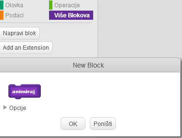

+ Dodaj sljedeće naredbe u svoju novu funkciju `animiraj` {.blockmoreblocks}, a zatim ju dva puta iskoristi:

	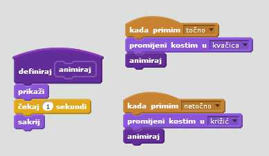

+ Želiš li da se kvačica i križić prikazuju dulje ili kraće vrijeme u svom kôdu trebaš napraviti samo jednu promjenu. Pokušaj!

+ Umjesto da se križić i kvaćica samo pokazuju, možeš promijeniti funkciju animacije tako da se grafika polako pojavljuje i nestaje.

	```blocks
		definiraj [animiraj]
		postavi efekt [duh v] na (100)
		prikaži
		ponovi (25)
   		promijeni efekt [duh v] za (-4)
		end
		sakrij
	```

## Spremi promijene u projektu. { .save }

## Izazov: Poboljšavanje animacije {.challenge}
Možeš li poboljšati animaciju svoje grafike? Možeš napraviti kôd za kvaćicu i križić tako da oni polako nestaju i pojavljuju se. A možeš koristiti i druge super efekte:

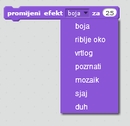

## Spremi promjene u projektu. { .save }

## Izazov: Zvuk i glazba {.challenge}
Možeš li dodati zvučne efekte i glazbu svojoj igrici? Na primjer:

+ Pojavljivanje zvuka kada igrač odgovori točno ili pogrešno;
+ Dodavanje zvuka odbrojavanju;
+ Puštanje zvuka kada vrijeme istekne;

	```blocks
		bubnjaj po (10 v) (0.1) puta
	```

+ Također možeš konstantno ponavljati glazbu (ako ne znaš kako to napraviti, korak 4 projekta 'Rock grupa' će ti pomoći).

## Spremi promjene u projektu. { .save }

## Izazov: Utrka do 10 bodova {.challenge}
Možeš li promijeniti igru tako da umjesto odgovaranja na što veći broj pitanja u 30 sekundi, igrač provjeri koliko brzo može odgovoriti točno na 10 pitanja?

To možeš napraviti mjenjanjem kôda odbrojavanja. Možeš li vidjeti što se treba promijeniti?

```blocks
	kada primim [kreni v]
	postavi [vrijeme v] na (30)
	ponavljaj dok nije <(vrijeme) = [0]>
   		čekaj (1) sekundi
   		promijeni [vrijeme v] za (-1)
	end
	pošalji [kraj v]
```

## Spremi promjene u projektu. { .save }

## Izazov: Ekran s uputama {.challenge}
Možeš li dodati ekran s uputama za igrače? Trebat će ti gumb 'Upute' i još jedna pozadina za pozornicu.


Također će ti trebati gumb 'Povratak' kako bi odveo igrača na glavni izbornik.

```blocks
	pošalji [main menu v]
```

## Spremi projekt. { .save }
