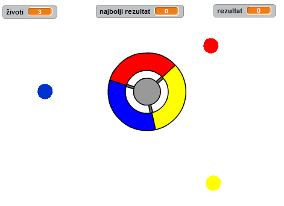
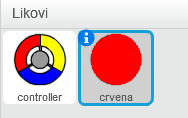
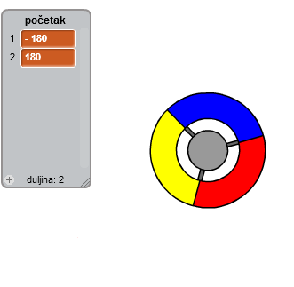
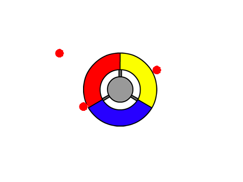
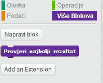
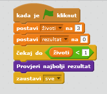

---
title: Uhvati točke
level: Scratch 2
language: hr-HR
stylesheet: scratch
embeds: "*.png"
materials: ["Club Leader Resources/*", "Project Resources/*"]
beta: true
...

# Uvod { .intro }

U ovom projektu naučit ćeš kako kreirati igru u kojoj moraš uskladiti obojane točke s dijelovima kontrolera.

<div class="scratch-preview">
  <iframe allowtransparency="true" width="485" height="402" src="http://scratch.mit.edu/projects/embed/44942820/?autostart=false" frameborder="0"></iframe>
  
</div>

# Korak 1: Izrada kontrolera { .activity }

Počnimo s izradom kontrolera koji će se koristiti za hvatanje točaka. 

## Zadatci { .check }

+ Otvori novi Scratch projekt i obriši lik mačke da dobiješ prazan projekt. Online Scratch nalazi se na adresi <a href="http://jumpto.cc/scratch-new">jumpto.cc/scratch-new</a>.

+ Ako imaš pristup do mape 'Resources' ili slike 'controller.svg' klikni ikonu 'Učitaj lik iz datoteke' i dodaj sliku 'controller.svg'. Premjesti ju u centar pozornice.

	
	
	Ako nemaš tu sliku, nacrtaj ju!
	
+ Okreni kontroler desno kada se pritisne desna strelica na tipkovnici:

	```blocks
		kada je ⚑ kliknut
		ponavljaj
   			ako <tipka [strelica desno v] pritisnuta?> onda
      				skreni ↻ (3) stupnjeva
   			end
		end
	```
+ Pokreni projekt i isprobaj kontroler - trebao bi se vrtiti u desno.

## Spremi projekt. { .save }

## Izazov: Okretanje u lijevo {.challenge}
Možeš li napraviti da se kontroler okreće u lijevu stranu kada se pritisne lijeva strelica na tipkovnici?

## Spremi promjene u projektu. { .save }

# Korak 2: Skupljanje točaka { .activity }

Dodajmo nekoliko točaka kako bi ih igrač pokupio s kontolerom.

## Zadatci { .check }

+ Kreiraj novog lika koji se zove 'crvena'. Taj lik bi trebao biti mala crvena točka.

	

+ Točki dodaj sljedeće naredbe kako bi se svakih nekoliko sekundi kreirao njezin duplikat:

	```blocks
		kada je ⚑ kliknut
		čekaj (2) sekundi
		ponavljaj
   			kloniraj [ja v]
   			čekaj (slučajni broj od (5) do (10)) sekundi
		end

	```

+ Kada god se pojavi duplikat, želiš da se pojavi u jednome od četiri kuta pozornice:

	

	Kako bi to napravili najprije kreiraj novu listu koja se zove `početak` {.blockdata}, klikni na znak `(+)`i dodaj vrijednosti `-180` i `180`.

	

+ Ta dva elementa liste ćeš koristiti za odabiranje nasumičnog kuta pozornice. Sljedeće naredbe dodaj liku 'točke' kako bi se svaki novi duplikat pojavio u nasumičnom kutu, a onda se polako kretao prema kontroleru.

	```blocks
		kada krećem kao klon
		idi na x:(element (nasumično v) iz [početak v]) y:(element (nasumično v) iz [početak v])
		okreni se k [controller v]
		prikaži
		ponavljaj dok nije <dodiruje [controller v]?>
   			idi (1) koraka
		end
	```

	Prethodnim odabiremo jednu od vrijednosti `-180` ili `180` za x _i_ y pozicije točke, što znači da će svaki puta duplikat krenuti iz jednoga kuta pozornice.

+ Pokreni projekt. Trebaš vidjeti puno crvenih točaka koje se pojavljuju u svakome uglu ekrana i polako se pokreću prema kontroleru.

	

+ Napravi dvije nove varijable koje se zovu`životi` {.blockdata} i `rezultat` {.blockdata}.

+ Pozornici dodaj naredbe kojima ćeš na početku igrice postaviti vrijednost varijable `životi` {.blockdata} na 3 i `rezultat` {.blockdata} na 0.

+  Na kraj koda `kada krećem kao klon` {.blockcontrol} crvene točke dodaj naredbe kojima ćeš dodati 1 bod igračevu `rezultatu` {.blockdata} ako se boje poklapaju, a  ako se ne poklapaju oduzeti 1 `život` {.blockdata}.

	```blocks
		idi (5) koraka
		ako <dodiruje boju [#FF0000]?> onda
   			promijeni [rezultat v] za (1)
   			zasviraj [pop v]
		inače
   			promijeni [životi v] za (-1)
   			zasviraj [laser1 v]
		end
		izbriši klona
	```

+ Na kraj skripte na pozornici dodaj naredbe kojima ćeš završiti igru kada  igrač izgubi sva 3 života:

	```blocks
		čekaj do <(životi) < [1]>
		zaustavi [sve v]

	```

+ Pokreni program i isprobaj igricu da vidiš radi li kako treba.

## Spremi promjene u projektu { .save }

## Izazov: Više točaka {.challenge}
Kloniraj 'crvenu' točku dva puta i imenuj dva nova lika 'žuta' i 'plava'.


Uredi te likove (uključujući i njihov kôd), tako da svaka točka odgovara boji kontrolera. Nemoj zaboraviti projeravati svoj projekt i uvjeriti se da igrač dobija bodove i gubi živote kako bi i trebao, te da igra nije previše lagana ili previše teška.


## Spremi promjene u projektu { .save }

# Korak 3: Povećavanje težine { .activity .new-page}

Napravimo da igrica postaje sve teža što dulje ju igrač igra, polako smanjujući razmak između točaka koje se pojavljuju.

## Zadatci { .check }

+ Napravi novu varijablu koja se zove `odgoda` {.blockdata}.

+ Na pozornici napravi novu skupinu naredbi koja postavlja vrijednost varijable odgoda na visoki broj, a onda polako smanjuje vrijeme odgode.

	```blocks
		kada je ⚑ kliknut
		postavi [odgoda v] na (8)
		ponavljaj dok nije <(odgoda) = (2)>
   			čekaj (10) sekundi
   			promijeni [odgoda v] za (-0.5)
		end
	```

	Primijeti da je ovo vrlo slično načinu na koji radi odbrojavanje igre!

+ Sada iskoristi varijablu `odgoda` {.blockdata} kôdu za crvene, plave i žute točke: ukloni naredbu koja čeka nasumičan broj sekundi prije izrade duplikata i zamijeni ju varijablom `odgoda` {.blockdata}: 

	```blocks
		čekaj (odgoda) sekundi

	```

+ Pokreni projekt da provjeriš smanjuje li se razmak između točaka. Radi li to za sve tri boje točaka? Možeš li vidjeti da se vrijednost varijable `odgoda` {.blockdata} smanjuje?

## Spremi promjene u projektu { .save }

## Izazov: Brže kretanje točaka {.challenge}
Možeš li poboljšati igru dodajući varijablu `brzina` {.blockdata}, tako da se točke počnu kretati korak po korak i polako postaju sve brže? To radi slično načinu na koji smo koristili varijablu `odgoda` {.blockdata} Te naredbe ti mogu pomoći. 

## Spremi promjene u projektu { .save }

# Korak 4: Najbolji rezultat { .activity }

Spremimo najbolji rezltat kako bi igrači vidjeli kako im ide.

## Zadatci { .check }

+ Napravi novu varijablu koja se zove `najbolji rezultat` {.blockdata}.

+ Klikni na pozornicu i napravi novi blok naredbi `Provjeri najbolji rezultat` {.blockmoreblocks}.

	

+ Dodaj taj blok prije završetka igre.

	

+ Sada dodaj sljedeće naredbe bloku naredbi `Provjeri najbolji rezultat` {.blockmoreblocks} kako bi se trenutni `rezultat` {.blockdata} spremio kao kao `najbolji rezultat` {.blockdata} `ako` {.blockcontrol} je to najbolji rezultat do sada:

	```blocks
		definiraj [Provjeri najbolji rezultat]
		ako <(rezultat) > (najbolji rezultat)> onda
   		postavi [najbolji rezultat v] na (rezultat)
		end
	```

+ Pokreni igru i provjeri mijenja li se`najbolji rezultat` {.blockdata} kako bi trebao.

## Spremi promjene u projektu { .save }

## Izazov: Poboljšaj svoju igru! {.challenge}
Možeš li smisliti načine na koje ćeš poboljšati svoju igru? Na primjer, možeš napraviti posebne točke koje:

+ poduplaju tvoj rezultat;
+ usporavaju točke;
+ skrivaju sve druge točke na ekranu!

## Spremi projekt { .save }

## Izazov: Izbornik {.challenge}
Možeš li igri dodati izbornik (sa gumbima)? Trebaš dodati ekran s uputama ili odvojeni ekran koji će pokazivati najbolji rezultat. Ako trebaš pomoć s time, projekt 'Mozgalica' će ti pomoći.
