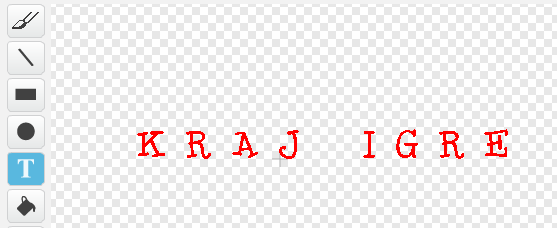

---
title: Ratovi klonova
level: Scratch 2
language: hr-HR
stylesheet: scratch
embeds: "*.png"
materials: ["Club Leader Resources/*"]
beta: true
...

## Projekt doprinosa zajednice { .challenge .pdf-hidden }
Ovaj projekt kreirao je Erik. Želite li doprinijeti svojim projektom [kontaktirajte nas na Githubu](https://github.com/CodeClub).

# Uvod { .intro }

U ovome projektu naučit ćeš napraviti igricu u kojoj moraš spasiti Zemlju od čudovišta iz svemira.

<div class="scratch-preview">
  <iframe allowtransparency="true" width="485" height="402" src="http://scratch.mit.edu/projects/embed/46018140/?autostart=false" frameborder="0"></iframe>
  
</div>

# Korak 1: Izrada svemirskog broda { .activity }

Napravimo svemirski brod koji će braniti Zemlju!

## Zadatci { .check }

+ Otvori novi Scratch projekt i obriši lik mačke da dobiješ prazan projekt. Online Scratch nalazi se na adresi <a href="http://jumpto.cc/scratch-new">jumpto.cc/scratch-new</a>.

+ Dodaj u projekt zvjezdanu pozadinu i svemirski brod. Smanji svemirski brod i pomakni ga na dno ekrana.

	

+ Dodaj naredbe kojima ćeš pomicati svemirski brod u lijevo kada se pritisne lijeva strelica na tipkovnici:

	```blocks
		kada je ⚑ kliknut
		ponavljaj
   		ako <tipka [strelica lijevo v] pritisnuta?> onda
      			promijeni x za (-4)
   		end
		end

	```

+ Dodaj naredbe koji će pokretati svemirski brod u desno kada se pritisne desna strelica na tipkovnici.

+ Pokreni projekt i provjeri možeš li kontrolirati svemirski brod sa strelicama na tipkovnici.

## Spremi projekt. { .save }

# Korak 2: Munje { .activity }

Dajmo svemirskome brodu mogućnost da ispaljuje munje.

## Zadatci{ .check }

+ Dodaj lik 'munje' iz biblioteke likova. Smanji ju prema želj. Odaberi karticu 'Kostimi' i okreni munju prema gore.

	

+ Kada se igra pokrene, munja bi trebala biti skrivena sve dok svemirski brod ne ispali laserske topove. Dodaj liku munje sljedeće naredbe:

	```blocks
		kada je ⚑ kliknut
		sakrij
	```

+ Dodaj slijedeće naredbe svemirskom brodu kako bi se nova munja stvorila svaki puta kada se pritisne razmaknica.


	```blocks
		kada je ⚑ kliknut
		ponavljaj
   			ako <tipka [razmaknica v] pritisnuta?> onda
      				kloniraj [Lightning v]
   			end
		end

	```

+ Kada god se kreira nova munja trebala bi se pojaviti na istome mjestu kao i svemirski brod, pomicati se pozornicom sve dok ne dođe do ruba. Dodaj sljedeće naredbe liku munje:

	```blocks
		kada krećem kao klon
		idi do [Spaceship v]
		prikaži
		ponavljaj dok nije <dodiruje [rub v]?>
   			promijeni y za (10)
		end
		izbriši klona
	```

Bilješka: Pokrećemo novog klona prema svemirskome brodu dok je on još uvijek skriven.

+ Pokreni projekt i testiraj munje držeći pritisnutu razmaknicu.

## Spremi promjene u projektu { .save }

## Izazov: Popravljanje munje {.challenge}
Što se događa ako cijelo vrijeme držiš razmaknicu? Možeš li iskoristiti naredbu `čekaj` {.blockcontrol} da to popraviš?

## Spremi promjene u projektu { .save }

# Korak 3: Leteći svemirski nilski konji { .activity }

Dodajmo leteće nilske konje koji pokušavaju uništiti svemirski brod. 

## Zadatci { .check }

+ Dodaj lik letećeg nilskog konja ('Hippo1') iz knjižnice likova i prilagodi njegovu veličinu igrici.

	

+ Postavi stil rotacije tako da se može kretati samo lijevo-desno i dodaj sljedeću naredbu kako bi on na početku igre bio sakriven:

	```blocks
		kada je ⚑ kliknut
		sakrij

	```

+ Kreiraj novu varijablu `brzina` {.blockdata}. Neka ona vrijedi samo za lik nilskoga konja.

	

	Kada pored imena varijable piše i ime lika, to znači da je varijabla ograničena samo na njega: 

	

+ Sljedeće naredbe će kreirati novog nilskoga konja svakih nekoliko sekundi. Postavi ih na pozornicu: 

	```blocks
		kada je ⚑ kliknut
		ponavljaj
   			čekaj (slučajni broj od (2) do (4)) sekundi
   		kloniraj [Hippo1 v]
		end

	```

+ Kada duplikat nilskog konja krene, neka se kreće po pozornici (nasumičnom brzinom) dok ga ne udari munja. Dodaj ovaj kôd liku nilskoga konja:

	```blocks
		kada krećem kao klon
		postavi [brzina v] na (slučajni broj od (2) do (4))
		idi na x:(slučajni broj od (-220) do (220)) y:(150)
		prikaži
		ponavljaj dok nije <dodiruje [lightning v]?>
   			idi (brzina) koraka
   			skreni ↻ (slučajni broj od (-10) do (10)) stupnjeva
   			ako si na rubu, okreni se
		end
		izbriši klona
	```

+ Pokreni projekt i provjeri kôd za nilske konje. Novi nilski konj trebao bi se pojavljivati svakih nekoliko sekundi i svaki od njih bi se trebao kretati vlastitom brzinom.

	

+ Provjeri i munju. Kada udari nilskog konja, nestane li on?

+ Kada nilski konj dodirne svemirski brod neka brod eksplodira. Da bi prikazali eksploziju broda, moramo mu dodati novi kostim. 
	
	

	Najprije odaberi karicu 'Kostimi'. Kostim 'spaceship-a' preimenuj u 'normalan'. Kostim 'spaceship-b' slobodno obriši.  
	Kostim 'udaren' možeš napraviti tako da iz knjižnice kostima učitaš sliku 'Sunca', a zatim alatom 'Oboji oblik' promijeniš njegovu boju. 

	

+ Dodaj sljedeće naredbe svemirskome brodu tako da zamijeni kostime kada se sudari s letećim nilskim konjem:

	```blocks
		kada je ⚑ kliknut
		ponavljaj
   			promijeni kostim u [normalan v]
   			čekaj do <dodiruje [Hippo1 v]?>
   			promijeni kostim u [udaren v]
   			pošalji [udaren v]
   			čekaj (1) sekundi
		end
	```

+ Poruku 'udaren' iz prethodnoga kôda možeš iskoristiti za to da svi nilski konji nestanu kada je svemirski brod udaren.

	Dodaj nilskome konju sljedeće naredbe:

	```blocks
		kada primim [udaren v]
		izbriši klona

	```

+ Provjeri kôd tako što ćeš pokrenuti novu igru i sudariti se s nilskim konjem.

	

## Spremi promjene u projektu. { .save }

## Izazov: Životi i bodovi {.challenge}
Možeš li dodati varijable `životi` {.blockdata}, `rezultat` {.blockdata} ili čak `najbolji rezultat` {.blockdata} svojoj igrici? Projekt "Uhvati točke" će ti pomoći ako naiđeš na problem.

## Spremi promjene u projektu.{ .save }

# Korak 4: Šišmiši s voćem { .activity }

Napravimo šišmiša koji baca naranče na svemirski brod.

## Zadatci { .check }

+ Dodaj lika šišmiša koji će se čitavo vrijeme igre kretati lijevo-desno u gornjem dijelu pozornice. Ne zaboravi provjeriti kôd.
	Napomena: ako se šišmiš prilikom okretanja u lijevo okrene i naglavačke, postavi stil rotacije lijevo-desno.

	

+ Pogledaš li kostime šišmiša, vidjet ćeš da on već ima dva kostima:

	

	Iskoristi naredbu `sljedeći kostim` {.blocklooks} da postigneš da šišmiš maše krilima dok se pomiče.

+ Iz knjižnice likova dodaj lik naranče ('Orange').

	


+ Šišmišu dodaj sljedeće naredbe kako bi se svakih nekoliko sekundi dodala nova duplicirana naranča.

	```blocks
		kada je ⚑ kliknut
		ponavljaj
   			čekaj (slučajni broj od (5) do (10)) sekundi
   			kloniraj [Orange v]
		end

	```

+ Klikni na lik naranče i dodaj sljedeće naredbe. Tako će šišmiš ispustiti duplikat naranče prema svemirskome brodu.

	```blocks
		kada je ⚑ kliknut
		sakrij

		kada krećem kao klon
		idi do [Bat1 v]
		prikaži
		ponavljaj dok nije <dodiruje [rub v]?>
   			promijeni y za (-4)
		end
		izbriši klona

		kada primim [udaren v]
		izbriši klona


	```

+ Promijeni kôd za svemirski brod, tako da on bude 'udaren' kada dodirne naranču ili nilskog konja:

	```blocks
		čekaj do <<dodiruje [Hippo1 v]?> ili <dodiruje [Orange v]?>>
	``` 

+ Testiraj svoju igricu. Što se dogodi udari padajuća naranča udari u svemirski brod?

## Spremi promjene u projektu. { .save }

# Korak 5: Kraj igre { .activity }

Dodajmo poruku 'Kraj igre'.

## Zadatci { .check }

+ Ako već nisi, napravi novu varijablu koja se zove `životi` {.blockdata}. Svemirski brod treba početi s 3 života i izgubiti život kada se sudari s neprijateljem. Igra treba završiti kada igraču ponestane života. Ako trebaš pomoć pogledaj projekt 'Uhvati točke'. 

+ Alatom za tekst nacrtaj lik 'Kraj igre'.

	

+ Pozornici dodaj naredbu koja će poslati poruku `kraj igre` {.blockevents} kada igra treba završiti, odnosno kada igrač ostane bez života.

	```blocks
		pošalji [kraj igre v] i čekaj
	```

+ Na kraju, dodaj naredbe liku 'Kraj igre', tako da se pokaže na kraju igre:

	```blocks
		kada je ⚑ kliknut
		sakrij

		kada primim [kraj igre v]
		prikaži

	```

+ Poreni projekt i testiraj igru. Koliko bodova možeš sakupiti? Možeš li smisliti načine kako bi se igra moglaa olakšati ili otežati?

## Spremi promjene u projektu. { .save }

## Izazov: Poboljšaj igricu{.challenge}

Koja poboljšanja možeš napraviti u igrici? Evo nekih ideja:

+ Dodaj likove koji se mogu sakupiti kako bi igrač dobio dodatan život;


+ Dodaj stijene koje svemirski brod mora izbijeći;
	


+ Kada rezultat dođe do 100, napravi da se pojavi još neprijatelja.

```blocks
	čekaj do <(rezultat) = [100]>
```

## Spremi projekt. { .save }
