---
title: Kreiraj vlastiti svijet
level: Scratch 2
language: hr-HR
stylesheet: scratch
embeds: "*.png"
materials: ["Club Leader Resources/*","Project Resources/*"]
...

# Uvod{ .intro }

U ovom projektu naučit ćeš napraviti vlastitu igricu avanture. 

<div class="scratch-preview">
  <iframe allowtransparency="true" width="485" height="402" src="http://scratch.mit.edu/projects/embed/34248822/?autostart=false" frameborder="0"></iframe>
  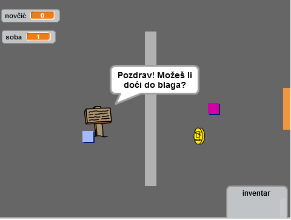
</div>

# Step 1: Izrada igrača { .activity }

Krenimo kreirajući igrača koji će se kretati po tvom svijetu. 

## Zadatci { .check }

+ Otvori novi Scratch projekt i obriši lik mačke tako da dobiješ prazan projekt. Online Scratch nalazi se na adresi <a href="http://jumpto.cc/scratch-new">jumpto.cc/scratch-new</a>.

+ Za ovaj projekt trebat će ti mapa 'Project Resources' koja sadrži sve slike koje će ti trebati. Pristup mapi omogućit će ti voditelj radionice. 

	

+ Dodaj sliku 'room1.png' za novu pozadinu pozornice i sliku 'player.png' za novog lika. Ukoliko nemaš pristup slikama, slobodno nacrtaj svoje! Ovako bi projekt sada trebao izgledati:  

	

+ Za kretanje igrača koristit će se tipke strelica na tipkovnici. Kada igrač pritisne strelicu gore, lik se treba kretati prema gore. To ćeš postići mijenjanjem koordinate y. Liku igrača dodaj sljedeće naredbe: 

	```blocks
		kada je ⚑ kliknut
		ponavljaj
   			ako <tipka [strelica gore v] pritisnuta?> onda
      				promijeni y za (2)
   			end
		end
	```

+ Provjeri naredbe tako što ćeš kliknuti na zastavicu, a zatim drži pritisnutu strelicu gore. Pomiče li se igrač prema gore? 

	

+ Za pomicanje igrača u lijevo trebaš dodati još jednu `ako je` {.blockcontrol} naredbu koja će mijenjati x koordinatu. 

	```blocks
		kada je ⚑ kliknut
		ponavljaj
   		ako <tipka [strelica gore v] pritisnuta?> onda
      			promijeni y za (2)
   		end
   		ako <tipka [strelica lijevo v] pritisnuta?> onda
      			promijeni x za (-2)
   		end
		end

	```

## Izazov: pomicanje u sva četiri smjera {.challenge}
Možeš li dodati naredbe kojima ćeš svog igrača pomicati u sva četiri smjera: gore, dolje, lijevo i desno? Iskoristi prethodne naredbe! 

## Spremi projekt { .save }

+ Pokreni projekt. Uočit ćeš da se igrač može kretati i kroz zidove. 

	

+ Da to popraviš, morati ćeš igrača vratiti natrag kada dotakne zid. Ovdje su naredbe koje ti trebaju za to: 

	```blocks
		kada je ⚑ kliknut
		ponavljaj
   		ako <tipka [strelica gore v] pritisnuta?> onda
      			promijeni y za (2)
      			ako <dodiruje boju [#BABABA]?> onda
         			promijeni y za (-2)
      			end
   		end
		end
	```

	Primijeti da se nova naredba `ako`{.blockcontrol} `dodiruje boju`{.blocksensing} nalazi _unutar_ naredbe  `ako`{.blockcontrol} `tipka [strelica gore] pritisnuta`{.blocksensing}.

+ Testiraj nove naredbe pomičući se kroz zid - sada to ne bi trebalo biti moguće.
	

+ Napravi to i za lijevu strelicu - vrati natrag igrača ako dotakne zid. Kôd za lik igrača sada bi trebao izgledati ovako: 

	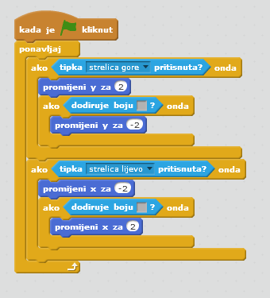

## Izazov: Popravljanje pokreta igrača {.challenge}
Dodaj naredbe kojima ćeš onemogućiti igrača da prolazi kroz zid u bilo kojem smjeru. Prethodni kôd ti može pomoći. 

## Spremi promjene u projektu { .save }

# Korak 2: Programiraj svoj svijet { .activity }

Dopustimo igraču da prođe kroz vrata u drugu sobu. 

## Zadatci { .check }

+ Dodaj još dvije pozadine na pozornicu ('room2.png' i 'room3.png'), tako da ukupno imaš tri pozadine. Provjeri jesu li u ispravnom redoslijedu - to će ti koristiti kasnije.  

	

+ Trebat će ti nova varijabla `soba` {.blockdata} koja će pratiti u kojoj sobi se igrač nalazi.  

	

+ Kada igrač dotakne narančasta vrata u prvoj sobi, treba se prikazati sljedeća pozadina i igrač bi se trebao vratiti na lijevu stranu pozornice. Ovdje su naredbe koje će ti trebati. Postavi ih unutar petlje `ponavljaj` {.blockcontrol}:

	```blocks
		ako <dodiruje boju [#F2A24A]?> onda
   			promijeni pozadinu na [sljedeća pozadina v]
   			idi na x:(-200) y:(0)
   			promijeni [soba v] za (1)
		end
	```

+ Sljedeće naredbe dodaj na  _početak_ bloka naredbi lika igrača (prije petlje `ponavljaj` {.blockcontrol} loop) da se osiguraš da će se sve vratiti na početnu poziciju kada se klikne zastavica. 

	```blocks
		postavi [room v] na (1)
		idi na x:(-200) y:(0)
		promijeni pozadinu na [room1 v]
	```

+ Klikni na zastavicu i pomiči igrača kroz narančasta vrata. Prelazi li igrač na novi ekran? Mijenja li se vrijednost varijable `soba` {.blockdata} na 2?

	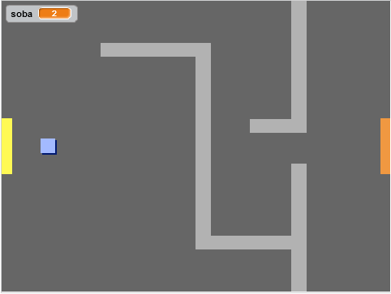

## Izazov: Vraćanje u prethodnu sobu {.challenge}
Možeš li napraviti da se igrač vrati u prethodnu sobu kada prođe kroz žuta vrata? Upamti da će taj kôd biti _vrlo_ sličan kôdu kojim igrač prelazi u sljedeću sobu. 

## Spremi promjene u projektu { .save }

# Korak 3: Znakovi { .activity }

Dodajmo znakove koji će voditi igrača.

## Zadatci { .check }

+ Dodaj novi lik iz datoteke - 'sign.svg' i prilagodi mu veličinu. Preimenuj lika u 'znak dobrodošlice'.

	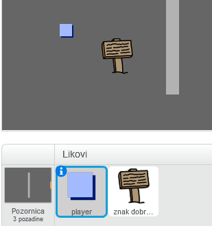

+ Taj znak treba biti vidljiv jedino u prvoj sobi. Da to osiguraš, dodaj mu sljedeće naredbe:

	```blocks
		kada je ⚑ kliknut
		ponavljaj
   		ako <(room) = [1]> onda
      			prikaži
   		inače
      			sakrij
   		end
		end
	```

+ Provjeri kôd pomicanjem između soba. Znak bi trebao biti vidljiv samo u prvoj sobi. 

	

+ Znak nije dobar ako ništa ne kaže! Dodajmo naredbe (u novom, odvojenom bloku) koje će prikazati poruku ako igrač dodirne znak: 

	```blocks
		kada je ⚑ kliknut
		ponavljaj
   		ako <dodiruje [player v]?> onda
      			reci [Pozdrav! Možeš li doći do blaga?]
   		inače
      			reci []
   		end
		end

	```
+ Testiraj znak i vidjet ćeš poruku kada ga igrač dotakne. 

	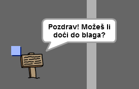

## Spremi promjene u projektu { .save }

## Izazov: Blago! {.challenge}
Možeš li dodati novi lik - škrinju s blagom. Iskoristi sliku 'chest.svg'. Škrinju postavi u treću sobu. Kada ju igrač dotakne prikaži poruku 'Bravo!'.

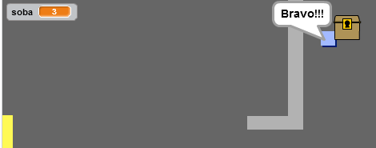

## Spremi promjene u projektu{ .save }

# Korak 4: Nove osobe { .activity }

Dodaj u svoj svijet druge osobe s kojima igrač može komunicirati tijekom igre. 

## Zadatci { .check }

+ Koristeći sliku 'person.png' dodaj novi lik u igru. 

	

+ Liku osobe dodaj sljedeće naredbe kako bi mogao razgovarati s igračem. Primjetit ćeš da je kôd vrlo sličan kôdu za znak.

	```blocks
		kada je ⚑ kliknut
		idi na x:(-200) y:(0)
		ponavljaj
   		ako <dodiruje [player v]?> onda
      			reci [Znaš li da možeš proći kroz narančasta i žuta vrata?]
   		inače
      			reci []
   		end
		end
	```

+ Sljedećim naredbama omogućit ćeš osobi da se kreće: 

	```blocks
		idi (1) koraka
		ako si na rubu, okreni se
	```

	Tvoja osoba ponašat će se drugačije ovisno o tome na koje mjesto postaviš prethodne naredbe - unutar petlje `ponavljaj` {.blockcontrol} ili unutar naredbe `ako je` {.blockcontrol}. Pokušaj oboje i vidi koji ti se način više sviđa. 

	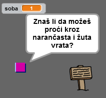

+ Primjeti da se osoba okreće naglavačke kada se okrene. Zaustavi to naredbom 'postavi stil rotacije' {.blockmotion} ili klikom na ikonu informacije (`i`{.blockmotion}) i odabirom točke. 

	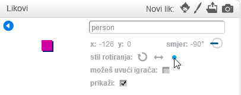

## Izazov: Poboljšaj svoju osobu {.challenge}
Možeš li svojoj novoj osobi dodati naredbe kojima će se ona pojavljivati samo u prvoj sobi? Ne zaboravi isprobati svoj novi kôd! 

## Spremi promjene u projektu { .save }

+ Možeš dodati i patrolirajuće neprijatelje koji završavaju igru kada ih igrač dotakne. Dodaj novi lik neprijatelja i promijeni stil rotacije, kao i za prethodnog lika osobe. 

+ Neprijatelju dodaj naredbe kojima ćeš osigurati da se on pojavljuje samo u drugoj sobi.

+ Također trebaš dodati naredbe kojima ćeš omogućiti neprijatelju da se kreće, te da igra završi ako ga igrač dotakne. Lakše ćeš to napraviti u odvojenim blokovima naredbi. Ovako treba izgledati neprijateljev blok naredbi:

	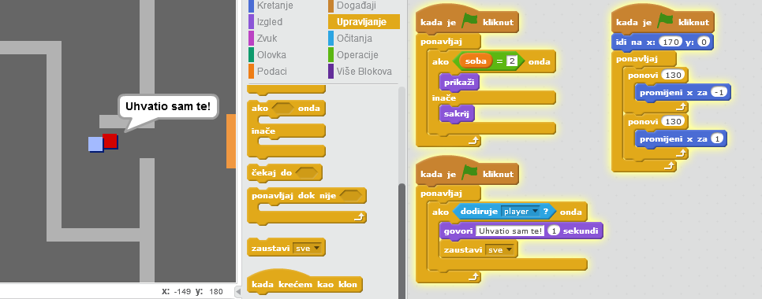

+ Testiraj neprijatelja da se uvjeriš da:
	+ Je vidljiv samo u drugoj sobi;
	+ Patrolira sobom;
	+ Igra završava ako ga igrač dotakne. 

## Spremi promjene u projektu { .save }

## Izazov: Više neprijatelja {.challenge}
Možeš li kreirati novog neprijatelja u trećoj sobi koji patrolira gore i dolje kroz prazninu u zidu? 


## Spremi promjene u projektu { .save }

# Korak 5: Sakupljanje novčića { .activity }

## Zadatci { .check }

+ Dodaj novu varijablu u projekt i nazovi ju `novčić` {.blockdata}.

+ Dodaj lik novčića ('coin') i prilagodi njegovu veličinu igri.


+ Liku novčića dodaj naredbe kojima ćeš omogućiti da se on pojavljuje samo u prvoj sobi. 

+ Zatim dodaj naredbe kojima ćeš povećavati vrijednost varijable `novčić`{.blockdata} za 1 kada igrač pokupi novčić:

	```blocks
		kada je ⚑ kliknut
		čekaj do <dodiruje [player v]?>
		promijeni [novčić v] za (1)
		zaustavi [ostale skripte lika v]
		sakrij
	```

	Naredba `zaustavi ostale skripte lika `{.blockcontrol} osigurava da se novčić ne više prikazuje ako je pokupljen. 

+ Ne zaboravi dodati naredbu kojom ćeš na početku igre postaviti vrijednost varijable `novčić` {.blockdata} na 0.

+ Isprobaj projekt - kada pokupiš novčić rezultat bi se trebao promijeniti na 1. 

## Izazov: Više novčića {.challenge}
Možeš li dodati više novčića u igru? Neka budu u različitim sobama, a neke od njih mogu i čuvati patrolirajući neprijatelji. 

# Korak 6: Vrata i ključevi { .activity }

## Zadatci { .check }

+ Iz mape sa slikama učitaj novog lika - 'key-blue.svg'. Prebaci se na treću pozadinu i postavi ključ negdje gdje će ga biti teško dosegnuti. 

 	

+ Osiguraj da ključ bude vidljiv samo u sobi 3. 

+ Kreiraj novu listu. Nazovi je `inventar` {.blockdata}. U nju će se spremati sve što igrač pokupi. 

+ Kôd za skupljanje ključa je sličan kôdu kojim smo prikupljali novčiće. Razlika je samo u tome što će se ključ dodavati u inventar. 

	```blocks
		kada je ⚑ kliknut
		čekaj do <dodiruje [player v]?>
		dodaj [blue key] u [inventar v]
		zaustavi [ostale skripte lika v]
		sakrij
	```

+ Isprobaj projekt i provjeri možeš li pokupiti ključ i nalazi li se on u inventaru. Ne zaboravi na pozornicu dodati naredbe kojima ćeš isprazniti inventar na početku.  

	```blocks
		obriši (sve v) iz [inventar v]
	```

+ Iz mape sa slikama učitaj novi lik. Iskoristi sliku 'door-blue.png'. Plava vrata postavi na treću pozadinu, u prazninu između dva zida.  

	

+ Liku vrata dodaj naredbe tako da bude vidljiv samo u trećoj sobi. 

+ Ako se plavi ključ nalazi u inventaru sakrij plava vrata sakrij i dopusti igraču prolaz:

	```blocks
		kada je ⚑ kliknut
		čekaj do <[iinventar v] sadrži [blue key]>
		zaustavi [ostale skripte lika v]
		sakrij
	```

+ Isprobaj projekt i provjeri možeš li pokupiti plavi ključ i otvoriti vrata. 

## Spremi promjene u projektu { .save }

## Izazov: Napravi svoj svijet {.challenge}
Sada možeš nastaviti kreirati svoj svijet. Evo nekoliko ideja: 

+ Promijeni postavke igre i grafiku;
+ Dodaj zvukove i glazbu;
+ Dodaj više ljudi, neprijatelja, znakova i novčića;
+ Dodaj crvena i žuta vrata koja će trebati ključeve za otvaranje;
+ Dodaj više soba;
+ Dodaj više korisnih stvari;

+ Iskoristi novčiće da dobiješ informacije od ljudi;

	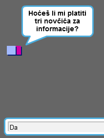

+ Možeš čak dodati južna i sjeverna vrata kako bi se igrač mogao kretati između soba u sva četiri smjera. Na primjer, imaš li devet soba možeš razmišljati o njima kao da se nalaze u rešetci 3x3.  Za spuštanje u nivo ispod možeš broj sobe uvećati za 3. 

	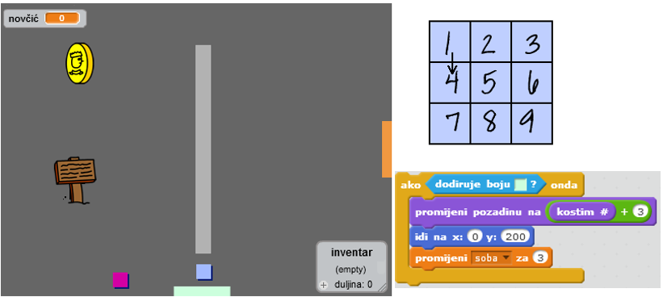

## Spremi projekt { .save }

