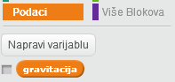
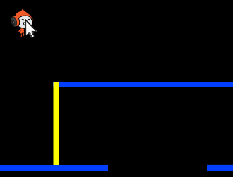
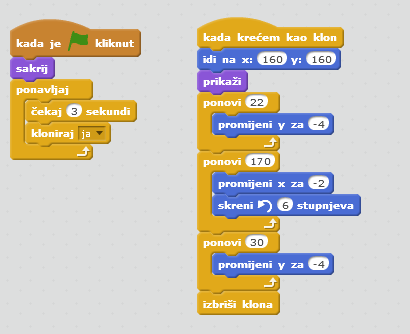

---
title: Preskakanje lopti
level: Scratch 2
language: hr-HR
stylesheet: scratch
embeds: "*.png"
materials: ["Club Leader Resources/*","Project Resources/*"]
...

# Uvod { .intro }

U ovom projektu ćeš naučiti napraviti igru u kojoj igrač treba izbjegavati lopte koje se kreću i stići do kraja nivoa.

<div class="scratch-preview">
  <iframe allowtransparency="true" width="485" height="402" src="http://scratch.mit.edu/projects/embed/39740618/?autostart=false" frameborder="0"></iframe>
  
</div>

# Korak 1: Kretanje lika { .activity }

Krenimo kreiranjem lika koji se može kretati lijevo i desno i penjati po preprekama. 

## Zadatci { .check }

+ Otvori novi Scratch projekt i obriši mačku tako da projekt bude prazan. Online Scratch nalazi se na linku: <a href="http://jumpto.cc/scratch-new">jumpto.cc/scratch-new</a>.

+ Za ovaj projekt potrebna ti je mapa 'Project Resources' koja sadrži sliku za pozadinu. Ukoliko ju nemaš, zamoli svog volontera da ti pomogne. 

	

+ Učitaj sliku 'background.png' za pozadinu pozornice (a možeš nacrtati i svoju). Crtaš li svoj nivo, vodi računa o tome da razine i stupovi budu različitih boja, te da su ti potrebna vrata (ili nešto slično) do kojih igrač treba stići. Projekt će izgledati otprilike ovako: 

	

+ Dodaj novog lika i smanji ga tako da se veličinom uklopi u igru. Najbolje bi bilo da odabrani lik ima više kostima, tako da možeš napraviti da izgleda kao da hoda. 

	
	

+ Upotrijebimo strelice za pomicanje lika po pozornici. Kada igrač pritisne desnu strelicu tvoj lik se treba okrenuti u desno, napraviti nekoliko koraka i promijeniti kostim: 

	```blocks
		kada je ⚑ kliknut
		ponavljaj
   			ako <tipka [strelica desno v] pritisnuta?> onda
      			okreni se u smjeru (90 v)
      			idi (3) koraka
      			sljedeći kostim
   		end
		end
	```

+ Provjeri kreće li se lik tako što ćeš kliknuti na zastavicu i držati pritisnutu desnu strelicu na tipkovnici. Kreće li se tvoj igrač u desno? Izgleda li kao da hoda?

	

+ Za pomicanje lika u lijevo potrebno je unutar petlje `ponavljaj` {.blockcontrol} dodati još jednu naredbu `ako` {.blockcontrol}.  
+ Pokreni program i provjeri radi li ispravno. Okreće li se možda igrač naopako kada skreće lijevo?  Ako da, na početak programa dodaj blok 

	```blocks
	postavi stil rotacije [lijevo-desno v]
	```

+ Da se popne na stup, igrač se treba polako pomicati prema gore ako je pritisnuta strelica prema gore i ako igrač dodiruje ispravnu boju. Dodaj ove naredbe unutar petlje `ponavljaj` {.blockcontrol} :

	```blocks
		ako <<tipka [strelica gore v] pritisnuta?> i <dodiruje boju [#FFFF00]?>> onda
   			promijeni y za (4)
		end

	```

+ Isprobaj penje li se tvoj igrač uz žute stupove i može li doći do kraja razine? 

	

## Spremi projekt { .save }

## Izazov: Dovršavanje nivoa {.challenge}
Možeš li dodati više naredbi svom igraču, tako da on kaže nešto `ako` {.blockcontrol} stigne do smeđih vrata?


## Spremi promjene u projektu { .save }

# Korak 2: Gravitacija i skakanje { .activity }

Dodavanjem gravitacije i omogućavanjem skakanja napravit ćemo da igrač bude još realističniji. 

## Zadatci { .check }

+ Primjeti da se igrač može kretati i po "praznim" dijelovima platforme za igru. Pokušaj ga pokretati po crnim dijelovima i provjeri što se događa. 

	

+ Da bi to popravili, dodajmo u igru gravitaciju. Kreiraj novu varijablu i nazovi ju `gravitacija` {.blockdata}. Slobodno ju sakrij da se ne prikazuje na pozornici. 

	

+ Dodaj sljedeći blok naredbi. Njime ćeš postaviti vrijednost varijable `gravitacija` na negativan broj i to ponavljati kako bi se mijenjala koordinata y igrača.  

	```blocks
		kada je ⚑ kliknut
		postavi [gravitacija v] na [-4]
		ponavljaj
   			promijeni y za (gravitacija)
		end
	```

+ Klikni zastavicu i odvuci igrača na vrh pozornice. Što se događa? Radi li gravitacija očekivano? 

	

+ Gravitacija ne bi trebala pomicati lik kroz platformu ili stup! Dodaj naredbu `ako` {.blockcontrol} u kôd tako da gravitacija djeluje samo kada je lik u zraku. Kôd za gravitaciju sada treba izgledati ovako: 

	```blocks
		kada je ⚑ kliknut
		postavi [gravitacija v] na [-4]
		ponavljaj
   			ako <nije <<dodiruje boju [#0000FF]?> ili <dodiruje boju [#FFFF00]?>>> onda
      			promijeni y za (gravitacija)
   		end
		end
	```

+ Isprobaj gravitaciju. Zaustavi li se lik kada dodirne platformu ili stup? Možeš li sada hodati od ruba platforme do razine ispod?

	

+  Napravimo sada da lik skoči svaki puta kada igrač pritisne razmaknicu. Jednostavan način za to je pomicanje lika prema gore nekoliko puta, koristeći naredbe: 

	```blocks
		kada je tipka [razmaknica v] pritisnuta
		ponovi (10)
   		promijeni y za (4)
		end
	```

	Kako gravitacija konstantno vuče lika za 4 piksela dolje u bloku `promijeni y za (4)` {.blockmotion} trebaš odabrati broj veći od 4. Mijenjaj taj broj sve dok skok ne izgleda dobro. 

+ Isprobaš li sada projekt primjetit ćeš da radi, ali da su pokreti jako spori. Da bi skok izgledao bolje potrebno je pokrete smanjivati postepeno. 

+ Da to napraviš kreiraj još jednu varijablu. Nazovi ju `visina skoka` {.blockdata}. I nju možeš sakriti ako želiš.

+ Obriši naredbe za skakanje lika i zamijeni ih sljedećim naredbama: 

	```blocks
		kada je tipka [razmaknica v] pritisnuta
		postavi [visina skoka v] na [8]
		ponavljaj dok nije <(visina skoka) = [0]>
   		promijeni y za (visina skoka)
   		promijeni [visina skoka v] za (-0.5)
		end
	```

	Ove naredbe pomiču lika za 8 piksela, pa na 7.5, 7, i tako sve dok lik ne završi sa skakanjem. Tako će skok izgledati glađe. 

+ Mijenjaj početnu vrijednost varijable `visina skoka` {.blockdata} i testiraj ju sve dok skok ne izgleda točno onako kako želiš.

## Spremi projekt { .save }

## Izazov: Poboljšaj skakanje {.challenge}
Tvoj lik sada je sposoban skočiti svaki puta kada je pritisnuta razmaknica, čak i kada je u zraku. Isprobaj to držeći razmaknicu pritisnutom. Možeš li to popraviti tako da lik može skakati samo  `ako` {.blockcontrol} dodiruje plavu platformu?  

## Spremi promjene u projektu { .save }

# Korak 3: Dodavanje lopti { .activity .new-page}

Sada kada smo dovršili kretanje lika, dodajmo lopte koje treba izbjegavati. 

## Zadatci { .check }

+ Dodaj novi lik - loptu.  

	

+ Promijeni veličinu lopte tako da ju tvoj lik može preskočiti. Pokušaj preskočiti loptu da se uvjeriš da je sve u redu. 

	

+ Dodaj sljedeće naredbe lopti: 

	

	One će svake tri sekunde kreirati duplikat lopte koji će se kretati gornjom platformom. 

+ Klikni na zastavicu i provjeri radi li.

	

+ Dodaj više naredbi kako bi se lopte kretale kroz sve tri platforme. 

	

+ Na kraju, trebat ćeš naredbe za situaciju u kojoj lik dodirne loptu. Liku lopte dodaj ove naredbe:  

	```blocks
		kada krećem kao klon
		ponavljaj
   			ako <dodiruje [Pico walking v]?> onda
      			pošalji [sudar v]
   		end
		end
	```

+ Također trebaš dodati naredbe svom liku koje će ga vraćati na početak kada dodirne loptu:

	```blocks
		kada primim [sudar v]
		okreni se u smjeru (90 v)
		idi na x:(-210) y:(-120)
	```	

+ Pokreni projekt i provjeri vraća li se lik na početak nakon što se sudari s loptom. 

## Spremi promjene u projektu { .save }

## Izazov: Slučajne lopte {.challenge}
Sve lopte su sada jednake i pojavljuju se svake tri sekunde. Možeš li to poboljšati na način:

+ da ne izgledaju sve lopte jednako?
+ da se ne pojavljuju u isto vrijeme (već nakon slučajno odabranog broja sekundi)?
+ da su različitih veličina?


## Spremi promjene u projektu { .save }

# Korak 4: Laseri! { .activity .new-page}

Otežajmo sada igru dodajući lasere!

## Zadatci { .check }

+ Napravi novi lik i nazovi ga laser. On treba imati dva kostima - 'on' (uključen) i 'off' (isključen).

	

+ Postavi ga negdje između dvije platforme. 

	

+ Dodaj laseru sljedeće naredbe kako bi mijenjao kostime: 

	```blocks
		kada je ⚑ kliknut
		ponavljaj
   			promijeni kostim u [on v]
   			čekaj (2) sekundi
   			promijeni kostim u [off v]
   			čekaj (2) sekundi
		end
	```

	Želiš li, možeš u bloku `čekaj` {.blockcontrol} umjesto dvije sekunde staviti broj sekundi odabran `slučajnim` {.blockoperators} odabirom kako bi se zamjena kostima odvijala svaki puta drugačije.

+ Na kraju dodaj laseru naredbe da pošalje poruku 'sudar' kada se lik i laser dodirnu. To je jednak kôd onome koji smo dodavali lopti. 

	Ne trebaš dodavati naredbe liku - on već zna što treba napraviti kada dođe do sudara! 

+ Pokreni igru i provjeri možeš li proći kroz laser. Promijeni vrijeme u bloku  `čekaj` {.blockcontrol} i time olakšaj ili otežaj igru.

## Izazov: Više prepreka {.challenge}
Misliš li da je igra još uvijek prelagana dodaj više prepreka. Evo nekoliko ideja: 

+ Leteći leptir;
+ Platforme koje se pojavljuju i nestaju
+ Teniske loptice koje padaju i potrebno ih je izbjeći.


Možeš napraviti i više pozadina i prijeći na novi nivo kada lik dodirne smeđa vrata: 

```blocks
	ako <dodiruje boju [#714300]?> onda
   	promijeni pozadinu na [sljedeća pozadina v]
   	idi na x:(-210) y:(-120)
   	čekaj (1) sekundi
end
```

## Spremi promjene u projektu { .save }

## Izazov: Poboljšaj gravitaciju {.challenge}
Postoji jedna mala pogreška u igrici - gravitacija ne vuče lika prema dolje ukoliko on  _bilo kojim_ svojim dijelom dodiruje platformu - čak i glavom! Isprobaj to tako što ćeš se penjati uz stup i negdje u drugoj polovici pokušaj se kretati u lijevo. 


Možeš li popraviti ovu pogrešku? Pokušaj svome liku promijeniti boju hlača (u _svim_ kostimima)...


...i zamijeniti naredbu (u bloku naredbi za gravitaciju): 

```blocks
	< dodiruje boju [#0000FF]? >
```

naredbom:

```blocks
	< boja [#00FF00] dodiruje [#0000FF]? >
```

Ne zaboravi isprobati program!

## Spremi promjene u projektu { .save }

## Izazov: Više života {.challenge}
Možeš li dati igraču tri `života` {.blockdata}, umjesto da ga svaki puta kada pogriješi samo šalješ na početak? To možeš napraviti na sljedeći način:

+ Igrač započinje igru s tri života
+ Kada igrač dodirne neku od prepreka, gubi jedan život i vraća se na početak; 
+ Kada više nema preostalih života igra završava.

## Spremi projekt { .save }
