---
title: Igra pamćenja
level: Scratch 2
language: hr-HR
stylesheet: scratch
embeds: "*.png"
materials: ["Club Leader Resources/*"]
...

## Projekt doprinosa zajednice { .challenge .pdf-hidden }
Ovaj projekt kreirli su Erik i njegova kćer Ruth. Želite li sudjelovati svojim projektom  [kontaktirajte nas na GitHubu](https://github.com/CodeClub).

# Uvod { .intro }

U ovom projektu kreirat ćeš igru pamćenja (memory) u kojoj ćeš trebati upamtiti i ponoviti niz slučajnih boja. 

<div class="scratch-preview">
  <iframe allowtransparency="true" width="485" height="402" src="http://scratch.mit.edu/projects/embed/34874510/?autostart=false" frameborder="0"></iframe>
  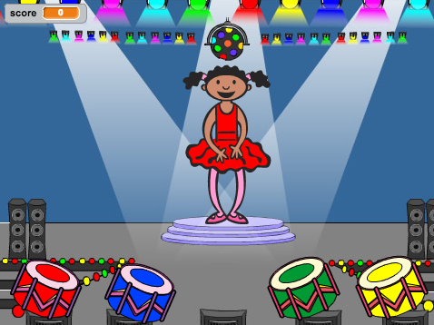
</div>

# Korak 1: Slučajne boje { .activity }

Najprije kreirajmo lika koji će mijenjati niz boja koji igrač treba upamtiti. 

## Zadatci { .check }

+ Otvori novi Scratch projekt i obriši lik mačke tako da projekt ostane prazan. Online Scratc nalazi se na adresi <a href="http://jumpto.cc/scratch-new">jumpto.cc/scratch-new</a>.

+ Odaberi lika i pozadinu. Lik ne mora nužno biti osoba, ali mora biti sposoban pokazivati različite boje. 

	

+ U igri ćeš koristiti sljedeće brojeve za prikaz svake boje:

	+ 1 = crvena;
	+ 2 = plava;
	+ 3 = zelena;
	+ 4 = žuta.

	Napravi četiri kostima odabranom liku. Za svaku od navedenih boja po jedan. Vodi računa o tome da su obojani kostimi u ispravnom redoslijedu. 

	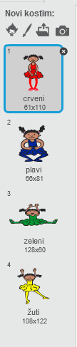

+ Za kreiranje slučajnog niza potrebno je kreirati __listu__. Lista je varijabla koja može pohraniti više  podataka __u određenom redoslijedu__. Kreiraj novu listu i nazovi ju `niz` {.blockdata}. Kako će listi pristupati samo tvoj lik, prilikom kreiranja odaberi mogućnost 'Samo za ovaj lik'.

	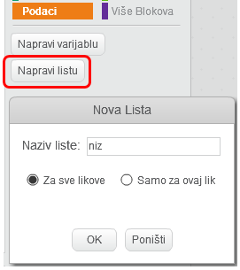

	Sada u gornjem lijevom kutu pozornice trebaš vidjeti praznu listu koja sadrži blokove za više vrijednosti. 

	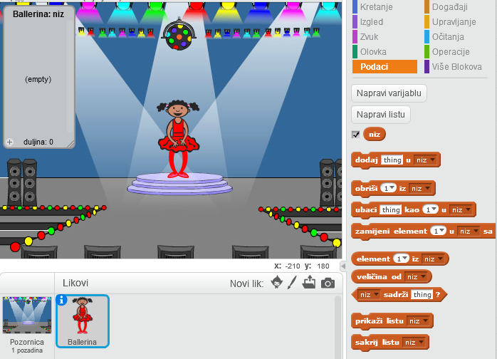

+ Za dodavanje pet slučajnih brojeva (i prikaz ispravnih kostima) u listu svom liku dodaj sljedeće naredbe: 

	```blocks
		kada je ⚑ kliknut
		obriši (sve v) iz [niz v]
		ponovi (5)
   			dodaj (slučajni broj od (1) do (4)) u [niz v]
   			promijeni kostim u (element (last v) iz [niz v])
   			čekaj (1) sekundi
		end
	```

Primjeti da smo na početku listu ispraznili.

## Izazov: Dodavanje zvuka {.challenge}
Isprobaj projekt nekoliko puta. Možda ćeš primjetiti da je ponekad jedan broj prikazan dva ili više puta. Zbog toga je teže zapamtiti redoslijed. Možeš li napraviti da svaki puta kada lik promjeni kostim zasvira bubanj? 

Možeš li sada napraviti da bubanj proizvodi drugačiji zvuk ovisno o odabranom broju? 
Kôd je sličan onome kojim je mijenjan kostim lika. 

## Spremi projekt { .save }

# Korak 2: Ponavljanje niza { .activity }

Dodajmo sada četiri gumba. Pomoću njih će igrač ponoviti niz koji je trebao zapamtiti. 

## Zadatci { .check }

+ Dodaj četiri lika koji će pretstavljati gumbe. Uredi ih tako da svaki od njih ima različitu boju.

	

+ Kada igrač klikne na crveni bubanj trebaš poslati poruku svom liku, tako da on zna da je kliknut crveni bubanj. Dodaj sljedeće naredbe crvenom bubnju: 

	```blocks
		kada je lik kliknut
		pošalji [crvena v]
	```

+ Kada lik primi tu poruku treba provjeriti je li na početku liste spremljena vrijednost 1 (što znači da je crvena sljedeća boja u nizu). Ako je, potrebno je ukloniti broj iz liste jer je ispravno pogođen. Inače je igra gotova. 

	```blocks
		kada primim [crvena v]
		ako <(element (1 v) iz [niz v]) = [1]> onda
   			obriši (1 v) iz [niz v]
		inače
   			govori [Kraj igre!] (1) sekundi
   		zaustavi [sve v]
		end
	```

+ Također možeš prikazati svjetleće lampice kada je lista prazna. To znači da je cijeli niz ispravno pogođen. Svom liku dodaj sljedeće naredbe na kraju `kada je ⚑ kliknut` {.blockevents} kôda:

	```blocks
		čekaj do <(veličina od [niz v]) = [0]>
		pošalji [pobjeda v] i čekaj
	```

+ Klikni na pozornicu i dodaj sljedeće naredbe kako bi pozadina promijenila boju kada igrač pobjedi. 

	```blocks
		kada primim [pobjeda v]
		sviraj zvuk [drum machine v]
		ponovi (50)
   			promijeni efekt [boja v] za (25)
   			čekaj (0.1) sekundi
		end
		makni grafičke efekte
	```

## Izazov: Izrada preostalih gumba {.challenge}
Ponovi prethodne korake za plavi, zeleni i žuti bubanj. Koje naredbe će ostati jednake, a koje će se promijeniti? 

Također možeš dodati zvuk koji će se puštati kada igrač klikne na bubanj. 

Ne zaboravi isprobati dodani kôd! Možeš li upamtiti niz od pet boja? Je li taj niz svaki puta drugačiji? 

## Spremi promjene u projektu { .save }

# Korak 3: Više nivoa { .activity .new-page }

Do sada je igrač trebao upamtiti samo pet boja. Poboljšajmo igru tako da se dužina niza povećava. 

## Zadatci { .check }

+ Kreiraj novu varijablu i nazovi ju `rezultat` {.blockdata}.

	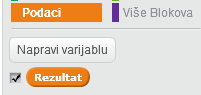

+ Varijabla `rezultat` {.blockdata} će se koristiti za odluku o dužini niza kojeg igrač treba upamtiti. Za početak, neka dužina niza bude jednaka 3. Liku dodaj sljedeći niz naredbi na početak bloka `kada je ⚑ kliknut` {.blockevents}:

	```blocks
		postavi [rezultat v] na [3]
	```

+ Umjesto da se uvijek kreira niz od pet boja, sada želimo da vrijednost varijable `rezultat` {.blockdata} određuje dužinu niza. Promijeni petlju `ponavljaj` {.blockcontrol}  (koja kreira niz) u:

	```blocks
		ponovi (rezultat)
		end
	```

+ Ako je niz ispravno pogođen vrijednost varijable `rezultat` {.blockdata} potrebno je uvećati za 1 kako bi se duljina niza povećala. 

	```blocks
		promijeni [rezultat v] za (1)
	```

+ Na kraju, potrebno je dodati petlju `ponavljaj` {.blockcontrol} oko kôda koji generira niz kako bi se za svaki nivo generirao novi niz boja. Kôd tvog lika sada treba izgledati ovako:

	```blocks
		kada je ⚑ kliknut
		postavi [rezultat v] na [3]
		ponavljaj
   			obriši (sve v) iz [niz v]
  			ponovi (rezultat)
      				dodaj (slučajni broj od (1) do (4)) u [niz v]
      				promijeni kostim u (element (last v) iz [niz v])
      				čekaj (1) sekundi
   			end
   			čekaj do <(veličina od [niz v]) = [0]>
   			pošalji [pobjeda v] i čekaj
   			promijeni [rezultat v] za (1)
		end
	```

+ Pokaži igru prijateljima i zamoli ih da ju isprobaju. Ne zaboravi sakriti listu `niz` {.blockdata} prije toga!

## Spremi promjene u projektu { .save }

# Korak 4: Najbolji rezultat { .activity }

Spremimo sada najbolji rezultat tako da možeš igrati sa prijateljima!

## Zadatci{ .check }

+ Dodaj dvije nove varijable u projekt. Nazovi ih `najbolji rezultat` {.blockdata} i `igrač` {.blockdata}.

+ Kada igra završi (pritiskom na pogrešni bubanj) potrebno je provjeriti je li rezultat igrača veći od trenutnog najvećeg rezultata. Ako je, trebamo ga spremiti kao najveći i pohraniti ime igrača. Ovako sada reba izgledati kôd za crveni bubanj: 

	```blocks
		kada primim [crvena v]
		ako <(element (1 v) iz [niz v]) = [1]> onda
   			obriši (1 v) iz [niz v]
		inače
   			govori [Kraj igre!] (1) sekundi
   		ako <(rezultat) > (najbolji rezultat)> onda
      			postavi [najbolji rezultat v] na (rezultat)
      			pitaj [Najbolji rezultat! Kako se zoveš?] i čekaj
      			postavi [igrač v] na (odgovor)
	   	end
   		zaustavi [sve v]
   		end
	```

+ Dodaj prethodne naredbe i preostalim bubnjevima. Primjeti da su naredbe u dijelu 'Kraj igre' jednake za sva četiri bubnja. 

	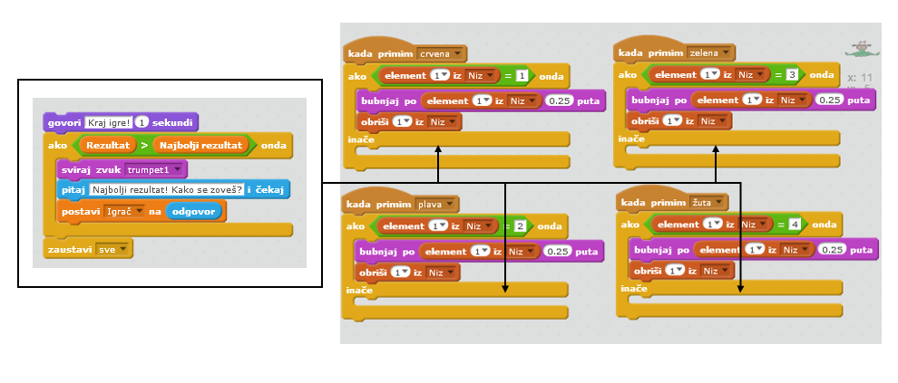

+ Pojavi li se nekada potreba za izmjenom tog dijela kôda, promjene će trebati napraviti četiri puta. To je dosadno i odnosi previše vremena.

	Umjesto toga možeš definirati vlastiti blok naredbi i koristiti ga više puta u projektu. Odaberi skupinu naredbi `Više Blokova` {.blockmoreblocks}, a zatim 'Napravi blok'. Nazovi ga 'Kraj igre'.

	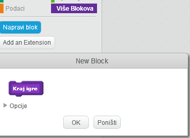

+ Dodaj naredbe iz bloka `inače` {.blockcontrol} crvenog bubnja u novi blok koji se pojavio:

	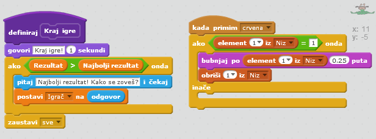

+ Napravili smo novu  _funkciju_  `Kraj igre` {.blockmoreblocks} koju sada možemo koristiti kada god nam zatreba. Odvuci blok  `Kraj igre` {.blockmoreblocks} u četiri skripte za bubnjeve.

	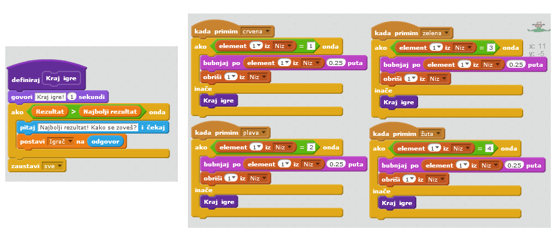

+ Sada dodaj zvuk koji će se puštati kada igrač odabere krivu boju. Narebe za to trebaš dodati samo  _jednom_ u blok `Kraj igre` {.blockmoreblocks}, ne četiri puta! 

	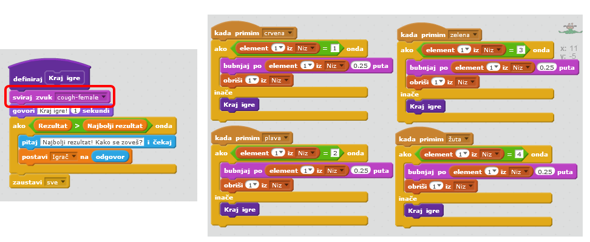

## Izazov: Napravi više blokova {.challenge}
Primjećuješ li još naredbi koje su jednake za sva četiri bubnja?

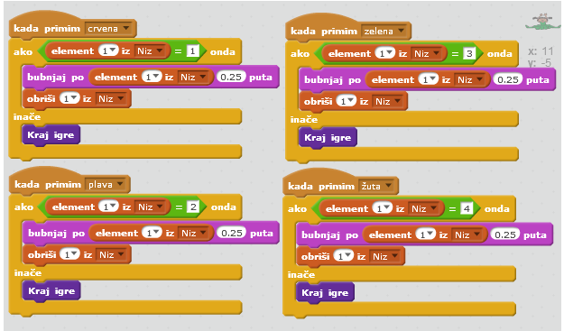

Možeš li napraviti neki drugi blok koji će koristiti sva četiri bubnja? 

## Spremi promjene u projektu { .save }

## Izazov: Drugi kostim {.challenge}
Primjećuješ li da je na početku igre tvoj lik uvijek u kostimu kojim je završila prethodna igra?

Možeš li dodati još jedan bijeli kostim koji će se prikazivati na početku igre i dok igrač ponavlja boje? 


## Spremi promjene u projektu { .save }

## Izazov: Različite težine igre {.challenge}
Možeš li omogućiti igraču da odabere između 'lakše razine' (koristeći samo crveni i plavi bubanj) i 'normalne razine' (u kojoj se koriste sva četiri bubnja)?

Možeš čak dodati i 'tešku razinu' koja koristi i peti bubanj!

## Spremi projekt{ .save }
