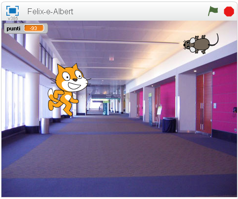
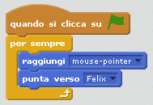
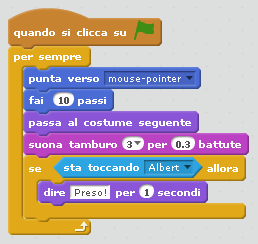
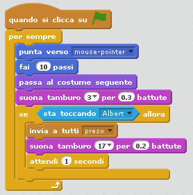
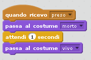
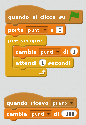

---
Titolo: Felix e Albert  
Livello: Livello 1  
Language: it-IT  
Stylesheet: scratch  
Embeds: "*.png"  
Materials: "Felix-e-Albert.sb2"  
Note: "note per i club leader.md"  
...

# Introduzione
Noi andremo a creare un gioco dove __Felix__ il gatto cercherà di catturare il topolino __Albert__.  
Albert è controllato con il mouse e cerca di non essere preso da Felix. 
Più a lungo riesci a far fuggire Albert e più punti farai, però non farti prendere altrimenti i punti andranno giù!

# Passo 1: Felix insegue il mouse

*Vogliamo che Felix insegua il puntatore del mouse.*

## Lista delle attività

+ **Creare un nuovo progetto File->Nuovo**

+ Cliccare su **stage 1 sfondo** vicino a **Sprite** e poi andare sulla sezione **Sfondi**, clicca su **Scegli uno sfondo dalla libreria** e seleziona lo sfondo **Interni/hall**. Cancellare lo sfondo bianco **tasto destro->cancella**

+ Cliccare sulla parte **Sprite** e poi sulla **i** che appare, quindi cambiare il nome dello Sprite con **Felix**

+ Assicurarsi che Felix punti solo a destra e sinistra cambiando lo stile di rotazione in <-->

+ **Creare il seguente script**:

##Verifica il tuo progetto

**Clicca sulla bandiera verde**

Cosa fa Felix?  
Segue il puntatore del tuo mouse?  
Sembra che cammini quando si muove?  
Si muove con la velocità corretta?  

##Salva il tuo progetto
File->Salva

# Passo 2: Felix insegue Albert

*Vogliamo che Felix insegua Albert il topolino invece del puntatore del mouse.*

## Lista delle attività

+ Creare un nuovo sprite clicando su **Nuovo sprite: Scegli uno sprite dalla libreria** selezionando poi **Animali/Mouse1**

+ Cambiare il nome dello sprite con **Albert**

+ Cliccare sulla sezione **Costumi** e sull'editor selezionare il topolino con il mouse. Intorno al topolino apparirà un rettangolo con il quale rimpiccioliamo il topolino facendolo diventare più piccolo di Felix.
+ Assicurarsi che Albert punti solo a destra e sinistra cambiando lo stile di rotazione in <-->
+ **Creare il seguente script per Albert:**

##Verifica il tuo progetto

**Clicca sulla bandiera verde**

Albert si muove insieme al puntatore del mouse?  
Felix insegue Herbert?  

##Salva il tuo progetto
File->Salva

#Passo 3: Felix dice che ha preso Albert

*Vogliamo che Felix ci dica quando prende Albert.*

## Lista delle attività

+ **Cambiare lo script di Felix come segue**

##Verifica il tuo progetto

**Clicca sulla bandiera verde**

Felix ci avvisa quando prende Albert?

##Salva il tuo progetto
File->Salva

#Passo 4: Albert si trasforma in un fantasma quando viene preso da Felix

*Invece di far dire qualcosa a Felix ora vogliamo che Albert si trasformi in un fantasma quando viene preso.*

## Lista delle attività

+ **Cambiare lo script di Felix in modo che mandi il messaggio "*preso*" quando riesce a prendere Albert**

+ Selezionando Albert aggiungere un nuovo costume, dalla sezione  **Costumi** cliccare su **Scegli un costume dalla libreria** e poi selezionare il costume **Fantasia/ghost2-a**.

+ Sull'editor cliccare sul nuovo costume, il fantasma, e ridimensionarlo per farlo diventare più piccolo.

+ Cambiare i nomi dei cosumi di Albert in modo che il topolino si chiami '*vivo*' e il fantasma si chiami '*morto*'
+ **Ora creare un nuovo script per trasformare Albert in un fantasma:**

##Verifica il tuo progetto

**Clicca sulla bandiera verde**

Albert si trasforma in fantasma quando è preso da Felix?  
Felix emette i suoni corretti?  
Feliz rimane fermo abbastanza per far si che Albert riesca a fuggire?

##Salva il tuo progetto
File->Salva

#Passo 5: Teniamo un punteggio

**Ora aggiungiamo il punteggio così sapremo quanto siamo bravi a tenere Albert vivo.
Partiremo con il punteggio a zero e lo incrementeremo di uno per ogni secondo che passa. Se Felix prende Albert il punteggio verrà diminuito di cento.**

## Lista delle attività

+ Creare una variabile, per tutti gli *sprite*, chiamata **punti**.
Cliccare sulla sezione **Script**, **Variabili e Liste**, **Crea una Variabile** e chiamarla **punti**, assicurarsi di selezionare **Per tutti gli sprite**.

+ Cliccare su **stage 1 sfondo** vicino a **Sprite** e creare due script come segue:

##Verifica il tuo progetto

**Clicca sulla bandiera verde**

Il punteggio sale ogni secondo?  
Il punteggio scende di cento quando Albert viene preso?  
Cosa succede se Albert viene preso prima che il punteggio arrivi a cento?  
Il punteggio si azzera quando inizio il gioco?  

##Salva il tuo progetto
File->Salva

**Ben fatto hai terminato, ora puoi divertirti a giocare!**

