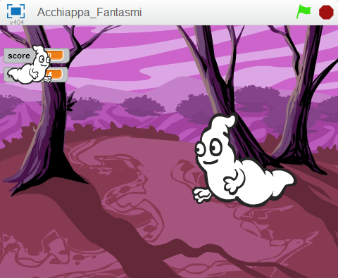

# Introduzione { .intro }

Questo progetto e' simile al gioco da luna park chiamato whack-a-mole (colpisci la talpa). Ottieni dei punti se colpisci i fantasmi che appaiono sul video. Lo scopo del gioco e' totalizzare il piu' alto punteggio possibile in 30 secondi!!




<div class="pagebreak"></div>
# Passo 1: Crea un fantasma volante { .activity }

## Lista delle Attivita' { .check }

+ Crea un nuovo progetto scratch.
+ Rimuovi lo sprite del gatto Felix (fai click con il taso destro del mouse sullo sprite e seleziona cancella) e sostituisci lo sfondo con **woods** del tema **Natura**.
+ Aggiungi un nuovo sprite facendo click su `Scegli uno sprite dalla libreria` e seleziona **Ghost1** nella categoria **Fantasia**
+ Adesso vogliamo che il nostro fantasma si possa muovere. Aggiungi una `Variabile` solo per questo sprite e chiamala `velocita'` { .blockorange }.
+ Nello **Stage** deve comparire un indicatore per questa variabile che visualizza "__Ghost1: velocita'__". Se viene visualizzato solo "velocita'" allora cancella la variabile e ricreala solo per lo sprite Ghost1. Se vuoi nascondere l'indicatore della variabile rimuovi lo spunta per la variabile "velocita'" nella sezione **Variabili e Liste**. La variabile "velocita'" controlla la velocita' con cui il fantasma si muove. A tal scopo utilizziamo una variabile in modo che possiamo cambiare la velocita' con cui il fantsma si muove con il procedere del gioco.
+ Vogliamo che il fantasma inizi a muoversi all'inizio del gioco, __quindi crea uno script come questo__:
```blocks
    quando si clicca su @
    porta [velocita' v] a [5]
    per sempre
        fai (velocita') passi
```

## Verifica il tuo progetto { .flag }

Fai click sulla bandierina verde e guarda come si comporta il fantasma.

Perche' si ferma all'estremita' dello schermo?

## Salva il tuo progetto { .save }

## Lista delle Attivita' { .check }

+ Per evitare che il fantasma si fermi all'estremita' dello schermo, dobbiamo fargli invertire direzione quando tocca il bordo dello schermo. Modifica lo script esistente aggiungendo il blocco `rimbalza quando tocchi il bordo` { .blockblue } sotto al blocco `fai` { .blockblue }`velocita'`{ .blockorange }`passi`{ .blockblue }. 
```blocks
    quando si clicca su @
    porta [velocita' v] a [5]
    per sempre
        fai (velocita') passi
        rimbalza quando tocchi il bordo
```

+ Per evitare che il fantasma appaia sottosopra, cambia lo stile di rotazione in `sinistra-destra` nell'area delle properieta' dello sprite.

## Verifica il tuo progetto { .flag }

Fai click sulla bandierina verde.

+ Il fantasma si muove correttamente da un'estremita' all'altra dello schermo?

## Salva il tuo progetto { .save }

<div class="pagebreak"></div>


## Cose da provare { .try }

+ Prova a cambiare il valore della variabile `velocita'` per far volare il fantasma piu' velocemente o piu' lentamente.
+ Come puoi fare in modo che il fantasma voli piu' velocemente con il passare del tempo? (Beh questa domanda e' un po' difficile, quindi non ti preoccupare se non hai idea di come fare. Riceverai degli indizi durante lo svolgimento del progetto)

# Passo 2: Fai comparire e scomparire il fantasma in modo casuale { .activity }

Per rendere il gioco piu' divertente, vogliamo che il fantasma appaia e scompaia dallo schermo in modo casuale. Otterremo questo risultato con un altro script che viene eseguito in contemporanea con lo script che muove il fantasma. Questo nuovo script rende il fantasma invisibile per un periodo di tempo casuale, poi lo fa' riapparire per un altro periodo di tempo casuale. Il tutto viene ripetuto indefinitamente o comunque fino alla fine del gioco.

## Lista delle Attivita' { .check }

+ Crea questo script per il fantasma:
```blocks
    quando si clicca su @
    per sempre
        nasconditi
        attendi (numero a caso tra (2) e (5)) secondi
        mostrati
        attendi (numero a caso tra (3) e (5)) secondi
```

<div class="pagebreak"></div>

## Verifica il tuo progetto { .flag }

Fai click sulla bandierina verde.

+ Il fantasma si muove correttamente da un'estremita' all'altra dello schermo e contemporaneamente compare e ricompare in modo casuale?

## Cose da provare { .try }

+ Prova a cambiare l'intervallo dei numeri casuali. Cosa succede se usi numeri molto grandi o molto piccoli? (Hai qualche indizio in piu' sul come fare che il fantasma voli piu' velocemente con il passare del tempo?)

## Salva il tuo progetto { .save }

<div class="pagebreak"></div>

# Passo 3: Far scomparire il fantasma quando e' colpito (click) { .activity }

Per far si che questo sia un vero gioco, dobbiamo far fare qualcosa al giocatore. Il giocatore deve colpire il fantasma, facendo click su di esso, in modo da farlo scomparire. Quando il fantasma e' colpito vogliamo che scompaia ed emetta un suono.

## Lista delle Attivita' { .check }

+ Seleziona il tab **Suoni** ed aggiungi un nuovo suono, dalla libreria, chiamato **fairydust** nella categoria **Elettronica** 
+ Aggiungi questo script per il fantasma:
```blocks
    quando si clicca questo sprite
    nasconditi
    produci suono [Fairydust v]
```

## Verifica il tuo progetto { .flag }

Fai click sulla bandierina verde.

+ Quando colpisci il fantasma scompare ed emette il suono desiderato?

## Cose da provare { .try }

+ Chiedi al tuo istruttore se puoi registrare un tuo suono da far emettere al fantasma

## Salva il tuo progetto { .save }

# Passo 4: Aggiungiamo il punteggio e un timer { .activity }

A questo punto abbiamo un fantasma, ma il nostro obiettivo finale e' creare un gioco!!! Vogliamo realizzare dei punti ogni volta che colpiamo un fantasma ma vogliamo anche che il gioco abbia un limite temporale. Possiamo usare una variabile per il punteggio ed una per la durata del gioco. 

## Lista delle Attivita' { .check }

+ Crea una nuova `Variabile` per tutti gli sprite e chiamala **punteggio**. Modifica lo script per il fantasma in modo che la variabile punteggio venga incrementata di 1 ogni volta che il fantasma e' colpito.
```blocks
    quando si clicca questo sprite
    nasconditi
    produci suono [Fairydust v]
    cambia [punteggio v] di (1)
```

+ Passa allo **Stage** e crea una variabile che si chiama **tempo_rimanente**.
+ Aggiungi un nuovo script che viene eseguito quando si fa click sulla bandierina verde in modo che inizializzi la variabile `tempo_rimanente` { .blockorange } a **30** secondi. Lo script deve anche azzerare la variabile `punteggio`. Usa un ciclo `ripeti fino a quando` { .blockorange } in cui aspetti 1 secondo e poi riduci di 1 la variabile `tempo_rimanente` { .blockyellow }. Il ciclo deve ripetersi finche' la variabile `tempo_rimanente` assume il valore 0. A tal punto usa `arresta tutto` { .blockyellow } per fermare il gioco.
```blocks
    quando si clicca su @
    porta [tempo rimanente v] a [30]
    porta [punteggio v] a [0]
    ripeti fino a quando <(tempo rimanente) = [0]>
        attendi (1) secondi
        cambia [tempo rimanente v] di (-1)
    fine
    arresta [tutto v]
```

## Verifica il tuo progetto { .flag }

Fai click sulla bandierina verde.

+ Il gioco finisce dopo 30 secondi?

## Cose da provare { .try }

+ Come puoi aumentare la velocita' del fantasma con il passare del tempo?

# Passo 5: Affronta le sfide { .activity }

Ben fatto!! hai completato la realizzazione del gioco base. Tuttavia ci sono molte altre cose che puoi aggiungere al tuo gioco. Prova a cimentarti con queste sfide!!!

## Sfida: aggiungi altri fantasmi  { .challenge }

Se un solo fantasma ve bene, tanti fantasmi sono meglio!!! Prova ad avere 3 fantasmi che volano per lo schermo. 

1. Duplica il fantasma facendo **click con il tasto destro** e seleziona `duplica`
2. Per ogni nuovo fantasma aggiusta la sua dimensione in modo che siano tutti diversi.
3. Per ogni nuovo fantasma cambia la variabile **velocita'** cosi' che volino a velocita' diverse
4. Posiziona i fantasmi in punti diversi in modo che non si sovrappongano.

## Salva il tuo progetto { .save }

<div class="pagebreak"></div>

## Verifica il tuo progetto { .flag }

Fai click sulla bandierina verde.

+ Riesci a vedere 3 fantasmi che si muovono da una parte all'altra dello schermo, che appaiono e scompaiono in modo casuale e che scompaiono quando colpiti?

## Cose da provare { .try }

+ Qual'e' il numero massimo di fantasmi per questo gioco?
+ Puoi far apparire i fantasmi in modo diverso? Puoi cambiare il loro costume o usare alcuni strumenti nell'editor costumi (cambia il colore degli occhi o del corpo)
+ Puoi far in modo che i fantasmi abbiano un punteggio differente quando colpiti?
+ Che ne dici di assegnare 10 punti al fantasma piu' veloce (e piccolo)?

## Salva il tuo progetto { .save }

Ben fatto!!! Hai finito con questo esercizio. Adesso divertiti con il tuo nuovo gioco!!!

Ehi, non dimenticare che puoi condividere il tuo gioco con tutti i tuoi amici e familiari. Basta che fai selezioni il menu File e poi **Share to website**!!