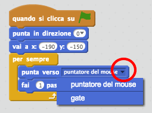
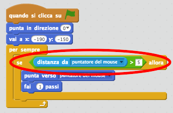
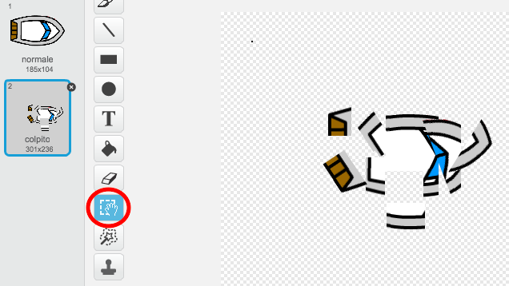
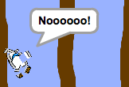
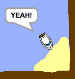
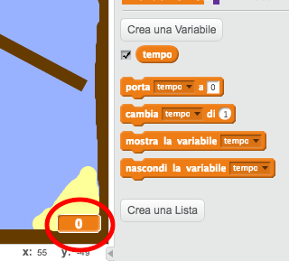
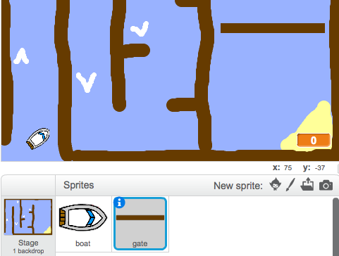
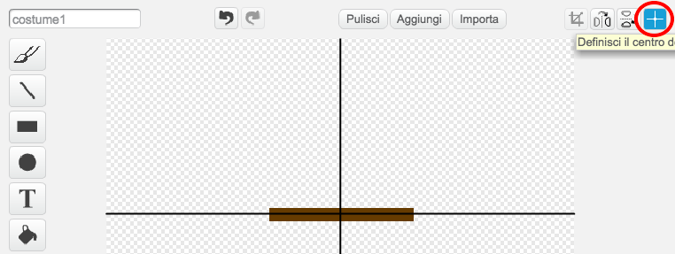

# Introduzione {.intro}

Imparerai come creare un gioco in cui userai il mouse per navigare la barca verso un'isola deserta.

<div class="scratch-preview">
  <iframe allowtransparency="true" width="485" height="402" src="https://scratch.mit.edu/projects/embed/63957956/?autostart=false" frameborder="0"></iframe>
  
</div>

# Passo 1: Come iniziare { .activity }

## Lista delle attività { .check}

+ Apri il progetto Scratch online 'Regata' a <a href="http://jumpto.cc/boat-go" target="_blank">jumpto.cc/boat-go</a> o scaricalo da <a href="http://jumpto.cc/boat-get" target="_blank">jumpto.cc/boat-get</a> e poi apri se stai usando l'editore offline.

+ Questo progetto include uno sprite di barca e uno scenario di corso con:

	+ Legno che la tua barca deve evitare;
	+ Un'isola deserta che la tua barca deve raggiungere.

	

# Passo 2: Controllare la barca { .activity }

## Lista delle attività { .check}

+ Controllerai la tua barca con il mouse. Aggiungi questo codice alla tua barca:

	```blocks
		quando si clicca sulla bandiera verde
		punta in direzione (0 v)
		vai a x: (-190) y: (-150)
		per sempre
  			punta verso [puntatore del mouse v]
  			fai (1) passi
		end
	```

+ Prova la tua barca cliccando la bandiera e muovendo il mouse. La barca naviga verso il mouse?

	

	__Note: + Attualmente c'è un bug in Scratch a causa del quale la tua barca non riesce a muoversi in direzione del cursore del mouse. Se questo succede, clicca la freccia sul blocco 'punta verso' {.blockmotion} e riseleziona 'cursore-mouse'.

	

+ Che succede se la barca raggiunge il cursore del mouse?

	Per evitare che questo succeda, dovrai aggiungere un blocco 'if' {.blockcontrol} al tuo codice, in modo che la barca si muova solo se si trova a più di 5 pixel dal mouse.

	

+ Prova di nuovo la tua barca per controllare se il problema è stato risolto.

## Salva il progetto {.save}

# Passo 3: Scontro! { .activity .new-page }

La tua barca può viaggiare attraverso le barriere di legno! Risolviamolo.

## Lista delle attività { .check}

+ Avrai bisogno di 2 costumi per la tua barca, un costume normale e uno per quando la barca si scontra. Duplica il costume della tua barca, e assegna loro il nome 'normale' e 'colpito'.

+ Clicca sul tuo costume 'colpito' e scegli lo strumento 'Seleziona' per acchiappare pezzi della barca, e per muoverli e ruotarli. Fai apparire la tua barca come se si fosse scontrata.

	

+ Aggiungi questo codice alla tua barca, dentro il loop 'per sempre' {.blockcontrol}, in modo che si schianti quando tocca qualsiasi pezzo di legno marrone:

	```blocks
		se <sta toccando il colore [#603C15]> allora
  			passa al costume [colpito v]
  			dire [Noooooo!] per (1) secondi
  			passa al costume [normale v]
  			punta in direzione (0 v)
  			vai a x: (-215) y: (-160)
		end
	```

	Questo codice si trova dentro il loop 'per sempre' {.blockcontrol}, per cui il tuo codice continua a controllare se la barca si è schiantata.

+ Ricordati di assicurarti che la tua barca appaia sempre 'normale'.

+ Se provi a navigare attraverso una barriera di legno, vedrai che la tua barca si schianta e ritornerà alla posizione iniziale.

	

## Salva il progetto {.save}

## Sfida: Stai vincendo! {.challenge}
Puoi aggiungere un'altra istruzione 'if' {.blockcontrol} al codice della tua barca, in modo che il giocatore vinca quando raggiunge l'isola deserta?

Quando la barca raggiunge l'isola deserta di colore giallo, dirà 'YEAH!' e il gioco si interromperà. Avrai bisogno di usare questo codice:

```blocks
	dire [YEAH!] per (1) secondi
	ferma [tutto v]
```



## Salva il progetto {.save}

## Sfida: Effetti sonori {.challenge}
Puoi aggiungere un effetto sonoro al tuo gioco per quando la barca si schianta o raggiunge l'isola alla fine? Puoi perfino aggiungere una musica di sottofondo (vedi il progetto precedente 'Banda Rock' se hai bisogno di aiuto).

## Salva il progetto {.save}

# Passo 4: Tempo di Prova { .activity }

Ora aggiungiamo un timer al tuo gioco, in modo che il giocatore debba raggiungere l'isola deserta il più velocemente possibile.

## Lista delle attività { .check}

+ Aggiungi una nuova variabile chiamata 'tempo' {.blockdata} al tuo quadro. Puoi anche cambiare lo schermo della tua nuova variabile. Se hai bisogno di aiuto, dai un'occhiata al progetto 'Ghostbusters'.

	

+ Aggiungi questo codice al tuo __quadro__, in modo che il timer conti il tempo che la tua barca impiega per raggiungere l'isola deserta.

	```blocks
		quando si clicca sulla bandiera verde
		porta [tempo v] a [0]
		per sempre
  			attendi (0.1) secondi
  			cambia [tempo v] di (0.1)
		end
	```

+ Ecco fatto! Prova il tuo gioco e vedi a che velocità puoi raggiungere l'isola deserta!

	

## Salva il progetto {.save}

# Passo 5: Ostacoli e potenziamenti { .activity }

Questo gioco è _davvero_troppo facile - rendiamolo più interessante.

## Lista delle attività { .check}

+ Per prima cosa, aggiungiamo delle 'spinte' al tuo gioco, che accelereranno la barca. Modifica lo scenario e aggiungi alcune frecce booster bianche.

	

+ Ora puoi aggiungere dei codici al loop 'per sempre' della tua barca {.blockcontrol}, in modo che possa avanzare altri 3 passi quando tocca un booster bianco.

	```blocks
		se <sta toccando il colore [#FFFFFF]> allora
  			fai (3) passi
		end
	```

+ Puoi anche aggiungere una porta rotante che la tua barca deve evitare. Aggiungi un nuovo sprite chiamato 'porta', che somiglia a questo:

	

	Assicurati che il colore della porta sia lo stesso delle altre barriere di legno.

+ Imposta il centro dello sprite porta.

	

+ Aggiungi il codice alla tua porta, per farla ruotare lentamente 'forever` {.blockcontrol}.

+ Prova il tuo gioco. Ora avrai una porta rotante che devi evitare.

	

## Salva il progetto {.save}

## Sfida: Altri ostacoli! {.challenge .new-page}
Puoi aggiungere altri ostacoli al gioco? Ecco alcune idee:

+ Puoi aggiungere una melma verde al tuo scenario, che rallenta il giocatore quando la tocca. Per fare ciò, puoi usare un blocco `aspetta` {.blockcontrol}:

```blocks
	attendi (0.01) secondi
````


+ Puoi aggiungere un oggetto in movimento, come un tronco o uno squalo!


Questi blocchi possono aiutarti:

```blocks
	fai (1) passi
	rimbalza quando tocchi il bordo
````

Se il tuo nuovo oggetto non è marrone, dovrai aggiungere al tuo codice della barca:

```blocks
	se <<sta toccando il colore [#603C15]> o <sta toccando [shark v]>> allora
	end
```

## Salva il progetto {.save}

## Sfida: Altre barche! {.challenge .new-page}
Puoi trasformare il tuo gioco in una regata tra 2 giocatori?

+ Duplica la barca, rinominala 'Giocatore 2' e cambiagli il colore.


+ Cambia la posizione iniziale del Giocatore 2, cambiando questo codice:

```blocks
	vai a x: (-190) y: (-150)
```

+ Cancella il codice che usa il mouse per controllare la barca:

```blocks
	se < (distanza da [puntatore del mouse v]) > [5] > allora
		punta verso [puntatore del mouse v]
		fai (1) passi
	end
```

...e sostituiscilo con il codice per controllare la barca usando i tasti freccia.

Questo è il codice che dovrai usare per fare avanzare la barca:

```blocks
	se <tasto [freccia su v] premuto> allora
  		fai (1) passi
	end
```

Avrai anche bisogno del codice per 'girare' {.blockmotion} la barca quando le frecce a destra e sinistra sono premute.

## Salva il progetto {.save}

## Sfida: Altri livelli! {.challenge .new-page}
Puoi creare altri scenari e far sì che il giocatore possa scegliere tra i livelli?

```blocks
	quando si preme il tasto [spazio v]
	passa allo sfondo seguente
```

## Salva il progetto {.save}
