# Introduzione {.intro}

In questo progetto, i bambini impareranno a creare un gioco a quiz sulle tabelline, in cui dovrai rispondere al maggior numero di domande possibili in 30 secondi.

<div class="scratch-preview">
  <iframe allowtransparency="true" width="485" height="402" src="https://scratch.mit.edu/projects/embed/42225768/?autostart=false" frameborder="0"></iframe>
  
</div>

# Passo 1: Creare domande { .activity }

Iniziamo a creare domande a caso per il giocatore.

## Lista delle attività { .check}

+ Inizia un nuovo progetto Scratch, e cancella lo sprite del gatto così che il tuo progetto sia vuoto. Puoi trovare l'editore Scratch online a <a href="http://jumpto.cc/scratch-new" target="_blank">jumpto.cc/scratch-new</a>.

+ Scegli un personaggio e uno scenario per il tuo gioco. Puoi scegliere quello che vuoi! Ecco un esempio:

	

+ Crea 2 nuove variabili chiamate `numero 1` {.blockdata} e `numero 2` {.blockdata}. Queste variabili salveranno i 2 numeri che verranno moltiplicati.

	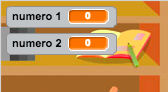

+ Aggiungi un codice al tuo personaggio per impostare entrambe le variabili come un numero `a caso` {.blockoperators} tra 2 e 12.

	```blocks
		quando si clicca sulla bandiera verde
		porta [numero 1 v] a (numero a caso tra (2) e (12))
		porta [numero 2 v] a (numero a caso tra (2) e (12))
	```

+ Puoi dunque chiedere la risposta al giocatore, e informarlo se è corretta o errata.

	```blocks
		quando si clicca sulla bandiera verde
		porta [numero 1 v] a (numero a caso tra (2) e (12))
		porta [numero 2 v] a (numero a caso tra (2) e (12))
		chiedi (unione di (number 1) e (unione di [ x ] e (number 2))) e attendi
		se <(answer) = ((number 1) * (number 2))> allora
  			dire [sì! :)] per (2) secondi
  		altrimenti
  			dire [no :(] per (2) secondi
		end
	```

+ Prova il tuo intero progetto, rispondendo correttamente e dando una risposta errata.

+ Aggiungi un loop `per sempre` {.blockcontrol} attorno a questo codice, così che il giocatore possa ricevere tante domande.

+ Crea un timer con conto alla rovescia su questa fase, usando una variabile chiamata 'tempo' {.blockdata}. Se hai bisogno di aiuto, il progetto 'Ghostbusters' possiede le istruzioni per creare un timer (al passo 5).

+ Prova di nuovo il tuo progetto - dovresti essere in grado di fare altre domande finché scadrà il tempo.

## Salva il progetto {.save}

## Sfida: Cambia costumi {.challenge}
Puoi cambiare i costumi di un personaggio, in modo che corrispondano alla risposta del giocatore?

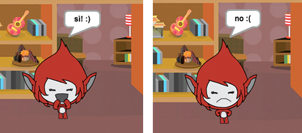

## Sfida: Aggiungi un punteggio {.challenge}
Puoi aggiungere un punteggio al gioco? Puoi aggiungere un punto per ogni risposta esatta. Se ti senti birichino, puoi perfino azzerare il punteggio del giocatore in caso di risposta errata!

## Salva il progetto {.save}

# Passo 2: Giochi multipli { .activity .new-page}

Aggiungiamo il tasto 'gioca', così che puoi giocare tante volte.

## Lista delle attività { .check}

+ Crea un nuovo sprite di tasto 'Gioca', che il tuo giocatore cliccherà per iniziare una nuova partita. Puoi disegnarlo tu o modificare uno sprite dalla libreria di Scratch.

	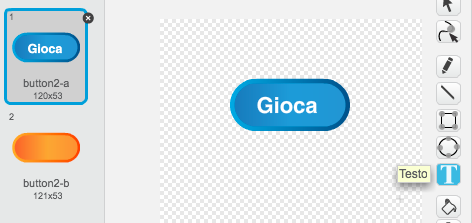

+ Aggiungi questo codice al tuo nuovo tasto.

	```blocks
		quando si clicca sulla bandiera verde
		mostra

		quando si clicca questo sprite
		nascondi
		invia a tutti [inizio v]
	```

	Questo codice mostra il tasto di gioco quando il tuo progetto è iniziato. Quando il tasto è cliccato, viene nascosto e poi trasmette un messaggio che inizierà la partita.

+ Dovrai modificare il codice del tuo personaggio, così che il gioco inizi quando ricevono il messaggio 'inizio' {.blockevents}, e non quando la bandiera è cliccata.

	Sostituisci il codice `quando si clicca sulla bandiera verde` {.blockevents} con `quando ricevo l'inizio` {.blockevents}.

	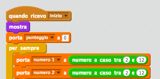

+ Clicca la bandiera verde e poi clicca il tuo nuovo tasto di inizio per testarlo. Vedrai che il gioco non inizia finché il tasto non è cliccato.

+ Hai notato che il timer comincia quando la bandiera verde è cliccata, e non quando inizia il gioco?

	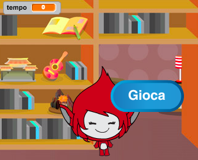

	Puoi risolvere il problema?

+ Clicca sulla fase e sostituisci il blocco 'ferma tutto' {.blockcontrol} con un messaggio 'fine' {.blockevents}.

	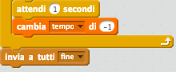

+ Ora puoi aggiungere il codice al tuo tasto per visualizzarlo di nuovo alla fine di ogni partita.

	```blocks
		quando ricevo [fine v]
		mostra
	```

+ Dovrai anche fermare il tuo personaggio dal fare domande alla fine di ogni partita:

	```blocks
		quando ricevo [fine v]
		ferma [tutti gli altri script dello sprite v]
	```

+ Prova il tuo tasto di inizio giocando un paio di partite. Dovresti notare che il tasto di inizio viene visualizzato dopo ogni partita. Per facilitare le prove, puoi accorciare ogni partita in modo da farle durare solo qualche secondo.

	```blocks
		porta [tempo v] a [10]
	```

+ Puoi anche cambiare il costume del tasto quando il cursore del mouse vi è sopra.

	```blocks
		quando si clicca sulla bandiera verde
		mostra
		per sempre
  		se <sta toccando [puntatore del mouse v]> allora
    		porta effetto [fish-eye v] a (30)
  		altrimenti
    		porta effetto [fish-eye v] a (0)
  		end
	end
	```

	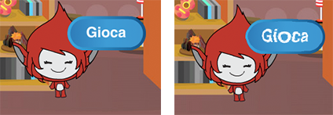

## Salva il progetto {.save}

## Sfida: Inizia schermata {.challenge}
Puoi aggiungere un altro scenario alla tua fase, che diventerà la schermata iniziale del tuo gioco? Puoi usare i blocchi 'quando ricevo inizio' {.blockevents} e 'quando ricevo fine' {.blockevents} per passare da uno scenario all'altro.

Puoi anche mostrare e nascondere il tuo personaggio, e perfino mostrare e nascondere il tuo timer usando questi blocchi:

```blocks
mostra la variabile [tempo v]
```
```blocks
nascondi la variabile [tempo v]
```

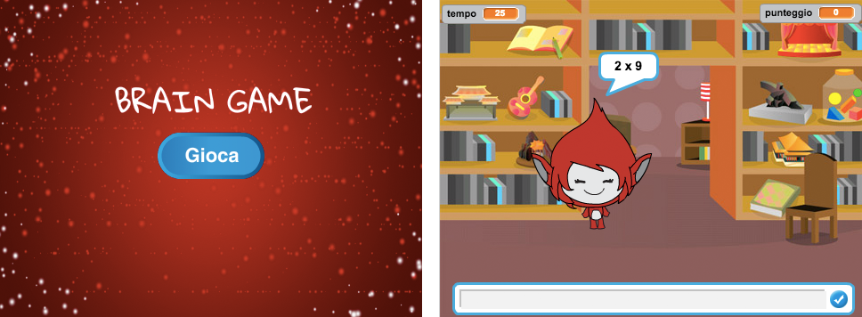

## Salva il progetto {.save}

# Passo 3: Aggiungi grafiche { .activity .new-page}

Invece di far dire solo 'sì' al tuo personaggio! :)` o `no :(` al giocatore, aggiungiamo alcune grafiche che informeranno i giocatori come stanno andando.

+ Crea un nuovo sprite chiamato 'Risultato', contenente un costume 'spunta' e 'croce'.

	

+ Cambia il codice del tuo personaggio, così che invece di dire al giocatore come è andata, trasmette i messaggi 'corretto' {.blockevents} ed 'errato' {.blockevents}.

	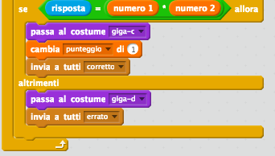

+ Puoi ora usare questi messaggi per mostrare il costume 'spunta' o 'croce'. + Aggiungi questo codice al tuo nuovo sprite 'Risultato':

	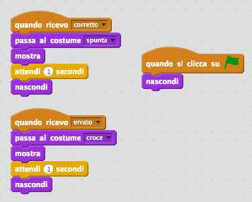

+ Prova di nuovo il tuo gioco. Vedrai un segno di spunta quando la risposta è corretta e una croce quando è errata!

	

+ Hai notato che il codice per 'quando ricevo corretto' {.blockevents} e quello per 'quando ricevo errato' {.blockevents} sono quasi identici? Creiamo ora una funzione per facilitare il modo di cambiare il tuo codice.

	Sul tuo sprite 'Risultato' , clicca 'Altri Blocchi' {.blockmoreblocks}, e poi 'Crea un Blocco'. Crea una nuova funzione chiamata 'animare' {.blockmoreblocks}.

	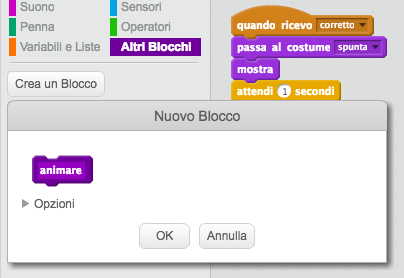

+ Puoi dunque aggiungere il codice di animazione nella tua nuova funzione di animazione, e poi usare la funzione solo due volte:

	

+ Se vuoi visualizzare la spunta e la croce per un periodo più lungo o più corto, dovrai effettuare solo un cambio al tuo codice. Prova!

+ Invece di mostrare e nascondere solamente la spunta e la croce, puoi cambiare la tua funzione di animazione, così che le grafiche si dissolvano a chiudere.

	```blocks
		definisci (animare)
		porta effetto [fantasma v] a (100)
		mostra
		ripeti (25) volte
  			cambia effetto [fantasma v] di (-4)
		end
		nascondi
	```

## Salva il progetto {.save}

## Sfida: Animazione migliorata {.challenge}
Puoi migliorare l'animazione delle tue grafiche? Puoi anche codificare la spunta e la croce in modo che si dissolvano sia ad aprire che a chiudere. Oppure, puoi usare altri effetti divertenti:

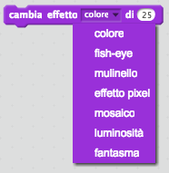

## Salva il progetto {.save}

## Sfida: Suono e musica {.challenge}
Puoi aggiungere al gioco musica ed effetti sonori? Ad esempio:

+ Riprodurre un suono quando il giocatore dà una risposta corretta o errata;
+ Aggiungere un ticchettio al tuo timer per il conto alla rovescia;
+ Riprodurre un suono quando il tempo è scaduto;

	```blocks
		suona tamburo (10 v) per (0.1) battute
	```

+ Puoi anche riprodurre musica costantemente in loop (se sei incerto su come si fa, il passo 4 del progetto 'Banda Rock' ti sarà d'aiuto).

## Salva il progetto {.save}

## Sfida: Gareggia fino ai 10 punti {.challenge}
Puoi cambiare il gioco per far in modo che, invece di dover rispondere a più domande possibili in 30 secondi, il giocatore veda in quanto tempo riesce a rispondere a 10 domande correttamente?

Per fare ciò, dovrai solo cambiare il codice del tuo timer. Vedi cosa deve essere cambiato?

```blocks
	quando ricevo [inizio v]
	porta [tempo v] a (30)
	ripeti fino a quando <(tempo) = [0]>
  		attendi (1) secondi
  		cambia [tempo v] di (-1)
	end
	invia a tutti [fine v]
```

## Salva il progetto {.save}

## Sfida: Schermata istruzioni {.challenge}
Puoi aggiungere una schermata di istruzioni al tuo gioco, dicendo al tuo giocatore come giocare la partita? Avrai bisogno di un tasto 'Istruzioni' e di un altro sfondo.

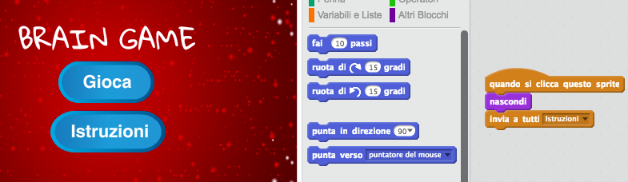

Potresti aver bisogno anche di un tasto 'Indietro' per ritornare al menu principale.

```blocks
	invia a tutti [menu principale v]
```

## Salva il progetto {.save}
