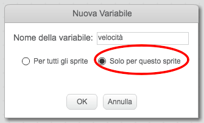
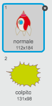
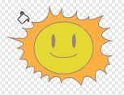
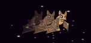
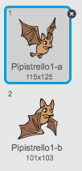
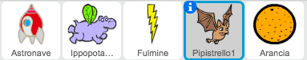

# Introduzione {.intro}

In questo progetto, imparerai a creare un gioco in cui dovrai salvare la Terra dai mostri dello spazio.

<div class="scratch-preview">
  <iframe allowtransparency="true" width="485" height="402" src="https://scratch.mit.edu/projects/embed/46018140/?autostart=false" frameborder="0"></iframe>
  
</div>

# Passo 1: Creare un'Astronave { .activity }

Creiamo un'astronave che difenderà la Terra!

## Lista delle attività { .check}

+ Inizia un nuovo progetto Scratch e cancella lo sprite del gatto così che il tuo progetto sia vuoto. Puoi trovare l'editore Scratch online a <a href="http://jumpto.cc/scratch-new" target="_blank">jumpto.cc/scratch-new</a>.

+ Aggiungi lo scenario 'stelle' e lo sprite 'Astronave' al tuo progetto. Rimpicciolisci l'astronave e muovila vicino al fondo dello schermo.

	

+ Aggiungi un codice per muovere la tua astronave verso sinistra quando la freccia sinistra è premuta. Avrai bisogno di usare questi blocchi:

	```blocks
		quando si clicca sulla bandiera verde
		per sempre 
  			se <tasto [freccia sinistra v] premuto> allora 
    			cambia x di (-4)
  			end
		end
	```

+ Aggiungi un codice per muovere la tua astronave verso destra quando la freccia destra è premuta.

+ Prova il tuo progetto per vedere se puoi controllare la tua astronave con i tasti freccia.

## Salva il progetto {.save}

# Passo 2: Fulmini { .activity }

Diamo all'astronave la possibilità di sparare fulmini!

## Lista delle attività { .check}

+ Aggiungi lo sprite 'Fulmine' dalla libreria Scratch.  Quando la partita è iniziata, il fulmine sarà nascosto finché l'astronave spara i suoi cannoni laser. Lo spire deve essere molto più piccolo e a testa in giù. Aggiungi il seguente codice allo sprite 'Fulmine'.

	```blocks
		quando si clicca sulla bandiera verde
		nascondi
		porta dimensione al (25) %
		punta in direzione (-90 v)	
	```


+ Aggiungi il seguente codice **all'Astronave** per creare un nuovo fulmine ogni volta che la barra spaziatrice è premuta.


	```blocks
		quando si clicca sulla bandiera verde
		per sempre 
  			se <tasto [spazio v] premuto> allora 
    			crea clone di [Fulmine v]
  			end
		end
	```

+ Ogni volta che viene creato un nuovo clone, dovrebbe iniziare nello stesso posto dell'astronave, e poi muoversi in alto dello schermo finché tocca il bordo. Aggiungi il seguente codice allo *sprite Fulmine**:

	```blocks
		quando vengo clonato
		raggiungi [Astronave v]
		mostra
		ripeti fino a quando <sta toccando [bordo v]> 
  			cambia y di (10)
		end
		elimina questo clone
	```

Nota: Muoviamo il nuovo clone verso l'astronave mentre è ancora nascosto, dunque prima di mostrarlo. Così va meglio.

+ Prova il tuo fulmine, premendo la barra spaziatrice.

## Salva il progetto {.save}

## Sfida: Aggiustare il fulmine {.challenge}
Cosa succede se tieni la barra spaziatrice premuta? Puoi usare un blocco `attendi` {.blockcontrol} per risolverlo?

## Salva il progetto {.save}

# Passo 3: Ippopotami Spaziali Volanti { .activity }

Aggiungiamo un mucchio di ippopotami volanti che cercano di distruggere la tua astronave.

## Lista delle attività { .check}

+ Crea un nuovo sprite dall'immagine 'Ippopotamo1' nella libreria Scratch.

	

+ Imposta il suo stile di rotazione in modo che sia solo destra-sinistra, e aggiungi il seguente codice per nascondere lo sprite quando la partita inizia:

	```blocks
		quando si clicca sulla bandiera verde
		nascondi
	```

+ Crea una nuova variabile chiamata 'velocità' {.blockdata}, che è solo per lo sprite dell'ippopotamo.

	

	Saprai se lo hai fatto correttamente perché la variabile avrà accanto il nome dello sprite, in questo modo:

	

+ Il seguente codice creerà un nuovo ippopotamo ogni pochi secondi. **Il Quadro** è un buon posto per far vivere questo codice:

	```blocks
		quando si clicca sulla bandiera verde
		per sempre 
  			attendi (numero a caso tra (2) e (4)) secondi
  			crea clone di [Ippopotamo1 v]
		end
	```

+ Quando inizia ogni clone di ippopotamo, fallo muovere attorno al quadro (a una velocità casuale) finché non verrà colpito dal fulmine. Aggiungi questo codice allo sprite **ippopotamo**:

	```blocks
		quando vengo clonato
		porta [velocità  v] a (numero a caso tra (2) e (4))
		vai a x: (numero a caso tra (-220) e (220)) y: (150)
		mostra
		ripeti fino a quando <sta toccando [fulmine v]> 
  			fai (velocità) passi
  			ruota in senso orario di (numero a caso tra (-10) e (10)) gradi
  			rimbalza quando tocchi il bordo
		end
		elimina questo clone
	```

+ Prova il tuo codice ippopotamo. Vedrai apparire un nuovo clone ippopotamo ogni pochi secondi, e ognuno si muoverà alla sua velocità.

	

+ Prova il tuo cannone laser. Se colpisci un ippopotamo, svanisce?

+ Quando un ippopotamo tocca la tua astronave, dobbiamo farla esplodere! Per fare ciò, assicurati che la tua astronave abbia 2 costumi chiamati 'normale' e 'colpito'.

	

	Il costume 'colpito' dell'astronave può essere creato importando l'immagine 'Sole' dalla libreria Scratch, e usando lo strumento 'Colora una forma' per cambiarne il colore.

	

+ Aggiungi questo codice alla tua astronave in modo che cambi costume ogni volta che si scontra con un ippopotamo volante:

	```blocks
		quando si clicca sulla bandiera verde
		per sempre 
  			passa al costume [normale v]
  			attendi fino a quando <sta toccando [Ippopotamo1 v]>
  			passa al costume [colpito v]
  			invia a tutti [colpito v]
  			attendi (1) secondi
		end
	```

+ Hai notato di aver trasmesso un messaggio 'colpito' al codice qui sopra? Puoi usare questo messaggio per fare scomparire tutti gli ippopotami quando l'astronave viene colpita.

	Aggiungi questo codice al tuo ippopotamo:

	```blocks
		quando ricevo [colpito v]
		elimina questo clone
	```

+ Prova questo codice iniziando una nuova partita e scontrandoti con un ippopotamo. 

	

## Salva il progetto {.save}

## Sfida: Vite e Punteggio {.challenge}
Puoi aggiungere al tuo gioco un blocco 'vite' {.blockdata}, `punteggio` {.blockdata} o perfino `punteggio alto` {.blockdata}? Per aiutarti, puoi usare il progetto 'Acchiappa i Puntini'.

## Salva il progetto {.save}

# Passo 4: Pipistrelli della Frutta! { .activity }

Creiamo ora un pipistrello della frutta che getta arance alla tua astronave.

## Lista delle attività { .check}

+ Per prima cosa, creiamo un nuovo sprite di pipistrello che si 'muoverà' {.blockmotion} attraverso la parte superiore del quadro 'per sempre' {.blockcontrol}. Ricordati di provare il tuo codice.

	

+ Se guardi gli costumi del pipistrello, vedrai che ne ha già 2:

	

	Usa il blocco 'passa al costume seguente' {.blocklooks} per far sbattere le ali al pipistrello mentre si muove.

+ Crea un nuovo sprite 'Arancia' dalla libreria Scratch.

	


+ Aggiungi il codice al tuo pipistrello, in modo che crei un nuovo clone di arancia ogni alcuni secondi.

	```blocks
		quando si clicca sulla bandiera verde
		per sempre 
  			attendi (numero a caso tra (5) e (10)) secondi
  			crea clone di [Arancia v]
		end
	```

+ Clicca sul tuo sprite di arancia e aggiungi questo codice per far sì che ogni clone di arancia si apra dal pipistrello verso l'astronave:

	```blocks
		quando si clicca sulla bandiera verde
		nascondi

		quando vengo clonato
		raggiungi [Pipistrello1 v]
		mostra
		ripeti fino a quando <sta toccando [bordo v]> 
  			cambia y di (-4)
		end
		elimina questo clone

		quando ricevo [colpito v]
		elimina questo clone
	```

+ Nello sprite della tua astronave, dovrai modificare il tuo codice così che tu venga colpito se tocchi un ippopotamo o un'arancia:

	```blocks
		attendi fino a quando <<sta toccando [Ippopotamo1 v]> o <sta toccando [Arancia v]>>
	``` 

+ Prova il tuo gioco. Che succede se vieni colpito da un'arancia in caduta?

## Salva il progetto {.save}

# Passo 5: Game over { .activity }

Aggiungiamo un messaggio 'game over' alla fine del gioco.

## Lista delle attività { .check}

+ Se non l'hai ancora fatto, crea una nuova variabile, chiamata 'vite' {.blockdata}. La tua astronave dovrebbe cominciare da 3 vite e perdere uan vita ogni volta che si scontra con un nemico. Il tuo gioco dovrebbe anche interrompersi quando termini le vite. Per aiutarti, puoi usare il progetto 'Acchiappa i Puntini'.

+ Disegna un nuovo sprite chiamato 'Game Over', usando l'editore.

	

+ Sul tuo quadro, trasmetti un messaggio 'game over' {.blockevents} appena prima che la partita finisca.

	```blocks
		invia a tutti [game over v] e attendi
	```

+ Aggiungi questo codice al tuo sprite 'Game Over', così che il messaggio venga visualizzato alla fine del gioco:

	```blocks
		quando si clicca sulla bandiera verde
		nascondi

		quando ricevo [game over v]
		mostra
	```

	Siccome hai usato sul quadro un blocco `invia a tutti [game over v] e attendi` {.blockevents}, aspetterà che lo sprite 'Game Over' sia visualizzato prima di terminare la partita. 

+ Prova il tuo gioco. Quanti punti puoi accumulare? Hai qualche idea per migliorare il tuo gioco se è troppo facile o troppo difficile?

## Salva il progetto {.save}

## Sfida: Migliora il tuo gioco {.challenge}
Che miglioramenti puoi apportare al tuo gioco? Ecco alcune idee:

+ Aggiungi dei pacchetti energia che puoi raccogliere per guadagnare vite extra;


+ Aggiungi delle rocce fluttuanti che la tua astronave deve evitare;
	


+ fai apparire altri nemici quando raggiungi il punteggio di 100.

```blocks
	attendi fino a quando <(punteggio) = [100]>
```

## Salva il progetto {.save}
