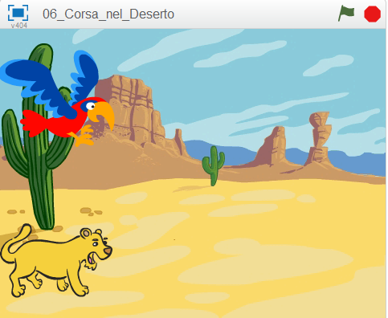

# Introduzione {.intro}
In questo esercizio sviluppiamo un gioco per due giocatori. Lo scopo e' di far gareggiare un pappagallo ed un leone nel deserto. Ogni giocatore deve premere un tasto il piu' velocmente possibile per far correre il proprio animale. Il primo che raggiunge il bordo dello schermo vince.



<div class="pagebreak"></div>

# Passo 1: Crea la scena ed aggiungi gli sprite {.activity}

## Lista delle Attivita' {.check}

+ Seleziona lo stage e aggiungi uno sfondo chiamato **desert** nella categoria **Natura**
+ Aggiungi uno sprite dalla libreria selezionando **Lioness** dalla categoria **Animali**
+ Aggiungi uno sprite dalla libreria selezionando **Parrot** dalla categoria **Animali**. Rimpiccioliscilo in modo che abbia dimensioni simile al leone.

# Passo 2: Fai muovere il leone ed il pappagallo {.activity}

Vogliamo che gli sprite si muovano alla pressione di un tatso.

## Lista delle Attivita' {.check}

+ Seleziona lo sprite leone e aggiungi un blocco `fai (4) passi` {.blockblue} quando il giocatore preme il tasto **‘L’**
```blocks
	quando si preme il tasto [l v]
		fai (4) passi
```
+ Adesso seleziona lo sprite pappagallo e aggiungi un blocco `fai (4) passi` {.blockblue} quando il giocatore preme il tasto **‘A’**.
```blocks
	quando si preme il tasto [a v]
		fai (4) passi
```

<div class="pagebreak"></div>

## Verifica il tuo progetto {.flag}

Fai click sulla bandierina verde.
+ Quando premi i tasti 'A' o 'L' vedi il pappagallo ed il leone avanzare sullo schermo?

## Salva il tuo progetto {.save}

# Passo 3: Inizia la corsa {.activity}

Ci serve un meccanismo per iniziare il gioco e sapere chi ha vinto. __Prima di tutto creiamo un nuovo pulsante.__

## Lista delle Attivita' {.check}

+ Aggiungi un nuovo sprite dalla libreria selezionando **button3** dalla categoria **Cose**
+ Modifica il costume dello sprite button3 ed aggiungi il testo **‘start’** e fai click su OK. Muovi lo sprite al centro dello stage.
+ Adesso aggiungi uno script per `button3` che visualizza lo sprite all'inizio del gioco:
```blocks
	quando si clicca su @
		mostrati
```

+ Adesso vogliamo che il pulsante, dopo che gli hai cliccato su,  inizii il conto alla rovescia da 3 e poi dica `Via!` ed infine che si nasconda: 
```blocks
	quando si clicca questo sprite
		dire [3] per (1) secondi
		dire [2] per (1) secondi
		dire [1] per (1) secondi
		dire [Via!] per (1) secondi
		nasconditi
```

## Verifica il tuo progetto {.flag}
Fai click sulla bandierina verde.

+ Quando premi il pulsante `start` viene visualizzato il conto alla rovescia prima di scomparire?

## Salva il tuo progetto {.save}

Vogliamo che i corridori si possano muovere solo dope che la corsa sia effettivamente iniziata. Vogliamo anche sapere quando la corsa e' finita. Abbiamo bisogno di una variabile per tale informazione

+ Aggiungi una variabile per tutti gli sprite chiamata `corsa` {.blockorange}. Deseleziona la variabile in modo che non appaia sullo stage.
+ Adesso assegna il valore **0** alla variabile **corsa** quando il gioco inizia. Cambia il tuo script in questo modo:
```blocks
	quando si clicca su @
		mostrati
		porta [corsa v] a (0)
```

+ Imposta a **1** la variabile **corsa** quando il gioco inizia (dopo il conto alla rovescia iniziale).
+ Dobbiamo fermare il leone ed il pappagallo nella loro corsa se **corsa** vale 0
+ Fai click sullo sprite del pappagallo. Aggiungi un blocco di controllo `se...allora` allo sprite in modo che possa muoversi se **corsa** = **1**
```blocks
	quando si preme il tasto [a v]
		se <(corsa) = [1]>
			fai (4) passi
```

+ Fai lo stesos per lo sprite del leone

## Verifica il tuo progetto {.flag}
Fai click sulla bandierina verde.

+ Il pappagallo o il leone si muovono solo dopo che il conto alla rovescia e' finito?
Vogliamo sapere chi ha vinto la corsa reinizializzare il contatore cosi' si puo' gareggiare dinuovo.

## Salva il tuo progetto {.save}

<div class="pagebreak"></div>

# Passo 4: Finire la corsa {.activity}

## Lista delle Attivita' {.check}

+ Aggiungi un blocco allo script del pappagallo che imposta la variabile **corsa** a 0 quando tocca il bordo dello schermo.
```blocks
	quando si preme il tasto [a v]
		se <(corsa) = [1]>
			fai (4) passi
			se <sta toccando [bordo v]> allora
				porta [corsa v] a [0]	
```

+ Adesso vogliamo che il pappagallo ci faccia sapere se ha vinto la corsa. Registra un suono per il pappagallo che verra' emesso in caso di vittoria. Fai click su `Suoni` {.blocklightgrey} e qui registra il suono.
+ Aggiungi un blocco `produci suono` {.blockpurple}  per far emettere il suono appena registrato in caso di vittoria del pappagallo:
```blocks
		quando si preme il tasto [a v]
		se <(corsa) = [1]>
			fai (4) passi
			se <sta toccando [bordo v]> allora
				porta [corsa v] a [0]
				produci suono [registrazione1]
				dire [Il Pappagallo ha vinto!] per (3) secondi	
```
+ Adesso ripeti questi passi per il leone.

<div class="pagebreak"></div>

## Verifica il tuo progetto {.flag}

Fai click sulla bandierina verde.

+ Quando premi il pulsante `Start` riesci a gareggiare premendo i tasti 'A' e 'L'?
+ In caso di vittoria lo sprite emette il proprio suono e ci dice che ha vinto?

## Salva il tuo progetto {.save}

<div class="pagebreak"></div>

# Passo 5: Reinizializzare il gioco {.activity}

Quando la gara e' finita dobbiamo dire all'altro sprite che abbiamo vinto e reinizializzare il gioco per un'altra partita.

__Vogiamo che lo sprite vincitore invii un messaggio.__

## Lista delle Attivita' {.check}

+ Fai click sullo sprite del pappagallo
Aggiungi un blocco `invia a tutti` con un messaggio **finito** come ultima operazione.
```blocks
		quando si preme il tasto [a v]
		se <(corsa) = [1]>
			fai (4) passi
			se <sta toccando [bordo v]> allora
				porta [corsa v] a [0]
				produci suono [registrazione1]
				dire [Il Pappagallo ha vinto!] per (3) secondi
				invia a tutti [finito v]	
```

+ Adesso dobbiamo aggiungere un nuovo script che ascolta il messaggio `finito` e muove il pappagallo dinuovo sulla linea di partenza. Cosa succede se cambi il valore di **x**?
```blocks
	quando ricevo [finito v]
		vai dove x e (-170)
```

+ Aggiungi lo stesso script per il leone. Prova diversi valori di **x** finche' non riesci ad allineare il leone ed il pappagallo sulla linea di partenza.
+ Vogliamo anche posizionare il pappagallo ed il leone sulla linea di partenza quando il gioco inizia. Aggiungi un altro script che muove lo sprite sulla linea di partenza quando fai click sulla bandierina.
```blocks
	quando si clicca su @
		vai dove x e (-170)
```

## Verifica il tuo progetto {.flag}

Fai click sulla bandierina verde.

+ Riesci a gareggiare con un tuo amico premendo 'A' per muovere il pappagallo e 'L' per il leone?

## Salva il tuo progetto {.save}

<div class="pagebreak"></div>

##Sfida 1: Aggiungi un turbo {.challenge}

+ __Prova ad aggiungere un turbo__ che puoi usare una sola volta per corsa, che muove lo sprite di __30 passi in una sola volta__
+ __Aggiungi un nuovo costume__ con le fiamme dietro lo sprite che visualizzi solo quando il turbo e' attivo.
+ __Registra un nuovo suono__ che lo sprite emettera' quando il turbo e' attivo.
```blocks
	quando si preme il tasto[p v]
		se <<(corsa) = [1]> e <(turbo) = [0]>> allora
			passa al costume [leone2 v]
			porta [turbo v] a [1]
			fai (4) passi
			se <sta toccando [bordo v]> allora
				porta [corsa v] a [0]
				produci suono [registrazione1 v]
				dire [Il Pappagallo ha vinto! v] per (3) secondi
				invia a tutti [finito v]
```

## Salva il tuo progetto {.save}

##Sfida 2: Usa dei blocci personalizzati per semplificare lo script {.challenge}

La logica per verificare se la corsa e' finita e' usata in due punti distinti dello script: quando lo sprite si muove normalmente e quando si muove con il turbo. Possiamo rendere lo script piu' leggibile usando un blocco personalizzato che verra' usato in punti diversi dello script. 

+ Seleziona lo script del pappagallo
+ Seleziona `Altri Blocchi` {.blocklightgrey}  dalla palette Script e poi fai click su `Crea un Blocco` {.blocklightgrey} .
+ Chiama il nuovo blocco **finito**
+ Adesso dovresti vedere un blocco `definisci finito` {.blockpurple}. Muovilo in un area libera dello script.
+ Stacca il blocco `se` {.blockyellow} `sta toccando` {.blocklightblue} `allora` {.blockyellow} e trascinalo ed aggancialo nel nuovo blocco `definisci finito` {.blockpurple}
```blocks
    definisci finito
    	se <sta toccando [bordo v]> allora
			porta [corsa v] a [0]
			produci suono [registrazione1 v]
			dire [Il Pappagallo ha vinto! v] per (3) secondi
			invia a tutti [finito v]
		fine

	quando si preme il tasto [q v]
		se <<(corsa) = [1]> e <(turbo) = [0]>> allora
			passa al costume [pappagallo-boost v]
			porta [turbo v] a [1]
			fai (4) passi
	finito	
```

Puoi trascinare il blocco `finito` {.blockpurple}  dalla palette ed utilizzarlo come qualsiasi altro blocco di Scratch?

Rimuovi l'altro blocco `se` {.blockyellow} `sta toccando` {.blocklightblue} `allora` {.blockyellow} e  sostituiscilo con il nuovo blocco `finito` {.blockpurple}

Adesso il tuo script e' piu' leggibile? Puoi creare un blocco personalizzato anche per il leone?

## Salva il tuo progetto {.save}

Ben fatto!!! Hai finito con questo esercizio. Adesso divertiti con il tuo nuovo gioco!!!

Ehi, non dimenticare che puoi condividere il tuo gioco con tutti i tuoi amici e familiari. Basta che fai selezioni il menu File e poi **Share to website**!!