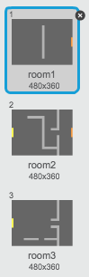

# Introduzione {.intro}

In questo progetto, imparerai a creare il tuo gioco di avventura open world.

<div class="scratch-preview">
  <iframe allowtransparency="true" width="485" height="402" src="https://scratch.mit.edu/projects/embed/34248822/?autostart=false" frameborder="0"></iframe>
  
</div>

# Passo 1: Codifica il tuo giocatore { .activity }

Iniziamo a creare un giocatore che possa muoversi attorno al mondo.

## Lista delle attività { .check}

+ Apri il progetto Scratch online 'Crea il Tuo Mondo' a <a href="http://jumpto.cc/world-go" target="_blank">jumpto.cc/world-go</a> o scaricalo da <a href="http://jumpto.cc/world-get" target="_blank">jumpto.cc/world-get</a> e poi apri se stai usando l'editore offline.

	

+ Usiamo i tasti freccia per muovere il giocatore. Quando il giocatore preme la freccia in su, vogliamo che il giocatore si sposti verso l'alto, cambiando la sua coordinata y. Aggiungi questo codice allo sprite 'giocatore':

	```blocchi
		quando si clicca la bandiera
		per sempre
			se < il tasto [freccia in su v] premuto? > allora
				cambia y di (2)
			fine
		fine
	```

+ Prova il tuo giocatore cliccando la bandiera e poi tenendo premuta la freccia in su. Il tuo giocatore si muove verso l'alto?

	

+ Per muovere il giocatore a sinistra, dovrai aggiungere un altro blocco 'se' {.blockcontrol} al tuo giocatore, che cambierà la coordinata x:

	```blocchi
		quando si clicca la bandiera
		per sempre
			se < il tasto [freccia in su v] premuto? > allora
				cambia y di (2)
			fine
			se < il tasto [freccia a sinistra v] premuto? > allora
				cambia x di (-2)
			fine
		fine
	```

## Sfida: Muoversi nelle quattro direzioni {.challenge}
Puoi aggiungere un altro codice al tuo giocatore, in modo che possa muoversi su, giù, a destra e a sinistra? Come aiuto, usa il codice che hai già!

## Salva il progetto {.save}

+ Prova di nuovo il tuo giocatore, e vedrai che riuscirà a camminare attraverso i muri di colore grigio chiaro.

	

+ Per risolverlo, dovrai muovere il giocatore, ma poi riportarlo indietro se tocca un muro grigio chiaro. Ecco il codice che ti servirà:

	```blocchi
		quando si clicca la bandiera
		per sempre
			se < il tasto [freccia in su v] premuto? > allora
				cambia y di (2)
				se < tocca colore [#BABABA]? > allora
					cambia y di (-2)
				fine
			fine
		fine
	```

	Nota che il nuovo blocco 'se'{.blockcontrol}`tocca colore`{.blocksensing} è _dentro_ il blocco `se`{.blockcontrol}`tasto [freccia in su]`{.blocksensing}.

+ Prova questo nuovo codice muovendoti sotto il muro - non sarai in grado di spostarti in alto nel muro.

	

+ Facciamo la stessa cosa per la freccia sinistra, riportandoci indietro se il giocatore tocca il muro. Il codice del tuo giocatore dovrebbe essere così:

	

## Sfida: Aggiustare il movimento del tuo giocatore {.challenge}
Aggiungi un codice al tuo giocatore in modo che tu non possa camminare attraverso i muri in qualsiasi direzione. Come aiuto, usa il codice che hai già!

## Salva il progetto {.save}

# Passo 2: Codifica il tuo mondo { .activity }

Facciamo in modo che il giocatore possa entrare nelle altre stanze camminando attraverso i muri!

## Lista delle attività { .check}

+ Il tuo progetto contiene scenari per stanze aggiuntive:

	

+ Avrai bisogno di una nuova variabile 'per tutti gli sprite' chiamata 'stanza' {.blockdata}, per tenere traccia della stanza in cui si trova il giocatore.

	

+ Quando il giocatore tocca la porta arancione nella prima stanza, verrà visualizzato il prossimo scenario, e il giocatore tornerà verso il lato sinistro del quadro. Ecco il codice che ti servirà - dovrebbe andare dentro il loop forever {.blockcontrol} del giocatore:

	```blocchi
		se <tocca colore [#F2A24A]?> allora
			cambia scenario a [prossimo scenario v]
			vai a x: (-200) y: (0)
			modifica [stanza v] di (1)
		fine
	```

+ Aggiungi questo codice all'_inizio_ del codice del tuo giocatore (prima del loop 'per sempre' {.blockcontrol}) per assicurarti che venga tutto azzerato quando si clicca la bandiera:

	```blocchi
		imposta [stanza v] a (1)
		vai a x: (-200) y: (0)
		cambia scenario a [stanza1 v]
	```

+ Clicca la bandiera e sposta il tuo giocatore sulla porta arancione. Il tuo giocatore si muove verso la prossima schermata? La variabile 'stanza' {.blockdata} cambia a 2?

	

## Sfida: Spostarsi alla stanza precedente {.challenge}
Puoi far muovere il giocatore verso la stanza precedente quando tocca una porta gialla? Ricordati che questo codice è_molto_simile a quello che hai già usato per muoverlo alla stanza seguente.

## Salva il progetto {.save}

# Passo 3: Segnali { .activity }

Aggiungiamo ora dei segnali al tuo mondo, che guideranno il giocatore nel suo viaggio.

## Lista delle attività { .check}

+ Il tuo progetto include uno sprite di segnale di benvenuto:

	

+ Questo segnale sarà visibile solo nella stanza 1, dunque aggiungiamo un codice al segnale per assicurarci che ciò accada:

	```blocchi
		quando si clicca la bandiera
		per sempre
			se < (stanza) = [1] > allora
				mostra
			altrimenti
				nascondi
			fine
		fine
	```

+ Prova il tuo segnale muovendoti tra le stanze. Il tuo segnale dovrebbe essere visibile solo nella stanza 1.

	

+ Un segnale non servirà a nulla se non c'è alcuna scritta! Aggiungiamo un altro codice (in un blocco separato) per visualizzare un messaggio nel caso in cui il messaggio stia toccando il giocatore:

	```blocchi
		quando si clicca la bandiera
		per sempre
			se < tocca [giocatore v]? > allora
				dici [Benvenuto! Puoi raggiungere il tesoro?]
			altrimenti
				dici []
			fine
		fine
	```
+ Prova il tuo segnale e vedrai un messaggio quando il giocatore lo tocca.

	

## Salva il progetto {.save}

## Sfida: Tesoro! {.challenge}
Fai clic col pulsante destro sullo sprite del forziere e scegli 'mostra'.

Puoi fare apparire lo sprite del forziere solo nella stanza 3 e dire 'Ottimo lavoro!' quando il giocatore lo tocca?


## Salva il progetto {.save}

# Passo 4: Persone { .activity }

Aggiungiamo altre persone al tuo mondo con le quali il tuo giocatore può interagire.

## Lista delle attività { .check}

+ Aggiungi questo codice allo sprite della persona, in modo che la persona parli con il tuo giocatore. Questo codice è molto simile a quello che hai aggiunto al segnale:

	```blocchi
		quando si clicca la bandiera
		vai a x: (0) y: (-150)
		per sempre
			se < tocca [giocatore v]? > allora
				dici [Sapevi che puoi attraversare le porte arancione e gialla?]
			altrimenti
				dici []
			fine
		fine
	```

+ Puoi anche far muovere la tua persona usando qusti due blocchi:

	```blocchi
		muovi (1) passi
		se sul bordo, rimbalza
	```

	La persona agirà diversamente, a seconda se posizioni questo codice dentro al loop 'per sempre' {.blockcontrol} o al blocco 'se' {.blockcontrol}. Provali entrambi e scegli quello che preferisci.

	

+ Hai notato che la tua persona si capovolge a testa in giù? Per fermarla, clicca il simbolo delle informazioni dello sprite ('i' {.blockmotion}), e clicca sul punto per aggiustare lo stile di rotazione.

	

## Sfida: Migliora la tua persona {.challenge}
Puoi aggiungere un codice alla tua nuova persona, in modo che appaia solo nella stanza 1? Ricordati di provare il tuo nuovo codice!

## Salva il progetto {.save}

+ Puoi aggiungere anche nemici in perlustrazione, che terminano la partita se il giocatore li tocca. Aggiungi un nuovo sprite del nemico e cambia lo stile di rotazione, proprio come hai fatto con lo sprite della 'persona'.

+ Aggiungi un codice al tuo nemico, in modo che appaia solo nella stanza 2.

+ Dovrai anche aggiungere un codice per muovere il nemico, e per terminare il gioco se il nemico tocca il giocatore. Sarà più facile farlo in blocchi di codice separati. Il codice del tuo nemico dovrebbe essere così:

	

+ Prova il tuo nemico per assicurarti che:
	+ È visibile solo nella stanza 2;
	+ Pattuglia la stanza;
	+ Il gioco termina se il giocatore lo tocca.

## Salva il progetto {.save}

## Sfida: Altri nemici {.challenge}
Puoi creare un altro nemico nella stanza 3 che vada avanti e indietro attraverso le aperture nel muro?


## Salva il progetto {.save}

# Passo 5: Raccogli monete { .activity }

## Lista delle attività { .check}

+ Aggiungi al tuo progetto una nuova variabile chiamata 'monete' {.blockdata}.

+ Fai clic col pulsante destro sullo sprite della 'moneta' e scegli 'mostra'.


+ Aggiungi un codice alla tua moneta, in modo che appaia solo nella stanza 1.

+ Aggiungi un codice allo sprite della tua moneta per aggiungere 1 alle tue 'monete' {.blockdata} quando vengono raccolte:

	```blocchi
		quando si clicca la bandiera
		aspetta finché <tocca [giocatore v]>?
		modifica [monete v] di (1)
		stop [altre scritte in sprite v]
		nascondi
	```

	Il codice 'stop altre scritte in sprite' {.blockcontrol} è necessario perché la moneta non venga più visualizzata nella stanza 1 una volta che viene raccolta.

+ Dovrai anche aggiungere un codice per impostare la variabile delle tue 'monete' {.blockdata} a 0 all'inizio del gioco.

+ Prova il tuo progetto - raccogliere le monete cambierà il tuo punteggio a 1.

## Sfida: Altre monete {.challenge}
Puoi aggiungere altre monete al gioco? Possono essere in stanze diverse, e alcune monete potrebbero essere custodite dai nemici in pattuglia.

# Passo 6: Porte e chiavi { .activity }

## Lista delle attività { .check}

+ Modifica l'aspetto dello sprite chiave per farlo diventare blu. Clicca col pulsante destro lo sprite chiave e scegli 'mostra' per farlo apparire sul quadro. Cambia il tuo quadro allo scenario 3 e colloca la chiave in una posizione difficile da raggiungere!

 	

+ Assicurati che la chiave sia visibile solo nella stanza 3.

+ Crea una nuova variabile chiamata `inventario` {.blockdata}. Lì verranno conservati tutti gli oggetti che il tuo giocatore raccoglie.

+ Il codice per raccogliere la chiave è molto simile a quello per raccogliere le monete. La differenza è che aggiungi la chiave al tuo inventario.

	```blocchi
		quando si clicca la bandiera
		aspetta finché <tocca [giocatore v]>?
		aggiungi [chiave blu] a [inventario v]
		stop [altre scritte in sprite v]
		nascondi
	```

+ Prova la tua chiave per vedere se puoi prenderla, e aggiungila all'inventario. Ricordati di aggiungere il codice al tuo quadro per svuotare l'inventario all'inizio.

	```blocchi
		cancella (tutto v) da [inventario v]
	```

+ Posiziona lo sprite della porta blu attraverso l'apertura tra i due muri.

	

+ Aggiungi un codice alla tua porta, in modo che appaia solo nella stanza 3.

+ Dovrai nascondere la tua porta blu per permettere al tuo giocatore di passare una volta che hai la chiave blu nell'inventario.

	```blocchi
		quando si clicca la bandiera
		aspetta finché <[inventario v] contiene [chiave blu]>
		stop [altre scritte in sprite v]
		nascondi
	```

+ Prova il tuo progetto e vedi se puoi prendere la chiave blu per aprire la porta!

## Salva il progetto {.save}

## Sfida: Crea il Tuo Mondo {.challenge}
Ora puoi continuare a creare il tuo mondo. Ecco alcune idee:

+ Cambia le impostazioni e le grafiche del tuo gioco;
+ Aggiungi al tuo gioco musica ed effetti sonori;
+ Aggiungi altre persone, nemici, segnali e monete;
+ Aggiungi porte rosse e gialle, che avranno bisogno delle loro chiavi per essere aperte;
+ Aggiungi altre stanze al tuo mondo;
+ Aggiungi al tuo gioco altri oggetti utili;

+ Usa le monete per ottenere informazioni dalle altre persone;

	

+ Puoi perfino aggiungere porte a nord e a sud, così che il giocatore possa muoversi in tutte e 4 le direzioni. Per esempio, se avessi 9 stanze, potresti pensarle come una griglia 3x3. Puoi dunque aggiungere 3 al numero della stanza per scendere di 1 livello.

	

## Salva il progetto {.save}
