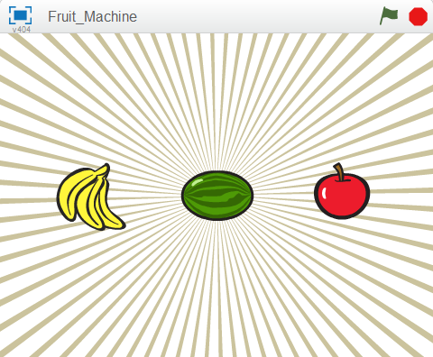

# Introduzione { .intro }

Questo e' il gioco della Slot Machine. E' un gioco che ha 3 sprite che cambiano il loro aspetto (costume). Lo scopo e' di fermare i 3 sprite sullo stesso frutto (come una Slot Machine).



<div class="pagebreak"></div>

# Passo 1: Crea uno sprite che cambia il suo aspetto (costume) { .activity }

## Lista delle Attivita' { .check }

**Importa tutti gli sprite del gioco**

+ Crea un nuovo progetto Scratch. Rimuovi il gatto Felix con click-destro e seleziona **cancella**.
+ Prima di tutto aggiungiamo uno sfondo. Nel tab `Sfondi` aggiungi un nuovo sfondo. Fai click su `Scegli uno sfondo dalla libreria`. Seleziona **rays** dalla categoria **Altro**. Cancella lo sfondo originale.
+ Adesso aggiungi gli sprite dalla libreria di Scratch.
+ Scegli un immagine da qualsiasi categoria. Noi abbiamo usato **banas** nella categoria **Altro**, ma tu puoi usare l'immagine che preferisci.
+ Fai click sulla `**i**` blue dello sprite e cambia il nome in `frutto1`
+ Adesso seleziona il tab `Costumi` e importa altri 2 sprite (frutti) in modo di avere 3 costumi in totale (noi abbiamo usato  **Altro/apple** e **Altro/watermelon-a**, ma tu puoi usare le immagini che preferisci.).

Adesso abbiamo un frutto con 3 aspetti, facciamo in modo che lo sprite cambi costume.

<div class="pagebreak"></div>

# Passo 2: Far cambiare il frutto { .activity }

## Lista delle Attivita' { .check }

+ Fai click sul tab `Script`.
+ Fai click su `Situazioni` e trascina un blocco `quando si clicca su bandierina` { .blockyellow } all'interno dell'area dello script. Questo blocco verra' eseguito quando si premera' sulla bandierina verde per dar inizio al gioco.
+ Fai click sul tab **Controllo** ed aggiungi un blocco `per sempre` { .blockyellow } e fallo aderire al blocco precedente.
+ **Fai click sulla bandierina verde** in alto a destra. Nota come lo script venga evidenziato con un bordo giallo. Cio' indica che lo script e' in esecuzione.
+ Adesso fai click su `Aspetto` e trascina il blocco `passa al costume seguente` { .blockpurple }
+ Come facciamo a rallentare il cambio del costume in modo che non sia troppo veloce? Fai click su `Controllo` e trascina un blocco `attendi 1 secondi` { .blockyellow }
+ Regola il tempo di attesa finche' i frutti non si alternano abbastanza velocemnete (un tempo di 0,5 secondi va bene). Cosa succederebbe se non avessimo aggiunto il blocco di attesa? 
```blocks
    quando si clicca su @
    per sempre
        passa al costume seguente
        attendi (0.5) secondi
```

## Verifica il tuo progetto { .flag }

**Fai click sulla bandierina verde.**

+ I frutti si alternano ad una velocita' adeguata?

## Salva il tuo progetto { .save }

## Cose da provare { .try }

+ Regola il tempo di attesa nel blocco `attendi 1 secondi` { .blockyellow }
+ Quali tempi di attesa pensi che renderebbero il gioco troppo facile o troppo difficile?

# Passo 3: Fermiamo la rotazione quando facciamo click sul frutto { .activity }

## Lista delle Attivita' { .check }

Fantastico! Siamo in grado di far cambiare il frutto per sempre, ma come facciamo a fermarlo quando gli facciamo click sopra?

Un modo possibile e' di usare una variabile per tenere traccia dello stato dello sprite. La useremo dopo...

+ Crea una nuova variabile facendo click su `Variabili e Liste` e poi su `Crea una variabile`. Chiamala `fermo` { .blockorange } e creala solo per questo sprite. Deseleziona lo spunta vicino al nome della variabile in modo che non appaia nello stage.
+ Siccome all'inizio del gioco lo sprite non e' stato ancora fermato, impostiamo il valore iniziale della variabile a **NO**.
```blocks
    quando si clicca su @
    porta [fermo v] a [NO]
    per sempre
    	passa al costume seguente
        attendi (0.5) secondi
```
+ Adesso impostiamo la variabile `fermo` { .blockorange } a **SI** quando facciamo click sullo sprite per fermarlo. 
```blocks
    quando si clicca questo sprite
    porta [fermo v] a [SI]
```
+ Per ultimo dobbiamo fermare il cambiamento del costume dello sprite quando la variabile `fermo` assume il valore "SI". Aggiungi un blocco `se..allora` { .blockyellow } ed usa un blocco **=**`[] = []` { .blockgreen } (lo trovi nella sezione *Operatori*) per verificare se la variabile `fermo` { .blockorange } e' ancora uguale a "NO"
```blocks
	quando si clicca su @
    porta [fermo v] a [NO]
    per sempre
    	se <(fermo) = [NO]> allora
    		passa al costume seguente
        	attendi (0.5) secondi
```

## Verifica il tuo progetto { .flag }

Fai click sulla bandierina verde, aspetta un attimo e poi fai click sullo sprite.

+ Vedi lo sprite cambiare costume prima che gli fai click sopra?
+ Lo sprite si ferma quando gli fai click sopra?
+ **Fai ripartire il gioco**. Se posizione il mouse sul frutto senza fare click lo vedi fermarsi?
+ Se fai click in un punto qualunque dello stage, vedi il frutto fermarsi?

## Salva il tuo progetto { .save }

<div class="pagebreak"></div>

# Passo 4: Crea gli altri sprite { .activity }

Ora dobbiamo creare gli altri due sprite in modo da poter giocare con la nostra Fruit Machine!

## Lista delle Attivita' { .check }

+ **Duplica lo sprite** (frutto1) selezionando `duplica` dopo aver premuto il tasto destro del mouse sullo sprite stesso.
+ Duplicalo ancora una volta cosi' avrai **3** frutti sullo schermo.
+ Allinea gli sprite orizzontalmente. Se necessario rimpiccioliscili un po'.

## Verifica il tuo progetto { .flag }

Fai click sulla bandierina verde. Devi vedere tutti gli sprite che cambiano aspetto. Prova a fermare i frutti uno per uno facendogli click sopra!

## Salva il tuo progetto { .save }

<div class="pagebreak"></div>

# Passo 5: Assegniamo ad ogni sprite un costume diverso { .activity }

Facciamo in modo che quando fai click sulla bandierina ad ogni sprite venga assegnato casualmente un costume.

Quando inizia il gioco tutti gli sprite hanno lo tesso costume e tutti e tre cambiano allo stesso modo. Se i costumi degli sprite cambiassero in modo casuale il gioco diventerebbe sicuramente piu' divertente!!

## Lista delle Attivita' { .check }

+ Se guardi nel tab `Costumi` di uno sprite vedrai che ogni costume ha un numero. E' possibile specificare quale costume uno sprite `indossera'` tramite il suo nome o numero.
+ Per assegnare un costume casuale agli sprite aggiungi un blocco `passa al costume` { .blockpurple } con un blocco `numero a caso tra (1) e (3)` { .blockgreen }.
+ Posiamo usare esattamente lo stesso blocco dentro il ciclo `per sempre` { .blockyellow } in modo da cambiare il costume di tutti gli sprite in modo casuale durante il gioco.
```blocks
	quando si clicca su @
    porta [fermo v] a [NO]
    passa al costume (numero a caso tra (1) e (3))
    per sempre
    	se <(fermo) = [NO]> allora
    		passa al costume (numero a caso tra (1) e (3))
        	attendi (0.5) secondi
```
+ Fai la stessa cosa per tutti gli sprite

<div class="pagebreak"></div>

## Verifica il tuo progetto { .flag }

Fai click sulla bandierina verde. Adesso tutti gli sprite dovrebbero cambiare aspetto in modo casuale.

+ Come dovremmo cambiare lo script se aggiungessimo un altro costume?

## Salva il tuo progetto { .save }

## Cose da provare { .try }

**Rendi il gioco piu' difficile**

Aumenta in qualche modo la difficolta' del gioco. Cambiare i costumi piu' velocemnete non e' difficile. Riesci a pensare a qualcosa di piu' difficile?

Ecco alcune idee che puoi provare:

+ Assegna un numero di costumi diversi per ciascun sprite
+ Fai in modo che alcuni sprite abbiamo dei costumi unici
+ Cambia i costumi con velocita' diverse

Divertiti provando le tue idee!! Ogni volta che cambi qualcosa pensa se il gioco diventa piu' facile o difficile. Come bilanci la difficolta' rispetto alla giocabilita'?

## Salva il tuo progetto { .save }

<div class="pagebreak"></div>
	
# Passo 6: Visualizza un messaggio quando il gioco finisce. { .activity }

Visualizziamo un messaggio "Game Over" al giocatore quando ha finito

## Lista delle Attivita' { .check }

Prima di tutto aggiungiamo uno sfondo da visualizzare quando il gioco finisce.

+ Fai click nello stage e poi su `Sfondi`. Cambia il nome dello sfondo corrente in `inizio`.
+ Duplica lo sfondo ed usando lo strumento `Testo` aggiungi una scritta **Game Over**. Puoi variare la dimensione del testo facendogli click sopra e trascinando un angolo. Cambia il nome in `fine`
+ Fai click su `Script` per lo stage ed imposta lo sfondo `inizio` all'inizio del gioco.
+ Come capiamo quando tutti gli sprite sono fermi? Ricordi la variabile `fermo` { .blockorange } che abbiamo usato per tenere traccia dello stato degli sprite? Controlliamo il varole della variabile `fermo` { .blockorange } per **frutto3** per verificare se il gioco e' terminato. Seleziona lo sprite frutto3 e usa il blocco `posizione x di frutto3` { .blockblue }, nella sezione `Sensori` { .blocklightgrey }. Cambia `posizione x` con `fermo` { .blockorange }.
```blocks
	quando si clicca su @
	passa allo sfondo [inizio v]
    per sempre
    se <([fermo v] di [frutto3 v]) = [SI]> allora
    	passa allo sfondo [fine v]
```

<div class="pagebreak"></div>

## Verifica il tuo progetto { .flag }
	
Fai click sulla bandierina verde. 

+ Vedi apparire il messaggio "Game Over"  quando fai click sul frutto3?
+ Cosa succede se fai click su frutto3 prima di fare click sugli altri due frutti? Adesso cambiamo lo script in modo che funzioni indipendentemente dall'ordine di fermata dei frutti.

## Salva il tuo progetto { .save }

Per verificare che **tutti e tre** i frutti abbiano la variabile `fermo` { .blockorange } impostata su **SI** possiamo usare l'operatore `e` { .blockgreen }. Questo blocco e' un po' complicato quindi creiamolo un passo alla volta.
```blocks
    quando si clicca su @
    passa allo sfondo [inizio v]
    per sempre
    se <<<([fermo v] di [frutto1 v]) = [SI]> e <([fermo v] di [frutto2 v]) = [SI]>> e <([fermo v] di [frutto3 v]) = [SI]>> allora
        passa allo sfondo [fine v]
```

## Verifica il tuo progetto { .flag }

**Fai click sulla bandierina verde.** 

+ Vedi apparire il messaggio "Game Over"  quando tutti e 3 i frutti sono fermi indipendentemente dall'ordine di fermata?

## Salva il tuo progetto { .save }

# Passo 7. Fai sapere al giocatore se ha vinto o perso { .activity }

Lo scopo del gioco e' di fermare i 3 sprite che girano sullo stesso frutto. Sarebbe carino visualizzare un messaggio che dice se il giocatore ha vinto o perso.

## Lista delle Attivita' { .check }

+ Al Passo 6 abbiamo aggiunto allo script la logica che verifica se il gioco e' finito. Adesso dobbiamo solo verificare se il giocatore ha vinto. Ritorna allo sfondo ed aggiungi un altro testo ("VINTO!") allo sfondo `fine`. Cambia il nomde dello sfondo in `vinto`.
+ Duplica lo sfondo e chiamalo `perso`. Modifica il testo con **PERSO!**.
+ Adesso dobbiamo aggiungere la logica che decida quale sfondo visualizzare alla fine del gioco. Possiamo usare il blocco `se...allora...altrimenti` { .blockyellow } in modo da verificare se il giocatore ha vinto o perso confrontando ogni costume. Possiamo usare in blocco `posizione x di frutto3` { .blockblue }, nella sezione `Sensori` { .blocklightgrey }. Questa volta anziche' verificare lo stato della variabile `fermo` { .blockorange } dobbiamo verificare il `numero del costume` { .blockpurple }, e controllare che il numero di costume del frutto 1 sia uguale a quesllo del frutto 2. Poi dobbiamo verificare che il numero di costume del frutto2 sia uguale a quello di frutto3. (properieta' transitiva)
```blocks
	quando si clicca su @
    passa allo sfondo [inizio v]
    per sempre
    se <<<([fermo v] di [frutto1 v]) = [SI]> e <([fermo v] di [frutto2 v]) = [SI]>> e <([fermo v] di [frutto3 v]) = [SI]>> allora
        se <<([numero costume] di [frutto1 v]) = ([numero costume] di [frutto2 v])> e <([numero costume] di [frutto2 v]) = ([numero costume] di [frutto3 v])>> allora  
            passa allo sfondo [vinto v]
        altrimenti
            passa allo sfondo [perso v]
```

<div class="pagebreak"></div>

## Verifica il tuo progetto { .flag }


Fai click sulla bandierina verde. 

+ Quando il gioco finische vedi apparire il messaggio corretto? 
+ Cosa succederebbe se il numero di costume non coincidesse (per esempio il costume 3 di frutto2 e' una mela mentre il costume 3 di frutto3 e' un anguria)? 

## Salva il tuo progetto { .save }

Ben fatto!!! Hai finito il gioco base. Ci sono altre cose che puoi fare con il tuo gioco. Dai un occhiata alla sfida!

##Sfida: Rendi il gioco piu' semplice o difficle al passare del tempo. { .challenge }

Giocatori differenti hanno diversi abilita'. **Come puoi adattare la difficolta' del gioco in base al giocatore?**

Un modo e' di **variare la velocita' di cambiamento dei costumi**. Puoi usare una variabile `ritardo` { .blockorange } da usare nel blocco `attendi` per ogni sprite. Se il giocatore vince puoi ridurre un po' il ritardo per rendere il gioco piu' difficile. Se il giocatore perde il turno puoi aumentare un po' il ritardo per rendere il gioco piu' facile. 

Probabilmente dovresti pensare ad un modo diverso di iniziare il gioco anziche fare click sulla bandierina. In questo modo puoi usare una variabile tra un turno di gioco e l'altro.

## Salva il tuo progetto { .save }

Ben fatto!!! Hai finito con questo esercizio. Adesso divertiti con il tuo nuovo gioco!!!

Ehi, non dimenticare che puoi condividere il tuo gioco con tutti i tuoi amici e familiari. Basta che fai selezioni il menu File e poi **Share to website**!!