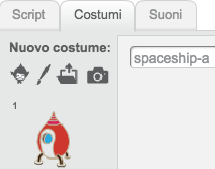
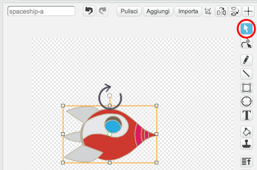
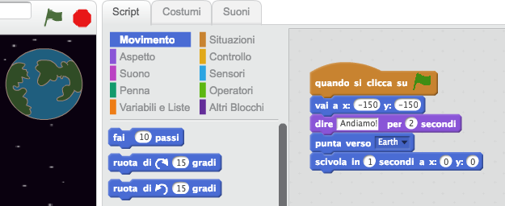
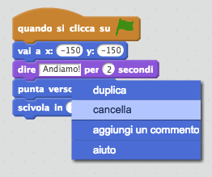
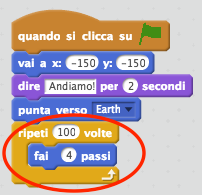
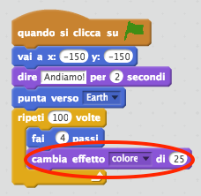
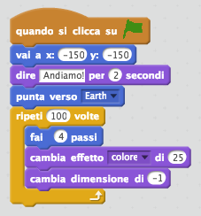
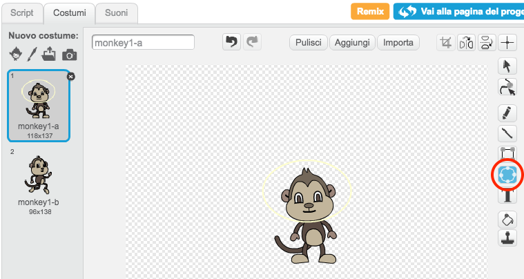
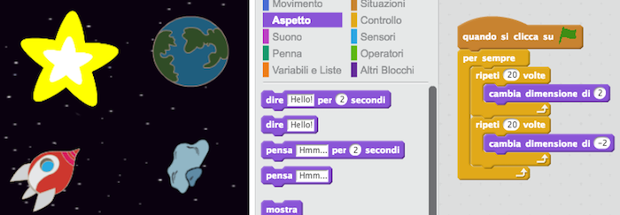

# Introduzione {.intro}

Imparerai a programmare la tua animazione!

<div class="scratch-preview">
  <iframe allowtransparency="true" width="485" height="402" src="https://scratch.mit.edu/projects/embed/26818098/?autostart=false" frameborder="0"></iframe>
  
</div>

# Passo 1: Animare un'astronave { .activity .new-page}

Creiamo un'astronave che vola verso la Terra!

## Lista delle attività { .check}

+ Inizia un nuovo progetto Scratch, e cancella lo sprite del gatto così che il tuo progetto sia vuoto. Puoi trovare l'editore Scratch online a <a href="http://jumpto.cc/scratch-new" target="_blank">jumpto.cc/scratch-new</a>.

+ Aggiungi al tuo quadro gli sprite 'Astronave' e 'Terra. Puoi anche aggiungere al tuo quadro lo scenario 'Stelle'. Il tuo quadro dovrebbe essere così:

	

+ Clicca sul tuo nuovo sprite di astronave, e clicca il tab 'Costumi'.

	

+ Usa la freccia per selezionare l'immagine. Clicca poi sulla maniglia circolare e ruota l'immagine finché si trova sul suo lato.

	

+ Aggiungi questo codice allo sprite dell'astronave:

	

	Cambia i numeri nei blocchi di codice, in modo che il codice sia esattamente lo stesso dell'immagine sopra.

+ Se clicchi sui blocchi per far funzionare il codice, dovresti vedere l'astronave parlare, girare e muoversi verso il centro del quadro.

	

	La posizione dello schermo `x:(0) y:(0)` {.blockmotion} è il centro del quadro. Una posizione come `x:(-150) y:(-150)` {.blockmotion} è verso la parte bassa a sinistra del quadro, e una posizione come `x:(150) y:(150)` {.blockmotion} è vicino alla parte alta a destra.

	

	Se hai bisogno di sapere le coordinate di una posizione sul quadro, muovi il mouse nella posizione che vuoi e annota le coordinate, che sono visualizzate sotto il quadro.

	

+ Prova la tua animazione, cliccando sulla bandiera verde appena sopra il quadro.

	

## Sfida: Migliora la tua animazione {.challenge}
Puoi cambiare i numeri nel codice della tua animazione in modo che:
+ L'astronave si muova finché tocca la Terra?
+ L'astronave si muova più lentamente verso la Terra?

Dovrai cambiare i numeri in questo blocco:

```blocks
	scivola in (1) secondi a x: (0) y: (0)
```

## Salva il progetto {.save}

# Passo 2: Animare usando i loop { .activity .new-page}

Un'altra maniera per animare l'astronave è di dirle di muoversi in piccole quantità, un sacco di volte.

## Lista delle attività { .check}

+ Cancella il blocco 'scivola' {.blockmotion} dal tuo codice, facendo clic col pulsante destro sul blocco e cliccando 'cancella'. Puoi anche cancellare il codice trascinandolo fuori dall'area del testo fino all'area dei blocchi di codici.

	

+ Una volta che hai rimosso il codice, aggiungi questo altro codice:

	

	Il blocco 'ripeti' {.blockcontrol} è usato per ripetere tante volte qualcosa, ed è noto anche come_loop_.

+ Se clicchi la bandiera per provare questo nuovo codice, vedrai che fa più o meno la stessa cosa di prima.

+ Puoi aggiungere un altro codice al tuo loop per fare cose interessanti. Aggiungi nel loop il blocco 'cambia effetto colore di 25' {.blocklooks} (dalla sezione 'Apparenze'), per cambiare ripetutamente il colore dell'astronave mentre si muove:

	

+ Clicca la bandiera per vedere la tua nuova animazione.

	

+ Puoi anche fare in modo che l'astronave si rimpicciolisca man mano che si avvicina alla Terra.

	

+ Prova la tua animazione. Che succede se clicchi la bandiera una seconda volta? La tua astronave inizia alla misura giusta? Puoi usare questo blocco per aggiustare la tua animazione:

	```blocks
		porta dimensione al (100) %
	```

## Salva il progetto {.save}

# Passo 3: Scimmie Fluttuanti { .activity .new-page }

Aggiungiamo alla tua animazione delle scimmie che si sono perdute nello spazio!

## Lista delle attività { .check}

+ Inizia aggiungendo dalla libreria lo sprite della scimmia.

	

+ Se clicchi sul tuo nuovo sprite della scimmia e poi clicchi 'Costumi', puoi modificare il costume della scimmia. Clicca sullo strumento 'Ellissi' e disegna attorno alla testa della scimmia un casco spaziale bianco.

	

+ Ora clicca 'Scritte' e aggiungi questo codice alla scimmia, così che ruoti lentamente in circolo per sempre:

	```blocks
		quando si clicca sulla bandiera verde
		per sempre
  			ruota in senso orario di (1) gradi
		end
	```

	Il blocco 'per sempre' {.blockcontrol} è un altro loop, ma uno che non finisce mai.

+ Clicca sulla bandiera per provare la scimmia. Dovrai cliccare il tasto stop (accanto alla bandiera) per termnare questa animazione.

	

# Passo 4: Asteroidi Rimbalzanti { .activity .new-page }

Aggiungiamo all'animazione delle rocce spaziali fluttuanti.

## Lista delle attività { .check}

+ Aggiungi lo sprite 'roccia' alla tua animazione.

	

+ Aggiungi questo codice alla tua roccia per farla rimbalzare attorno al quadro:

	```blocks
		quando si clicca sulla bandiera verde
		punta verso [Earth v]
		per sempre
  			fai (2) passi
  			rimbalza quando tocchi il bordo
		end
	```

+ Clicca sulla bandiera per provare la roccia. Rimbalza attorno al quadro?

# Passo 5: Stelle Splendenti { .activity .new-page }

Organizziamo i loop per creare delle stelle splendenti.

## Lista delle attività { .check}

+ Aggiungi lo sprite 'stella' alla tua animazione.

	

+ Aggiungi questo codice alla tua stella:

	

+ Clicca sulla bandiera per provare l'animazione della stella. Cosa fa questo codice? Ecco, la stella diventa più grande di 20 volte e poi ritorna alla sua misura originale, 20 volte più piccola. Questi 2 loop sono dentro il loop 'per sempre' {.blockcontrol}, così che l'animazione si ripete costantemente.

## Salva il progetto {.save}

## Sfida: Crea la tua animazione {.challenge}
Termina l'animazione dello spazio e clicca 'File' e poi 'Nuovo' per iniziare un nuovo progetto.

Usa quello che hai imparato in questo progetto per creare la tua animazione. Può essere quello che vuoi, ma fai in modo che la tua animazione si adatti all'ambientazione. Ecco alcuni esempi:


