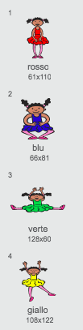
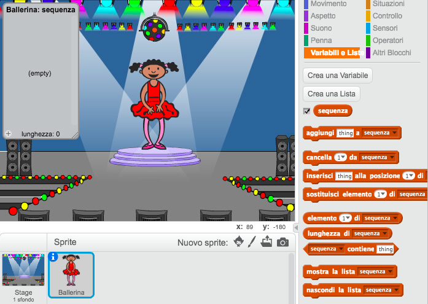
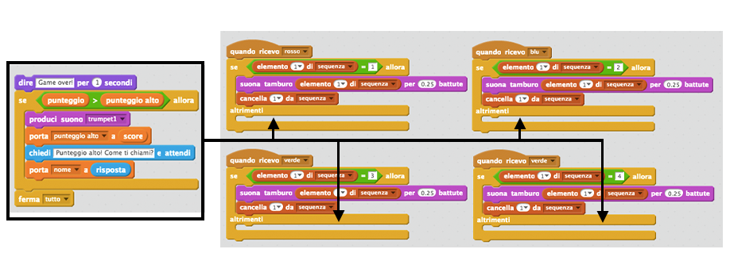
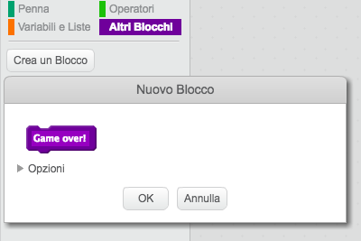
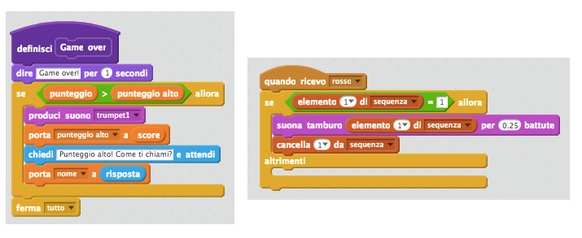
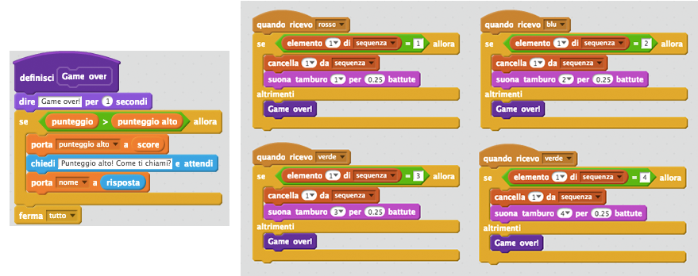
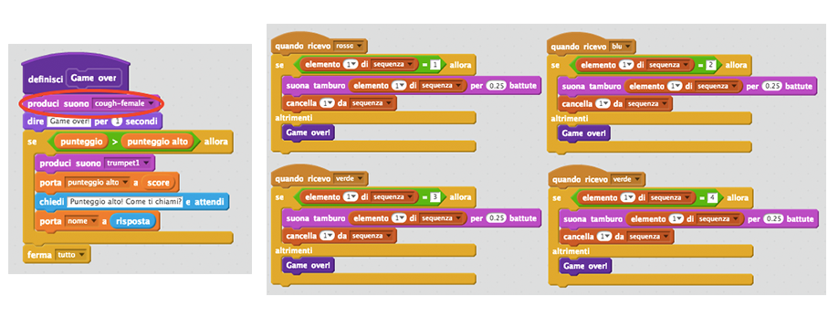
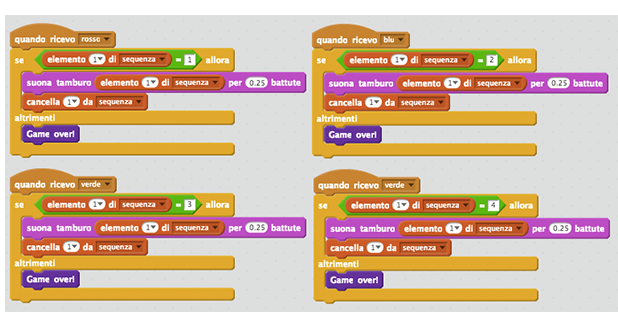

# Introduzione {.intro}

In questo progetto, creerai un gioco di memoria, dove devi memorizzare e ripetere una sequenza di colori a caso!

<div class="scratch-preview">
  <iframe allowtransparency="true" width="485" height="402" src="https://scratch.mit.edu/projects/embed/34874510/?autostart=false" frameborder="0"></iframe>
  
</div>

# Passo 1: Colori a caso { .activity }

Per prima cosa, creiamo un personaggio che può cambiare in una sequenza di colori che il giocatore deve memorizzare.

## Lista delle attività { .check}

+ Inizia un nuovo progetto Scratch, e cancella lo sprite del gatto così che il tuo progetto sia vuoto. Puoi trovare l'editore Scratch online a <a href="http://jumpto.cc/scratch-new" target="_blank">jumpto.cc/scratch-new</a>.

+ Scegli un personaggio e uno scenario. Il tuo personaggio non deve essere una persona, ma deve essere in grado di mostrare colori diversi.

	

+ Nel tuo gioco, userai un numero diverso per rappresentare ciascun colore.

	+ 1 = rosso;
	+ 2 = blu;
	+ 3 = verde;
	+ 4 = giallo;

	Dai al tuo personaggio 4 costumi colorati diversi, uno per ciascuno dei 4 colori qui sopra. Assicurati che i tuoi costumi colorati siano nell'ordine giusto.

	

+ Per creare una sequenza a caso, dovrai creare una __lista__. Una lista è solo una variabile che immagazzina tanti dati __in ordine__. + Crea una nuova lista chiamata `sequenza` {.blockdata}. Dato che solo il tuo personaggio ha bisogno di vedere la lista, possiamo anche cliccare 'Solo per questo sprite'.

	

	Ora vedrai la tua lista vuota in alto a sinistra del quadro, così come tanti nuovi blocchi per usare le liste.

	

+ Aggiungi questo codice al tuo personaggio per aggiungere un numero a caso alla tua lista (e mostrare il costume corretto) 5 volte:

	```blocks
		quando si clicca sulla bandiera verde
		cancella (tutto v) da [sequenza v]
		ripeti (5) volte
  			aggiungi (numero a caso tra (1) e (4)) a [sequenza v]
  			passa al costume (elemento (last v) di [sequenza v] :: list)
  			attendi (1) secondi
		end
	```

	Nota che hai innanzitutto svuotato la lista.

## Sfida: Aggiungi un suono {.challenge}
Prova un po' di volte il tuo progetto. Potresti notare che a volte viene scelto lo stesso numero due o più volte di seguito, rendendo la sequenza più difficile da memorizzare. Puoi riprodurre un suono di tamburo ogni volta che il personaggio cambia costume?

Puoi riprodurre un suono di tamburo diverso a seconda del numero scelto a caso? Questo si assomiglierà_molto_ al codice che hai usato per cambiare il costumo del personaggio.

## Salva il progetto {.save}

# Passo 2: Ripetere la sequenza { .activity }

Aggiungiamo 4 tasti che il giocatore può usare per ripetere la sequenza che ricorda.

## Lista delle attività { .check}

Aggiungi 4 sprite al tuo progetto, che diventeranno tasti. Modifica i tuoi 4 sprite in modo che ce ne sia 1 per ognuno dei 4 colori.

	

+ Quando si clicca il tamburo rosso, dovrai trasmettere un messaggio al tuo personaggio, informandolo che il tasto rosso è stato cliccato. Aggiungi questo codice al tuo tamburo rosso:

	```blocks
		quando si clicca questo sprite
		invia a tutti [rosso v]
	```

+ Quando il tuo personaggio riceve questo messaggio, dovrebbe controllare se il numero 1 è all'inizio della lista (il che significa che il rosso è il prossimo colore nella sequenza). Se lo è, puoi rimuovere il numero dalla lista, in qaunto è stato indovinato correttamente. Altrimenti il gioco è finito!

	```blocks
		quando ricevo [rosso v]
		se <(item (1 v) of [sequenza v] :: list) = [1]> allora
  			cancella (1 v) da [sequenza v]
  		altrimenti
  			dire [Game over!] per (1) secondi
  			ferma [tutto v]
		end
	```

+ Puoi anche visualizzare delle luci lampeggianti una volta che la lista è vuota, perché significa che l'intera sequenza è stata indovinata correttamente. Aggiungi questo codice alla fine del testo 'quando si clicca sulla bandiera verde' {.blockevents}.

	```blocks
		attendi fino a quando <(length of [sequenza v] :: list) = [0]>
		invia a tutti [won v] e attendi
	```

+ Clicca sul tuo quadro e aggiungi questo codice per riprodurre_qualsiasi_suono e fare in modo che lo scenario cambi colore una volta che il giocatore ha vinto.

	```blocks
		quando ricevo [won v]
		produci suono [drum machine v]
		ripeti (50) volte
  			cambia effetto [colore v] di (25)
  			attendi (0.1) secondi
		end
		rimuovi effetti grafici
	```

## Sfida: Crea 4 tasti {.challenge}
Ripeti gli stessi passi per i tasti blu, verde e giallo. Quale codice rimane lo stesso e quale cambierà per ciascun tasto?

Puoi anche aggiungere dei suoni che si attivano quando si premono i tasti.

Ricordati di provare il codice che hai aggiunto! Puoi memorizzare una sequenza di 5 colori? La sequenza è ogni volta diversa?

## Salva il progetto {.save}

# Passo 3: Livelli multipli { .activity .new-page}

Fino ad ora, il giocatore deve ricordare solo 5 colori. Miglioriamo il tuo gioco in modo che la lunghezza della sequenza aumenti.

## Lista delle attività { .check}

+ Crea una nuova variabile chiamata `punteggio` {.blockdata}.

	

+ Questo 'punteggio' {.blockdata} verrà usato per decidere la lunghezza della sequenza che il giocatore deve memorizzare.  Dunque, fin dall'inizio il punteggio (e la lunghezza della sequenza) è 3. Aggiungi questo codice all'inizio del codice 'quando si clicca la bandiera' {.blockevents}:

	```blocks
		porta [punteggio v] a [3]
	```

Invece di creare sempre una sequenza di 5 colori, ora vuoi che il 'punteggio' {.blockdata} determini la lunghezza della sequenza. Cambia il loop 'ripeti' {.blockcontrol} del tuo personaggio (per creare la sequenza) a:

	```blocks
		ripeti (punteggio) volte
		end
	```

+ Se si indovina la sequenza correttamente, dovrai aggiungere 1 al punteggio per aumentare la lunghezza della sequenza.

	```blocks
		cambia [punteggio v] di (1)
	```

+ Infine, dovrai aggiungere un loop 'per sempre' {.blockcontrol} attorno al codice per generare la sequenza, in modo che venga creata una nuova sequenza per ogni livello. Il codice del tuo personaggio dovrebbe essere così:

	```blocchi
		quando si clicca sulla bandiera verde
		porta [punteggio v] a [3]
		per sempre
  			cancella (tutto v) da [sequenza v]
  			ripeti (score) volte
    			aggiungi (numero a caso tra (1) e (4)) a [sequenza v]
    			passa al costume (elemento (ultimo v) di [sequenza v] :: list)
    			attendi (1) secondi
  			end
  			attendi fino a quando <(length of [sequenza v] :: list) = [0]>
  			invia a tutti [won v] e attendi
  			cambia [punteggio v] di (1)
		end
	```

+ Fai provare il gioco ai tuoi amici. Ricordati di nascondere la lista 'sequenza' {.blockdata} prima che inizino a giocare!

## Salva il progetto {.save}

# Passo 4: Punteggio alto { .activity }

Salviamo il punteggio alto, in modo che tu possa giocare contro i tuoi amici.

## Lista delle attività { .check}

+ Aggiungi al progetto 2 nuovi variabili chiamate 'punteggio alto' {.blockdata} e 'nome' {.blockdata}.

+ Se il gioco dovesse finire (premendo il tasto sbagliato), dovrai controllare se il punteggio del giocatore è più alto del punteggio massimo attuale. Se lo è, dovrai salvare il punteggio come punteggio alto, e salvare il nome del giocatore. Il tuo tasto rosso sarà così:

	```blocks
		quando ricevo [rosso v]
		se <(item (1 v) of [sequenza v] :: list) = [1]> allora
  			cancella (1 v) da [sequenza v]
		altrimenti
  			dire [Game over!] per (1) secondi
  			se <(punteggio) > (punteggio alto)> allora
    			porta [punteggio alto v] a (punteggio)
    			chiedi [Punteggio alto! Come ti chiami?] e attendi
    			porta [nome v] a (risposta)
  			end
  			ferma [tutto v]
		end
	```

+ Dovrai aggiungere questo nuovo codice anche agli altri 3 tasti! hai notato che il codice 'Game over' è esattamente lo stesso in ognuno dei 4 tasti?

	

+ Se dovessi avere bisogno di cambiare qualsiasi cosa di questo codice, come aggiungere un suono o cambiare il messaggio 'Game over!', dovrai cambiarlo 4 volte! Ciò potrebbe essere fastidioso e risultare in una perdita di tempo.

	Invece, puoi definire i tuoi blocchi e riutilizzarli nel tuo progetto! Per fare ciò, clicca 'Altri Blocchi' {.blockmoreblocks}, e poi 'Crea un Blocco'. Chiama questo nuovo blocco 'Game over'.

	

+ Aggiungi questo codice dal blocco 'altrimenti' {.blockcontrol} dal tasto rosso fino al nuovo blocco che compare:

	

+ hai creato ora una nuova_funzione_chiamata Game over' {.blockmoreblocks}, che puoi usare ogni volta che vorrai. Trascina il tuo nuovo blocco 'Game over' {.blockmoreblocks} sulle 4 scritte dei tasti.

	

+ Adesso aggiungi un suono per quando viene premuto il tasto sbagliato. Questo codice dovrà essere aggiunto_una volta_ nel blocco 'Game over' {.blockmoreblocks} che hai creato, e non 4 volte separate!

	

## Sfida: Crea altri blocchi {.challenge}
Hai notato qualche altro codice che è lo stesso per tutti e 4 i tasti?



Puoi creare un altro blocco personalizzato che viene usato da ogni tasto?

## Salva il progetto {.save}

## Sfida: Un altro costume {.challenge}
Hai notato che il gioco inizia con il tuo personaggio che mostra uno dei 4 colori, e che visualizza sempre l'ultimo colore nella sequenza mentre il giocatore ripete la sequenza?

Puoi aggiungere al tuo personaggio un altro semplice costume bianco, che viene visualizzato all'inizio del tuo gioco, e quando il giocatore cerca di copiare la sequenza?


## Salva il progetto {.save}

## Sfida: Livello difficoltà {.challenge}
Puoi fare in modo che il tuo giocatore possa scegliere tra 'modalità facile' (usando solo i tamburi rosso e blu) e 'modalità normale' (che usa tutti e 4 i tamburi)?

Puoi aggiungere perfino una 'modalità difficile', che utilizza un quinto tamburo!

## Salva il progetto {.save}
