---
title: チャットボット
level: Scratch 1
language: ja-JP
stylesheet: スクラッチ
embeds: "*.png"
materials: ["Club Leader Resources/*"]
...

# まえがき { .intro }

おしゃべりチャットボットをつくってみましょう！

<div class="scratch-preview">
  <iframe allowtransparency="true" width="485" height="402" src="http://scratch.mit.edu/projects/embed/26762091/?autostart=false" frameborder="0"></iframe>
  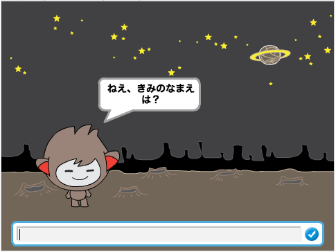
</div>

# ステップ１：チャットボット { .activity }

## チェックリスト { .check }

+ まずはじめに、チャットボットのキャラクターを決めましょう。
	+ 名前は?
	+ 住んでいる場所は?
	+ 明るい？まじめ？楽しい？おとなしい？やさしい？

+ 新しいスクラッチのプロジェクトを開いたら、まずネコのキャラクターを消してプロジェクトをからっぽにしましょう。オンラインのエディターはここから開きます： <a href="http://jumpto.cc/scratch-new">jumpto.cc/scratch-new</a>。

+ キャラクターの絵をえらんで、プロジェクト内におきましょう。

	

+ キャラクターにあう<ruby>背景<rp>(</rp><rt>はいけい</rt><rp>)</rp></ruby>をえらびましょう。こういう感じにしても良いですし、ちがう<ruby>背景<rp>(</rp><rt>はいけい</rt><rp>)</rp></ruby>にすることもできます。

	

## プロジェクトを保存してください { .save }

# ステップ２：おしゃべりチャットボット { .activity }

さてチャットボットのキャラクターが決まったので、おしゃべりができるようにプログラムしましょう。

## チェックリスト { .check }

+ チャットボットのキャラクターをクリックして、このコードを入れてみましょう。

	```blocks
    このスプライトがクリックされたとき
    [ねえ、きみのなまえは？] と聞いて待つ
    [すてきな名前ですね!] と (2) 秒言う
	```

+ チャットボットをクリックして、プログラムをテストします。名前を聞かれたら、下のところに自分の名前を入力しましょう。

	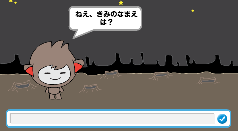

+ チャットボットは何回でも`すてきな名前ですね！` と答えます。他の言葉にかえれば、チャットボットをちがう感じにすることができます。 コードをこのようにかえます。

	```blocks
    このスプライトがクリックされたとき
    [ねえ、きみのなまえは？] と聞いて待つ
    <[こんにちは] と (答え)> と (2) 秒言う
	```

	図の３つ目のブロックを作るには、２つの言葉をつなげる`helloとworld`{.blockoperators}のブロックをドラッグして、`言う`{.blocklooks}のブロックの上にドラッグします。

	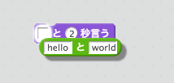

	`hello`のところを`こんにちは`にかえて、`答え`{.blocksensing}ブロック（「調べる」というカテゴリーの中にありますをドラッグして `world`のところにおきます。

	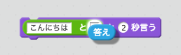

+ 新しいプログラムを動かしてみましょう。思いどおりに動きましたか？ おかしなところがあれば直せるでしょうか？

+ ユーザーの名前を<ruby>変数<rp>(</rp><rt>へんすう</rt><rp>)</rp></ruby>に入れておけば、 その名前をあとで他のところにも使うことができます。`名前(name)`{.blockdata}という<ruby>変数<rp>(</rp><rt>へんすう</rt><rp>)</rp></ruby>を新しく作りましょう。 もし作り方をわすれてしまった場合は、 「ゴーストバスター」のプロジェクトを見てみましょう。

+ 入力した言葉は、`答え` {.blocksensing}という<ruby>変数<rp>(</rp><rt>へんすう</rt><rp>)</rp></ruby>に入ります。「調べる」のカテゴリーから、`答え`{.blocksensing}のところにあるチェックをクリックしましょう。`答え`{.blocksensing}に入っているものが左上に見えるようになります。

+ チャットボットのコードがこのようになっているか、たしかめてみましょう。

	```blocks
		このスプライトがクリックされたとき
		[ねえ、きみのなまえは？] と聞いて待つ
		[name v] を (答え) にする
		<[こんにちは] と (name)> と (2) 秒言う
	```

+ もう一回テストしたら、こんどは答えが`名前(name)` {.blockdata}の中に入っていて、左上に出てきます。`名前(name)` {.blockdata}には、`答え` {.blocksensing}と同じものが入っているはずです。

	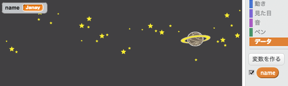

	もし<ruby>変数<rp>(</rp><rt>へんすう</rt><rp>)</rp></ruby>をわざわざ見なくてもよい場合は、 スクリプトの「データ」や「調べる」のカテゴリーにある<ruby>変数<rp>(</rp><rt>へんすう</rt><rp>)</rp></ruby>のチェックをクリックすれば、かくすことができます。

## プロジェクトを保存してください { .save }

## チャレンジ：<ruby>質問<rp>(</rp><rt>しつもん</rt><rp>)</rp></ruby>をふやす { .challenge }

チャットボットがもう一つ他のことを聞いてくるようにプログラムしてみましょう。 答えを<ruby>変数<rp>(</rp><rt>へんすう</rt><rp>)</rp></ruby>に入れられるでしょうか?

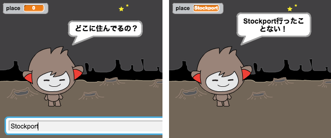

## プロジェクトを保存してください { .save }

# ステップ３：いろいろな答え方 { .activity }

ユーザーの入力によって、チャットボットがちがう答え方をするようにプログラムすることができます。

## チェックリスト { .check }

+ `はい`か`いいえ`で答えられることを聞くようにしてみましょう。この図のようにしてもよいですし、すきな言葉にかえてもかまいません。

	```blocks
		このスプライトがクリックされたとき
		[ねえ、きみのなまえは？] と聞いて待つ
		[name v] を (答え) にする
		<[こんにちは] と (name)> と (2) 秒言う
		<(name) と [は元気ですか？]> と聞いて待つ
		もし ((答え) = [はい]) なら
			[それはよかった！] と (2) 秒言う
		end
	```

	ここで名前が<ruby>変数<rp>(</rp><rt>へんすう</rt><rp>)</rp></ruby>に入っていることに気がつきましたか？<ruby>変数<rp>(</rp><rt>へんすう</rt><rp>)</rp></ruby>にすることで何回も使うことができます。

+ このプログラムがうまく動くかをたしかめるには２回テストします。１回目は`いいえ`と入力し、２回目は`はい`と入力します。`はい`と入力したときだけチャットボットが答えます。

+ ここで問題は、答えが`いいえ`のときチャットボットが何も言ってくれないことです。うまく直すには`もし…なら`{.blockcontrol}のブロックを`もし…なら／でなければ`{.blockcontrol}ブロックにかえればいいのです。こんなふうに直してみましょう。

	```blocks
		このスプライトがクリックされたとき
		[ねえ、きみのなまえは？] と聞いて待つ
		[name v] を (答え) にする
		<[こんにちは] と (name)> と (2) 秒言う
		<(name) と [は元気ですか？]> と聞いて待つ
		もし ((答え) = [はい]) なら
			[それはよかった！] と (2) 秒言う
		でなければ
			[それはこまったね。。。] と (2) 秒言う
		end
	```

+ このプログラムをテストすると、こんどは`はい`でも`いいえ`でも答えが返ってきましたね。答えが`はい`なら`それはよかった！`と言いますが、`はい`以外のときには`それはこまったね・・・`と言うはずです。

	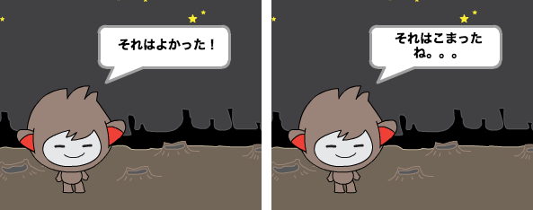

+ `もし…なら／でなければ`{.blockcontrol}のブロックには、チャットボットの言葉だけではなく、いろいろなコードを入れることができます。たとえば、答えに合わせてコスチュームをかえることもできます。


	チャットボットのコスチュームを見てみると、いくつかあるのがわかると思います。（もしない場合は自分で足すこともできます！）

	

	コードを次のようにすることで、コスチュームをかえることができます。

	

+ プログラムをテストしてみましょう。答えによってチャットボットの顔がかわるはずです。

	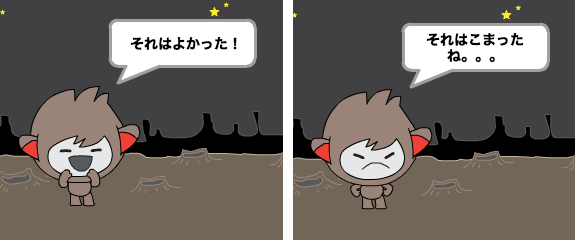

## プロジェクトを保存してください  { .save }

## チャレンジ：もっといろいろな答え { .challenge }

チャットボットが他のことも聞くようにプログラムしてみましょう。`はい`か`いいえ`で答えられるようにしましょう。あなたのチャットボットはきちんと答えられるでしょうか？

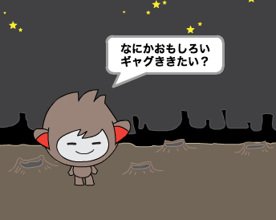

## プロジェクトを保存してください  { .save }

# ステップ４：<ruby>背景<rp>(</rp><rt>はいけい</rt><rp>)</rp></ruby>をかえる { .activity }

チャットボットのいるところの<ruby>背景<rp>(</rp><rt>はいけい</rt><rp>)</rp></ruby>をかえることができます。

## チェックリスト { .check }

+ ステージに他の<ruby>背景<rp>(</rp><rt>はいけい</rt><rp>)</rp></ruby>、たとえば「moon（月）」にしてみましょう。

	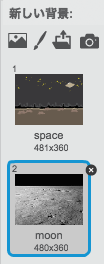

+ コードを次のようにして、チャットボットのいる場所をかえてみましょう。

	```blocks
		[今から月に行くんだけど、きみもいっしょに来る？] と聞いて待つ
		もし ((答え) = [yes]) なら
   			背景を [moon v] にする
		end
	```

+ チャットボットが話しはじめるときはきちんと外にいるようにするために、このようなブロックを入れておきましょう。

	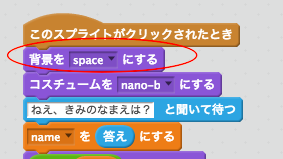

+ テストしてみましょう。チャットボットに月に行きたいかを聞かれたら`はい`と答えましょう。チャットボットのいる場所がかわったはずです。

	

+ チャットボットに`いいえ`と答えたら、いる場所はかわりましたか。`わからない`と答えた場合はどうでしょうか。

+ `もし…なら`{.blockcontrol}のブロックの中にこのようにコードを入れると、`はい`と答えたときにチャットボットを４回ジャンプさせることができます。

	```scratch
	(4) 回繰り返す
   		y座標を (10) ずつ変える
   		(0.1) 秒待つ
   		y座標を (-10) ずつ変える
   		(0.1) 秒待つ
	end
	```

	

+ テストしてみましょう。チャットボットに`はい`と答えたら４回ジャンプしましたか？

## プロジェクトを保存してください { .save }

## チャレンジ：自分のチャットボット {.challenge}
これまでに学んだことを使って、おしゃべりチャットボットを作り上げましょう。ここにいくつかのアイデアがあります。

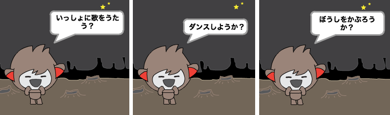

チャットボットができあがったら、友だちにためしてもらいましょう！気に入ってもらえましたか？おかしなところが見つかったりしましたか？

## プロジェクトを保存してください { .save }
