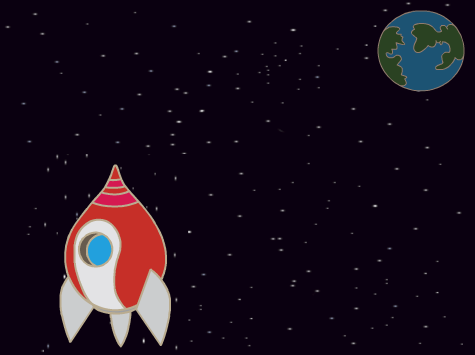
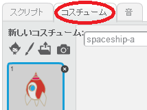
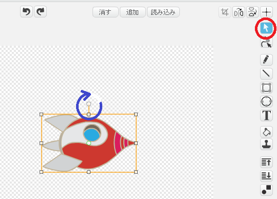
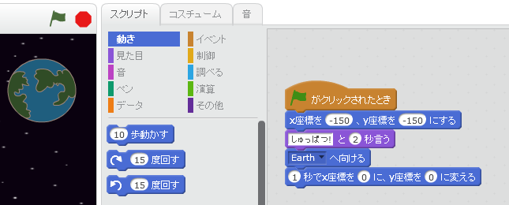
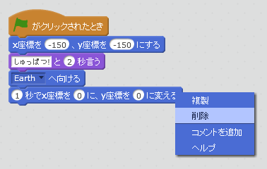
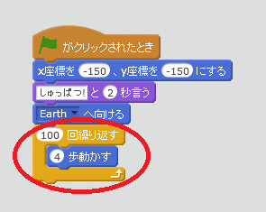
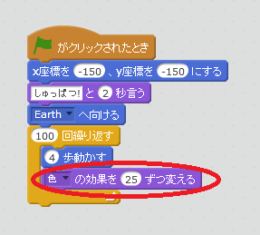
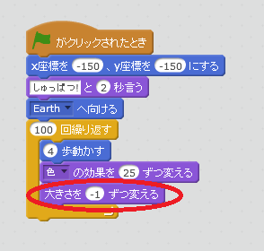
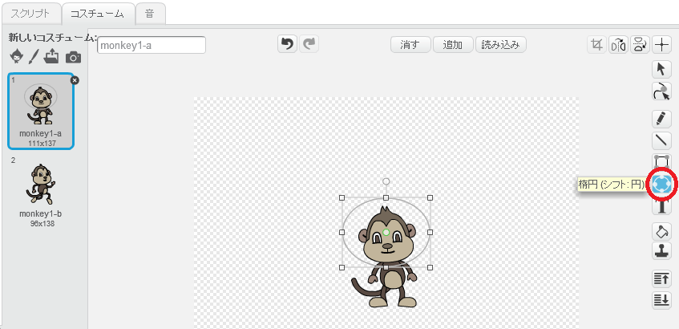
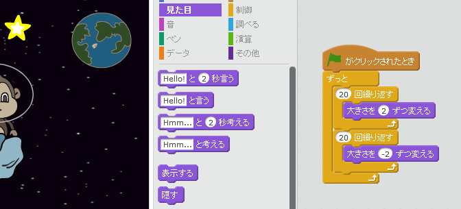

---
title: ロスト・イン・スペース/ 宇宙(うちゅう)で迷子(まいご)
level: Scratch 1
language: ja-JP
stylesheet: スクラッチ
embeds: "*.png"
materials: ["Club Leader Resources/*"]
...

# まえがき { .intro }

アニメーションのプログラム<ruby>方法<rp>（</rp><rt>ほうほう</rt><rp>）</rp></ruby>を<ruby>学<rp>（</rp><rt>まな</rt><rp>）</rp></ruby>びます！

<div class="scratch-preview">
	<iframe allowtransparency="true" width="485" height="402" src="http://scratch.mit.edu/projects/embed/26818098/?autostart=false" frameborder="0"></iframe>
	
</div>

# ステップ１: <ruby>宇宙船<rp>（</rp><rt>うちゅうせん</rt><rp>）</rp></ruby>のアニメーション { .activity .new-page}

<ruby>地球<rp>（</rp><rt>ちきゅう</rt><rp>）</rp></ruby>に<ruby>向<rp>（</rp><rt>む</rt><rp>）</rp></ruby>かって<ruby>飛<rp>（</rp><rt>と</rt><rp>）</rp></ruby>んでいく<ruby>宇宙船<rp>（</rp><rt>うちゅうせん</rt><rp>）</rp></ruby>をつくりましょう！

## チェックリスト { .check }

+ スクラッチで<ruby>新<rp>（</rp><rt>あたら</rt><rp>）</rp></ruby>しいプロジェクトを<ruby>開<rp>（</rp><rt>ひら</rt><rp>）</rp></ruby>いてください。ネコのスプライトを<ruby>消去<rp>（</rp><rt>しょうきょ</rt><rp>）</rp></ruby>して、プロジェクトを<ruby>空<rp>（</rp><rt>から</rt><rp>）</rp></ruby>にします。スクラッチエディタはオンラインでも<ruby>開<rp>（</rp><rt>ひら</rt><rp>）</rp></ruby>くことができます（jumpto.cc/scratch-new）。

+ 「<ruby>宇宙船<rp>（</rp><rt>うちゅうせん</rt><rp>）</rp></ruby>（Spaceship）」と「<ruby>地球<rp>（</rp><rt>ちきゅう</rt><rp>）</rp></ruby>（Earth）」のスプライトをステージに<ruby>追加<rp>（</rp><rt>ついか</rt><rp>）</rp></ruby>してください。<ruby>背景<rp>（</rp><rt>はいけい</rt><rp>）</rp></ruby>には「<ruby>星<rp>（</rp><rt>ほし</rt><rp>）</rp></ruby>（stars）」を<ruby>追加<rp>（</rp><rt>ついか</rt><rp>）</rp></ruby>してください。こんなふうに<ruby>表示<rp>（</rp><rt>ひょうじ</rt><rp>）</rp></ruby>されるはずです。:
  
	

+ <ruby>宇宙船<rp>（</rp><rt>うちゅうせん</rt><rp>）</rp></ruby>をクリックして、コスチュームのタブをクリックしてください。

	

+ イメージを<ruby>選択<rp>（</rp><rt>せんたく</rt><rp>）</rp></ruby>するのに<ruby>矢印<rp>（</rp><rt>やじるし</rt><rp>）</rp></ruby>ツールを<ruby>使<rp>（</rp><rt>つか</rt><rp>）</rp></ruby>います。<ruby>回転<rp>（</rp><rt>かいてん</rt><rp>）</rp></ruby>ハンドルをクリックして、イメージを<ruby>回転<rp>（</rp><rt>かいてん</rt><rp>）</rp></ruby>させます。

	

+ <ruby>宇宙船<rp>（</rp><rt>うちゅうせん</rt><rp>）</rp></ruby>のスプライトにこのプログラムを<ruby>追加<rp>（</rp><rt>ついか</rt><rp>）</rp></ruby>します。:

	
	
	プログラムのためのブロックの<ruby>中<rp>（</rp><rt>なか</rt><rp>）</rp></ruby>の<ruby>数<rp>（</rp><rt>かず</rt><rp>）</rp></ruby>を<ruby>変更<rp>（</rp><rt>へんこう</rt><rp>）</rp></ruby>します。<ruby>上<rp>（</rp><rt>うえ</rt><rp>）</rp></ruby>に<ruby>書<rp>（</rp><rt>か</rt><rp>）</rp></ruby>いてあるプログラムとまったく<ruby>同<rp>（</rp><rt>おな</rt><rp>）</rp></ruby>じにしてください。

+ プログラムを<ruby>実行<rp>（</rp><rt>じっこう</rt><rp>）</rp></ruby>するためにブロックをクリックすると、<ruby>宇宙船<rp>（</rp><rt>うちゅうせん</rt><rp>）</rp></ruby>が<ruby>話<rp>（</rp><rt>はな</rt><rp>）</rp></ruby>して、<ruby>回転<rp>（</rp><rt>かいてん</rt><rp>）</rp></ruby>して、ステージの<ruby>中央<rp>（</rp><rt>ちゅうおう</rt><rp>）</rp></ruby>に<ruby>向<rp>（</rp><rt>む</rt><rp>）</rp></ruby>かって<ruby>進<rp>（</rp><rt>すす</rt><rp>）</rp></ruby>んでいきます。

	
	
	スクリーンの<ruby>位置<rp>（</rp><rt>いち</rt><rp>）</rp></ruby> `x:(0) y:(0)` {.blockmotion} はステージの<ruby>中央<rp>（</rp><rt>ちゅうおう</rt><rp>）</rp></ruby>です。 `x:(-150) y:(-150)` {.blockmotion} はステージの<ruby>左下<rp>（</rp><rt>ひだりした</rt><rp>）</rp></ruby>で、 `x:(150) y:(150)` {.blockmotion} は<ruby>右下<rp>（</rp><rt>みぎした</rt><rp>）</rp></ruby>です。
	
	
	
	ステージ上の<ruby>位置<rp>（</rp><rt>いち</rt><rp>）</rp></ruby>を知りたいときはマウスをその<ruby>位置<rp>（</rp><rt>いち</rt><rp>）</rp></ruby>に<ruby>動<rp>（</rp><rt>うご</rt><rp>）</rp></ruby>かして、ステージ<ruby>右下<rp>（</rp><rt>みぎした</rt><rp>）</rp></ruby>に<ruby>表示<rp>（</rp><rt>ひょうじ</rt><rp>）</rp></ruby>されるxとyの<ruby>値<rp>（</rp><rt>あたい</rt><rp>）</rp></ruby>をメモしましょう。
	
	

+ ステージ<ruby>右上<rp>（</rp><rt>みぎうえ</rt><rp>）</rp></ruby>の<ruby>緑<rp>（</rp><rt>みどり</rt><rp>）</rp></ruby>の<ruby>旗<rp>（</rp><rt>はた</rt><rp>）</rp></ruby>をクリックしてアニメーションを<ruby>試<rp>（</rp><rt>ため</rt><rp>）</rp></ruby>してみましょう。

	

## チャレンジ: アニメーションの<ruby>改良<rp>（</rp><rt>かいりょう</rt><rp>）</rp></ruby> {.challenge}
アニメーションのプログラムの<ruby>値<rp>（</rp><rt>あたい</rt><rp>）</rp></ruby>を<ruby>変<rp>（</rp><rt>かえ</rt><rp>）</rp></ruby>えることで:
+ <ruby>宇宙船<rp>（</rp><rt>うちゅうせん</rt><rp>）</rp></ruby>を<ruby>地球<rp>（</rp><rt>ちきゅう</rt><rp>）</rp></ruby>にタッチするまで<ruby>動<rp>（</rp><rt>うご</rt><rp>）</rp></ruby>かせますか？
+ <ruby>宇宙船<rp>（</rp><rt>うちゅうせん</rt><rp>）</rp></ruby>を<ruby>地球<rp>（</rp><rt>ちきゅう</rt><rp>）</rp></ruby>に<ruby>向<rp>（</rp><rt>む</rt><rp>）</rp></ruby>かって、もっとゆっくり<ruby>動<rp>（</rp><rt>うご</rt><rp>）</rp></ruby>かせますか？

このブロックの<ruby>値<rp>（</rp><rt>あたい</rt><rp>）</rp></ruby>を<ruby>変<rp>（</rp><rt>かえ</rt><rp>）</rp></ruby>える<ruby>必要<rp>（</rp><rt>ひつよう</rt><rp>）</rp></ruby>があるでしょう。:

```blocks
	(1) 秒でx座標を (0) に、y座標を (0) に変える
```

## プロジェクトを<ruby>保存<rp>（</rp><rt>ほぞん</rt><rp>）</rp></ruby>してください { .save }

# ステップ２: ループを<ruby>使<rp>（</rp><rt>つか</rt><rp>）</rp></ruby>ったアニメーション { .activity .new-page }

ここで<ruby>紹介<rp>（</rp><rt>しょうかい</rt><rp>）</rp></ruby>するアニメーションの<ruby>作<rp>（</rp><rt>つく</rt><rp>）</rp></ruby>り<ruby>方<rp>（</rp><rt>かた</rt><rp>）</rp></ruby>では、<ruby>宇宙船<rp>（</rp><rt>うちゅうせん</rt><rp>）</rp></ruby>を少しづつ、<ruby>何回<rp>（</rp><rt>なんかい</rt><rp>）</rp></ruby>も<ruby>動<rp>（</rp><rt>うご</rt><rp>）</rp></ruby>かすことができます。

## チェックリスト { .check }

+ <ruby>みぎ<rp>（</rp><rt>右</rt><rp>）</rp></ruby>クリックで<ruby>消去<rp>（</rp><rt>しょうきょ</rt><rp>）</rp></ruby>を<ruby>選択<rp>（</rp><rt>せんたく</rt><rp>）</rp></ruby>して、`変える` {.blockmotion}ブロックを<ruby>消<rp>（</rp><rt>け</rt><rp>）</rp></ruby>します。スクリプトエリアからブロックエリアにブロックをドラッグして<ruby>戻<rp>（</rp><rt>もど</rt><rp>）</rp></ruby>すことで、<ruby>消去<rp>（</rp><rt>しょうきょ</rt><rp>）</rp></ruby>することもできます。

	

+ そして、<ruby>代<rp>（</rp><rt>か</rt><rp>）</rp></ruby>わりにこのプログラムを<ruby>追加<rp>（</rp><rt>ついか</rt><rp>）</rp></ruby>します。:

	
	
	`繰り返す` {.blockcontrol}ブロックは<ruby>何<rp>（</rp><rt>なに</rt><rp>）</rp></ruby>かをたくさん<ruby>繰<rp>（</rp><rt>く</rt><rp>）</rp></ruby>り<ruby>返<rp>（</rp><rt>かえ</rt><rp>）</rp></ruby>すときに<ruby>使<rp>（</rp><rt>つか</rt><rp>）</rp></ruby>います。「ループ」とも<ruby>呼<rp>（</rp><rt>よ</rt><rp>）</rp></ruby>ばれます。

+ <ruby>旗<rp>（</rp><rt>はた</rt><rp>）</rp></ruby>をクリックして、この<ruby>新<rp>（</rp><rt>あたら</rt><rp>）</rp></ruby>しいプログラムを<ruby>試<rp>（</rp><rt>ため</rt><rp>）</rp></ruby>しましょう。<ruby>先程<rp>（</rp><rt>さきほど</rt><rp>）</rp></ruby>と<ruby>同<rp>（</rp><rt>おな</rt><rp>）</rp></ruby>じように<ruby>動<rp>（</rp><rt>うご</rt><rp>）</rp></ruby>くはずです。

+ ループにプログラムを<ruby>追加<rp>（</rp><rt>ついか</rt><rp>）</rp></ruby>しましょう。「<ruby>見<rp>（</rp><rt>み</rt><rp>）</rp></ruby>た<ruby>目<rp>（</rp><rt>め</rt><rp>）</rp></ruby>」から`色の効果を25ずつ変える` {.blocklooks}ブロックを<ruby>追加<rp>（</rp><rt>ついか</rt><rp>）</rp></ruby>してください。<ruby>宇宙船<rp>（</rp><rt>うちゅうせん</rt><rp>）</rp></ruby>の<ruby>色<rp>（</rp><rt>いろ</rt><rp>）</rp></ruby>が<ruby>繰<rp>（</rp><rt>く</rt><rp>）</rp></ruby>り<ruby>返<rp>（</rp><rt>かえ</rt><rp>）</rp></ruby>し<ruby>変<rp>（</rp><rt>か</rt><rp>）</rp></ruby>わっていきます。:

	

+ <ruby>旗<rp>（</rp><rt>はた</rt><rp>）</rp></ruby>をクリックして<ruby>試<rp>（</rp><rt>ため</rt><rp>）</rp></ruby>してみましょう。

	

+ <ruby>地球<rp>（</rp><rt>ちきゅう</rt><rp>）</rp></ruby>に<ruby>近<rp>（</rp><rt>ちか</rt><rp>）</rp></ruby>づくにつれて<ruby>宇宙船<rp>（</rp><rt>うちゅうせん</rt><rp>）</rp></ruby>を<ruby>小<rp>（</rp><rt>ちい</rt><rp>）</rp></ruby>さくしていくこともできます。

	

+ アニメーションを<ruby>試<rp>（</rp><rt>ため</rt><rp>）</rp></ruby>してください。<ruby>旗<rp>（</rp><rt>はた</rt><rp>）</rp></ruby>をクリックしたときに<ruby>何<rp>（</rp><rt>なに</rt><rp>）</rp></ruby>が<ruby>起<rp>（</rp><rt>お</rt><rp>）</rp></ruby>きましたか？<ruby>宇宙船<rp>（</rp><rt>うちゅうせん</rt><rp>）</rp></ruby>は<ruby>丁度良<rp>（</rp><rt>ちょうどよ</rt><rp>）</rp></ruby>いサイズでスタートしましたか？このブロックでアニメーションを<ruby>調整<rp>（</rp><rt>ちょうせい</rt><rp>）</rp></ruby>することができます。:

	```scratch
		set size to (100) %
	```

## プロジェクトを<ruby>保存<rp>（</rp><rt>ほぞん</rt><rp>）</rp></ruby>してください { .save }

# ステップ３: <ruby>浮<rp>（</rp><rt>う</rt><rp>）</rp></ruby>いているサル { .activity .new-page }

サルをアニメーションに<ruby>追加<rp>（</rp><rt>ついか</rt><rp>）</rp></ruby>しましょう。このサルが<ruby>宇宙<rp>（</rp><rt>うちゅう</rt><rp>）</rp></ruby>で<ruby>迷子<rp>（</rp><rt>まいご</rt><rp>）</rp></ruby>になります！

## チェックリスト { .check }

+ ライブラリからサルのスプライトを<ruby>追加<rp>（</rp><rt>ついか</rt><rp>）</rp></ruby>しましょう。

	

+ サルのスプライトをクリックして「コスチューム」をクリックします。サルの<ruby>見<rp>（</rp><rt>み</rt><rp>）</rp></ruby>え<ruby>方<rp>（</rp><rt>かた</rt><rp>）</rp></ruby>を<ruby>編集<rp>（</rp><rt>へんしゅう</rt><rp>）</rp></ruby>できます。「エリプス」ツールをクリックして、サルの<ruby>頭<rp>（</rp><rt>あたま</rt><rp>）</rp></ruby>にヘルメットを<ruby>描<rp>（</rp><rt>か</rt><rp>）</rp></ruby>いてください。

	

+ 「スクリプト」をクリックして、サルにこのプログラムを<ruby>追加<rp>（</rp><rt>ついか</rt><rp>）</rp></ruby>してください。サルがゆっくりと<ruby>回転<rp>（</rp><rt>かいてん</rt><rp>）</rp></ruby>を<ruby>続<rp>（</rp><rt>つづ</rt><rp>）</rp></ruby>けます。:

	```blocks
		⚑ がクリックされたとき
		ずっと
		   ↻ (1) 度回す
		end
	```

	`ずっと` {.blockcontrol}ブロックはループの<ruby>一種<rp>（</rp><rt>いっしゅ</rt><rp>）</rp></ruby>ですが、これは<ruby>永遠<rp>（</rp><rt>えいえん</rt><rp>）</rp></ruby>に<ruby>終<rp>（</rp><rt>お</rt><rp>）</rp></ruby>わりません。

+ <ruby>旗<rp>（</rp><rt>はた</rt><rp>）</rp></ruby>をクリックしてサルの<ruby>動<rp>（</rp><rt>うご</rt><rp>）</rp></ruby>きを<ruby>確認<rp>（</rp><rt>かくにん</rt><rp>）</rp></ruby>しましょう。このアニメーションを<ruby>止<rp>（</rp><rt>と</rt><rp>）</rp></ruby>めるためには、<ruby>停止<rp>（</rp><rt>ていし</rt><rp>）</rp></ruby>ボタン（<ruby>旗<rp>（</rp><rt>はた</rt><rp>）</rp></ruby>のとなり）をクリックしなければなりません。

	

# ステップ４: <ruby>弾<rp>（</rp><rt>はず</rt><rp>）</rp></ruby>む<ruby>小惑星<rp>（</rp><rt>しょうわくせい</rt><rp>）</rp></ruby> { .activity .new-page }

<ruby>宇宙<rp>（</rp><rt>うちゅう</rt><rp>）</rp></ruby>に<ruby>浮<rp>（</rp><rt>う</rt><rp>）</rp></ruby>かぶ<ruby>岩<rp>（</rp><rt>いわ</rt><rp>）</rp></ruby>をアニメーションに<ruby>追加<rp>（</rp><rt>ついか</rt><rp>）</rp></ruby>しましょう。

## チェックリスト { .check }

+ アニメーションに「<ruby>岩<rp>（</rp><rt>いわ</rt><rp>）</rp></ruby>」を<ruby>追加<rp>（</rp><rt>ついか</rt><rp>）</rp></ruby>してください。

	

+ <ruby>岩<rp>（</rp><rt>いわ</rt><rp>）</rp></ruby>にこのプログラムを<ruby>追加<rp>（</rp><rt>ついか</rt><rp>）</rp></ruby>してください。ステージの<ruby>周<rp>（</rp><rt>まわ</rt><rp>）</rp></ruby>りを<ruby>跳<rp>（</rp><rt>は</rt><rp>）</rp></ruby>ね<ruby>返<rp>（</rp><rt>かえ</rt><rp>）</rp></ruby>るようになります。:

	```scratch
		⚑ がクリックされたとき
		[Earth v] へ向ける
		ずっと
		   (2) 歩動かす
		   もし端に着いたら、跳ね返る
	```

+ <ruby>旗<rp>（</rp><rt>はた</rt><rp>）</rp></ruby>をクリックして<ruby>岩<rp>（</rp><rt>いわ</rt><rp>）</rp></ruby>の<ruby>動<rp>（</rp><rt>うご</rt><rp>）</rp></ruby>きを<ruby>確認<rp>（</rp><rt>かくにん</rt><rp>）</rp></ruby>しましょう。ステージの<ruby>周<rp>（</rp><rt>まわ</rt><rp>）</rp></ruby>りで<ruby>弾<rp>（</rp><rt>はず</rt><rp>）</rp></ruby>んでいますか？

# ステップ５: <ruby>光<rp>（</rp><rt>ひか</rt><rp>）</rp></ruby>る<ruby>星<rp>（</rp><rt>ほし</rt><rp>）</rp></ruby> { .activity .new-page }

<ruby>光<rp>（</rp><rt>ひか</rt><rp>）</rp></ruby>る<ruby>星<rp>（</rp><rt>ほし</rt><rp>）</rp></ruby>を<ruby>作<rp>（</rp><rt>つく</rt><rp>）</rp></ruby>るためにループを<ruby>合体<rp>（</rp><rt>がったい</rt><rp>）</rp></ruby>させましょう。

## チェックリスト { .check }

+ 「<ruby>星<rp>（</rp><rt>ほし</rt><rp>）</rp></ruby>」をアニメーションに<ruby>追加<rp>（</rp><rt>ついか</rt><rp>）</rp></ruby>しましょう。

	

+ <ruby>星<rp>（</rp><rt>ほし</rt><rp>）</rp></ruby>にこのプラグラムを<ruby>追加<rp>（</rp><rt>ついか</rt><rp>）</rp></ruby>しましょう。:

	

+ <ruby>旗<rp>（</rp><rt>はた</rt><rp>）</rp></ruby>をクリックして<ruby>星<rp>（</rp><rt>ほし</rt><rp>）</rp></ruby>のアニメーションを<ruby>確認<rp>（</rp><rt>かくにん</rt><rp>）</rp></ruby>しましょう。このプログラムは<ruby>何<rp>（</rp><rt>なに</rt><rp>）</rp></ruby>をしますか？<ruby>星<rp>（</rp><rt>ほし</rt><rp>）</rp></ruby>が少しづつ20<ruby>回<rp>（</rp><rt>かい</rt><rp>）</rp></ruby><ruby>大<rp>（</rp><rt>おお</rt><rp>）</rp></ruby>きくなります。そして少しづつ20<ruby>回<rp>（</rp><rt>かい</rt><rp>）</rp></ruby><ruby>小<rp>（</rp><rt>ちい</rt><rp>）</rp></ruby>さくなり<ruby>元<rp>（</rp><rt>もと</rt><rp>）</rp></ruby>のサイズにもどります。これら2つのループは「ずっと」 {.blockcontrol} ループの<ruby>中<rp>（</rp><rt>なか</rt><rp>）</rp></ruby>にあるのでアニメーションは<ruby>繰<rp>（</rp><rt>く</rt><rp>）</rp></ruby>り<ruby>返<rp>（</rp><rt>かえ</rt><rp>）</rp></ruby>されます。

## プロジェクトを<ruby>保存<rp>（</rp><rt>ほぞん</rt><rp>）</rp></ruby>してください { .save }

## チェレンジ: <ruby>自分<rp>（</rp><rt>じぶん</rt><rp>）</rp></ruby>のアニメーションをつくろう {.challenge}
<ruby>宇宙<rp>（</rp><rt>うちゅう</rt><rp>）</rp></ruby>のアニメーションを<ruby>止<rp>（</rp><rt>と</rt><rp>）</rp></ruby>めます。「ファイル」をクリックして、「<ruby>新規<rp>（</rp><rt>しんき</rt><rp>）</rp></ruby>」から<ruby>新<rp>（</rp><rt>あたら</rt><rp>）</rp></ruby>しいプロジェクトを<ruby>始<rp>（</rp><rt>はじ</rt><rp>）</rp></ruby>めてください。

このプロジェクトで<ruby>学<rp>（</rp><rt>まな</rt><rp>）</rp></ruby>んだことを<ruby>生<rp>（</rp><rt>い</rt><rp>）</rp></ruby>かして、<ruby>自分<rp>（</rp><rt>じぶん</rt><rp>）</rp></ruby>のアニメーションをつくりましょう。あなたの<ruby>好<rp>（</rp><rt>す</rt><rp>）</rp></ruby>きなもの、なんでも<ruby>良<rp>（</rp><rt>よ</rt><rp>）</rp></ruby>いです。ただし、キャラクターに<ruby>合<rp>（</rp><rt>あ</rt><rp>）</rp></ruby>ったアニメーションを<ruby>目指<rp>（</rp><rt>めざ</rt><rp>）</rp></ruby>してください。こちらがその<ruby>例<rp>（</rp><rt>れい</rt><rp>）</rp></ruby>です。:


## プロジェクトを<ruby>保存<rp>（</rp><rt>ほぞん</rt><rp>）</rp></ruby>してください { .save }
