---
title: お絵かきの箱
level: Scratch 1
language: ja-JP
stylesheet: スクラッチ
embeds: "*.png"
materials: ["Club Leader Resources/*","Project Resources/*"]
...

# まえがき　{ .intro }

このプロジェクトでは、お絵かきができるプログラムを作ります！

<div class="scratch-preview">
  <iframe allowtransparency="true" width="485" height="402" src="http://scratch.mit.edu/projects/embed/63473366/?autostart=false" frameborder="0"></iframe>
  
</div>

# ステップ１：えんぴつを作る { .activity }

まず、ステージでお絵かきをするえんぴつを作ります。

## Activity Checklist { .check }

+ 「お絵かきの箱」という名前のスクラッチ・プロジェクトを開きます。オンラインで開く場合はこちら<a href="http://jumpto.cc/paint-go">jumpto.cc/paint-go</a>から、オフラインエディターを使う場合はこちら<a href="http://jumpto.cc/paint-get">jumpto.cc/paint-get</a>からダウンロードして、プロジェクトを開きます。
	
	えんぴつと消しゴムのスプライトが出てきます。

	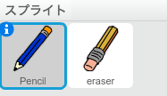

+ マウスを使ってお絵かきするので、えんぴつがマウスの動きに`ずっと`{.blockcontrol}ついていくようにします。えんぴつスプライトにこのようなコードを入れます。

	```blocks
		⚑ がクリックされたとき
		ずっと
   			[マウスのポインター v] へ行く
		end
	```

+ フラグ(⚑)ボタンをクリックすると、プログラムを動かすことができるので、ステージの中でマウスをぐるぐる動かしてみましょう。

+ 次に、`もし`{.blockcontrol}マウスが押された<ruby>状態<rp>（</rp><rt>じょうたい</rt><rp>）</rp></ruby>であればえんぴつで線を書けるようにしてみましょう。えんぴつスプライトにこのコードを足しましょう。

		

+ もう一度テストしてみましょう。今度は、マウスを押しながらえんぴつをステージの中で動かします。うまく絵がかけましたか？

	

## プロジェクトを保存してください { .save }

# ステップ２：色えんぴつ { .activity }

色えんぴつをプロジェクトの中に作って、好きな色をえらべるようにしましょう！

## Activity Checklist { .check }

+ まず、えんぴつスプライトをクリックし、「コスチューム」のところから「pencil-a」のところを「青えんぴつ」にかえます。「青えんぴつ」コスチュームで右クリックし、「<ruby>複製<rp>（</rp><rt>ふくせい</rt><rp>）</rp></ruby>」をえらびます。

	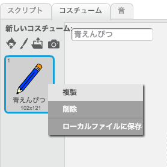

+ 新しくできたコスチュームを「緑えんぴつ」に名前をかえて、えんぴつを緑色をにぬりつぶします。

	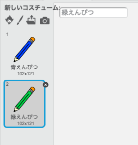

+ 青や緑のえんぴつをえらぶための、新しいスプライトを２つ作ります。

	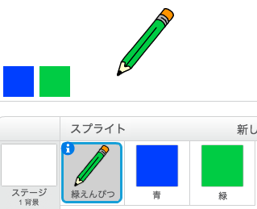

+ 緑のアイコンをクリックしたときに、とくべつなメッセージを`送る`{.blockevents}ことによって、コスチュームとえんぴつの色をかえられるようにします。

	そのためには、まず緑色のアイコンのコードをこのようにします。

	```blocks
		このスプライトがクリックされたとき
		[緑 v] を送る
	```

	`送る`{.blockevents}というブロック内にあるメッセージの下ボタンをクリックして、「新しいメッセージ」をえらびます。

	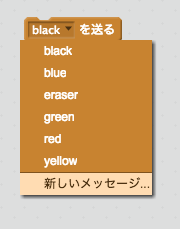

	メッセージ名に「緑」と入力して、新しいメッセージを作ります。

	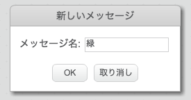

+ メッセージを受け取ったときにどうするかを、えんぴつスプライトのコードでこのようにします。

	```blocks
		[緑 v] を受け取ったとき
		コスチュームを [緑えんぴつ v] にする
		ペンの色を [#00ff00] にする
	```

	えんぴつを緑色にかえるために、`ペンの色を…にする`{.blockpen}というブロック内にある四角い色ボタンをクリックしてから、緑のアイコンの緑色の部分をクリックします。

+ 青えんぴつも同じように、青のアイコンのコードをこのようにします。

	```blocks
		このスプライトがクリックされたとき
		[青 v] を送る
	```

	そして、えんぴつスプライトのコードをこのようにしましょう。

	```blocks
		[青 v] を受け取ったとき
		コスチュームを [青えんぴつ v] にする
		ペンの色を [#0000ff] にする
	```

+ プログラムをスタートさせたときに、まず初めに画面を全部を消してから、えんぴつのコスチュームや色をえらべるようにします。えんぴつスプライトの初めの`⚑ がクリックされたとき`{.blockevents}のコードをこのようにします。（`ずっと`{.blockcontrol}ループがあるところの前）

	```blocks
		消す
		コスチュームを [青えんぴつ v] にする
		ペンの色を [#0000ff] にする
	```

	好きな色のえんぴつで始まるようにしてみましょう！

+ できあがったプログラムをテストします。うまく色を切りかえられましたか？

	

## プロジェクトを保存してください { .save }

# ステップ３：まちがえたとき { .activity .new-page }

お絵かきをしていると、時にはまちがえてしまうこともあります。ステージを全て消す「×」ボタンと、消しゴムを作りましょう。

## チェックリスト { .check }

+ ステージを全て消すためのボタンを作りましょう。「X-block」というスプライトをステージの中におき、赤くぬりつぶします。

	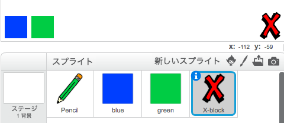

+ クリックしたときにステージを「消す」ように、「×」ボタンにコードをこのようにしましょう。

	```blocks
		このスプライトがクリックされたとき
		消す
	```

	他のスプライトでも同じですが、わざわざメッセージを送らなくても、ステージ全体を消すことができます！

+ えんぴつのコスチュームの中に、消しゴムがあることに気がつきましたか？

	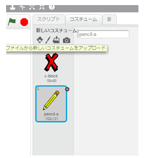

+ プロジェクトには消しゴムをえらべるスプライトが入っています。右クリックして「<ruby>表示<rp>（</rp><rt>ひょうじ</rt><rp>）</rp></ruby>」をクリックします。ステージはこのように見えるはずです。

	

+ 消しゴムボタンをクリックした時に切りかわるようにするには、まず「消しゴム」メッセージを送ります。消しゴムスプライトにコードを足しましょう

	```blocks
		このスプライトがクリックされたとき
		[消しゴム v] を送る
	```

+ えんぴつがこのメッセージを受け取ったとき、コスチュームを消しゴムにかえて、ステージをなぞったときの色を白にしてしまえば、消しゴムのできあがりです！

	```blocks
		[消しゴム v] を受け取ったとき
		コスチュームを [消しゴム v] にする
		ペンの色を [#FFFFFF] にする
	```

+ ステージをXボタンや消しゴムで消せるかテストしてみましょう。

	

+ えんぴつにはもう一つ問題があります・・・ステージのどこにでも線をかけてしまいます。ボタンの近くにも！

	

	これをうまく直すためには、えんぴつのYの<ruby>位置<rp>（</rp><rt>いち</rt><rp>）</rp></ruby>が-120以上(`マウスのy座票`{.blocksensing}`> -120`{.blockoperators})のときだけ書けるようにすればよいのです。えんぴつの`もし`{.blockcontrol}ブロックをこのようにかえましょう。

	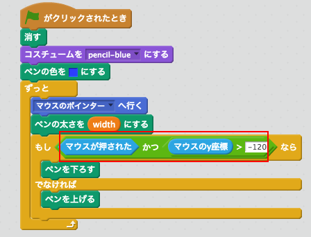

+ もう一回テストすると、ボタンの近くには書けなくなっているはずです。

	

## プロジェクトを保存してください { .save }

# ステップ４：えんぴつの太さ { .activity .new-page }

いろいろな太さのえんぴつで書けるようにしましょう。

## チェックリスト { .check }

+ まず「<ruby>幅<rp>（</rp><rt>はば</rt><rp>）</rp></ruby>」という<ruby>変数<rp>（</rp><rt>へんすう</rt><rp>）</rp></ruby>を新しく作ります。やり方が分からなければ「ゴーストバスターズ」のプロジェクトをヒントにしましょう。

+ えんぴつのコードに下のコードを`ずっと`{.blockcontrol}ループに入れてみます。

	```blocks
		ペンの太さを (幅) にする
	```

	えんぴつの太さが、<ruby>変数<rp>（</rp><rt>へんすう</rt><rp>）</rp></ruby>とずっと同じになりつづけます。

+ ステージにある「<ruby>幅<rp>（</rp><rt>はば</rt><rp>）</rp></ruby>」の<ruby>変数<rp>（</rp><rt>へんすう</rt><rp>）</rp></ruby>を右クリックして、スライダーを使ってかえることができます。

	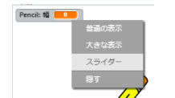

	スライダーを左右に動かして数字をかえてみましょう。

	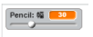

+ えんぴつの太さがうまくかわっているかテストしましょう

	

	さらに、「<ruby>幅<rp>（</rp><rt>はば</rt><rp>）</rp></ruby>」が大きすぎる数や小さすぎる数にならないようにすることができます。もう一度ステージの<ruby>変数<rp>（</rp><rt>へんすう</rt><rp>）</rp></ruby>を右クリックし、「スライダーの<ruby>最小値<rp>（</rp><rt>さいしょうち</rt><rp>）</rp></ruby>と<ruby>最大値<rp>（</rp><rt>さいだいち</rt><rp>）</rp></ruby>を<ruby>設定<rp>（</rp><rt>せってい</rt><rp>）</rp></ruby>」をえらびます。１から２０までにすると、ちょうど良くなるでしょう。

	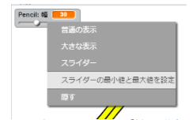

	すきな太さになるように、「<ruby>幅<rp>（</rp><rt>はば</rt><rp>）</rp></ruby>」の数字をかえてみましょう。

## プロジェクトを保存してください { .save }

## チャレンジ: ショートカット { .challenge }
キーボードショートカットを作れますか？ 例をいくつか示します。

+ b = 青えんぴつを使う
+ g = 緑えんぴつを使う
+ e = 消しゴムを使う
+ c = 画面をクリアする

方向キーでえんぴつの太さを変えるショートカットも作れます！

## プロジェクトを保存してください { .save }

## チャレンジ：えんぴつの<ruby>追加<rp>（</rp><rt>ついか</rt><rp>）</rp></ruby> { .challenge }
赤えんぴつ、黄色えんぴつ、黒えんぴつを追加できますか？ わからなくなったら、「ステップ２」を見てみましょう。<ruby>追加<rp>（</rp><rt>ついか</rt><rp>）</rp></ruby>したえんぴつのキーボードショートカットも作りましょう。

<ruby>追加<rp>（</rp><rt>ついか</rt><rp>）</rp></ruby>したえんぴつでお絵かきできますか？


