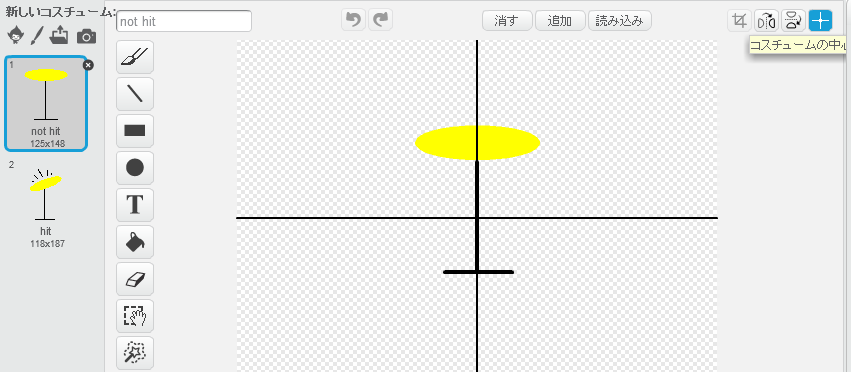

---
title: ロックバンド — リーダー用ノート
language: ja-JP
embeds: "*.png"
...

#イントロダクション:
このプロジェクトでは、スプライトに音を追加したり、スプライトのコスチュームを変更することを学びます。

#資料
このプロジェクトではスクラッチ２を使用してください。スクラッチ２はオンラインで使用することができます（[jumpto.cc/scratch-on](http://jumpto.cc/scratch-on)）。また、こちらからダウンロードしてオフラインで使用することも可能です（[jumpto.cc/scratch-off](http://jumpto.cc/scratch-off)）。

このプロジェクトの完成版は<a href="http://scratch.mit.edu/projects/26741186/#editor">こちら</a>から確認できます。また、「プロジェクト資料のダウンロード」をクリックしてダウンロードすることもできます。中身は下記の通りです。

+ RockBand.sb2

#学習のねらい
+ スプライト
+ コスチューム
+ プログラムのブロックの連なり
+ イベント
+ 音

#チャレンジ
+ 「ドラムの改良」 - スプライトの音の変更とイベントの追加
+ 「歌手のコスチュームの変更」 - コスチュームの追加と制御
+ 「自分のバンドの作成」 - 学習したスキルを使った新しい楽器の作成

#FAQ
+ 自分でスプライトを作成した場合に、スプライトをクリックしてコスチュームを変更すると、スプライトがジャンプしてしまうことがあります。これは２つのコスチュームの中心がづれていることが原因です。

  これを直すには「コスチュームの中心」をクリックして、２つのコスチュームの中心が合っていることを確認してください。

  

+ Linuxでは右クリックでスプライトを削除できないことがあります。この場合、Shift + 左クリックで削除のメニューが表示されます。