---
title: ロックバンド
level: Scratch 1
language: ja-JP
stylesheet: スクラッチ
embeds: "*.png"
materials: ["Club Leader Resources/*"]
...

# まえがき { .intro }

このプロジェクトではプログラミングを使った楽器の作り方を学びます！

<div class="scratch-preview">
	<iframe allowtransparency="true" width="485" height="402" src="http://scratch.mit.edu/projects/embed/26741186/?autostart=false" frameborder="0"></iframe>
	
</div>

# ステップ１: スプライト { .activity }

プログラミングをはじめる前に、ある「モノ」を取り入れる必要があります。この「モノ」はスクラッチでは__スプライト__と呼ばれています。

## チェックリスト { .check }

+ まず、スクラッチエディタを開きましょう。スクラッチエディタはオンラインでも開くことができます（<a href="http://jumpto.cc/scratch-new">jumpto.cc/scratch-new</a>）。こんなふうに<ruby>表示<rp>（</rp><rt>ひょうじ</rt><rp>）</rp></ruby>されるはずです。

	

+ <ruby>表示<rp>（</rp><rt>ひょうじ</rt><rp>）</rp></ruby>されているネコのスプライトはスクラッチのマスコットですが、最初にこれを<ruby>削除<rp>（</rp><rt>さくじょ</rt><rp>）</rp></ruby>してください。右クリックで<ruby>削除<rp>（</rp><rt>さくじょ</rt><rp>）</rp></ruby>を選んでください。

  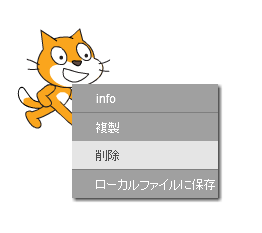

+ 次に「スプライトをライブラリーから<ruby>選択<rp>（</rp><rt>せんたく</rt><rp>）</rp></ruby>」をクリックして、スプライトのリストを開きましょう。

	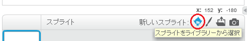

+ 下の方にスクロールしていき、ドラムを<ruby>探<rp>（</rp><rt>さが</rt><rp>）</rp></ruby>しましょう。ドラムをクリックして、右下の「OK」ボタンをクリック。自分のプロジェクトに追加されます。

	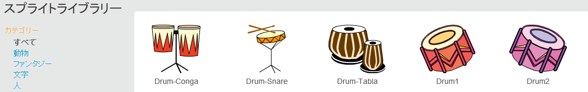

+ 「<ruby>縮小<rp>（</rp><rt>しゅくしょう</rt><rp>）</rp></ruby>」アイコンをクリックして、次にドラムを何回かクリックして、ドラムを小さくしましょう。

	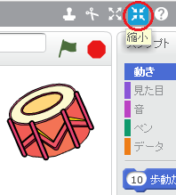

## プロジェクトを保存してください { .save }

プログラムに<ruby>名称<rp>（</rp><rt>めいしょう</rt><rp>）</rp></ruby>をつけるには、左上のテキストボックスに入力してください。

「ファイル」をクリックして「直ちに<ruby>保存<rp>（</rp><rt>ほぞん</rt><rp>）</rp></ruby>」を<ruby>選択<rp>（</rp><rt>せんたく</rt><rp>）</rp></ruby>するとプロジェクトが<ruby>保存<rp>（</rp><rt>ほぞん</rt><rp>）</rp></ruby>されます。

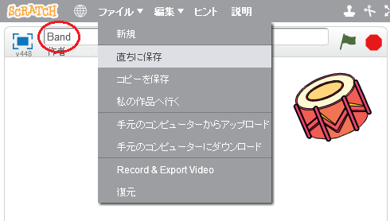

（スクラッチのアカウントをもってない場合は、「手元のコンピュータにダウンロード」をクリックして<ruby>保存<rp>（</rp><rt>ほぞん</rt><rp>）</rp></ruby>してください。）

# ステップ２: ステージ { .activity }

__ステージ__は左のエリアです。この場所でプロジェクトが動きます。本物のステージのように考えてください！

## チェックリスト { .check }

+ 今はステージが真白で、とても<ruby>退屈<rp>（</rp><rt>たいくつ</rt><rp>）</rp></ruby>に見えます！ステージに背景を追加しましょう。「ライブラリーから背景を<ruby>選択<rp>（</rp><rt>せんたく</rt><rp>）</rp></ruby>」をクリックしてください。

	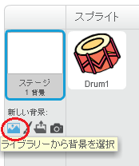

+ 左の「屋内」をクリックして、ステージの背景をクリック。さらに右下の「OK」ボタンをクリック。

	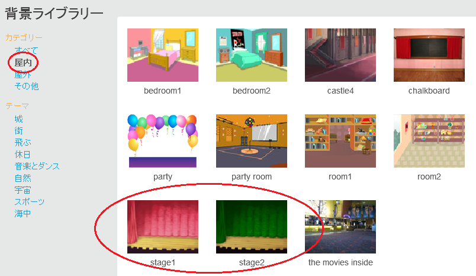

+ みなさんのステージはこんなふうに見えているはずです。

	

# ステップ３: ドラムの作成 { .activity }

クリックすると音が鳴るプログラムを作りましょう。

## チェックリスト { .check }

+ 「スクリプト」のタブの中にプログラムのためのブロックがあります。すべて色付けされています。 

	ドラムのスプライトをクリックして、この２つのブロックを右のプログラムエリアにドラッグしてください。ブロックがレゴのように合体しているのを<ruby>確認<rp>（</rp><rt>かくにん</rt><rp>）</rp></ruby>しましょう。
	
	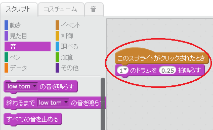

+ ドラムをクリックして、自分の新しい楽器を試してください！

+ 新たにコスチュームをつくることで、クリックしたときのドラムの見え方を変えることもできます。「コスチューム」タブをクリックするとドラムのイメージが<ruby>表示<rp>（</rp><rt>ひょうじ</rt><rp>）</rp></ruby>されます。

	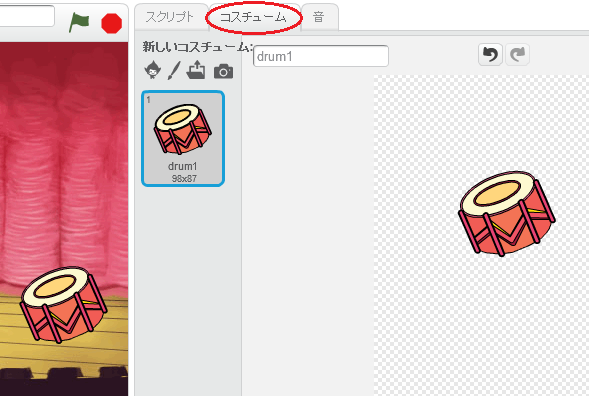

+ そのコスチュームを右クリックして<ruby>複製<rp>（</rp><rt>ふくせい</rt><rp>）</rp></ruby>をクリックすると、コスチュームのコピーができます。

	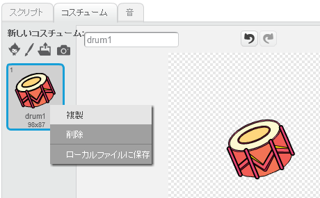

+ 新しいコスチューム（「drum2」という<ruby>名称<rp>（</rp><rt>めいしょう</rt><rp>）</rp></ruby>）をクリックしてください。そして直線ツールを使って、音が鳴っているように線を引きましょう。

	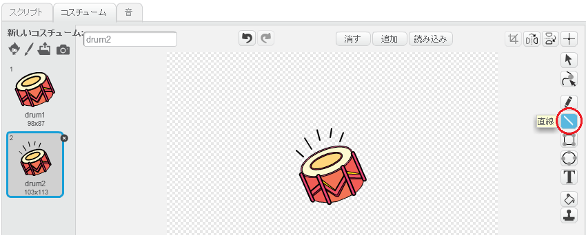

+ コスチュームの<ruby>名称<rp>（</rp><rt>めいしょう</rt><rp>）</rp></ruby>がわかりづらいので、「not hit」と「hit」に<ruby>名称<rp>（</rp><rt>めいしょう</rt><rp>）</rp></ruby>を書き換えましょう。それぞれのコスチュームのテキストボックスに入力してください。

	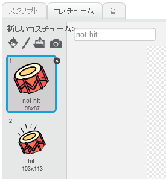

+ みなさんのドラムには２種類のコスチュームができました。どちらのコスチュームを<ruby>表示<rp>（</rp><rt>ひょうじ</rt><rp>）</rp></ruby>させるか自分で選ぶことができます。この２つのブロックを自分のドラムに追加してください。

	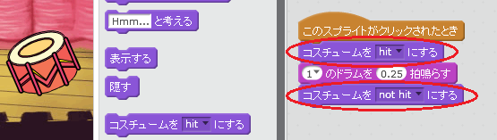
	
	コスチュームを変えるブロックは`見た目`{.blocklooks}のところにあります。

+ 自分のドラムを試してください。クリックしたとき、ドラムが<ruby>叩<rp>（</rp><rt>たた</rt><rp>）</rp></ruby>かれているように見えるはずです

## プロジェクトを保存してください { .save }

##チャレンジ：ドラムの<ruby>改良<rp>（</rp><rt>かいりょう</rt><rp>）</rp></ruby> { .challenge }

+ ドラムをクリックしたときに鳴る音を変えることはできますか？

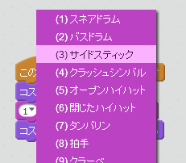

+ スペースキーを押したときにドラムが鳴るようにできますか？この`イベント` {.blockevents}ブロックが必要になります。

```blocks
	  [スペース v] キーが押されたとき
```

右クリックで「<ruby>複製<rp>（</rp><rt>ふくせい</rt><rp>）</rp></ruby>」を<ruby>選択<rp>（</rp><rt>せんたく</rt><rp>）</rp></ruby>すると、ブロックがコピーされます。

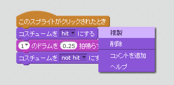

## プロジェクトを保存してください { .save }

# ステップ４: 歌手の作成 { .activity .new-page }

バンドに歌手を追加しましょう！

## チェックリスト { .check }

+ ステージに２つのスプライト、歌手とマイクを追加してください。

	

+ 歌手に歌わせる前に、スプライトに音を追加する必要があります。歌手をクリックして、「音」タブをクリック、そして「音をライブラリーから<ruby>選択<rp>（</rp><rt>せんたく</rt><rp>）</rp></ruby>」をクリックしてください。

	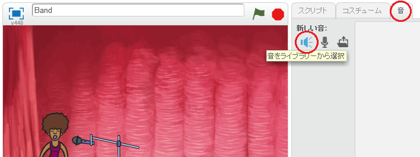

+ 左側の「ボーカル」をクリックして、スプライトに追加する音を選びましょう。

	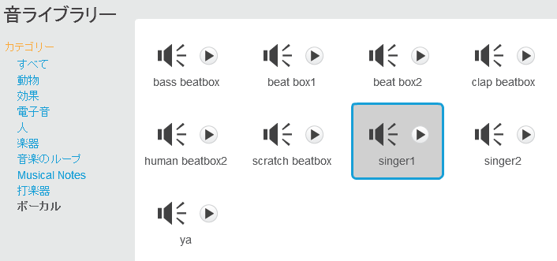

+ 右下の「OK」ボタンをクリックすると音が追加されます。このプログラムを自分の歌手に入れてください。

	```blocks
		このスプライトがクリックされたとき
		終わるまで [singer1 v] の音を鳴らす
	```

+ 歌手をクリックして、ちゃんと歌うか<ruby>確認<rp>（</rp><rt>かくにん</rt><rp>）</rp></ruby>しましょう。

## プロジェクトを保存してください { .save }

##チェレンジ：歌手のコスチュームの<ruby>変更<rp>（</rp><rt>へんこう</rt><rp>）</rp></ruby> { .challenge }
歌手をクリックしたときに、歌っているように<ruby>表示<rp>（</rp><rt>ひょうじ</rt><rp>）</rp></ruby>させることはできますか？わからないことがあれば、上記のドラムの説明をもう一度読んでください。


新しいプログラムをつくったら、ちゃんと動くかテストする事を<ruby>覚<rp>（</rp><rt>おぼ</rt><rp>）</rp></ruby>えておきましょう。

## プロジェクトを保存してください<Save your project> { .save }

##チャレンジ：自分のバンドの作成 { .challenge }
このプロジェクトで学んだことを生かしてください。みなさんはどんな楽器でも好きなものを作ることができます。

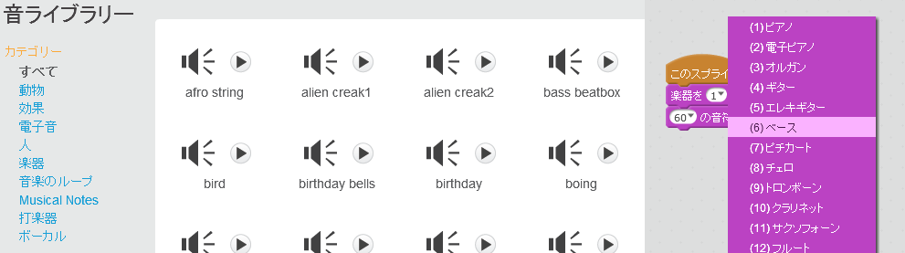

楽器は<ruby>正確<rp>（</rp><rt>せいかく</rt><rp>）</rp></ruby>である必要はありません。たとえば、マフィンでピアノを作ることもできます！


すでにあるスプライトを使うこともできますし、自分で絵を描くこともできます。<As well as using existing sprites, you can also draw your own.>

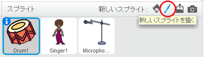

もしマイクを持っていたら、自分で<ruby>録音<rp>（</rp><rt>ろくおん</rt><rp>）</rp></ruby>することができます。またWEBカメラを使って、自分の楽器を鳴らすこともできます。<If you have a microphone you can record your own sounds, or even use a webcam to hit your instruments!>

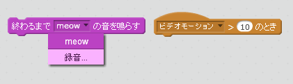

## プロジェクトを保存してください<Save your project> { .save }
