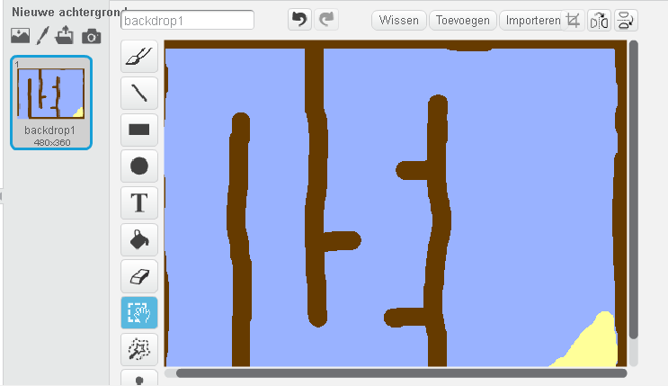
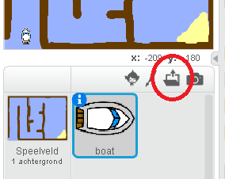
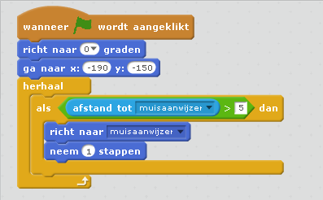
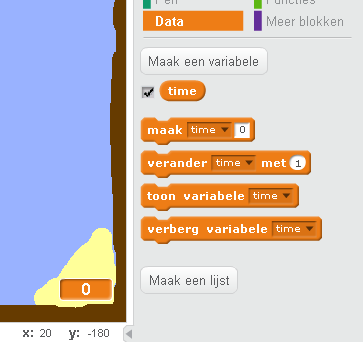
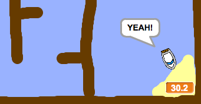
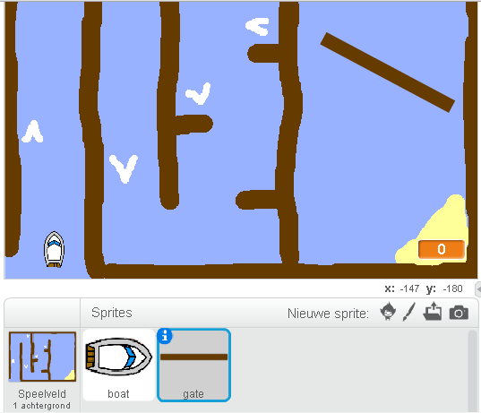
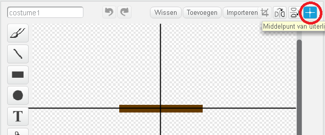
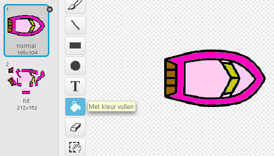

---
title: Boat Race
level: Scratch 1
language: nl-NL
stylesheet: scratch
embeds: "*.png"
materials: ["Club Leader Resources/*","Project Resources/*"]
...

# Introductie { .intro }

Je gaat leren hoe je een spel kan maken, waarin je de muis gaat gebruiken om een bootje naar een verlaten eiland te navigeren.

<div class="scratch-preview">
  <iframe allowtransparency="true" width="485" height="402" src="http://scratch.mit.edu/projects/embed/63957956/?autostart=false" frameborder="0"></iframe>
  
</div>

# Stap 1: Planning van jouw spel { .activity }

## Activiteiten Checklist { .check }

+ Begin een nieuw Scratch project en verwijder de kat sprite, zodat je een leeg project hebt. Je kan de online Scratch editor vinden via <a href="http://jumpto.cc/scratch-new">jumpto.cc/scratch-new</a>.

+ Klik op de achtergrond van jouw speelveld en maak een opzet van jouw level. Het volgende moet worden toegevoegd:
	+ Hout, wat jouw bootje moet zien te vermijden;
	+ Een verlaten eilandje waar jouw bootje naar toe gebracht moet worden.

	Hier zie je hoe jouw spel eruit zou kunnen zien:

	 

# Stap 2: Het bootje besturen { .activity }

## Activiteiten Checklist { .check }

+ Als jouw club leider je de 'Resources' map heeft gegeven, klik op 'Upload sprite' en voeg de 'boat.png' afbeelding toe. Je zal de sprite moeten laten krimpen en hem op zijn startpunt moeten plaatsen.

	

	Als je de boat.png afbeelding niet hebt, kan je in plaats daarvan jouw eigen bootje ontwerpen!

+ Je gaat jouw bootje besturen met jouw muis. Voeg het volgende programma toe aan jouw bootje:

	```blocks
		wanneer ⚑ wordt aangeklikt
		richt naar (0 v) graden
		ga naar x:(-190) y:(-150)
		herhaal
			richt naar [muisaanwijzer v]
			neem (1) stappen
		einde
	```
	
+ Probeer jouw bootje uit door op de vlag te klikken en de muis te bewegen. Vaart jouw bootje in de richting van de muis?

	

+ Wat gebeurd er als het bootje de muisaanwijzer bereikt?

	Om dit te voorkomen moet je een `als` {.blockcontrol} blok aan jouw programma toevoegen, zodat het bootje alleen beweegt zolang het meer dan 5 pixels van de muisaanwijzer verwijderd is.

		

+ Probeer je bootje opnieuw uit om te zien of het probleem is opgelost.

## Sla jouw project op { .save }

# Stap 3: Verongelukken! { .activity .new-page }

Jouw bootje kan over de houten obstakels varen! Laten we dat gaan oplossen.

## Activiteiten Checklist { .check }

+ Je hebt twee uiterlijken nodig voor jouw bootje, een normaal uiterlijk en een voor als het bootje verongelukt. Kopieer het uiterlijk van jouw bootje en noem de een 'normal' en de andere 'hit'.

+ Klik op jouw 'hit' uiterlijk en kies het 'Selecteer' gereedschap om kleine stukjes van het bootje te pakken en deze te verplaatsen en te draaien. Verander jouw bootje zodat het eruit ziet alsof het verongelukt is.

	

+ Voeg het volgende programma toe aan jouw bootje, binnen een `herhaal` {.blockcontrol} loop (spreek uit: loep), zodat het verongelukt zodra het in aanraking komt met een bruin houten obstakel:

	```blocks
		als <raak ik kleur [#603C15]?> dan
			verander uiterlijk naar [hit v]
			zeg [Noooooo!] (1) sec.
			verander uiterlijk naar [normal v]
			richt naar (0 v) graden
			ga naar x:(-215) y:(-160)
		einde
	```

	Deze programmablokken zijn ingesloten in een `herhaal` {.blockcontrol} loop, zodat jouw programma constant controleerd of het bootje niet verongelukt is.

+ Je moet er ook zeker van zijn dat als het bootje begint, het er 'normal' uitziet.

+ Als je nu probeert door een houten obstakel te varen, zou je moeten zien dat jouw bootje verongelukt en terug naar zijn begin positie gaat.

	

## Sla jouw project op { .save }

## Uitdaging: Winnen! {.challenge}
Kan je nog een ander `als` {.blockcontrol} statement aan het programma van jouw bootje toevoegen, zodat de speler wint, zodra hij het verlaten eiland heeft bereikt?

Wanneer het bootje het gele verlaten eiland bereikt, moet het 'YEAH! zeggen' en daarna moet het spel stoppen. Je moet het volgende programma deel gebruiken:

```blocks
zeg [YEAH!] (1) sec.
stop [alle v]
```


## Sla jouw project op { .save }

## Uitdaging: Geluidseffecten {.challenge}
Kan je geluidseffecten aan jouw spel toevoegen, wanneer het bootje verongelukt of wanneer het eiland wordt bereikt aan het eind. Je kan ook achtergrond muziek toevoegen (Zie hiervoor het voorgaande 'Rock Band' project, als je hier hulp bij nodig hebt).

## Sla jouw project op { .save }

# Stap 4: Tijd bijhouden { .activity }

Laten  we een timer toevoegen aan jouw spel, zodat een speler zo snel mogelijk het verlaten eiland moet zien te bereiken.

## Activiteieten Checklist { .check }

+ Voeg een nieuwe variabele toe aan jouw speelveld en noem deze: `time` {.blockdata}. Je kan de weergave van jouw variabele ook nog wijzigen. Als je hierbij hulp nodig hebt, kijk dan nog eens naar het 'Ghostbusters' project.

	

+ Voeg dit programma toe aan jouw __speelveld__, zodat je timer optelt totdat het bootjehet verlaten eilandje bereikt:

	```blocks
		wanneer ⚑ wordt aangeklikt
		maak [time v] [0]
		herhaal
			wacht (0.1) sec.
			verander [time v] met (0.1)
		einde
	```

+ Dat is alles! Probeer jouw spel uit en kijk hoe lang je erover doet om het eiland te bereiken!

	

## Sla jouw project op { .save }

# Stap 5: Obstakel en versterkingen { .activity }

Dit spel is  _veel_ te eenvoudig - laten we wat dingen toevoegen om het wat interessanter te maken.

## Activiteiten Checklist { .check }

+ Ten eerste gaan we een aantal versnellingen  aan jouw spel toevoegen, welke jouw bootje meer snelheid gaan geven. Wijzig de achtergrond van jouw speelveld en voeg een aantal witte versnellingspijlen toe.

	

+ Je kan nu een paar programma blokken toevoegen aan de `herhaal` {.blockcontrol} loop van jouw bootje, zodat het 2 _extra_ stappen zet als het een witte versneller raakt.

	```blocks
		als <raak ik kleur [#FFFFFF]?> dan
			neem (3) stappen
		einde
	```

+ Je kan ook nog een ronddraaiende poort toevoegen, die het bootje moet zien te veermijden. Voeg een nieuwe sprite, genaamd 'gate' toe, die er als volgt uitziet:

	

	Zorg ervoor dat de draaiende poort dezelfde kleur heeft als de houten obstakels.

+ Bepaal het midden van de 'gate' sprite.

	

+ Voeg programma blokken toe aan jouw poort, om deze langzaam rond te laten draaienmet een `herhaal` {.blockcontrol} blok.

+ Probeer jouw spel uit. Je zou nu een draaiende poort moeten hebben, welke je moet vermijden.

	

## Sla jouw project op { .save }

## Uitdaging: Meer obstakels! {.challenge .new-page}
Kan je zelf nog meer obstakels aan jouw spel toevoegen Hier volgen een paar suggesties:

+ Je kan bijvoorbeeld groene slijm aan jouw achtergrond toevoegen, Wat ervoor zorgt dat de speler langzamer vooruit komt, als het geraakt wordt. Je kan hiervoor een `wacht` {.blockcontrol} blok gebruiken:

```blocks
	wacht (0.01) sec.
````


+ Je kan een bewegend object toevoegen, zoals een boomstam of een haai!


Deze blokken kunnen je hierbij helpen:

```blocks
	neem (1) stappen
	keer om aan de rand
````

Als jouw nieuwe object niet bruin is, moet je wat toevoegen aan het programma van jouw bootje:

```blocks
	als <<raak ik kleur [#603C15]?> of <raak ik [shark v]?>> dan
	einde
```

## Sla jouw project op { .save }

## Uitdaging: Meer bootjes! {.challenge .new-page}
Kan je jouw spel aanpassen in een race voor 2 spelers?

+ Kopieer het bootje, wijzig de naam in 'Player 2' en verander de kleur.



+ Verander de startpositie van speler 2, door de volgende programma blokken aan te passen:

```blocks
	ga naar x:(-190) y:(-150)	
```

+ Verwijder de programmablokken waardoor de muis gebruikt wordt om het bootje te besturen:

```blocks
	als <(afstand tot [muisaanwijzer v]) > [5]> dan
		richt naar [muisaanwijzer v]
		neem (1) stappen
		einde
```

...en vervang deze door programmablokken waardoor het bootje wordt bestuurd door de pijltjes toetsen.

Deze programma blokken zorgen ervoor dat jouw bootje vooruit gaat:

```blocks
	als <toets [pijltje omhoog v] ingedrukt?> dan
		neem (1) stappen
	einde
```

Je hebt ook programma blokken nodig om een `draai` {.blockmotion} met jouw bootje te maken als de linker en rechter pijltjes toetsen worden ingedrukt.

## Sla jouw project op { .save }

## Uitdaging: Meer levels! {.challenge .new-page}
Kan je meer achtergronden maken en de speler laten kiezen tussen de levels?

```blocks
	wanneer [spatiebalk v] wordt ingedrukt
	volgende achtergrond
```

## Sla jouw project op { .save }
