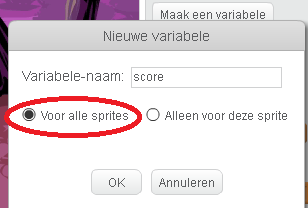
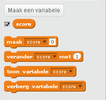
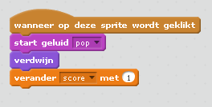
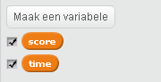
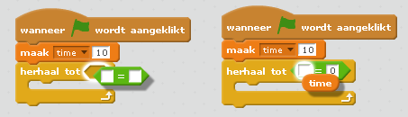
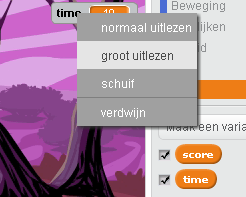

---
title: Spokenjagers
level: Scratch 1
language: nl-NL
stylesheet: scratch
embeds: "*.png"
materials: ["Club Leader Resources/*"]
...

# Introductie { .intro }

Je gaat vandaag een spellentje maken waarin je spoken moet vangen!

<div class="scratch-preview">
  <iframe allowtransparency="true" width="485" height="402" src="http://scratch.mit.edu/projects/embed/60787262/?autostart=false" frameborder="0"></iframe>
  
</div>

# Stap 1: Animatie van een spook { .activity }

## Activiteiten Checklist { .check }

+ Start een nieuw Scratch project en verwijder de kat-sprite zodat je een leeg project hebt. Je vind de online Scratch editor hier <a href="http://jumpto.cc/scratch-new">jumpto.cc/scratch-new</a>.

+Voeg een nieuwe sprite van een spook toe en zoek een bijpassende achtergrond.

	

+ Voeg het volgende programmma toe aan jouw spook, zodat deze herhaaldelijk verschijnt en verdwijnt:

	```blocks
		wanneer vlag wordt aangeklikt
		herhaal
			verdwijn
			wacht (1) sec.
			verschijn
			wacht (1) sec.
		eind
	```

+ Test het programma van jouw spook door op de groene vlag te klikken.

## Sla jouw project op { .save }

# Stap 2: Willekeurige spoken { .activity }

Jouw spook is makkelijk te vangen, omdat hij niet beweegt!

## Activiteiten Checklist { .check }

+ in plaats van op dezelfde plaats te blijven, kan je Scratch in plaats daarvan willekeurige x and y coordinaten laten kiezen. Voeg een `ga naar` {.blockmotion} blok toe aan jouw spook programma, zodat het er als volgt uitziet:

	```blocks
		wanneer vlag wordt aangeklikt
		herhaal
			verdwijn
			wacht (1) sec.
			ga naar  x:(willekeurig getal tussen (-150) en (150)) y:(willekeurig getal tussen (-150) en (150))
			verschijn
			wacht (1) sec.
		eind
	```

+ Test jouw programma van het spook nog een keer en je zou moeten zien dat het spook verdwijnt en verschijnt op verschillende plaatsen.

## Bewaar jouw project { .save }

## Uitdaging: Meer willekeurige dingen {.challenge}

Kan je jouw spook een willekeurige tijd in de `wacht` {.blockcontrol} zetten voordat deze weer verschijnt? Kan je het `maak grootte` {.blocklooks} blok gebruiken om  jouw spook iedere keer als het verschijnt een willekeurige grootte te geven?

## Sla jouw project op { .save }

# Stap 3: Spoken vangen { .activity }

De speler toestaan de spoken te vangen!

## Activiteieten Checklist { .check }

+ Om de speler toe te staan een spook te vangen, moet je het volgende programma toevoegen:

	```blocks
		wanneer op deze sprite wordt geklikt
		verdwijn
	```

+ Probeer jouw project uit. Kan je spoken vangen zodra ze verschijnen? Als je het moeilijk vind de spoken te vangen, kan je het spel spelen op het volledige scherm door op deze knop te klikken:

	

## Uitdaging: Geluid toevoegen { .challenge }

Kan je iedere keer dat een spook gevangen wordt een geluid laten horen?

## Sla jouw project op { .save }

# Stap 4: Score bijhouden { .activity .new-page }

Laten we het spelletje nog interessanter maken door de score bij te gaan houden.

## Activiteieten Checklist { .check }

+ Om de score van een speler bij te houden, moet je daar een plekje voor maken. Een  __variabele__ is een plekje om gegevens op te slaan die kunnen veranderen, zoals de score.

	Om een nieuwe variabele te maken, klik je op de 'Scripts' tab, selecteer `Data` {.blockdata} en klik dan op 'Maak een variabele'.

	

	Typ 'score' in als naam voor de variabele, zorg ervoor dat het bereikbaar is voor alle sprites, en klik op 'OK' om hem te maken. Je zal heel veel programma blokken tegenkomen, welke gebruik kunnen maken van jouw `score` {.blockdata} variabele.

	

	Je zal nu ook de score zien in de linker bovenhoek van het speelveld.

	

+ Wanneer een nieuw spel gestart wordt (door op de vlag te klikken), moet je de score van de speler op 0 moeten zetten:

	```blocks
	wanneer vlag wordt aangeklikt
	maak [score v] [0]
	```

+ Wanneer een spook gevangen wordt, moet je 1 optellen bij de score van de speler:

	

+ Voer jouw programma weer uit en vang een paar spoken. Verandert jouw score?

## Sla jouw project op { .save }

# Stap 5: Een timer toevoegen { .activity }

Je kan jouw spelletje nog interessanter maken door een speler slecht 10 seconds de tijd te geven om zoveel mogelijk spoken te vangen.

## Activiteiten Checklist { .check }

+ Je kan nog een variabele toevoegen die de resterende tijd bij houdt. Klik op het speelveld en maak een nieuwe variabele en noem deze 'time':

	 

+ Hier volgt hoe jouw timer zou moeten werken:

	+ De timer zou moeten beginnen met 10 seconden;
	+ De timer moet elke seconde af moeten tellen;
	+ Het spel moet stoppen, zodra de timer op 0 staat.

	Hier volgt het programma om dit uit te voeren. Je kan dit toevoegen aan jouw __speelveld__:

	```blocks
		wanneer vlag wordt aangeklikt
		maak [time v] [10]
		herhaal tot <(time) = [0]>
			wacht (1) sec.
			verander [time v] met (-1)
		end
		stop [alle v]
	```

	Hier volgt hoe je het `herhaal tot`{.blockcontrol}`time`{.blockdata}`= 0`{.blockoperators} programmaatje maakt:

	

+ Sleep jouw 'time' variabele weergave naar de rechterkant van het speelveld. Je  kan ook rechtsklikken op de variabele weergave en kiezen voor 'groot uitlezen' om de manier waarop de tijd wordt weergegeven te veranderen.

	

+ Vraag een vriend om jouw spel uit te proberen. Hoeveel punten kunnen zij halen? Als jouw spelletje te makkelijk is, kan je:

	+ De speler minder tijd geven;
	+ De spoken minder vaak laten verschijnen;
	+ De spoken kleiner maken.

	Test jouw spel een aantal keren, totdat je tevreden bent met de juiste moeilijkheidgraad.

## Sla jouw project op { .save }

## Uitdaging: Meer voorwerpen {.challenge}
Kan je nog meer opjecten aan je spel toevoegen?


Je moet wel even nadenken over de dingen die je toevoegt. Denk daarbij aan:

+ Hoe groot is het?
+ Verschijnt het meer of minder vaak dan de spoken?
+ Hoe ziet het eruit/klinkt het als het gevangen wordt?
+ Hoeveel punten win (of verlies) je als je het vangt?

Als je nog een voorwerp wilt toevoegen, kan je bovenstaande stappen nogmaals volgen!

## Sla jouw project op { .save }

## Community Contributed Translation { .challenge .pdf-hidden }

This project was translated by Jeroen Dekker. Our amazing translation volunteers help us give children around the world the chance to learn to code.  You can help us reach more children by translating a Code Club project via [Github](https://github.com/CodeClub/curriculum_documentation/blob/master/contributing.md) or by getting in touch with us at hello@codeclubworld.