---
title: Rock Band
level: Scratch 1
language: nl-NL
stylesheet: scratch
embeds: "*.png"
materiaal: ["Club Leader Resources/*"]
...

# Introductie { .intro }

In dit project leer je hoe je jouw eigen muziek instrumenten programmeert!

<div class="scratch-preview">
  <iframe allowtransparency="true" width="485" height="402" src="http://scratch.mit.edu/projects/embed/26741186/?autostart=false" frameborder="0"></iframe>
  
</div>

# Stap 1: Sprites { .activity }

Voordat je iets kan animeren of wel laten bewegen, moet je eerst een 'ding' toevoegen dat je kan laten bewegen. In Scratch heten deze 'dingen' __sprites__.
 
## Activiteiten Checklist { .check }

+ Om te beginnen open je de Scratch editor. Je kan de online versie van Scratch vinden via <a href="http://jumpto.cc/scratch-new">jumpto.cc/scratch-new</a>. Zo zou het eruit moeten zien:

	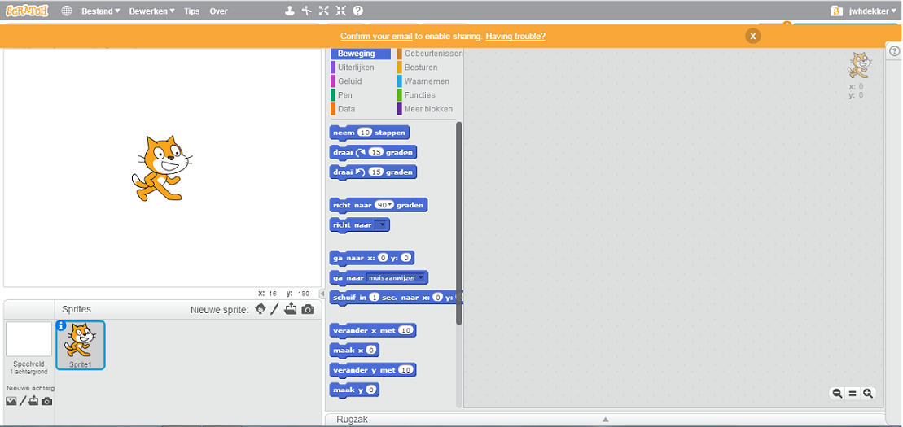

+ De kat sprite die je ziet is de Scratch mascotte. Die gaan we verwijderen; klik op de kat met de rechter muistoets op en klik dan op 'verwijderen'.

	

+ Vervolgens klik je bij Nieuwe Sprite 'Kies sprite uit bibliotheek' Dit opent de verzameling van alle Scratch sprites.
    
	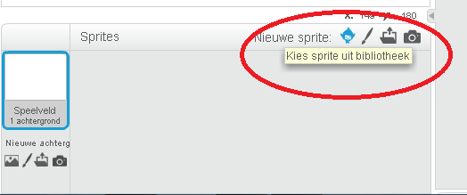
	
	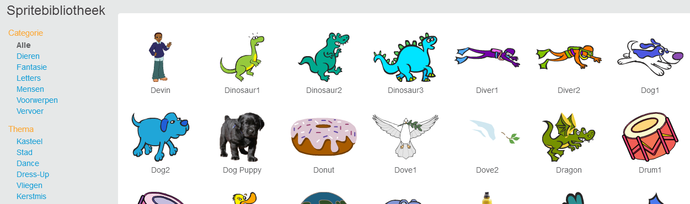

+ Scroll naar beneden totdat je de drum1 sprite ziet. Klik op de trommel en klik op 'OK' om hem aan jouw project toe te voegen.

	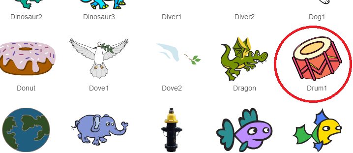

+ Klik op het 'kleiner maken' icoontje, en klik daarna een paar keer op de trommel om deze te laten krimpen.

	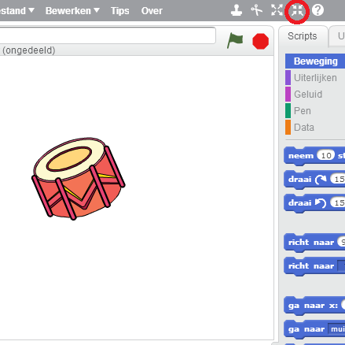

## Sla jouw project op  { .save }

Geef jouw programma een naam, door er een naam in het tekstveld in de linker bovenhoek te typen.

Daarna klik je op het menu 'Bestand' en daarna op 'Nu opslaan' om jouw project op te slaan.

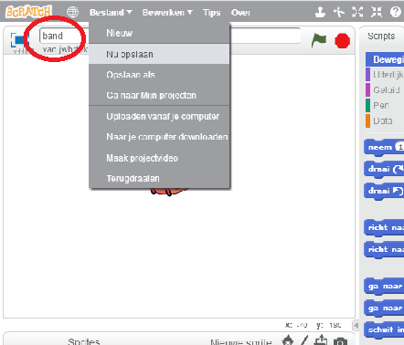

# Stap 2: Het speelveld { .activity }

Het speelveld is het veld links. Dat is het veld waar jouw project tot leven komt. Vergelijk het maar met het toneel in een echte schouwburg!

## Activiteiten Checklist { .check }

+ Op dit moment is het toneel wit en ziet het er saai uit! Laten we een mooie achtergrond toevoegen door op 'Kies een achtergrond uit bibliotheek' te klikken.

	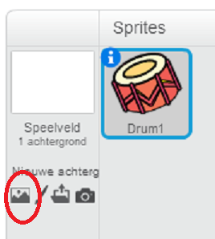

+ Klik op 'Binnen' aan de linker kant, en klik vervolgens op een 'stage' achtergrond en dan op 'OK'.

	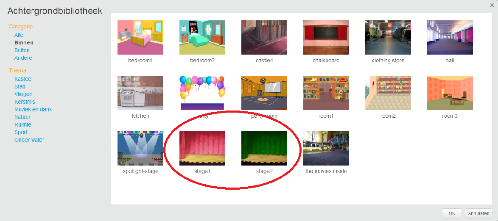

+ Jouw toneel zou er ongeveer zo uit moeten zien:

	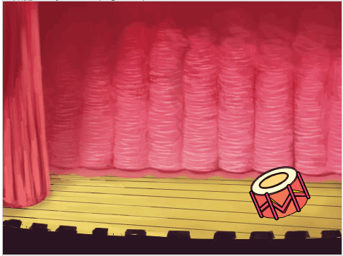

# Stap 3: Een Trommel maken { .activity }

Laten we nu jouw trommel programmeren, zodat deze geluid maakt als erop wordt 'geslagen'.

## Activiteiten Checklist { .check }

+ Je kan de programmablokken vinden in de 'Scripts' tab. Ze hebben allemaal een kleurcode! 

+ Klik op de drum sprite, daarna zoek en sleep je de volgende twee programma blokken naar het rechter vlak, het programma vlak. Zorg ervoor dat ze op elkaar aansluiten. (zoals lego-steentjes):

	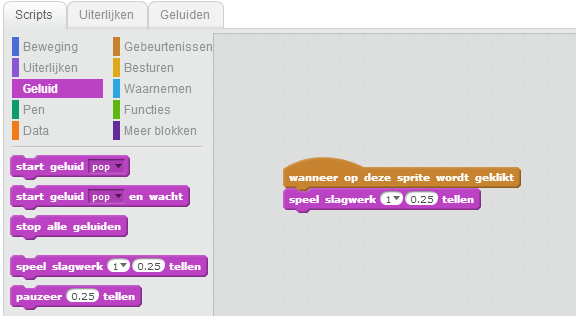

+ Klik op de trommel op het toneel om het nieuwe instrument uit te proberen.

+ Je kan ook het uiterlijk van de trommel veranderen als erop wordt geklikt, door een nieuw uiterlijk te maken. Klik op de 'Uiterlijken' tab en je zal de trommel zien.

	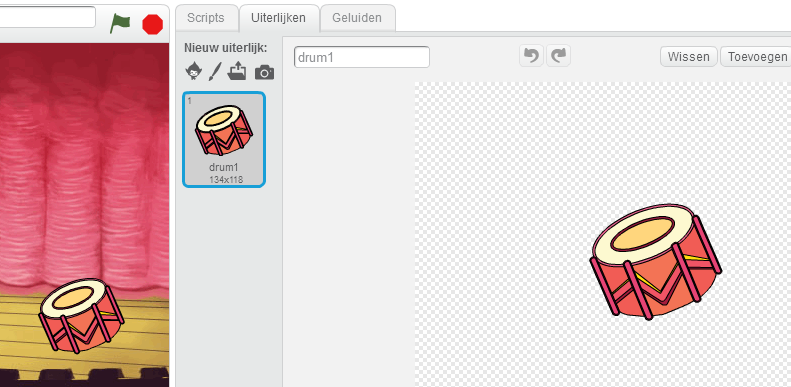

+ Klik met de rechter muistoets op het uiterlijk en klik op 'kopie maken' om een kopie van het uiterlijk te maken.

	

+ Klik op het nieuwe uiterlijk ('drum2' genaamd) en selecteer daarna het 'lijn' gereedschap om lijnen te tekenen, zodat het eruit ziet alsof de trommel geluid maakt.

	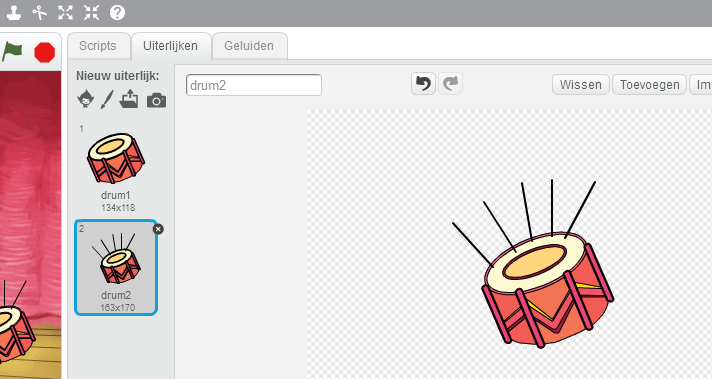

+ De namen van de uiterlijken helpt niet om ze uit elkaar te houden. Hernoem de 2 uiterlijken naar 'not hit' and 'hit' door de nieuwe naam in de tekstbox te typen.

	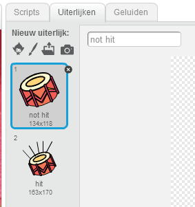

+ Nu we twee verschillende uiterlijken hebben, kunnen we kiezen welk uiterlijk wordt weergegeven! Voeg deze 2 blokken toe aan jouw trommel:

	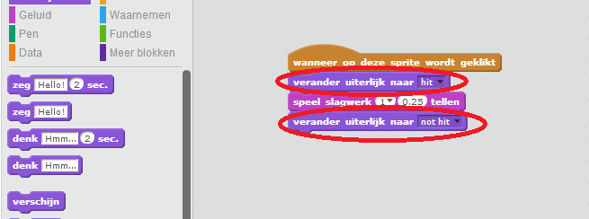

	Het programmablok voor het veranderen van het uiterlijk kan je vinden in de `Uiterlijken` {.blocklooks} selectie.

+ Test jouw trommel. Als je erop klikt, zou het eruit moeten zien alsof erop geslagen is!

## Sla jouw project op { .save }

##Uitdaging: Verbeter jouw trommel { .challenge }

+ Kan je het geluid veranderen als je op de trommel klikt?


+ Kan je de trommel ook geluid laten maken door op de spatiebalk te drukken.? Hiervoor zal je deze 'gebeurtenis' {.blockevents} moeten gebruiken: 

```blocks
	Wanneer [spatiebalk] wordt ingedrukt
```

Je kan een bestaand programma kopiëren door er met de rechter muistoets op te klikken en te klikken op 'kopie maken'.


## Sla jouw project op { .save }

# Stap 4: Een zangeres toevoegen { .activity .new-page }

Laten we een zangeres toevoegen aan jouw band!

## Activiteiten Checklist { .check }

+ Voeg nog twee sprites toe aan jouw toneel; een zangeres en een microfoon.

	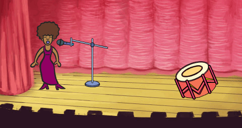

+ Voordat je jouw zangeres kan laten zingen, moet je een geluid toevoegen aan jouw sprite. Zorg ervoor dat je jouw zangeres geselecteerd hebt, klik vervolgens op de 'geluiden' tab en klik 'Kies geluid uit bibliotheek':

	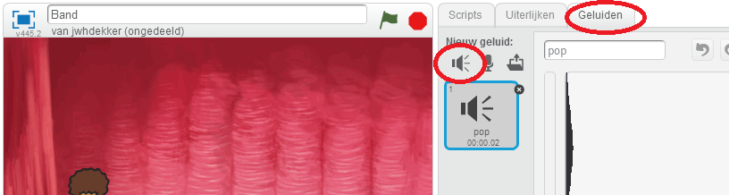

+ Als je klikt op 'Stemmen' aan de linker zijde, kan je een bruikbaar geluid kiezen om aan jouw sprite toe te voegen.

	

+ Nu we het geluid hebben toegevoegd , kunnen we het volgende programma aan jouw zangeres toevoegen:

	```blocks
		wanneer op deze sprite wordt geklikt
		start geluid [singer1] en wacht
	```

+ Klik op jouw zangeres om er zeker van te zijn dat ze zingt, zodra er op haar geklikt wordt.

## Sla jouw project op { .save }

## Uitdaging: Verander het uiterlijk van jouw zangeres. { .challenge }

Kan je jouw zangeres er laten uitzien alsof ze zingt, nadat er op haar is geklikt? Als je hulp nodig hebt, kan je gebruik maken van de instructies voor de trommel hierboven.

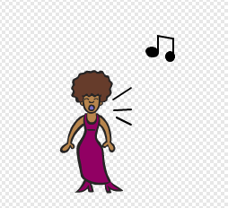

Denk eraan dat je jouw nieuwe programma test om te zien of het werkt!

## Sla jouw  project op { .save }

## Uitdaging: Ontwerp jouw eigen band { .challenge }
Gebruik wat je hebt geleerd in dit project om jouw eigen band te maken! Je kan elk instrument maken wat je wilt, maar kijk naar de beschikbare geluiden en instrumenten om wat ideeën op te doen.

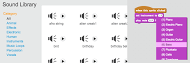

Jouw instrumenten mogen ook verzonnen zijn. Zo kan je bijvoorbeeld een piano van muffins maken!

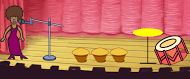

Behalve dat je bestaande sprites kan gebruiken, kan je ook eigen sprites ontwerpen.


Als je een microfoon hebt, kan je jouw eigen geluiden opnemen, of zelfs een webcam gebruiken om jouw instrumenten te bedienen!


## Sla jouw project op { .save }

