---
title: Brain Game
level: Scratch 2
language: nl-NL
stylesheet: scratch
embeds: "*.png"
materials: ["Club Leader Resources/*"]
...

# Introductie { .intro }

In dit project leer je een quiz te maken van de tafels van vermenigvuldiging, waarin je binnen 30 seconden zoveel mogelijk goede antwoorden moet geven.

<div class="scratch-preview">
  <iframe allowtransparency="true" width="485" height="402" src="http://scratch.mit.edu/projects/embed/42225768/?autostart=false" frameborder="0"></iframe>
  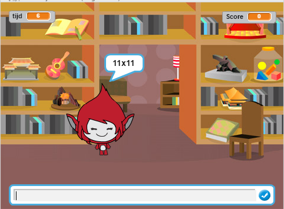
</div>

# Stap 1: Vragen maken { .activity }

Om te beginnen gaan we willekeurige vragen maken, welke de speler moet beantwoorden.

## Activiteiten Checklist { .check }

+ Begin een nieuw Scratch project en verwijder de kat sprite, zodat je een leeg project hebt. Je kan de online Scratch editor vinden via <a href="http://jumpto.cc/scratch-new">jumpto.cc/scratch-new</a>.

+ Kies een karakter en een achtergrond voor jouw spel. Je mag zelf kiezen! Hier is een voorbeeld:

		

+ Maak 2 nieuwe variabelen aan en noem ze `nummer 1` {.blockdata} en `nummer 2` {.blockdata}. Deze variabelen gaan 2 nummers bevatten, welke met elkaar vermenigvuldigd moeten worden.

	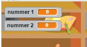

+ Voeg programmablokken aan jouw karakter toe om beide variabelen een  `willekeurig` {.blockoperators} nummer tussen 2 en 12 te geven.

	```blocks
        wanneer ⚑ wordt aangeklikt
        maak [nummer 1 v] (willekeurig getal tussen (2) en (12))
        maak [nummer 2 v] (willekeurig getal tussen (2) en (12))      
	```

+ Je kan de speler vragen het antwoord te geven en hem laten weten of dit goed.

	```blocks
        wanneer ⚑ wordt aangeklikt
        maak [nummer 1 v] (willekeurig getal tussen (2) en (12))
        maak [nummer 2 v] (willekeurig getal tussen (2) en (12))
        vraag (voeg (number 1) en (voeg [x] en (number 2) samen) samen) en wacht
        als <(antwoord) = ((nummer 1) * (nummer 2))> dan
           zeg [Goed! :)] (2) sec.
        anders
           zeg [Jammer. :(] (2) sec.
        einde
	```

+ Test jouw project op alle manieren door zowel goede als foute antwoorden te geven.

+ Voeg een `herhaal` {.blockcontrol} lus toe aan de programmablokken, zodat de speler veel vragen krijgt.

+ Maak een terugtel timer aan op het speelveld, met een variabele `tijd` {.blockdata} genaamd. Het 'Ghostbusters' project had instructies voor het maken van een timer (in stap 6) voor het geval je hulp nodig hebt!

+ Probeer jouw project opnieuw uit - Je zou nu continue vragern moeten krijgen, totdat de tijd verstreken is.

## Sla jouw project op { .save }

## Uitdaging: Verander de uiterlijken {.challenge}
Kan je de uiterlijken van jouw karakter aanpassen, zodat deze reageert op het antwoord van de speler?

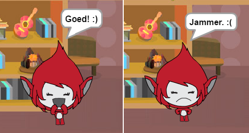

## Uidaging: bijhouden van de score {.challenge}
Kan je jouw spel de score van een speler bij laten houden? Je kan een punt toe laten voegen voor elk goed antwoord. Als je erg gemeen wilt zijn, kan je de score naar 0 terug laten zetten, zodra een speler een fout antwoord!

## Sla jouw project op{ .save }

# Stap 2: meerdere spellen { .activity .new-page}

We gaan nu een 'speel' knop aan jouw spel toevoegen, zodat je het spel vaak kan spelen.

## Activiteiten Checklist { .check }

+ Maak een nieuwe 'Speel' knop sprite, waarop je moet klikken om een nieuw spel te starten. Je kan er zelf een tekenen, ofe een sprite uit de Scratch bibliotheek importeren en wijzigen.

	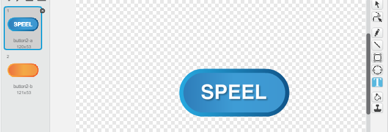

+ Voeg de volgende programma blokken toe aan jouw nieuwe knop.

	```blocks
		wanneer ⚑ wordt aangeklikt
		verschijn

		wanneer op deze sprite wordt geklikt
		verdwijn
		zend signaal [start v]
	```

	Dit programma laat de 'SPEEL' knop zien zodra je project gestart wordt. Zodra er op de knop wordt geklikt, wordt de knop verborgen en wordt de boodschap welke het spel laat starten verzonden.

+ Je zal het programma van jouw karakter moeten aanpassen, zodat het spel start als deze de boodschap `start` {.blockevents} ontvangt en niet wanneer op de vlag wordt geklikt.

	Vervang het  `wanneer ⚑ wordt aangeklikt` {.blockevents} blok met `wanneer ik signaal [start v] ontvang` {.blockevents}.

	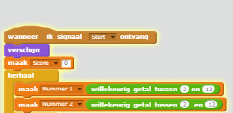

+ Klik op de groene vlag en klik daarna op de nieuwe 'play' knop om dit uit te proberen. Je zou nu moeten zien dat dat het spel niet gestart wordt, totdat op de knop wordt geklikt.

+ Viel het jou op dat de tijd startte toen op de groene vlag werd geklikt, en niet toen het spel werd gestart? 

	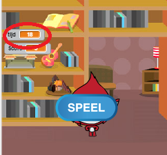

	Kan je dit probleem oplossen?

+ Klik op het speelveld en vervang het `stop alles` {.blockcontrol} blok met een  `Zend signaal [EINDE v]` {.blockevents} blok.

	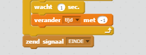

+ Je kan nu programmablokken aan jouw knop toegvoegen, om deze te laten verschijnen aan het einde van ieder spel.

	```blocks
		wanneer ik signaal [einde v] ontvang
		verschijn
	```

+ Je zal er ook voor moeten zorgen dat jouw karakter stopt met het stellen van vragen aan het einde van ieder spel:

	```blocks
		wanneer ik signaal [einde v] ontvang
		stop [andere scripts in sprite v]
	```

+ Test jouw 'play' knop door een paar spelletjes te spelen. Het zou je op moeten vallen dat de 'play' knop na ieder spel verschijnt. Om het testen makkelijker te maken, kan je ieder spel inkorten, zodat een spel slechts enkele seconden duurt.

	```blocks
		maak [time v] [10]
	```

+ Ook kan je jouw knop er anders uit laten zien, zodra de muisaanwijzer er boven zweeft.

	```blocks
		wanneer ⚑ wordt aangeklikt
		verschijn
		herhaal
		   als <raak ik [muisaanwijzer v]?> dan
		      zet [vissenoog v]-effect op (30)
		   anders
		      zet [vissenoog v]-effect op (0)
		   einde
		einde
	```

	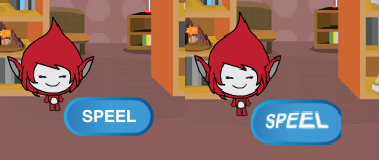

## Sla jouw project op { .save }

## Uitdaging: Start scherm {.challenge}
Kan je een andere achtergrond aan jouw speelveld toevoegen, welke gaat dienen als het startscherm van jouw spel? Je kan gebruik maken van de `Wanneer ik signaal Start ontvang` {.blockevents}  en  `Wanneer ik signaal Einde ontvang` {.blockevents} blokken om tussen de achtergronden te wisselen.

Je kan ook jouw karakter laten verdwijnen en verschijnen en ook jouw timer door deze blokken te gebruiken:

```blocks
toon variabele [time v]
```
```blocks
verberg variabele [time v]
```

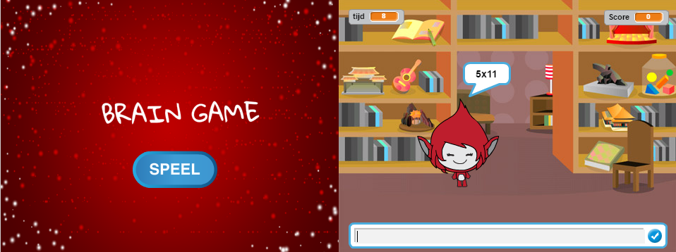

## Sla jouw project op { .save }

# Stap 3: AFbeeldingen toevoegen { .activity .new-page}

Het is jammer dat jouw karakter alleen `Goed! :)` of `Jammer :(` kan zeggen tegen de speler. Laten we daarom wat afbeeldingen toevoegen, die de speler laat zie hoe hij ervoor staat.

+ Maak een nieuwe sprite en noem deze 'Result'. Deze moet twee uiterlijken bevatten, zowel een 'vinkje' als een 'kruis' uiterlijk.

	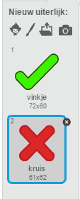

+ Verander de programma blokken van jouw karakter zodat de speler in plaats van dat hem verteld wordt hoe deze het gedaan heeft, een bericht `correct` {.blockevents} verstuurd of een bericht `fout` {.blockevents} verstuurd.

	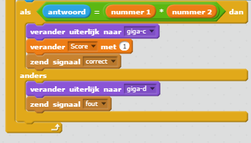

+ Je kan deze berichten gebruiken om de uiterlijken met het 'vinkje' of 'kruis' te laten zien. Voeg de volgende programmablokken toe aan jouw nieuwe 'Result' sprite:

	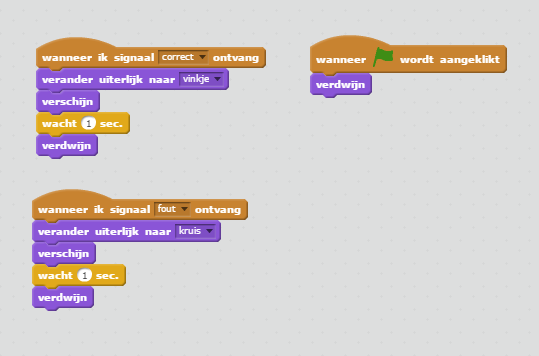	

+ Probeer jouw spel opnieuw uit. Je zou nu een vinkje moeten zien bij een goed antwoord of een kruis als het gegeven antwoord fout was!

	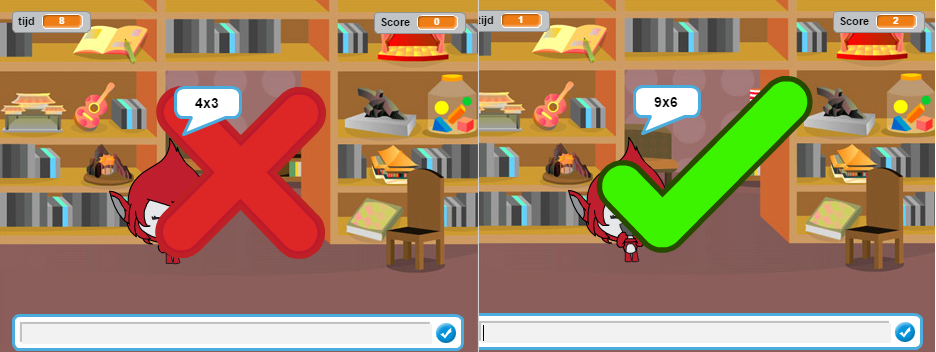

+ Is het jou opgevallen dat de programmablokken voor `wanneer ik bericht correct ontvang` {.blockevents} en `wanneer ik bericht wrong ontvang` {.blockevents} bijna hetzelfde zijn? Laten we er een funciet van maken, zodat het voor jou makkelijker is om wijzigingen in jouw programma te maken.

	In het programma van jouw 'Result' sprite, klik op `Meer blokken` {.blockmoreblocks} en vervolgens op 'Maak een blok'. Maak een functie en noem deze `animatie` {.blockmoreblocks}.

	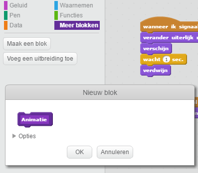

+ Je kan daarna de programmablokken voor de animatie toevoegen aan jouw nieuwe animatie functie om vervolgens de functie twee maal te gebruiken:

	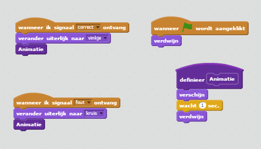

+ Als je het vinkje of het kruis nu langer of korter wil tonen, hoef je alleen nog maar een ding te wijzigen in jouw programma. Probeer het eens!

+ In plaats van het laten zien of verebergen van het vinkje of het kruis, kan je er ook voor kiezen om je afbeelding te laten verschijnen en vervolgens te laten vervagen.

	```blocks
		definieer [object Object]
		zet [geest v]-effect op (100)
		verschijn
		herhaal (25) keer
		   verander [geest v]-effect met (-4)
		einde
		verdwijn
	```

## Sla jouw project op { .save }

## Uitdaging: Animaties verbeteren {.challenge}
Kan je de animaties van jouw afbeeldingen  nog verder verbeteren? Je zou kunnen zorgen dat het vinkje of het kruis ook langzaam opkomen of vervagen. Je kan ook andere coole effecten gebruiken:

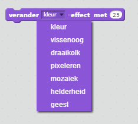

## Sla jouw project op { .save }

## Uitdaging: Geluid en muziek {.challenge}
Kan je geluidseffecten en muziek toevoegen aan jouw spel? Bijvoorbeeld:

+ Een geluid afspelen afhankelijk van het goede of foute antwoord van de speler;
+ Een tikkend geluid laten horen terwijl de timer afloopt;
+ Een geluid afspelen, zodra de tijd op is;

	```blocks
		speel slagwerk (10 v) (0.1) tellen
	```

+ Je kan er ook voor zorgen dat er een muziekje continue is een lus (loop) wordt afgespeelt (Als je niet meer precies weet hoe dit moet, kan stap 4 van het 'Rock Band' project je waarschijnlijk verder helpen.)

## Sla jouw project op { .save }

## Uitdaging: Een race naar 10 punten {.challenge}
Kan je jou proramma aanpassen, zodat jouw speler in plaats van zoveel mogelijk vragen in 30 seconden goed te beantwoorden, te meten hoe lang het duurt, voordat de speler 10 vragen goed beantwoord heeft?

Om dit te doen moet je de programma blokken van de timer aanpassen. Kan je zien wat er aangepast moet worden?

```blocks
	wanneer ik signaal [start v] ontvang
	maak [time v] (30)
	herhaal tot <(time) = [0]>
	   wacht (1) sec.
	   verander [time v] met (-1)
	einde
	zend signaal [einde v]
```

## Sla jouw project op { .save }

## Uitdaging: Instructie scherm {.challenge}
Kan je ook nog een scherm met instructie voor het spel maken, waarin je de speler uitlegt hoe hij het spel moet spelen? Je zal hiervoor een 'Uitleg' knop nodig hebben en een ander achtergrond.

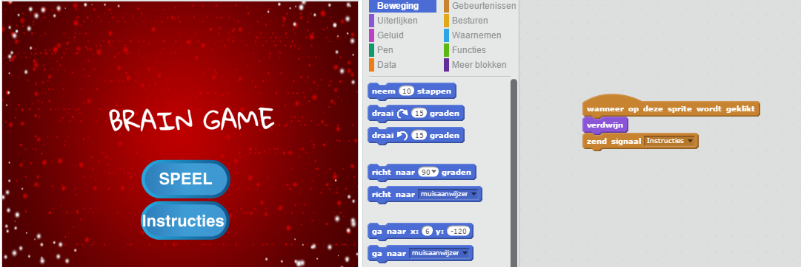

Ook heb je waarschijnlijk een 'Terug' knop nodig om naar het hoordmenu te kunnen gaan.

```blocks
	zend signaal [hoofdmenu v]
```

## Sla jouw project op { .save }
