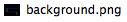
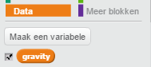
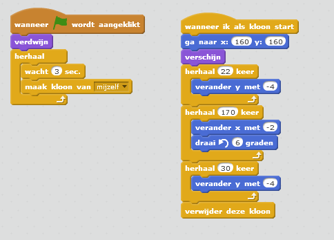

---
title: Dodgeball
level: Scratch 2
language: nl-NL
stylesheet: scratch
embeds: "*.png"
materials: ["Club Leader Resources/*","Project Resources/*"]
...

# Introductie { .intro }

In dit project ga je een platform spel leren maken, waarin jij moet proberen bewegende ballen te ontwijken en moet proberen het einde van het level te bereiken.

<div class="scratch-preview">
  <iframe allowtransparency="true" width="485" height="402" src="http://scratch.mit.edu/projects/embed/39740618/?autostart=false" frameborder="0"></iframe>
  
</div>

# Stap 1: Karakter beweging { .activity }

Laten we beginnen met het maken van een karakter dat naar links en naar rechts kan bewegen, maar ook in palen kan klimmen.

## Activiteiten Checklist { .check }

+ Begin een nieuw Scratch project en verwijder de kat sprite, zodat je een leeg project hebt. Je kan de online Scratch editor vinden via <a href="http://jumpto.cc/scratch-new">jumpto.cc/scratch-new</a>.

+ Voor dit project heb je een 'Project Resources' map nodig, die de achtergrond afbeelding bevat, welke je kan gebruiken. Zorg ervoor dat je deze map kan bereiken of vraag het bij de club Leider als je hem niet kan vinden.

	

+ Voeg de afbeelding 'background.png' toe als een nieuwe achtergrond of teken zelf jouw eigen level! Als je zelf jouw eigen level tekent, zorg er dan voor dat de palen en de vloeren verschillende kleuren hebben. Zorg er ook voor dat er een deur is of iets dergelijks, welke jouw speler moet zien te bereiken. Hier zie je hoe jouw project er nu uit zou moeten zien:

	

+ Voeg een nieuwe sprite toe, welke jouw karakter zal zijn. Het is beter als je een sprite kiest met meerdere uiterlijken, zodat je het eruit kan laten zien alsof het loopt.

	

+ Laten we de pijltjes toetsen gebruiken om jouw karakter te laten bewegen. Wanneer de speler de pijl naar rechts indrukt, wil je dat jouw karakter zich naar rechts richt en enkele passen neemt en zich naar zijn volgende uiterlijk veranderd:

	```blocks
		wanneer ⚑ wordt aangeklikt
		herhaal
		   als <toets [pijltje naar rechts v] ingedrukt?> dan
		      richt naar (90 v) graden
		      neem (3) stappen
		      volgend uiterlijk
		   einde
		einde
	```

+ Probeer jouw karakter uit door op de groene vlag te klikken en vervolgens de pijl naar rechts ingedrukt te houden. Beweegt jouw karakter naar rechts? Ziet het eruit alsof jouw karakter loopt?

	

+ Om jouw karakter naar links te laten bewegen, moet je een ander `als` {.blockcontrol} blok toevoegen binnen jouw `herhaal` {.blockcontrol} lus, waardoor jouw karakter naar links beweegt. Denk eraan dat je jouw programma probeert om zeker te weten dat het werkt!

+ Om in een paal te klimmen, moet jouw karakter iets naar boven bewegen, zodra het pijltje naar boven wordt ingedrukt en als de sprite de juiste kleur raakt. Voeg het volgende programma toe binnen de `herhaal` {.blockcontrol} lus van jouw karakter:

	```blocks
		als <<toets [pijltje omhoog v] ingedrukt?> en <raak ik kleur [#FFFF00]?>> dan
		   verander y met (4)
		einde
	```

+ Probeer jouw karakter uit - kan je in de gele palen klimmen en naar het einde van het level komen?

	

## Sla jouw project op { .save }

## Uitdaging: Het level afmaken {.challenge}
Kan je nog wat programmablokken aan jowu karakter toevoegen, zodat deze iets zegt `als` {.blockcontrol} jouw karakter de bruine deur bereikt?


## Sla jouw project op { .save }

# Stap 2: Zwaartekracht en springen { .activity }

Laten we ervoor zorgen dat jouw karakter zich realistischer beweegt, door zwaartekracht toe te voegen and hem te kunnen laten springen.

## Activiteiten Checklist { .check }

+ Het kan je zijn opgevallen dat jouw karakter kan blijven lopen, ook als hij geen vloer meer onder zijn voeten heeft en hij dus door de lucht lijkt te lopen. Probeer eens om van een vloer af te lopen en kijk wat er gebeurt.

	

+ Om dit te verhelpen, gaan we zwaartekracht aan het spel toevoegen. Maak een nieuwe variabele en moem deze `gravity` {.blockdata}. Als je wilt, kan je deze verbergen op jouw speelveld.

	

+ Voeg de volgende nieuwe programmablokken toe, wat ervoor zorgt dat de zwaartekracht een negatief getal toegewezen krijgt en dit vervolgens herhaaldelijk gebruikt om de y-coordinaten te veranderen.

	```blocks
		wanneer ⚑ wordt aangeklikt
		maak [gravity v] [-4]
		herhaal
		   verander y met (gravity)
		einde
	```

+ Klik op de vlag en sleep jouw karakter naar de bovenkant van het speelveld. Wat gebeurt er? Werkt de zwaartekracht zoals je verwacht?

	

+ Zwaartekracht zou er niet voor moeten zorgen dat je karakter door een vloer of een paal heen beweegt! Voeg een `als` {.blockcontrol} blok toe aan jouw programma, zodat de zwartekracht alleen werkt als jouw karakter zich in de lucht bevind. Jouw programma zou er nu zo uit moeten zien:

	```blocks
		wanneer ⚑ wordt aangeklikt
		maak [gravity v] [-4]
		herhaal
		   als <niet <<raak ik kleur [#0000FF]?> of <raak ik kleur [#FFFF00]?>>> dan
		      verander y met (gravity)
		   einde
		einde
	```

+ Test de zwaartekracht nog een keer. Stopt jouw karakter, zodra deze een vloer of een paal raakt? Kan je van een vloer aflopen en op een lager level terecht komen?

	

+  Laten we er nu voor zorgen dat jouw karakter kan springen, zodra de speler de spatiebalk indrukt. Een heel eenvoudige manier om dit te regelen is om jouw karakter een paar keer achter elkaar naar boven te laten bewegen, door het volgende programma te gebruiken:

	```blocks
		wanneer [spatiebalk v] wordt ingedrukt
		herhaal (10) keer
		   verander y met (4)
		einde
	```

	Omdat de zwaartekracht jouw karakter constant naar beneden trekt met 4 pixels, moet je ee getal groter dan 4 kiezen in jouw `verander y met (4)` {.blockmotion} blok. Verander dit getal totdat je tevreden bent met de hoogte die jowu karakter behaald, als deze springt.

+ Zodra je het programma uitprobeert, zal het jou opvallen dat het wel werkt, maar dat de beweging er niet soepel uitziet. Om het springen er soepeler uit te laten zien, moet je jouw karakter steeds kleinere bewegingen laten maken, totdat deze niet meer springt.

+ Om dit te doen, maken je nog een variabele en noem je deze `jump height` {.blockdata}. Als je dat wilt, kan je ook deze variabele verbergen in jouw speelveld.

+ Verwijder het spring programmablok die je aan jouw karakter had toegevoegd en vervang deze door het volgende programmablok:

	```blocks
		wanneer [spatiebalk v] wordt ingedrukt
		maak [jump height v] [8]
		herhaal tot <(jump height) = [0]>
		   verander y met (jump height)
		   verander [jump height v] met (-0.5)
		einde
	```

	Dit programma laat jouw karakter naar boven bewegen, om te beginnen met 8 pixels, daarna 7,5 pixels, daarna 7 pixels, net zolang totdat jouw karakter klaar is met springen. Dit zorgt ervoor dat een sprong er veel soepeler uit ziet.

+ Verander de beginwaarde van jouw `jump height` {.blockdata} variabele en probeer het uit totdat je tevreden bent met de hoogte van de sprong van jouw karakter.

## Sla jouw project op { .save }

## Uitdaging: Springen nog meer verbeteren {.challenge}
Jouw karakter kan nu springen, zodra er op de spatiebalk wordt gedrukt, zelfs als jouw karater al in de lucht zweeft. Je kan dit proberen door de spatiebalk ingedrukt te houden. Kan je dit verhelpen door jouw karakter alleen te kunnen laten springen `als` {.blockcontrol} deze een blauwe vloer aanraakt?

## Sla jouw project op { .save }

# Stap 3: Ballen ontwijken { .activity .new-page}

Nu we ervoor gezorgd hebben dat jouw karakter zich in het speelveld kan bewegen, gaan we ballen toevoegen, die ontweken moeten worden.

## Activiteiten Checklist { .check }

+ Maak een nieuwe bal sprite. Het maakt niet uit welk type bal je gebruikt.

	

+ Wijzig de grootte van de bal van jouw bal, zodat jouw karakter er overheen kan springen. Probeer over de bal heen te springen om dit uit te proberen. 

	

+ Voeg de volgende programmablokken toe aan jouw bal:

	

	Dit programmablok zorgt elke 3 seconden voor een nieuwe kloon van de bal. Elke nieuwe kloon beweegt langs de bovenkant van de bovenste vloer.

+ Klik op de vlag om dit uit te probereren.

	

+ Voeg meer programmablokken toe aan de bal-sprite, zodat deze langs alle drie de vloeren beweegt.

	

+ Tenslotte moet je een programmablok maken voor het geval jouw karakter geraakt wordt door een bal! Voeg dit programmablok toe aan jouw bal-sprite:

	```blocks
		wanneer ik als kloon start
		herhaal
		   als <raak ik [Pico walking v]?> dan
		      zend signaal [hit v]
		   einde
		einde
	```

+ Je moet ook een porogrammablok toevoegen aan jouw karakter, dat er voor zorgt dat deze naar het startpunt wordt terug geplaatst, nadat deze door een bal geraakt wordt:

	```blocks
		wanneer ik signaal [hit v] ontvang
		richt naar (90 v) graden
		ga naar x:(-210) y:(-120)
	```	

+ Probeer jouw karakter uit en kijk of deze naar het startpunt terug gaat nadat deze geraakt wordt door een bal.

## Sla jouw project op { .save }

## Uitdaging: Willekeurige ballen {.challenge}
De ballen die jouw karakter moet ontwijkenzien er allemaal hetzelfde uit en verschijnen altijd elke 3 seconden. Kan je hen verbeteren, zodat zij:

+ er niet allenmaal hetzelfde uitzien?
+ verschijnen na een willekeurige tijd?
+ een willekeurige grootte hebben?


## Sla jouw project op { .save }

# Stap 4: Lasers! { .activity .new-page}

Laten we jouw spel iets moeilijker maken om te voltooien door lasers toe te voegen!

## Activiteiten Checklist { .check }

+ Voeg een nieuwe sprite toe en noem deze 'Laser'. Het zou 2 uiterlijken moeten hebben, genaamd 'on' en 'off'.

	

+ Place your new laser anywhere you like, between 2 platforms.

	

+ Voeg programmablokken toe aan jouw laser om het te latenwisselen tussen de twee uiterlijken.

	```blockswanneer 
		⚑ wordt aangeklikt
		herhaal
		   verander uiterlijk naar [aan v]
		   wacht (2) sec.
		   verander uiterlijk naar [uit v]
		   wacht (2) sec.
		einde
	```

	Als je dat wilt, kan je ook een `willekeurige` {.blockoperators} tijd `wachten` {.blockcontrol}  tussen het wisselen van uiterlijken.

+ Voeg tenslotte nog programmablokken toe aan jouw laser, zodat deze een 'hit' boodschap uitzendt als de laser jouw karakter raakt. Deze programmablokken zullen hetzelfde zijn als die je al hebt toegevoegd aan de bal-sprite.

	Je hoeft niet nog meer programma blokken toe te voegen aan jouw karakter - deze weet al wat deze moet doen, zodra deze geraakt wordt!

+ Probeer jouw spel uit om te zien of je voorbij de laser kan komen. Verander de `wacht` {.blockcontrol} tiijden in jouw programma als het te makkelijk of te moeilijk is om de lasers te passeren.
## Uitdaging: Meer obstakels {.challenge}
Als je nog steeds vind dat jouw spel te makkelijk is, kan je nog meer obstakels aan jouw level toevoegen. Je kan alles toevoegen wat je wilt, maar hier volgen een paar ideeën:

+ Een dodelijke rondvliegende vlinder;
+ Vloeren die verschijnen en verdwijnen;
+ Vallende tennisballen die vermeden moeten worden.


Je kan ook meerdere achtergronden maken en naar een volgend lvel gaan, zodra jouw karakter de bruine deur bereikt:

```blocks
	als <raak ik kleur [#714300]?> dan
	   verander achtergrond naar [volgende achtergrond v]
	   ga naar x:(-210) y:(-120)
	   wacht (1) sec.
	einde
```

## Sla jouw project op { .save }

## Uitdaging: Verbeterde zwaartekracht {.challenge}
Er zit nog steeds een kleine fout in jouw spel: de zaartekracht trekt jouw karakter niet naar beneden als er ook maar _enig_ onderdeel van jouw karakter een blauwe vloer raakt - ook als dit het hoofd is! Je kan dit uitproberen door bijna helemaal in een paal te klimmen en daarna naar links te bewegen.


Kan jij deze fout herstellen? Om dit te doen, moet je jouw karakter een andere kleur broek geven (voor  _alle_ uiterlijken)...


...en daarna het volgende programmablok vervangen: 

```blocks
	raak ik kleur [#0000FF]?
```

door:

```blocks
	kleur [#00FF00] raakt [#0000FF]?
```

Vergeet niet jouw verbeteringen uit te proberen om te zien of je het probleem hebt opgelost!

## Sla jouw project op { .save }

## Uitdaning: Meerdere levens {.challenge}
Kan je jouw speler 3 `levens` {.blockdata} geven, in plaats van hem iedere keer terug naar het begin te sturen? Hier volg hoe jouw spel gespeeld zou kunnen worden:

+ Jouw spele start met 3 levens;
+ Zodra jouw speler geraakt wordt, verliest hij een leven en moet hij opnieuw beginnen;
+ Zodra er geen levens meer zijn, stopt het spel.

## Sla jouw project op { .save }
