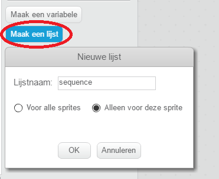
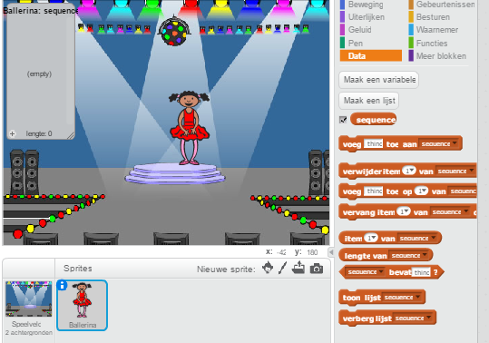
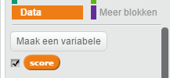
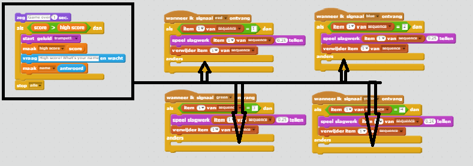
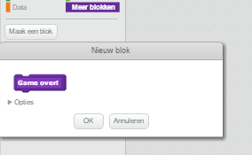
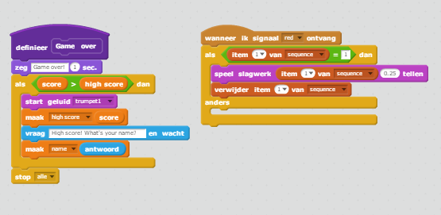
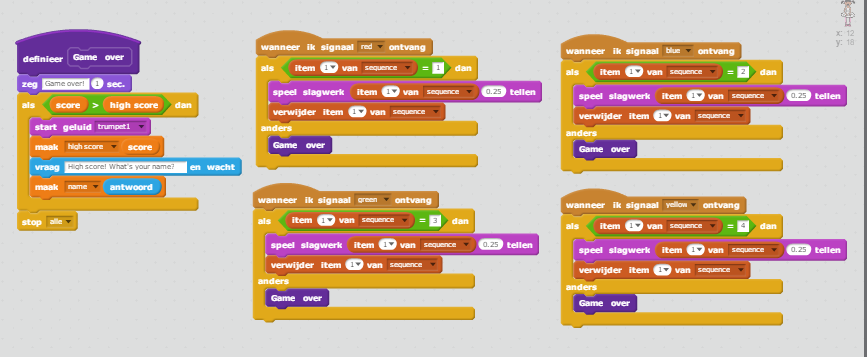
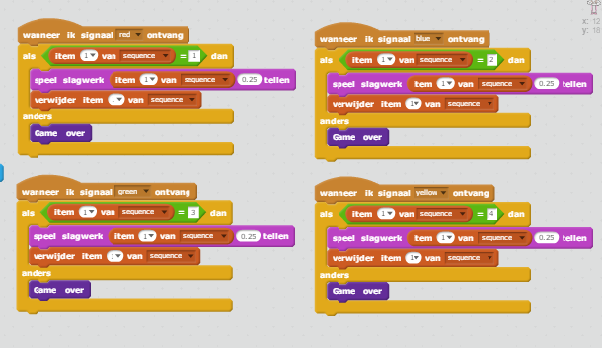

---
title: Memory
level: Scratch 2
language: nl-NL
stylesheet: scratch
embeds: "*.png"
materials: ["Club Leader Resources/*"]
...

## Community Contributed Project { .challenge .pdf-hidden }
Dit project is gemaakt door Erik en zijn dochter Ruth. Als jij ook een project van jou wil bijdragen, [neem dan contact met ons op via Github](https://github.com/CodeClub).

# Introductie { .intro }

In dit project, ga je een geheugenspel maken, waarin je een willekeurige volgorde van kleuren moet onthouden en herhalen!

<div class="scratch-preview">
  <iframe allowtransparency="true" width="485" height="402" src="http://scratch.mit.edu/projects/embed/34874510/?autostart=false" frameborder="0"></iframe>
  
</div>

# Stap 1: Willekeurige kleuren { .activity }

Als eerste maken wij een karakter, welke kan veranderen in een willekeurige volgorde van kleuren die de speler moet onthouden.

## Activiteieten Checklist { .check }

+ Begin een nieuw Scratch project en verwijder de kat sprite, zodat je een leeg project hebt. Je kan de online Scratch editor vinden via <a href="http://jumpto.cc/scratch-new">jumpto.cc/scratch-new</a>.

+ Kies een karakter en een achtergrond. Jouw karakter hoeft geen persoon te zijn, maar het moet mogelijk zijn om verschillende kleuren te laten zien.

	

+ In jouw spel moet je verschillende nummers toewijzen om een kleur te vertegenwoordigen:

	+ 1 = rood;
	+ 2 = blauw;
	+ 3 = groen;
	+ 4 = geel.

	Geef jouw karakter 4 verschillend gekleurde uiterlijken, een met elk van de 4 hierboven genoemde kleuren. Zorg ervoor dat jouw gekleurde uiterlijken in de goede volgorde staan.

	

+ Om een willekeurige volgorde te maken, moet je een __lijst__ maken. Een lijst is gewoon een variabele die veel gegevens __in volgorde__ kan opslaan. Maak een nieuwe lijst en noem deze `sequence` {.blockdata}. Omdat alleen jouw karakter toegang moet hebben tot de lijst, kunnen we ook klikken op 'Alleen voor deze sprite'.

	

	Je zou nu een lege lijst moeten zien in de linker bovenhoek van het speelveld en een heleboel nieuwe blokken, om gebruik te maken van lijsten.

	

+ Voeg het volgende programma toe aan jouw karakter, om 5 maal een willekeurig nummer aan jouw lijst toe te voegen (en het juiste uiterlijk te laten zien):

	```blocks
		wanneer ⚑ wordt aangeklikt
		verwijder item (alle v) van [sequence v]
		herhaal (5) keer
			voeg (willekeurig getal tussen (1) en (4)) toe aan [sequence v]
			verander uiterlijk naar (item (last v) van [sequence v])
 			wacht (1) sec.
		einde
	```

	Zoals je ziet, begin je elke keer met de list leeg te mnaken.

## Uitdaging: Geluid toevoegen {.challenge}
Probeer jouw project een paar keer uit. Het valt je misschien op dat soms meerdere keren hetzelfde nummer gekozen wordt, waardoor het moeilijker wordt om de volgorde te onthouden. Kan je elke keer dat het karakter van uiterlijk veranderd een trommelgeluid laten afspelen?

Kan je het drumgeluid afhankelijk maken van het willekeurige gekozen nummer? Dit zal _zeer_ veel lijken op het programma om het uiterlijk van het karakter te veranderen.

## Sla jouw project op { .save }

# Stap 2: Herhalen van de volgorde { .activity }

We gaan 4 knoppen toevoegen, zodat de speler de volgorde, die hij onthouden heeft, kan herhalen.

## Activiteiten Checklist { .check }

+ Voeg 4 sprites toe aan jouw project, waarmee wij knoppen gaan maken. Verander jouw 4 sprites, zodat er 1 is voor elk van de 4 kleuren.

	

+ Wanneer er op de rode drum geklikt wordt, moet er een boodschap worden gezonden naar jouw karakter om deze te laten weten dat er op de rode knop is geklikt. Voeg het volgende programma toe aan jouw rode drum:

	```blocks
		wanneer op deze sprite wordt geklikt
		zend signaal [red v]
	```

+ Wanneer jouw karakter dit bericht ontvangt, moet deze controleren of deze gelijk is met de nummer 1 aan het begin van de lijst (wat betekent dat rood de volgende kleur is in de volgorde). Als dat zo is, kan je het nummer verwijderen van de lijst, omdat het goed geraden is. Anders is het einde van het spel!

	```blocks
		wanneer ik signaal [red v] ontvang
		als <(item (1 v) van [sequence v]) = [1]> dan
		   verwijder item (1 v) van [sequence v]
		anders
		   zeg [Game over!] (1) sec.
		   stop [alle v]
		einde
	```

+ Je kan ook wat lichten laten flitsen, zodra de lijst leeg is, want dit betekent dat de hele volgorde goed is geraden. Voeg deze programmaregels toe aan het einde van het programma van jouw karakter's `wanneer ⚑ wordt aangeklikt` {.blockevents} script:

	```blocks
		wacht tot <(lengte van [sequence v]) = [0]>
		zend signaal [won v] en wacht
	```

+ Klik op jouw speelveld en voeg de volgende programmaregels toe om de kleuren van de achtergrond te veranderen zodra de speler gewonnen heeft.

	```blocks
		wanneer ik signaal [won v] ontvang
		start geluid [drum machine v]
		herhaal (50) keer
		   verander [kleur v]-effect met (25)
		   wacht (0.1) sec.
		einde
		zet alle effecten uit
	```

## Uitdaging: 4 knoppen maken {.challenge}
Herhaal de stappen zoals hierboven omschreven voor de blauwe, groene en gele knoppen. De programma regels zullen hetzelfde blijven en welke programma regels moeten worden veranderd voor iedere knop?

Je kan ook geluiden toevoegen wanneer de knoppen worden aangeklikt.

Vergeet niet om het programma's te testen, die je hebt toegevoegd! Kan jij de volgorde van de 5 kleuren onthouden? Is de volgorde iedere keer anders?

## Sla jouw project op { .save }

# Stap 3: Meerdere levels { .activity .new-page }

Tot nu toe moest een speler slechts 5 kleueren te onthouden. Laten we het spel verbeteren door de lengte van de volgorde te vergroten.

## Activiteieten Checklist { .check }

+ Maak een nieuwe variabele en noem deze `score` {.blockdata}.

	

+ Deze `score` {.blockdata} zal worden gebruikt om te beslissen wat de lengte wordt van de volgorde die de speler moet onthouden. Hierom beginnen we met een score (en de lengte van de volgorde) die gelijk is aan 3. Voeg het volgende programma blok toe aan het begin van jouw karakter's `wanneer ⚑ wordt aangeklikt` {.blockevents} blok:

	```blocks
		maak [score v] [3]
	```

+ In plaats van iedere keer een volgorde van 5 kleueren te maken, Wil jij nu de `score` {.blockdata} laten bepalen wat de lengte van de volgorde wordt. Verander de `herhaal` {.blockcontrol} lus (Voor het maken van de volgorde) van jouw karakter in:

	```blocks
		herhaal (score) keer
		einde
	```

+ Zodra de volgorde juist is geraden, moet je 1 optellen bij de score, om de lengte van de volgorde te verhogen.

	```blocks
		verander [score v] met (1)
	```

+ Tenslotte moet je een `herhaal` {.blockcontrol} lus om het programma heen zetten om de volgorde te maken, zodat een nieuwe volgorde wordt gemaakt voor ieder level. Dit is hoe het programma van jouw karakter er nu uit zou moeten zien:

	```blocks
		wanneer ⚑ wordt aangeklikt
		maak [score v] [3]
		herhaal
		   verwijder item (alle v) van [sequence v]
		   herhaal (score) keer
		      voeg (willekeurig getal tussen (1) en (4)) toe aan [sequence v]
		      verander uiterlijk naar (item (last v) van [sequence v])
		      wacht (1) sec.
		   einde
		   wacht tot <(lengte van [sequence v]) = [0]>
		   zend signaal [won v] en wacht
		   verander [score v] met (1)
		einde
	```

+ Laat jouw vrienden jouw spel uitproberen. Vergeet niet om de `sequence` {.blockdata} lijst te verbergen, voordat ze het spel gaan spelen!

## Sla jouw project op { .save }

# Stap 4: Hoogste score { .activity }

Laten we de hoogst behaalde score bewaren, zodat je tegen jouw vrienden kan spelen.

## Activiteiten Checklist { .check }

+ Voeg twee nieuwe variabelen toe en noem deze `high score` {.blockdata} en `naam` {.blockdata}.

+ Als het spel uiteindelijk eindigd (door op een verkeerde knop te klikken), moet je controleren of de score van de speler hoger is dan de huidige hoogste score. Als dat zo is, moet je deze score als hoogste score bewaren, samen met de naam van de speler. Hier zie je hoe het programma van jouw rode knop eruit zou moten zien:

	```blocks
		wanneer ik signaal [red v] ontvang
		als <(item (1 v) van [sequence v]) = [1]> dan
		   verwijder item (1 v) van [sequence v]
		anders
		   zeg [Game over!] (1) sec.
		   als <(score) > (high score)> dan
		      maak [high score v] (score)
		      vraag [High score! What is your name?] en wacht
		      maak [name v] (antwoord)
		   einde
		   stop [alle v]
		einde
	```

+ Je moet deze programma regels ook toevoegen aan de andere 3 knoppen! Is het jou opgevallen dat de 'Game over' programma regels voor alle 4 de knoppen precies hetzelfde is?

	

+ Als je ooit iets aan deze programma regels wilt veranderen, zoals het toevoegen van een geluid of het wijzigen van de 'Game over!' boodschap, zou je het 4 keer moeten veranderen! Dat kan vervelend worden en een hoop tijd kunnen kosten.

	In plaats daarvan kan je jouw eigen blokken maken en deze meerdere keren in jouw project gaan gebruiken! Om dit te doen, klik je op `Meer blokken` {.blockmoreblocks} en vervolgens op 'Maak een blok'. Noem dit nieuwe blok 'Game over'.

	

+ Voeg de programma regels van het `anders` {.blockcontrol} blok van de rode knop toe aan het nieuwe blok dat is verschenen:

	

+ Je hebt nu een nieuwe _functie_ genaamd `Game over` {.blockmoreblocks} gemaakt, die je overal waar je maar wilt, kan gebruiken. Sleep jouw nieuwe `Game over` {.blockmoreblocks} blok naar elk van de 4 scripts van de knoppens.

	

+ Voeg nu een geluid toe voor het geval dat een verkeerde knop wordt aangeklikt. Je hoeft deze programma regel slechts  _eenmaal_ toe te voegen aan het `Game over` {.blockmoreblocks} blok welke je net gemaakt hebt en dus niet 4 verschillende keren!

	

## Uitdaging: Meer blokken maken {.challenge}
Is het jou opgevallen dat er nog een programma is welk voor alle 4 de knoppen gelijk is?



Kan je nog een aangepast blok maken, dat door elke knop wordt gebruikt?

## Sla jouw project op { .save }

## Uitdaging: Een ander uiterlijk {.challenge}
Is het jou opgevallen dat wanneer jouw spel begint, jouw karakter 1 van de 4 kleuren die moet worden geraden laat zien en dat altijd de laatste kleur van de volgorde wordt getoond, als de speler de volgorde probeert te herhalen?

Kan je een simpel wit uiterlijk aan jouw karakter toevoegen, welke wordt getoond aan het begin van het spel en wannneer de speler probeert de volgorde te herhalen?


## Sla jouw project op { .save }

## Uitdaging: Moeilijkheidsgraad {.challenge}
Kan jij jouw speler toestaan om te kiezen tussen een eenvoudig spel (waarin alleen de rode en de blauwe drums worden gebruikt) of een normaal spel (waanin alle 4 de drums worden gebruikt)?

Kan je ook nog een extra moeilijk spel maken, waarin een vijfde drum wordt toegevoegd?

## Sla jouw project op { .save }
