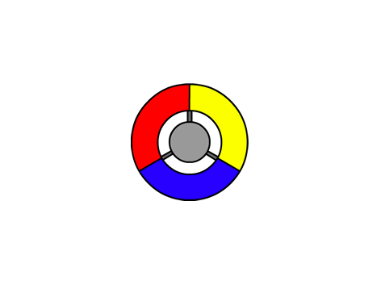
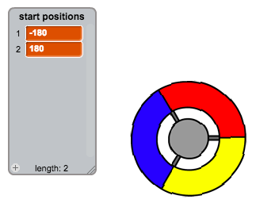
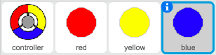
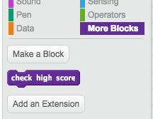

---
title: Vang de stippen
level: Scratch 2
language: nl-NL
stylesheet: scratch
embeds: "*.png"
materials: ["Club Leider Bronnen/*", "Projectbronnen/*"]
beta: true
...

# Inleiding { .intro }

In dit project leer je een spel te maken waarin je met een controller de juiste kleur van stippen moet aantikken.

<div class="scratch-preview">
  <iframe allowtransparency="true" width="485" height="402" src="http://scratch.mit.edu/projects/embed/44942820/?autostart=false" frameborder="0"></iframe>
  
</div>

# Stap 1: Een controller maken { .activity }

Laten we eerst een controller maken waarmee je de stippen kan vangen.

## Stappenplan { .check }

+ Start een nieuw Scratch project en verwijder de kat-sprite zodat je een leeg project hebt. Je can de online versie van Scratch hier vinden: <a href="http://jumpto.cc/scratch-new">jumpto.cc/scratch-new</a>.

+ Als je van de clubleider een 'resources'-map hebt gekregen, klik je op 'Upload sprite' en voeg je de 'controller.svg' afbeelding toe. Zet deze sprite in het midden van het speelveld.

	
	
	Als je deze afbeelding niet hebt, kan je deze zelf tekenen!
	
+ Draai je controller naar rechts als het rechterpijltje wordt ingedrukt:

	```blocks
		wanneer ⚑ wordt aangeklikt
		herhaal
		   als <toets [pijltje naar rechts v] ingedrukt?> dan
		      draai ↻ (3) graden
		   einde
		einde
	```
+ Test nu je controller, deze moet naar rechts draaien.

## Sla je project op { .save }

## Uitdaging: Links draaien {.challenge}
Kan je nu zelf je controller naar links laten draaien als je de linkerpijl indrukt?

## Sla je project op { .save }

# Stap 2: Stippen verzamelen { .activity }

We zullen nu wat stippen toevoegen die de speler met de controller kan verzamelen.

## Stappenplan { .check }

+ Maak een nieuwe sprite en noem deze 'red'. Dit moet een klein rood stipje zijn.

	

+ Voeg deze code toe om je rode stip na enkele seconden steeds opnieuw te verschijnen:

	```blocks
		wanneer ⚑ wordt aangeklikt
		verdwijn
		wacht (2) sec.
		herhaal
		   maak kloon van [mijzelf v]
		   wacht (willekeurig getal tussen (5) en (10)) sec.
		einde
	```

+ Wanneer een kloon is gemaakt, wil je dat deze in een van de vier hoeken verschijnt.

	

	Om dit te bekomen, maak je een nieuwe variabele `start positions` {.blockdata} en klik je `(+)` om de waarden `-180` en  `180` in te geven.

	

+ Je kan dit gebruiken om een willekeurige hoek te kiezen. Voeg deze code toe bij de 'dot'-sprite, zodat elke nieuwe kloon in een van de hoeken verschijnt en zachtje naar de controller toe gaat.

	```blocks
		Wanneer ik als kloon start
		ga naar x: (item (willekeurig v) van [start positions v]) y: (item (willekeurig v) van [start positions v])
		richt naar [controller v]
		verschijn
		herhaal tot <raak ik [controller v]?>
			neem (1) stappen
		end
	```

	Deze code kiest `-180` of `180` voor x _and_ y posities, wat maakt dat elke kloon in een van de hoeken van het scherm start.

+ Test je project. Je moet vele rode stippen zien verschijnen in elke hoek van het scherm en naar de controller toegaan.

	

+ Maak 2 nieuwe variabelen: `lives` {.blockdata} en `score` {.blockdata}.

+ Voeg code aan je scherm toe om: `lives` {.blockdata} op 3 en de `score` {.blockdata} op 0 wanneer het spel begint.

+ Je moet code toevoegen aan je rode sprite code `Wanneer ik als een kloon start` {.blockcontrol} , zodat er een punt bij de `score` {.blockdata} komt als de kleuren overeenkomen, of een punt afgetrokken wordt van de `lives` {.blockdata} als de kleuren niet kloppen.

	```blocks
		neem (5) stappen
		als <raak ik kleur [#FF0000]?> dan
			verander [score v] met (1)
			start geluid [pop v]
		anders
			verander [lives v] met (-1)
			start geluid  [laser1 v]
		end
		verwijder deze kloon
	```

+ Voeg deze code nog toe aan je hoofdscherm zodat het spel eindigt als je speler alle levens kwijt is:

	```blocks
		wacht tot <(lives) < [1]>
		stop [alle v]
	```

+ Test nu je spel zodat je zeker weet dat alles goed werkt.

## Sla je project op { .save }

## Uitdaging: Meer stippen {.challenge}
Dupliceer je rode stip-sprite 2 keer, en noem de nieuwe sprites 'yellow' and 'blue'.



Bewerk deze sprites (ook hun code), zodat elke gekleurde stip het juiste deel van de controller moet aanraken. Test je project, let er op dat je punten wint en levens verliest en dat je spel niet te eenvoudig of te moeilijk is!


## Sla je project op { .save }

# Stap 3: Verhoog de moeilijkheid { .activity .new-page}

Laat ons nu de moeilijkheidsgraad verhogen naarmate de speler langer speelt, door de tijd beetje bij beetje in te korten waartussen nieuwe stippen verschijnen.

## Stappenplan { .check }

+ Maak een nieuwe variabele `delay` {.blockdata}.

+ Maak een nieuw script op je speelscherm dat start van een hoge tijdsinterval en dan langzaamaan de tussenliggende tijd verlaagt.

	```blocks
		wanneer ⚑ wordt aangeklikt
		maak [delay v] (8)
		herhaal tot <(delay) = (2)>
		   wacht (10) sec.
		   verander [delay v] met (-0.5)
		einde
	```

	Je merkt dat dit zeer gelijk loopt met de werking van een 'game timer'!

+ Afsluitend kan je deze `delay` {.blockdata} variabele in je red, yellow and blue stippen hun scripts steken. Neem de code weg die een willekeurige tijd bepaalt tussen het maken van 2 nieuwe stippen, en vervang deze door je nieuwe `delay` {.blockdata} variabele:

	```blocks
		wacht (delay) sec.
	```

+ Test je nieuwe `delay` {.blockdata} variabele, En kijk of de tijd tussen het verschijnen van 2 nieuwe stippen beetje bij beetje vermindert. Kijk je na voor de drie kleuren? Kan je de waarde van de `delay` {.blockdata} variable zien verminderen?

## Sla je project op { .save }

## Uitdaging: Sneller bewegende stippen {.challenge}
Kan je je spel verbeteren door een snelheids{.blockdata} variable, zodat de stip eerst stapje per stapje zich verplaatsen maar stilletjes aan sneller en sneller beginnen te bewegen? Dit zal je kunnen uitvoeren op een manier die erg lijkt op de `delay` {.blockdata} variabele zoals hierboven beschreven.

## Sla je project op { .save }

# Stap 4: High score { .activity }

We gaan nu de hoogste score opslaan zodat de spelers zien hoe goed ze het doen.

## Stappenplan { .check }

+ Maak een nieuwe variabele `high score` {.blockdata}.

+ Klik op je speelveld en maak `check high score` {.blockmoreblocks}.

	

+ Juist voordat het spel eindigt laat je het verschijnen.

	

+ Voeg code toe aan je veranderbare blok om de huidige `score` {.blockdata} op te slaan als de `high score` {.blockdata} `als` {.blockcontrol} het de hoogste score is tot nu toe:

	```blocks
		definieer [check high score]
		als <(score) > (high score)> dan
			maak [high score v] (score)
		end
	```

+ Test the code die je hebt toegevoegd. Speel je spel om na te gaan of de `high score` {.blockdata} juist wordt aangepast.

## Sla je project op { .save }

## Uitdaging: Verbeter je spel! {.challenge}
Kan je iets bedenken dat je spel kan verbeteren? Je zou bijvoorbeeld stippen kunnen bedenken die:

+ je score verdubbelen;
+ de stippen vertragen;
+ alle andere stippen op het scherm onzichtbaar maken!

## Sla je project op { .save }

## Uitdaging: Game menu {.challenge}
Kan je een menu (met knoppen) toevoegen aan je spel? Je kan een instructiescherm of een apart 'high score' venster toevoegen. Als je hiervoor hulp nodig hebt kan de 'brain game' je helpen.
