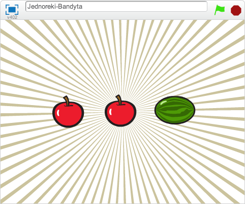

---
title: Jednoręki bandyta
level: Poziom 2
language: pl-PL
stylesheet: scratch
embeds: "*.png"
materials: "*.sb"
...

# Wstęp {.intro}

Zrobimy prostą grę z trzema duszkami, które się zmieniają w trakcie gry. Twoje zadanie polega na zatrzymaniu tych duszków w taki sposób, aby wszystkie miały taki sam obrazek (jak w jednorękim bandycie!).



# Krok 1: Tworzenie duszka, który zmienia kostiumy {.activity}

## Zadania do wkonania {.check}

__Zaimportujmy obrazki potrzebne do gry__

* Rozpocznij nowy projekt w Scratchu. Usuń kota, klikając na nim prawym przyciskiem myszki i wybierając 'usuń'.
* Dodaj nowe tło z biblioteki. Z kategorii **Inne** wybierz tło **rays** a następnie usuń puste tło sceny.
* Zaimportuj nowego duszka.
* Wybierz obrazek z dowolnego katalogu. My użyliśmy **Przedmioty/bananas1**, ale możesz wybrać dowolny obrazek, który ci się podoba.
* Kliknij na zakładkę 'Kostiumy' i wybierz dwa inne obrazki – potrzebujemy w sumie trzy różne kostiumy (my wybraliśmy **Przedmioty/apple** i **Przedmioty/watermelon-a**, ale możesz wybrać którekolwiek chcesz).

__Skoro mamy już kostiumy, teraz sprawmy, aby duszek nosił je wszystkie na zmianę.__

# Krok 2: Zmieniamy pojawiające się obrazki {.activity}

## Zadania do wykonania {.check}

* Przejdź do zakładki `Skrypty` {.blocklightgrey}.
* Kliknij na palecie `Zdarzenia` {.blockgrey} i przeciągnij blok `kiedy kliknięto zieloną flagę` {.blockbrown} na obszar ze skryptami.
* Dodaj blok `zawsze` {.blockyellow} z palety `Kontrola` {.blockgrey} i dołącz go do bloku z flagą.
* **Kliknij na zieloną flagę** w prawym rogu nad sceną. Zauważ, że nasz skrypt podświetlił się na żółto. Dzieje się tak ponieważ kliknęliśmy na zieloną flagę, co spowodowało, że skrypt się uruchomił.
* Kliknij na palecie `Wygląd` {.blockgrey} i dołacz do skryptu blok `następny kostium` {.blockpurple}. Kliknij zieloną flagę.
* Co możemy zrobić, aby obrazki nie zmieniały się tak szybko? Dodaj blok `czekaj 1 s` {.blockyellow} z palety `Kontrola` {.blockgrey}.
* Zmień czas, aby obrazki zmieniały się troszkę szybciej, ale nie za szybko - 0.5 s powinno być w sam raz. Co się stanie, jeżeli usuniemy ze skryptu blok `czekaj 1 s` {.blockyellow}?

    ```blocks
        kiedy kliknięto zieloną flagę
        zawsze
            następny kostium
            czekaj (0.5) s
    ```

## Przetestuj swój projekt {.flag}
__Kliknij zieloną flagę.__

Czy kostiumy zmieniają się z rozsądną szybkością?

## Zapisz swój projekt. {.save}

## Rzeczy do spróbowania {.try}
Zmień ilość sekund w bloku `czekaj 1 s` {.blockyellow}. Jak myślisz, przy jakiej wartości gra stanie się zbyt prosta, a przy jakiej wartości będzie za trudna?

# Krok 3: Zatrzymujemy obrazki kliknięciem klawisza myszki {.activity}

**Świetnie! Potrafimy już sprawić, aby kostiumy duszka zmieniały się w nieskończoność, ale jak zrobić, aby zatrzymały się, kiedy na niego klikniemy?**
Można do tego użyć zmiennej, w której będziemy przechowywać stan Duszka. Przyda się ona także później...

## Zadania do wykonania {.check}

* Kliknij na palecie `Zmienne` {.blockgrey} i `stwórz nową zmienną` {.blocklightgrey}. Nazwij ją `zatrzymany` {.blockorange} i zaznacz, że ma być dostępna **tylko dla tego duszka**. Następnie odznacz haczyk obok niej, aby nie była widoczna na Scenie.

* Na początku gry duszek nie został kliknięty, więc ustawimy wartość zmiennej na **"NIE"**.

    ```blocks
        kiedy kliknięto zieloną flagę
        ustaw [zatrzymany v] na [NIE]
        zawsze
            następny kostium
            czekaj (0.5) s
    ```
* Teraz będziemy ustawiać wartość zmiennej `zatrzymany` {.blockorange} na **"TAK"** kiedy ktoś kliknie na duszka.

    ```blocks
        kiedy duszek kliknięty
        ustaw [zatrzymany v] na [TAK]
    ```
* Na koniec chcemy, aby duszek przestał zmieniać kostiumy kiedy zmienna `zatrzymany` {.blockorange} zmieni się na "TAK". Dodaj blok `jeżeli ... to` {.blockyellow} i użyj bloku do porównania `[] = []` {.blockgreen} (znajdziesz go w panelu *Wyrażenia*), aby sprawdzić czy zmienna `zatrzymany` {.blockorange} ma nadal wartość "NIE".

    ```blocks
        kiedy kliknięto zieloną flagę
        ustaw [zatrzymany v] na [NIE]
        zawsze
            jeżeli <(zatrzymany) = [NIE]> to
                następny kostium
                czekaj (0.5) s
    ```

## Przetestuj swój projekt {.flag}
__Kliknij zieloną flagę, poczekaj chwilę i kliknij na duszka.__

Czy duszek zmienia kostium, zanim na niego klikniesz?
Czy duszek zatrzymuje się po kliknięciu?

__Uruchom skrypt jeszcze raz.__

Czy duszek zatrzymuje się, jeżeli najedziesz na niego kursorem myszki, ale nie klikniesz? Czy zatrzymuje się, jeżeli klikniesz gdzie indziej na Scenie?

## Zapisz swój projekt. {.save}

# Krok 4: Dodajemy dodatkowe duszki {.activity}
__Teraz potrzebujemy stworzyć dwa inne duszki, abyśmy mogli zagrać w naszą grę!__

## Zadania do wykonania {.check}

* **Zduplikuj duszka**, klikając na nim prawym przyciskiem myszki.
* Zduplikuj go jeszcze raz, tak aby były w sumie **trzy** duszki.
* Poprzesuwaj duszki na Scenie tak, aby były obok siebie. Jeśli chcesz, możesz je trochę zmniejszyć.

## Przetestuj swój projekt {.flag}
__Kliknij zieloną flagę.__

Wszystkie duszki powinny się zmieniać. Spróbuj zatrzymać je na tym samym obrazku!

## Zapisz swój projekt. {.save}

# Krok 5: Losowy kostium dla każdego duszka {.activity}
__Niech duszki zmieniają kostium na losowy po kliknięciu zielonej flagi.__

Gdy zaczynasz grę, wszystkie duszki pokazują ten sam kostium i zmieniają się razem w taki sam sposób. Gra będzie ciekawsza (i trudniejsza) jeśli będą się zmieniać w mniej przewidywalny sposób.

## Zadania do wykonania {.check}

* Jeśli spojrzysz do zakładki `Kostiumy` {.blocklightgrey} dla duszka zobaczysz, że każdy kostium ma swój numer. Możesz określić, który kostium ma założyć duszek podając nazwę kostiumu lub jego numer.
* Aby duszek rozpoczynał grę w losowym kostiumie dodajmy blok `zmień kostium na` {.blockpurple} z blokiem `losuj od (1) do (3)` {.blockgreen}, aby wybrać numer kostiumu.
* Możemy użyć dokładnie tego samego bloku w pętli `zawsze` {.blockyellow} tak, aby duszek zmieniał kostium na inny za każdym razem w ciągu gry.

    ```blocks
        kiedy kliknięto zieloną flagę
        ustaw [zatrzymany v] na [NIE]
        zmień kostium na <losuj od (1) do (3)>
        zawsze
            jeżeli <(zatrzymany) = [NIE]> to
                zmień kostium na <losuj od (1) do (3)>
                czekaj (0.5) s
    ```
* Takie same zmiany zrób dla pozostałych duszków.

## Przetestuj swój projekt {.flag}
__Kliknij zieloną flagę.__ Wszystkie duszki powinny zmieniać swoje kostiumy w różnej kolejności.

Jak powinniśmy zmienić nasz skrypt kiedy dodamy kolejny kostium?

## Zapisz swój projekt. {.save}

## Rzeczy do spróbowania {.try}

__Zwiększ poziom trudności gry__

Zwiększmy poziom trudności gry. Zwiększenie prędkości, z jaką zmieniają się obrazki, jest najprostym rozwiązaniem. Spróbuj czegoś bardziej wyszukanego. Oto kilka pomysłów, które mogą ci się spodobać:
+ Zmień ilość kostiumów dla każdego duszka.
+ Dodaj unikalne kostiumy niektórym duszkom.
+ Spraw, aby kostiumy zmieniały się z różną prędkością dla różnych duszków.

__Baw się wymyślając swoje własne modyfikacje!__

Za każdym razem, gdy coś zmieniasz zastanów się, jaki ma to wpływ na poziom trudności gry. Czy gra robi się łatwiejsza czy trudniejsza? Jak możesz zmienić poziom trudności tak, aby był w sam raz?

# Krok 6: Wyświetlamy wiadomość o końcu gry {.activity}
__Pokażmy naszemu graczowi wiadomość "Koniec gry" kiedy gra się skończy__

## Zadania do wykonania {.check}
Na początek, stwórzmy inne tło, które będziemy pokazywać kiedy gra się zakończy.
* Kliknij w scenę, a następnie w zakładkę `Tła` {.blocklightgrey}. Zmień nazwę dotychczas używanego tła na **"Gra"**.
* Zduplikuj tło i do nowego tła dodaj tekst **"Koniec gry"**. Możesz zmienić rozmiar tekstu klikając na nim i przeciągając jeden z narożników. Zmień nazwę tego tła na "KoniecGry".
* Przejdź do zakładki `Skrypty` {.blocklightgrey} dla sceny i spraw by tło "Gra" pokazywało się przy starcie gry.
* Jak możemy sprawdzić, czy wszystkie duszki się zatrzymały? Pamiętasz, że używaliśmy zmiennej `zatrzymany` {.blockorange}, aby sprawdzić dla każdego duszka czy został kliknięty? Sprawdźmy zmienną `zatrzymany` {.blockorange} ostatniego duszka (Sprite3), aby stwierdzić, czy gra się skończyła. Zaznacz ostatniego duszka (Sprite3) i użyj bloku `pozycja x z Sprite3` {.blockblue} z panelu `Czujniki` {.blocklightgrey}, ale zmień **pozycja x** na `zatrzymany`{.blockblue}.

    ```blocks
        kiedy kliknięto zieloną flagę
        zmień tło na [Gra v]
        zawsze
            jeżeli <([zatrzymany v] z [Sprite3 v]) = [TAK]> to
                zmień tło na [KoniecGry v]
    ```

## Przetestuj swój projekt {.flag}
__Kliknij zieloną flagę.__

Czy wiadomość "Koniec gry" pokazała się po kliknięciu ostatniego duszka?

Co się stanie kiedy zatrzymasz ostatniego duszka zanim kilkniesz na pozostałe duszki?
Zmieńmy nasz skrypt w taki sposób, żeby działał niezależnie od tego w jakiej kolejności duszki były zatrzymywane.

## Zadania do wykonania {.check}

* Aby sprawdzić, czy __wszystkie trzy__ duszki mają zmienną `zatrzymany` {.blockorange} ustawioną na **TAK**, możemy użyć operatora `i` {.blockgreen}. To skomplikowany blok, który może być niełątwy do zmontowania, dlatego spróbuj i umieść wszystko razem w jednym kroku.

    ```blocks
        kiedy kliknięto zieloną flagę
        zmień tło na [Gra v]
        zawsze
            jeżeli <<<([zatrzymany v] z [Sprite1 v]) = [TAK]> i <([zatrzymany v] z [Sprite2 v]) = [TAK]>> i <([zatrzymany v] z [Sprite3 v]) = [TAK]>> to
                zmień tło na [KoniecGry v]
    ```

## Przetestuj swój projekt {.flag}
__Kliknij zieloną flagę.__

Czy wiadomość "Koniec gry" pojawia się wkiedy wszystkie trzy duszki są zatrzymane niezależnie od kolejności w jakiej na nie klikaliśmy?

## Zapisz swój projekt. {.save}

# Krok 7: Powiedz graczowi czy wygrał {.activity}
__Celem gry jest kliknięcie na każdym duszku w takim momencie, aby wszystkie miały ten sam kostium. Dobrze by było pokazać wiadomość, która będzie informować gracza, czy udało mu się wygrać.__

## Zadania do wykonania {.check}

* W kroku 6 napisaliśmy kod, który sprawdza czy gra się skończyła, więc wszystko co musimy teraz zrobić to sprawdzić, czy gracz wygrał. Przejdź do zakładki `Tła` {.blocklightgrey} i zmień tekst tła "KoniecGry" tak, by pokazywał także **"WYGRANA!"**. Potem zmień nazwę tła na "Wygrana".
* Skopiuj tło, aby utworzyć nowe z napisem **"Przegrana"**. Nadaj mu też nazwę **"Przegrana"**.
* Teraz potrzebujemy kawałek kodu, który sprawdzi, które tło wybrać kiedy gra się skończy. Możemy użyć bloku `jeżeli ... to ... w przeciwnym razie` {.blockyellow}, by sprawdzić czy gracz wygrał czy przegrał. Porównamy każdy blok `kostium #` {.blockpurple} (numer kostiumu) używając bloku `pozycja x z Sprite` {.blockblue} tak, jak to robiliśmy wcześniej. Tym razem zamiast zmiennej `zatrzymany` {.blockorange}, wybierzemy blok `kostium #` {.blockpurple} i sprawdzimy czy pierwszy duszek ma ten sam kostium co drugi i czy drugi duszek ma ten sam kostium co trzeci.

    ```blocks
        kiedy kliknięto zieloną flagę
        zmień tło na [Gra v]
        zawsze
            jeżeli <<<([zatrzymany v] z [Sprite1 v]) = [TAK]> i <([zatrzymany v] z [Sprite2 v]) = [TAK]>> i <([zatrzymany v] z [Sprite3 v]) = [TAK]>> to
                jeżeli <<([kostium # v] z [Sprite1 v]) = ([kostium # v] z [Sprite2 v])> i <([kostium # v] z [Sprite2 v]) = ([kostium # v] z [Sprite3 v])>> to
                    zmień tło na [Wygrana v]
                w przeciwnym razie
                    zmień tło na [Przegrana v]
    ```

## Przetestuj swój projekt {.flag}
__Kliknij zieloną flagę.__

Czy pokazuje się poprawna wiadomość na koniec gry? Co się stanie jeśli numery kostiumów się nie zgadzają (na przykład kiedy kostium nr 3 pierwszego duszka to jabłko a kostium nr 3 drugiego duszka to arbuz)?

## Zapisz swój projekt. {.save}

## Wyzwanie: Dodaj zmienny poziom trudności gry {.challenge}

Różni ludzie różnie sobie radzą z grą. __Jak możesz zmodyfikować grę, aby dopasowywała swój poziom trudności do zdolności gracza?__

Jednym z rozwiązań jest __dopasowanie prędkości, z jaką zmieniają się kostiumy__. Możesz dodać zmienną o nazwie `opóźnienie` {.blockorange}, aby kierować blokiem "czekaj". Jeżeli gracz wygra rundę, opóźnienie może się trochę zmniejszyć (co podniesie nieco poziom trudności gry). Jeżeli gracz przegra rundę, opóźnienie może wzrosnąć, co ułatwi nieco grę.

Prawdopodobnie będzie trzeba pomyśleć o użyciu innego sposobu na rozpoczęcie gry niż `kiedy kliknięto zieloną flagę` {.blockbrown}. Możesz wtedy przechowywać wartości w zmiennych, które będą zappamiętane pomiędzy różnymi rundami gry.

## Zapisz swój projekt. {.save}

__Brawo! To by było na tyle, teraz możesz się cieszyć swoją grą!__

Nie zapomnij, że możesz podzielić się swoją grą ze swoimi przyjaciółmi i rodziną. Żeby to zrobić, kliknij menu __Udostępnij__.
