---
title: Balony
level: Scratch +
language: pl-PL
stylesheet: scratch
embeds: "*.png"
materials: ["Zasoby Lidera Klubu/*"]
...

# Wprowadzenie { .intro }

Za chwilę stworzysz grę w przebijanie balonów!

<div class="scratch-preview">
  <iframe allowtransparency="true" width="485" height="402" src="http://scratch.mit.edu/projects/embed/26745384/?autostart=false" frameborder="0"></iframe>
  
</div>

# Krok 1: Animowanie balona { .activity }

## Zadania do wykonania { .check }

+ Stwórz nowy projekt Scratch, usuń duszka-kota, aby Twój projekt był pusty. Edytor Scratch jest dostępny online pod adresem <a href="http://jumpto.cc/scratch-new">jumpto.cc/scratch-new</a>.

+ Dodaj nowego duszka-balona oraz odpowiednie tło.

	

+ Dodaj następujący kod dla duszka, dzięki któremu będzie on latał po scenie i odbijał się od jej brzegów:

	```blocks
		kiedy kliknięto zieloną flagę
		idź do x:(0) y:(0)
		ustaw kierunek na (45 v)
		zawsze
			move (1) Kroks
			jeżeli na brzegu, odbij się
		koniec
	```

+ Przetestuj swojego duszka. Czy nie porusza się za wolno? Zmień nieco liczby w Twoim kodzie, aby go przyspieszyć.

+ Czy zauważyłeś, że balon się obraca w locie?

	

	Balony nie poruszają się w ten sposób! Poprawmyto, kliknij na duszka, następnie na niebieską ikonkę `i` {.blockmotion}.

	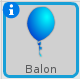
	W sekcji 'styl obrotu', kliknij na kropkę, aby zapobiec obrotom balona.

	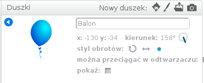

+ Przetestuj swój program ponownie aby sprawdzić, czy problem został rozwiązany.

## Zapisz swój projekt { .save }

# Krok 2: Losowe balony { .activity }

## Zadania do wykonania { .check }

+ Obecnie Twoj balon będzie zawsze startował w tej samej pozycji i poruszał się tą samą ściezką. Kliknij na zieloną flagę kilka razy, a przekonasz się, że gra przebiega zawsze w ten sam sposób.

+ Zamiast używać tych samych wartości dla pozycji startowych x i y, pozwólmy Scratchowi wybrać losowe liczby. Zmień kod duszka-balona, tak aby wyglądał w ten sposób:

	```blocks
		kiedy kliknięto zieloną flagę
		idź do x:(losuj od (-150) do (150)) y:(losuj od (-150) do (150))
		ustaw kierunek na (45 v)
		zawsze
			move (1) Kroks
			jeżeli na brzegu, odbij się
		koniec
	```

+ Jeśli klikniesz na zieloną flagę kilka razy, powinieneś zauważyć, że balon startuje z różnych miejsc.

+ Możesz także użyć losowych liczb aby zmienić kolog balona:

	```blocks
		zmień efekt [colour v] o (losuj od (0) do (200))
	```

	

	Co się stanie, jeśli umieścisz kod na początku programu? Czy zadzieje się tak samo, jeżeli umieścisz kod wewnątrz pętli `zawsze` {.blockcontrol}? Które rozwiązanie wolisz?

## Zapisz swój projekt { .save }

## Wyzwanie: Więcej losowości {.challenge}
Czy potrafisz sprawić, aby Twój balon rozpoczynał lot w losowo wybranym kierunku (pomiędzy -90 a 180 stopni)?

## Zapisz swój projekt { .save }

# Krok 3: Przebijanie balonów { .activity }

Pozwólmy graczom przebijać balony!

## Zadania do wykonania { .check }

+ Kliknij na duszka-balona, przejdź do zakładki "Kostium". Możesz usunąć wszystkie inne kostiumy, zostaw tylko pierwszy z nich. Dodaj onowy kostium klikając na "Narysuj nowy kostoium" i utwórz kostium o nazwie 'rozerwany'.

	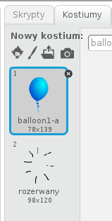

+ Upewnij się, że balon zmienia kostium na domyślny, kiedy gra się rozpoczyna. Twój kod powinien wyglądać w ten sposób:

	```blocks
		kiedy kliknięto zieloną flagę
		zmień kostium na [balloon1-a v]
		ustaw kierunek na (losuj od (-90) do (180))
		idź do x:(losuj od (-150) do (150)) y:(losuj od (-150) do (150))
		zmień efekt [kolor v] o (losuj od (0) do (200))
		zawsze
			move (1) Kroks
			jeżeli na brzegu, odbij się
		koniec
	```

+ Aby pozwolić graczom przebć balon, dodaj ten kod:

	```blocks
		kiedy duszek kliknięty
		zmień kostium na [rozerwany v]
		zagraj dźwięk [pop v]
	```

+ Przetestuj swój projekt. Czy potrafisz przebić balon? Czy działa to tak, jak tego oczekiwałeś? Będziesz musiał poprawić kod, aby po kliknięciu na balon, wyświetlił się kostium 'rozerwany', a następnie, po krótkiej chwili, balon zniknął. Możesz to zrobić zmieniając blok `kiedy duszek kliknięty` {.blockcontrol} w taki sposób:

	```blocks
		kiedy duszek kliknięty
		zmień kostium na [burst v]
		zagraj dźwięk [pop v]
		czekaj (0.3) s
		ukryj
	```

+ Teraz, kiedy już usuwasz balon, gdy został kliknięty, musisz dodać także blok `pokaż` {.blocklooks} na początku kodu `kiedy kliknięto zieloną flagę` {.blockevents}.

+ Spróbuj przebić balon ponownie żeby sprawdzić, czy wszystko działa jak należy. Jeśli ciężko Ci przebić balon nie przesuwając go po scenie, spróbuj zagrać w trybie pełnoekranowym. Aby go włączyć, kliknij na przycisk:

	

## Zapisz swój projekt { .save }

# Krok 4: Dodawanie punktacji { .activity .new-page }

Dodajmy punktację, aby uczynić grę bardziej emocjonującą.

## Zadania do wykonania { .check }

+ Będziemy potrzebowali czegoś do trzymania punktacji gracza. _Zmienna_ to dobre miejsce do trzymania danych, które mogą się zmienić, takich jak punktacja.

	Aby utworzyć zmienną, kliknij na zakładkę 'Skrypty' i wybierz `Dane` {.blockdata}, a nastepnie kliknij na 'Utwórz zmienną'.

	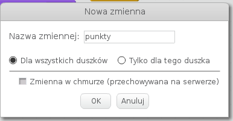

	Wpisz 'punkty' jako nazwę zmiennej, upewnij się, że jest dostępna dla wszystkich duszków i kliknij 'OK'. Teraz pojawi się wiele nowych bloków, dzięki którym będziesz mógł użyć swojej zmiennej `punkty` {.blockdata}.

	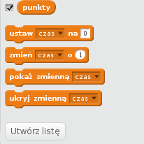

	Powinieneś takż zobaczyć punkty w lewym górnym rogu sceny.

	

+ Kiedy nowa gra się zacznie (po kliknięciu na flagę), powinieneś ustawić `punkty` na 0. Dodaj taki kod na górę skryptu duszka-balona po bloku `kiedy kliknięto zieloną flagę` {.blockevents}:

	```blocks
	ustaw [punkty v] na [0]
	```

+ Musisz dodać 1 punkt zawsze, kiedy balon zostanie przebity:

	```blocks
		kiedy duszek kliknięty
		zmień kostium na [rozerwany v]
		zagraj dźwięk [pop v]
		czekaj (0.3) s
		zmień [punkty v] o (1)
		ukryj
	```

+ Uruchom swój program ponownie i kliknij na balon. Czy punkty uległy zmianie?

## Zapisz swój projekt { .save }

# Krok 5: Więcej balonów { .activity }

Przebijanie jednego balona to nie jest zbyt zajmująca gra, dodajmy więcej balonów!

Prostym sposobem na dodanie wielu balonóœ jest kliknięciu prawym przyciskiem na duszku-balonie i wybranie opcji 'Duplikuj'. Takie podejście jest OK, jeśli chcesz dodać tylko kilka nowych duszków, ale co zrobić jeśli ma ich być 20 lub 100? Czy chciałbyś duplikować duszka tyle razy?

## Zadania do wykonania { .check }

+ Dużo lepszym sposobem jest _konowanie_ duszka-balona.

	Przeciągnij część skryptu znajdującego się po `kiedy kliknięto zieloną flagę` {.blockevents} (za wyjątkiem kodu dotyczącego punktacji) kawałek dalej (nie usuwaj go), a zamiast niego dodaj kod tworzący 20 klonów duszka.

	Teraz możesz spowrotem przyczepić kod, który przed chwilą odciągnąłeś na bok do bloku `kiedy zaczynam jako klon` {.blockevents}. Powinieneś także zastąpić `ukryj` {.blocklooks} w skrypcie odpowiedzialnym za ukrywanie balona po kliknięciu blokiem `usuń tego klona` {.blockcontrol}.

	Kod dla balona powinien wyglądać obecnie następująco:

	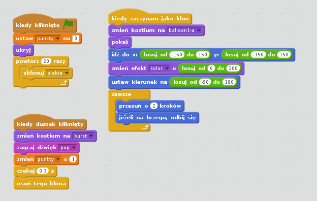

+ Przetestuj swóə projekt! Teraz, kiedy zielona flaga zostanie kliknięta, głowny duszek zostanie ukryty i sklonowany 20 razy. Kiedy każdy z klonów zostanie dodany do gry, będzie latał po scenie losowo, tak jak robił to duszek. Sprawdź, czy możesz przebić 20 blonów.

## Zapisz swój projekt { .save }

# Krok 6: Dodawanie sekundnika { .activity }

Możesz sprawić, że gra będzie bardziej interesująca poprzez dodanie ograniczenia 10 sekund na przebicie wszystkich balonów.

## Zadania do wykonania { .check }

+ Możesz użyć kolejnej zmiennej do trzymania informacji o czasie, jaki pozostał graczom. Kliknij na scenę a następnie utwórz nową zmienną o nazwie 'czas':

	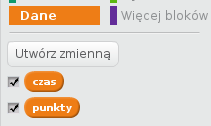

+ Oto jak powinien działać sekundnik:

	+ Czas powinien być ustawiony początkowo na 10 sekund.
	+ Co sekundę powinieneś odejmować 1 od pozostałego czasu.
	+ Gra powinna się zatrzymać, kiedy sekundnik osiągnie 0.

	
	Oto kod, który Ci to umożliwi, musisz go dodać do _sceny_:

	```blocks
		kiedy kliknięto zieloną flagę
		ustaw [czas v] na [10]
		powtarzaj aż <(czas) = [0]>
			czekaj (1) s
			zmień [czas v] o (-1)
		koniec
		zatrzymaj [wszystko v]
	```

	Aby dodać blok `powtarzaj aż`{.blockcontrol}`czas`{.blockdata}`= 0`{.blockoperators}, musisz najpierw przenieś zielony blok `=` {.blockoperators} na blok `powtarzaj aż` {.blockcontrol}:

	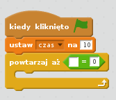

	Wtedy będziesz mógł przesunąć zmienną `czas`{.blockdata} na blok `=` {.blockoperators}:

	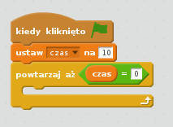

+ Przenieś zmienną `czas` w prawy górny róg sceny. Możesz także kliknąć na zmienną prawym przyciskiem myszy i wybrać sposób wyświetlania `duży odczyt`, aby zmienić sposób, w jaki zmienna będzie prezentowana:

	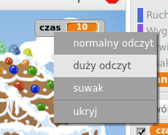

+ Przetestuj swoją grę. Jak wiele punktów potrafisz zdobyć? Jeśli gra jest zbyt łatwa, możesz:

	+ Dać graczom mniej czasu.
	+ Dodać więcej balonów.
	+ Sprawić, aby balony poruszały się szybciej.
	+ Zmniejszyć balony.

	Przetestuj grę kilka razy, aż uznasz, że jest poziom trudności jest odpowiedni.

## Zapisz swój projekt { .save }

## Challenge: Więcej obiektów {.challenge}
Czy potrafisz dodać inne obiekty do gry? Możesz dodać obiekty, dzięki którym zdobędziesz wiele punktów, jak pączki, albo takie, jak nietoperze, przez które będziesz tracił punkty po kliknięciu.

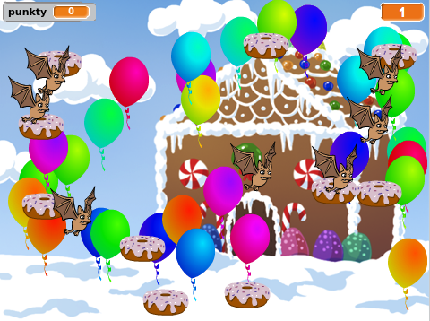

Będziesz musiał przemyśleć kilka kwestii dotyczących obiektów, które dodasz. Np.:

+ Ile powinno ich być?
+ Jak duże powinny być? Jak powinny się poruszać?
+ Ile punktów stracisz lub zyskasz po kliknięciu na nowe obiekty?
+ Czy będa poruszać się szybciej czy wolniej niż balony?
+ Jak będą wyglądać i brzemić, kiedy zostaną kliknięte?

Jeśli potrzebujesz pomocy przy dodawaniu kolejnych obiektów, możesz skorzystać z wcześniejszych instrukcji.

## Zapisz swój projekt { .save }
