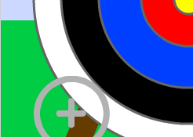
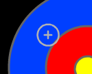
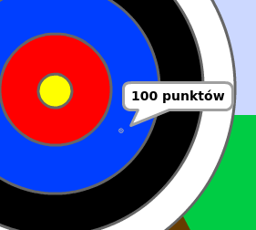

---
title: Łucznik
level: Scratch +
language: pl-PL
stylesheet: scratch
embeds: "*.png"
materials: ["Zasoby do Projektu/*", "Zasoby Lidera Klubu/*"]
...

# Wprowadzenie { .intro }

Dzisiaj nauczysz się jak stworzyć grę, w której będziesz musiał trafić strzałą jak najbliżej środka tarczy.

<div class="scratch-preview">
  <iframe allowtransparency="true" width="485" height="402" src="https://scratch.mit.edu/projects/embed/114760038/?autostart=false" frameborder="0"></iframe>
  
</div>

# Krok 1: Celowanie strzałami { .activity }

Zacznijmy od dodania strzały, która porusza się po planszy.

## Zadania do wykonania { .check }

+ Otwórz projekt "Łucznik". Lider Twojego Klubu Kodowania dostarczy Ci kopię tego projektu, albo możesz ją znaleźć online pod adresem <a href="http://jumpto.cc/archery-resources" target="_blank">jumpto.cc/archery-resources</a>.

+ Kiedy gra się rozpocznie, nadaj komunikat, aby wystrzelić nową strzałę.

	````blocks
		kiedy kliknięto zieloną flagę
		nadaj [nowa strzała v]
	````

+ Gdy wiadomość zostanie odebrana, ustaw pozycję i rozmiar strzały.

	````blocks
		kiedy otrzymam [nowa strzała v]
		idź do x:(-150) y:(-150)
		ustaw rozmiar na (400)%
	````

+ Kliknij na zieloną flagę i przetestuj swoją grę. Powinieneś widzieć jak strzała powiększa się i porusza w kierunku lewego dolnego rogu sceny.

	

+ Dodaj kod do strzały, dzięki któremu będzie mogła `zawsze` {.blockcontrol} poruszać się losowo po scenie. 

	````blocks
		kiedy otrzymam [nowa strzała v]
		idź do x:(-150) y:(-150)
		ustaw rozmiar na (400)%
		zawsze
			leć przez (0.5)s do x:(losuj od (-150) do (150)) y:(losuj od (-150) do (150)
	````

+ Przetestuj swoją grę ponownie, zauważ, że strzała porusza się losowo po scenie.

	

## Zapisz swój projekt { .save }

# Krok 2: Wystrzelenie strzały { .activity }

Dodajmy kod, który sprawi, że strzała zostanie wystrzelona po naciśnięciu spacji.

## Zadania do wykonania { .check }

+ Zatrzymaj inne skrypty (te, które poruszają strzałą), kiedy spacja zostanie naciśnięta.

	````blocks
		kiedy klawisz [spacja v] naciśnięty
		zatrzymaj [inne skrypty duszka v]
	````

+ Przetestuj swój projekt. Tym razem strzała powinna przestać się pruszać __kiedy klawisz spacji zostanie wciśnięty__.

+ Zanimuj swoją strzałę, żeby wyglądała jakby poruszała się w kierunku celu.

	```blocks
		kiedy klawisz [spacja v] naciśnięty
		zatrzymaj [inne skrypty duszka v]
		powtórz (50) razy
			zmień rozmiar o (-10)
		koniec
	```

+ Przetestuj swoją grę jeszcze raz. Tym razem, kiedy wciśniesz klawisz spacji, strzała powinna zacząć się zmniejszać poruszając się w kierunku celu.

	

+ Kiedy strzała osiągnie cel, możesz powiedzieć graczom ile punktów zdobyli. Na przykład, mogą zdobyć 200 punktów za trafienie w kolor żółty.

	````blocks
		kiedy klawisz [spacja v] naciśnięty
		zatrzymaj [inne skrypty duszka v]
		powtórz (50) razy
  			zmień rozmiar o (-10)
		koniec
		jeżeli <dotyka koloru [#ffff00]>to
  			powiedz [200 punktów] przez [2] s
		koniec
	````

+ Możesz również odegrać odpowiedni dźwięk, kiedy kolor żółty zostanie trafiony.

	````blocks
		kiedy klawisz [spacja v] naciśnięty
		zatrzymaj [inne skrypty duszka v]
		powtórz (50) razy
  			zmień rozmiar o (-10)
		koniec
		jeżeli <dotyka koloru [#ffff00]>to
  			zagraj dźwięk [cheer v]
  			powiedz [200 punktów] przez [2] s
		koniec
	````

+ Na koniec musisz nadać komunikat `nowa strzała` {.blockevents} ponownie, aby móc grać dalej.

	````blocks
		kiedy klawisz [spacja v] naciśnięty
		zatrzymaj [inne skrypty duszka v]
		powtórz (50) razy
  			zmień rozmiar o (-10)
		koniec
		jeżeli <dotyka koloru [#ffff00]>to
  			zagraj dźwięk [cheer v]
  			powiedz [200 punktów] przez [2] s
		koniec
		nadaj [nowa strzała v]
	````

## Zapisz swój projekt { .save }

##Wyzwanie: Różna punktacja {.challenge}
Czy potrafisz dodać do gry kod, dzięki któremu będziesz otrzymywał różną ilość punktów za trafienie w różne fragmenty tarczy?



## Zapisz swój projekt { .save }