---
title: Kapela rockowa
level: Scratch 1
language: pl-PL
stylesheet: scratch
embeds: "*.png"
materials: ["Zasoby Lidera Klubu/*.*"]
...

# Wstęp { .intro }

Wykonując ten projekt nauczysz się jak zaprogramować własne instrumenty muzyczne!

<div class="scratch-preview">
  <iframe allowtransparency="true" width="485" height="402" src="http://scratch.mit.edu/projects/embed/26741186/?autostart=false" frameborder="0"></iframe>
  
</div>

# Krok 1: Duszki { .activity }

Zanim rozpoczniesz przygotowywać animację, musisz dodać "rzecz", którą można poruszać. Takie "rzeczy" w Scratchu nazywamy __duszkami__.

## Zadania do wykonania { .check }

+ Na początek otwórz Scratcha. Jest on dostępny w sieci pod adresem <a href="http://jumpto.cc/scratch-new">jumpto.cc/scratch-new</a>. Wygląda mniej więcej tak:

	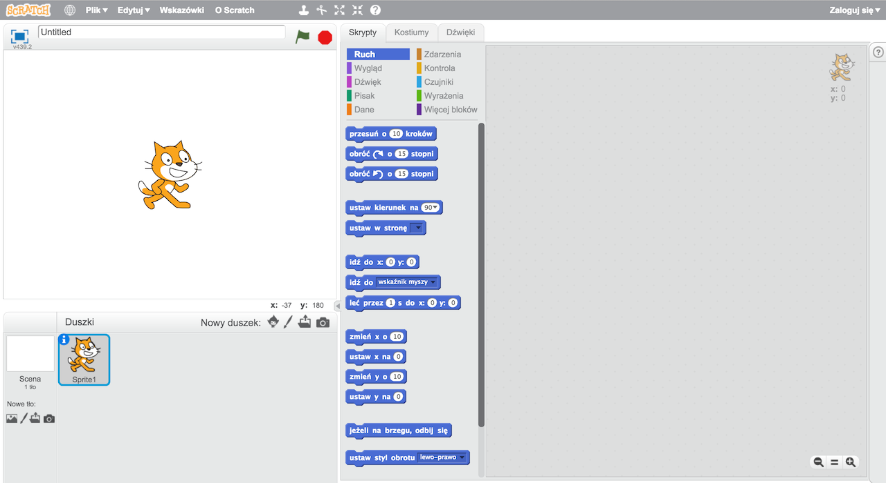

+ Kot, którego widzisz jest maskotką Scratcha. Pozbądź się go klikając na nim prawym przyciskiem myszy a następnie wybierając 'usuń'.

	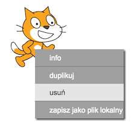

+ Następnie kliknij "Wybierz duszka z biblioteki", aby otworzyć listę wszystkich dostępnych w Scratchu duszków.

	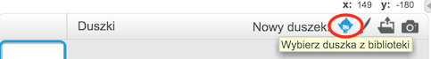

+ Zjedź na dół do duszka przedstawiającego bębenek (ang. drum). Kliknij na nim, a następnie na "OK", aby dodać go do swojego projektu.

	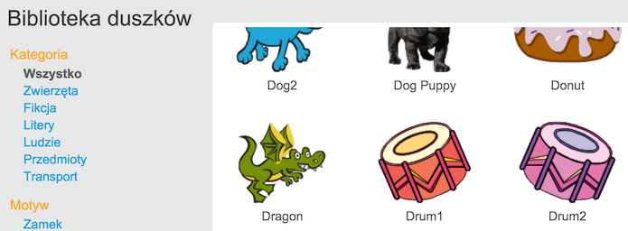

+ Kliknij na ikonie "Zmniejsz", a następnie kilkukrotnie na bębenku aby go pomniejszyć.

	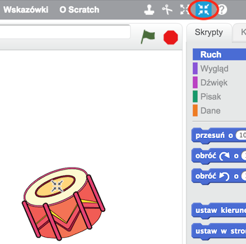

## Zapisz swój projekt { .save }

Nadaj swojemu projektowi nazwę wpisując ją w pole tekstowe w lewym górnym narożniku.

Teraz możesz kliknąć w menu "Plik" a następnie w "Zapisz teraz", aby zapisać swój projekt.

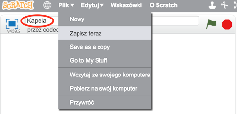

# Krok 2: Scena { .activity }

__Scena__, to obszar po lewej stronie. Jest to miejsce, w którym Twój projekt ożywa. Możesz o tym myśleć jak o scenie, na której wystawiane są przedstawienia!

## Zadania do wykonania { .check }

+ Póki co scena jest biała, więc jest dość nudna! Dodaj do niej tło klikając "Wybierz tło z biblioteki".

	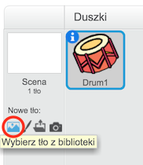

+ Wybierz z lewej strony kategorię "W pomieszczeniu", kliknij na kurtynę, a następnie wybierz "OK".

	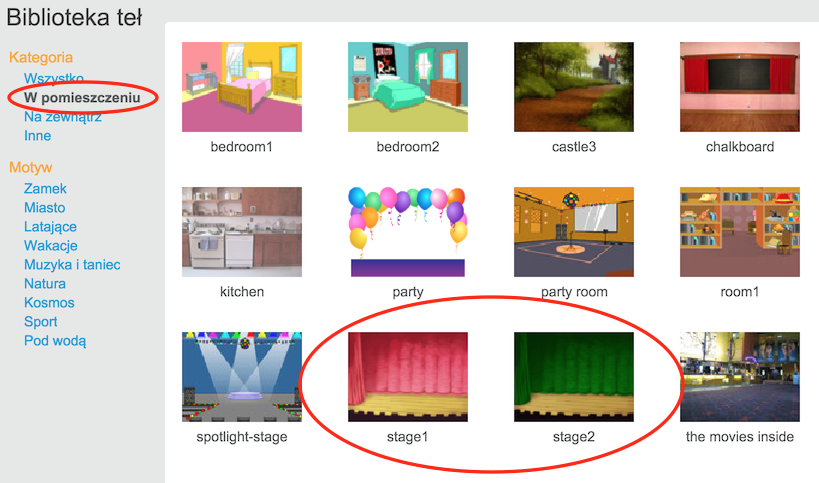

+ Twoja scena powinna wyglądać tak:

	

# Krok 3: Przygotuj bębenek { .activity }

Zaprogramuj swój bębenek aby wydawał dźwięk, kiedy zostanie uderzony.

## Zadania do wykonania { .check }

+ Bloki kodu możesz odnaleźć w zakładce "Skrypty", zwróć uwagę na ich kolory.

	Kliknij na duszku bębenku, a następnie przeciągnij te dwa bloki w obszar skryptów po prawej stronie. Upewnij się, że oba bloki są ze sobą połączone (jak klocki Lego).

	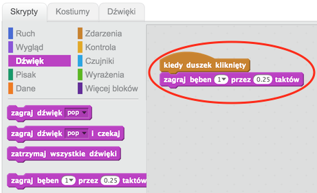

+ Kliknij na bębenku, aby wypróbować swój nowy instrument!

+ Możesz również zmienić to, jak wygląda bębenek, gdy na niego klikasz. Aby to zrobić dodaj do niego nowy kostium. Kliknij na zakładkę "Kostiumy", a zobaczysz obrazek bębenka.

	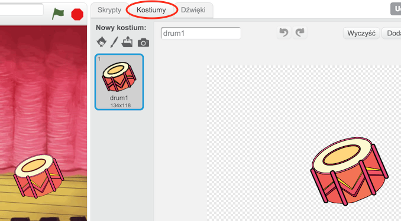

+ Kliknij na jego miniaturce prawym przyciskiem myszy, a następnie wybierz "duplikuj", aby utworzyć kopię kostiumu.

	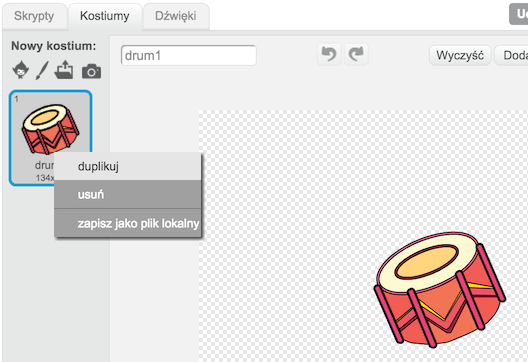

+ Kliknij na nowym kostiumie, który właśnie utworzyłeś (będzie się nazywał np. "drum2"). Następnie wybierz narzędzie "Linia" i narysuj linie, aby wyglądały tak, jakby bębenek wydawał dźwięk.

	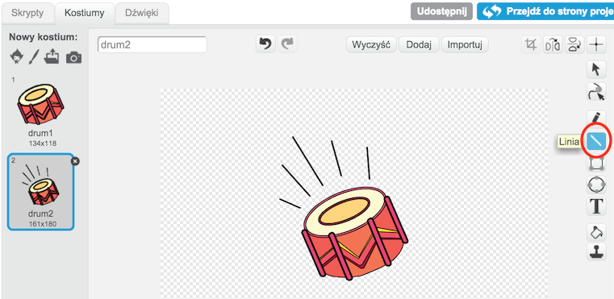

+ Nazwy kostiumów nie są na razie zbyt pomocne. Nadaj im nowe nazwy: "nieuderzony" i "uderzony" wpisując nową nazwę w pole tekstowe u góry dla każdego z kostiumów.

	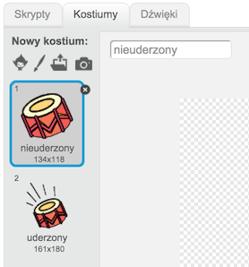

+ Teraz, kiedy masz dwa różne kostiumy dla swojego bębenka, możesz wybrać, który kostium ma się wyświetlać! Dodaj te dwa nowe bloki kodu do swojego duszka:

	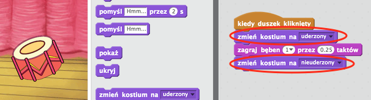

	Bloki zmieniające kostiumy duszków znajdują się w grupie `Wygląd` {.blocklooks}.

+ Przetestuj swój bębenek. Kiedy klikasz, powinien wyglądać jakbyś w niego uderzył!

## Zapisz swój projekt { .save }

## Wyzwanie: Udoskonal swój bębenek { .challenge }

+ Czy możesz zmienić dźwięk, który wydaje bębenek po kliknięciu?

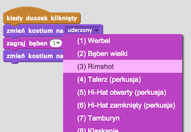

+ Czy możesz sprawić, aby bębenek wydawał dźwięk również po naciśnięciu spacji? Będziesz do tego potrzebował tego bloku z grupy `Zdarzenia` {.blockevents}:

```blocks
	kiedy klawisz [spacja v] naciśnięty
```

Możesz skopiować swój istniejący kod klikając na niego prawym przyciskiem myszy i wybranie "duplikuj".

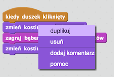

## Zapisz swój projekt { .save }

# Krok 4: Przygotuj solistkę { .activity .new-page }

Dodaj do swojej kapeli solistkę!

## Zadania do wykonania { .check }

+ Dodaj kolejne dwa duszki do swojej sceny: solistkę i jej mikrofon.

	

+ Zanim będziesz mógł sprawić, żeby solistka zaśpiewała, musisz dodać dźwięk do duszka. Upewnij się, że wybrałeś solistkę, a następnie kliknij na zakładkę "Dźwięki" i na "Wybierz dźwięk z biblioteki":

	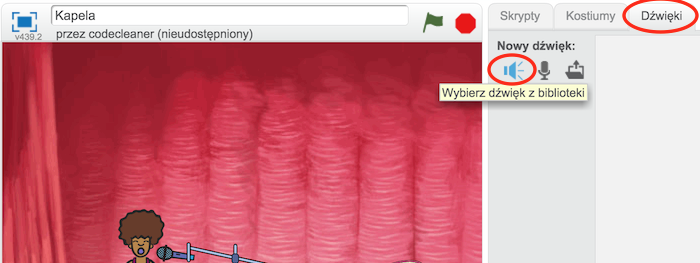

+ Jeśli klikniesz na kategorię "Wokal" po lewej stronie, będziesz mógł wybrać odpowiedni dźwięk do dodania do swojego duszka.

	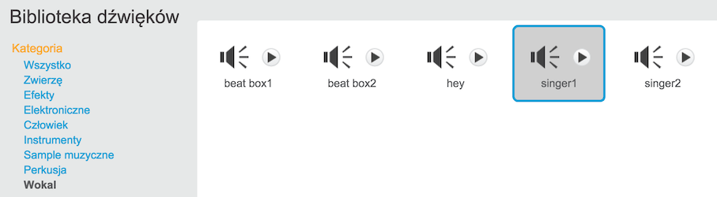

+ Teraz, kiedy dodałeś wybrany dźwięk, możesz dodać ten kod do swojej solistki:

	```blocks
		kiedy duszek kliknięty
        zagraj dźwięk [singer1 v] i czekaj
	```

+ Kliknij na swoją solistkę, aby upewnić się, że zaśpiewa.

## Zapisz swój projekt { .save }

## Wyzwanie: Zmiana kostiumu solistki { .challenge }
Czy możesz sprawić, aby solistka wyglądała tak, jakby śpiewała kiedy na nią klikniesz? Jeśli potrzebujesz pomocy, możesz wykorzystać wcześniejszą instrukcję tworzenia kostiumu dla bębenka.


Pamiętaj, aby sprawdzić, czy Twój nowy kod działa!

## Zapisz swój projekt { .save }

## Wyzwanie: Stwórz swoją własną kapelę { .challenge }
Wykorzystaj to, czego się dzisiaj nauczyłeś, aby zrobić swoją własną kapelę!
Możesz stworzyć dowolny instrument jaki chcesz - zajrzyj jakie są dostępne dźwięki i instrumenty w bibliotece, jeśli potrzebujesz pomysłu.

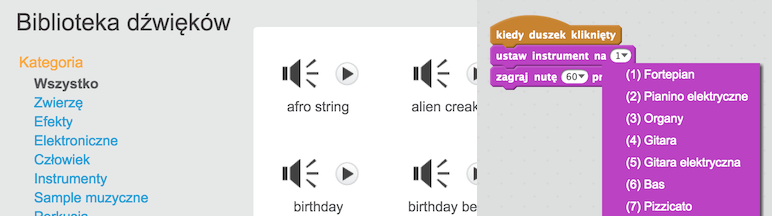

Twój instrument nie musi być sensowny. Na przykład, możesz stworzyć fortepian zrobiony z babeczek!


Możesz wykorzystać zarówno istniejące w bibliotece duszki, jak i narysować swój własny.

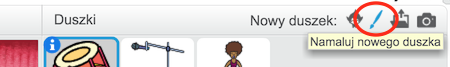

Jeśli dysponujesz mikrofonem możesz też nagrać własny dźwięk, a nawet wykorzystać kamerę internetową do uderzania w swoje instrumenty!

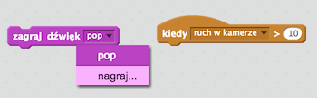

## Zapisz swój projekt { .save }
