---
title: Kolorowe kredki
level: Scratch 1
language: pl-PL
stylesheet: scratch
embeds: "*.png"
materials: ["Zasoby Lidera Klubu/*.*","Zasoby do Projektu/*.*"]
...

# Wstęp { .intro }

W ramach tego projektu przygotujesz swój własny program do rysowania! 

<div class="scratch-preview">
  <iframe allowtransparency="true" width="485" height="402" src="http://scratch.mit.edu/projects/embed/63473366/?autostart=false" frameborder="0"></iframe>
  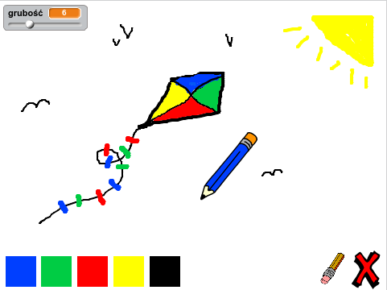
</div>

# Krok 1: Przygotowywanie kredki { .activity }

Rozpocznijmy od przygotowania kredki, którą będzie można rysować po scenie.

## Zadania do wykonania { .check }

+ Rozpocznij nowy projekt Scratch, usuń duszka-kota, tak, aby Twój projekt był pusty. Edytor Scratch online możesz znaleźć tutaj: <a href="http://jumpto.cc/scratch-new">jumpto.cc/scratch-new</a>.

+ Dodaj nowy duszek-kredkę do swojego projektu.

	 

+ Kliknij na zakładkę "Kostiumy" i usuń kostium "pencil-b".

	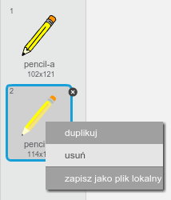 

+ Zmień nazwę kostiumu na 'kredka-niebieska', a następnie użyj narzędzia "Wypełnij kształt" aby pokolorować kredkę na niebiesko. 

	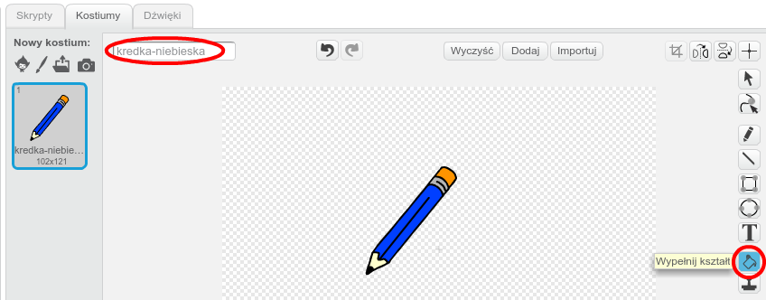 

+ Ponieważ będziesz rysował za pomocą myszki, będziesz chciał, aby kredka podążała `zawsze` {.blockcontrol} za kursorem myszki. Dodaj poniższy kod do swojego duszka:

	```blocks
		kiedy kliknięto zieloną flagę
        zawsze
           idź do [wskaźnik myszy v]
        koniec
	```

+ Przetestuj swój kod klikając na zieloną flagę a następnie poruszając myszą nad sceną. Czy zachowuje się tak, jak się tego spodziewałeś?

+ Czy zauważyłeś, że za kursorem myszy porusza się środek kredki, a nie jej rysik?

	

	Aby to poprawić, kliknij na kostiumie "kredka-niebieska" swojego duszka, a następnie wybierz przycisk "Ustaw środek kostiumu".

	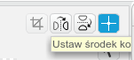

+ Powinieneś zauważyć, że nad kostiumem pojawiły się dwie krzyżujące się linie. Możesz teraz kliknąć tuż pod rysikiem kredki, aby ustawić w tym punkcie środek kostiumu.

	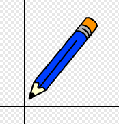

+ Kliknij na zakładkę "Skrypty", a następnie przetestuj swoją kredkę jeszcze raz - czy teraz działa lepiej niż poprzednio?

+ Następnie, sprawmy aby kredka rysowała `jeżeli` {.blockcontrol} wciśnięty jest przycisk myszy. Dodaj poniższy kod do swojego duszka:

	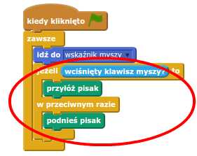	

+ Jeszcze raz przetestuj swój kod. Tym razem ruszaj kredką nas sceną trzymając wciśnięty przycisk myszy. Czy Twoja kredka rysuje?

	

## Zapisz swój projekt { .save }

# Krok 2: Kolorowe kredki { .activity }

Dodajmy inne kolory kredek i pozwólmy użytkownikowi wybierać spośród nich!

## Zadania do wykonania { .check }

+ Kliknij na duszku-kredce, a następnie na zakładce "Kostiumy" i zduplikuj kostium "kredka-niebieska".

	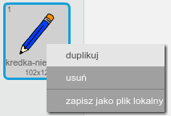

+ Zmień nazwę nowego kostiumu na "kredka-zielona" i zmień kolor kredki na zielony.

	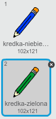

+ Utwórz dwa nowe duszki, których będziesz używał do wybierania pomiędzy niebieską a zieloną kredką.

	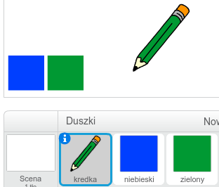

+ Kiedy zielona ikona zostanie kliknięta, musisz `nadać` {.blockevents} komunikat do kredki mówiący jej, aby zmieniła kolor swojego kostiumu na zielony.

	Aby to zrobić, najpierw dodaj poniższy kod do zielonej ikony wyboru:

	```blocks
		kiedy duszek kliknięty
        nadaj [zielony v]
	```

	Aby utworzyć komunikat dla bloku `nadaj` {.blockevents}, kliknij w nim na strzałkę w dół i wybierz opcję 'nowy komunikat...'.

	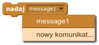

	Wówczas możesz wpisać "zielony" i nacisnąć przycisk OK aby utowrzyć swój komunikat.

	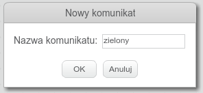

+ Teraz musisz powiedzieć swojej kredce, co ma zrobić, kiedy otrzyma komunikat. Dodaj poniższy kod do swojej kredki:

	```blocks
		kiedy otrzymam [zielony v]
        zmień kostium na [kredka-zielona v]
        ustaw kolor pisaka na [#00ff00]
	```

	Aby kredka kolorowała na zielono, kliknij na kolorowy kwadracik w bloku `ustaw kolor pisaka na` {.blockpen}, i kliknij na zielonej ikonie wyboru aby wybrać zielony jako kolor Twojej kredki.

+ Teraz możesz zrobić to samo ze swoją niebieską ikoną wyboru, dodając poniższy kod do tej ikony:

	```blocks
		kiedy duszek kliknięty
        nadaj [niebieski v]
	```

	...i ten kod do duszka-kredki:

	```blocks
		kiedy otrzymam [niebieski v]
        zmień kostium na [kredka-niebieska v]
        ustaw kolor pisaka na [#0000ff]
	```

+ Na końcu, musisz powiedzieć swojemu duszkowi-kredce który kostium i kolor ma wybrać oraz żeby scena się wyczyściła kiedy uruchamiasz swój projekt. Dodaj poniższy kod na początek skryptu `kiedy kliknięto zieloną flagę` {.blockevents} Twojej kredki (przed pętlą `zawsze` {.blockcontrol}):

	```blocks
		wyczyść
        zmień kostium na [kredka-niebieska v]
        ustaw kolor pisaka na [#0000ff]
	```

	Jeśli wolisz, możesz ustawić przy uruchamianiu projektu inny kolor kredki!

+ Przetestuj swój projekt. Czy możesz przełączać się pomiędszy zielonym i niebieskim kolorem?

	

## Zapisz swój projekt { .save }

# Krok 3: Robienie błędów { .activity .new-page }

Czasami błędy się zdarzają, więc dodajmy ikonę do czyszczenia sceny oraz gumkę do mazania!

## Zadania do wykonania { .check }

+ Dodajmy ikonę do czyszczenia sceny. Aby to zrobić, dodaj duszka-literkę X i pokoloruj go na czerwono.

	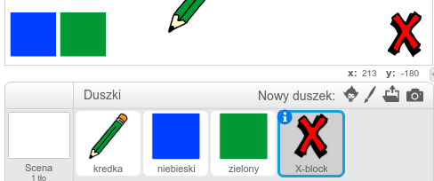

+ Dodaj poniższy kod czyszczący scenę do nowego duszka: 

	```blocks
		kiedy duszek kliknięty
        wyczyść
	```

	Zauważ, że nie musisz nadawać komunikatu aby wyczyścić scenę, ponieważ może to zrobić każdy duszek.

+ Możesz również utworzyć gumkę do mazania. Jeśli lider Twojego klubu przekazał Ci folder "Zasoby do Projektu", kliknij na przycisk "Wczytaj kostium z pliku" i dodaj obrazek "eraser.svg".

	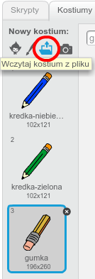
	
	Jeśli nie masz pliku "eraser.svg", po prostu utwórz nową, biała kredkę!

+ Powinieneś także dodać ikonę gumki aby móc ją wybrać zamiast kredki. Tak powinna wyglądać Twoja scena:

	

+ Teraz powinieneś dodać skrypt do swojej ikony z gumką do mazania, aby powiedzieć kredce, że ma zamienić się w gumkę.

	```blocks
		kiedy duszek kliknięty
        nadaj [gumka v]
	```

+ Kiedy kredka otrzyma ten komunikat, możesz wyświetlić gumkę zmieniając kostium kredki na gumkę oraz zmieniając kolor pisaka na ten sam kolor, który ma scena!

	```blocks
		kiedy otrzymam [gumka v]
        zmień kostium na [gumka v]
        ustaw kolor pisaka na [#FFFFFF]
	```

+ Prztestuj swój projekt, aby sprawdzić czy możesz mazać oraz czyścić całkowicie swoją scenę.

	

+ Jest jeszcze jeden problem z kredką - możesz nią rysować w dowolnym miejscu sceny - również przy ikonach wyboru koloru i mazania!

	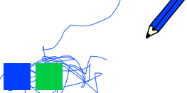

	Aby to naprawić, musisz powiedzieć swojej kredce, aby rysowała tylko wtedy, gdy jest wciśnięty przycisk myszy _oraz_ pozycja kursora jest powyżej -110 (`y myszy`{.blocksensing}`> -120` {.blockoperators}). Zmień dla swojej kredki warunek `jeżeli` {.blockcontrol} aby wyglądał tak:

	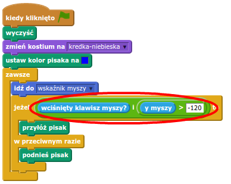

+ Przetestuj swój projekt; teraz nie powinieneś móc rysować w pobliżu ikon wyboru koloru oraz mazania.

	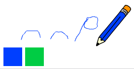

## Zapisz swój projekt { .save }

# Krok 4: Zmienianie grubości kredki { .activity .new-page }

Pozwólmy użytkownikowi rysować używając kredek o różnej grubości.

## Zadania do wykonania { .check }

+ Najpierw dodaj zmienną o nazwie "grubość".

+ Dodaj poniższy blok kodu _wewnątrz_ pętli `zawsze` {.blockcontrol} Twojej kredki:

	```blocks
		ustaw rozmiar pisaka na (grubość)
	```

	Grubość Twojej kredki będzie teraz regularnie ustawiać się na wartość Twojej zmiennej "grubość".

+ Możesz zmienić wartość tej zmiennej klikając prawym przyciskiem myszy na nazwie zmiennej (na scenie) i wybierająć "suwak".

	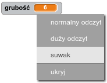

	Możesz teraz przesuwać suwak pod nazwą zmiennej aby zmieniać jej wartość.

	

+ Przetestuj swój projekt i zobaczy, czy działa zmienianie grubości kredki.

	

	Jeśli wolisz, możesz ustawić minimalną i maksymalną dopuszczalną wartość zmiennej "grubość". Aby to zrobić, kliknij ponownie prawym przyciskiem myszy na nazwie zmiennej a następnie wybierz opcję "ustaw min i max suwaka". Ustaw wartości minimalne i maksymalne na coś bardziej sensownego, na przykład 1 i 20.

	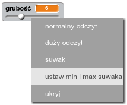

	Testuj dalej swoją zmienną "grubość" dopóki nie będziesz zadowolony.

## Zapisz swój projekt { .save }

## Wyzwanie: Skróty { .challenge }
Czy możesz utworzyć skróty dla swoich ikon wyboru? Na przykład:

+ n = przełącz na niebieską kredkę
+ z = przełącz na zieloną kredkę
+ g = przełącz na gumkę do mazania
+ w = wyczyść scenę

Możesz nawet pozwolić użytkownikowi na zmianę grubości kredki za pomocą strzałek na klawiaturze!

## Zapisz swój projekt { .save }

## Wyzwanie: Więcej kredek { .challenge }
Czy możesz dodać kredkę czerwoną, żółtą i czarną do swojego programu? Pamiętaj, aby dodać także skróty dla nowych kredek!

Czy możesz użyć swoich kredek aby narysować obrazek?


