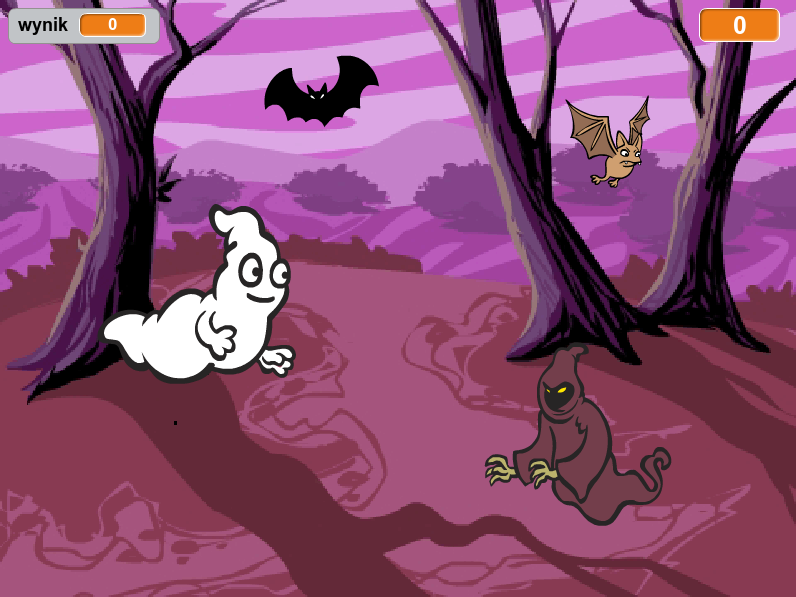
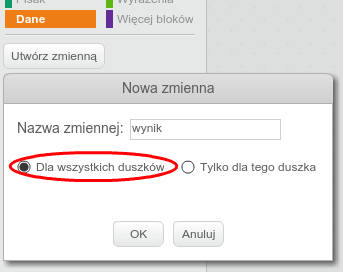
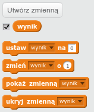
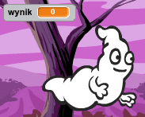
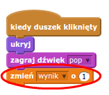
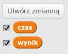
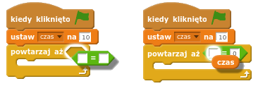
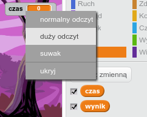

---
title: Pogromcy duchów
level: Scratch 1
language: pl-PL
stylesheet: scratch
embeds: "*.png"
materials: ["Zasoby Lidera Klubu/*.*"]
...

# Wstęp { .intro }

Dzisiaj zrobimy grę w łapanie duchów!

<div class="scratch-preview">
  <iframe allowtransparency="true" width="485" height="402" src="http://scratch.mit.edu/projects/embed/60787262/?autostart=false" frameborder="0"></iframe>
  
</div>

# Krok 1: Animacja ducha { .activity }

## Zadania do wykonania { .check }

+ Rozpocznij nowy projekt w Scratchu i usuń duszka-kota, aby Twój projekt był pusty. Edytor Scratch online znajdziesz pod adresem <a href="http://jumpto.cc/scratch-new">jumpto.cc/scratch-new</a>.

+ Dodaj nowego duszka przedstawiającego ducha oraz ustaw odpowiednie tło sceny.

	

+ Dodaj poniższy kod do ducha, aby na zmianę pojawiał się i znikał:

	```blocks
		kiedy kliknięto zieloną flagę
        zawsze
           ukryj
           czekaj (1) s
           pokaż
           czekaj (1) s
        koniec
	```

+ Przetestuj kod klikając na zieloną flagę.

## Zapisz swój projekt { .save }

# Krok 2: Losowy duch { .activity }

Twój duch jest bardzo prosty do złapania, ponieważ się nie porusza!

## Zadania do wykonania { .check }

+ Aby nie był cały czas w tym samym miejscu, możesz pozwolić Scratchowi wybierać losowe koordynaty x i y. Dodaj blok `idź do` {.blockmotion} do kodu Twojego ducha, aby wyglądał tak jak poniżej:

	```blocks
		kiedy kliknięto zieloną flagę
        zawsze
           ukryj
           czekaj (1) s
           idź do x:(losuj od (-150) do (150)) y:(losuj od (-150) do (150))
           pokaż
           czekaj (1) s
        koniec
	```

+ Przetestuj ponownie swojego ducha. Powinieneś zauważyć, że pojawia się za każdym razem w innym miejscu sceny.

## Zapisz swój projekt { .save }

## Wyzwanie: Więcej losowości {.challenge}
Czy możesz powiedzieć swojemu duchowi "`czekaj` {.blockcontrol} losową ilość czasu zanim się pojawisz"? Czy możesz użyć bloku `ustaw rozmiar na` {.blocklooks} aby Twój duszek miał losowy rozmiar za każdym razem, kiedy się pojawia?

## Zapisz swój projekt { .save }

# Krok 3: Łapanie duchów { .activity }

Teraz pozwólmy graczom łapać duchy!

##Zadania do wykonania { .check }

+ Aby pozwolić graczowi na łapanie duchów, dodaj poniższy kod:

	```blocks
		kiedy duszek kliknięty
        ukryj
	```

+ Przetestuj swój projekt. Czy możesz złapać ducha, kiedy się pojawi? Jeśli uznasz, że jest to trudne, możesz zagrać w trybie pełnoekranowym klikając na ten przycisk:

	

## Wyzwanie: Dodanie dźwięku { .challenge }
Czy możesz dodać dźwięk odtwarzany za każdym razem, kiedy duch zostanie złapany?

## Zapisz swój projekt { .save }

# Krok 4: Dodanie wyniku { .activity .new-page }

Sprawimy, aby gra była ciekawsza przez wyświetlanie wyniku.

## Zadania do wykonania { .check }

+ Aby zachować wynik gracza, potrzebujesz miejsca, w którym będziesz mógł go trzymać. Zmienna, to miejsce gdzie można trzymać dane, które mogą się zmieniać - tak, jak wynik.

	Aby utworzyć nową zmienną, kliknij na zakładkę "Skrypty", wybierz sekcję `Dane` {.blockdata} a następnie kliknij na przycisk "Utwórz zmienną".

	

	Wpisz "wynik" jako nazwę zmiennej i upewnij się, że jest ona dostępna dla wszystkich duszków, a następniej kliknij "OK" aby ją utworzyć. Zobaczysz wtedy mnóstwo bloków kodu, których możesz użyć ze swoją zmienną `wynik` {.blockdata}.

	

	Zobaczysz także wynik w lewym górnym narożniku sceny.

	

+ Kiedy rozpoczyna się nowa gra (poprzez kliknięcie na zieloną flagę), powinieneś ustawić wynik gracza na 0:

	```blocks
	kiedy kliknięto zieloną flagę
    ustaw [wynik v] na [0]
	```

+ Za każdym razem, kiedy duszek zostanie złapany, musisz dodać 1 do wyniku:

	

+ Uruchom swój program ponownie i złap jakiegoś ducha. Czy wynik się zmienia?

## Zapisz swój projekt { .save }

# Krok 5: Dodawanie zegara { .activity }

Możesz sprawić, aby gra była jeszcze bardziej wciągająca, dając graczowi tylko 10 sekund na złapanie tylu duchów, ile da radę.

## Zadania do wykonania { .check }

+ Możesz użyć nowej zmiennej do przechowywania pozostałego czasu. Kliknij na scenę i utwórz nową zmienną "czas":

	

+ Odliczanie czasu powinno działać w następujący sposób:

	+ Przy rozpoczęciu gry zegar powinien wyświetlać 10 sekund;
	+ Zegar powinien zmniejszać swoją wartość co sekundę;
	+ Gra powinna się zatrzymać, kiedy zegar osiągnie wartość 0.

	Poniższy kod, który powinieneś dodać do swojej __sceny__ realizuje powyższe założenia:

	```blocks
		kiedy kliknięto zieloną flagę
        ustaw [czas v] na [10]
        powtarzaj aż <(czas) = [0]>
           czekaj (1) s
           zmień [czas v] o (-1)
        koniec
        zatrzymaj [wszystko v]
	```

	W ten sposób można dodać kod `powtarzaj aż`{.blockcontrol}`czas`{.blockdata}`= 0`{.blockoperators}:

	

+ Przeciągnij wyświetlacz zmiennej "czas" na prawą stronę swojej sceny. Możesz również kliknąć prawym przyciskiem myszy na wyświetlaczu zmiennej i wybrać "duży odczyt" aby zmienić sposób wyświetlania.

	

+ Poproś kolegę aby przetestował Twoją grę. Ile punktów uda mu się zdobyć? Jeśli Twoja gra jest zbyt łatwa, możesz:

	+ Dać graczowi mniej czasu;
	+ Sprawić, aby duch pokazywał się rzadziej;
	+ Zmniejszyć ducha.

	Przetestuj swoją grę kilkukrotnie, dopóki nie będziesz zadowolony z poziomu trudności.

## Zapisz swój projekt { .save }

## Wyzwanie: Więcej obiektów {.challenge}
Czy możesz dodać więcej obiektów do swojej gry?


Będziesz musiał zastanowić się nad obiektami, które dodasz. Pomyśl o każdym z nich:

+ Jaki jest duży?
+ Czy powinien się pojawiać rzadziej czy częściej niż duch?
+ Jak zmieni się jego wygląd lub jaki dźwięk wyda, kiedy zostanie złapany?
+ Ile punktów można otrzymać (lub stracić) za jego złapanie?

Jeśli będziesz potrzebował pomocy przy dodawaniu kolejnych obiektów, zawsze możesz wykorzystać ponownie kroki z tej instrukcji!

## Zapisz swój projekt { .save }
