---
title: Robot Gaduła
level: Scratch 1
language: pl-PL
stylesheet: scratch
embeds: "*.png"
materials: ["Zasoby Lidera Klubu/*.*"]
...

# Wstęp { .intro }

Nauczysz się jak zaprogramować własnego, gadającego robota!

<div class="scratch-preview">
  <iframe allowtransparency="true" width="485" height="402" src="http://scratch.mit.edu/projects/embed/26762091/?autostart=false" frameborder="0"></iframe>
  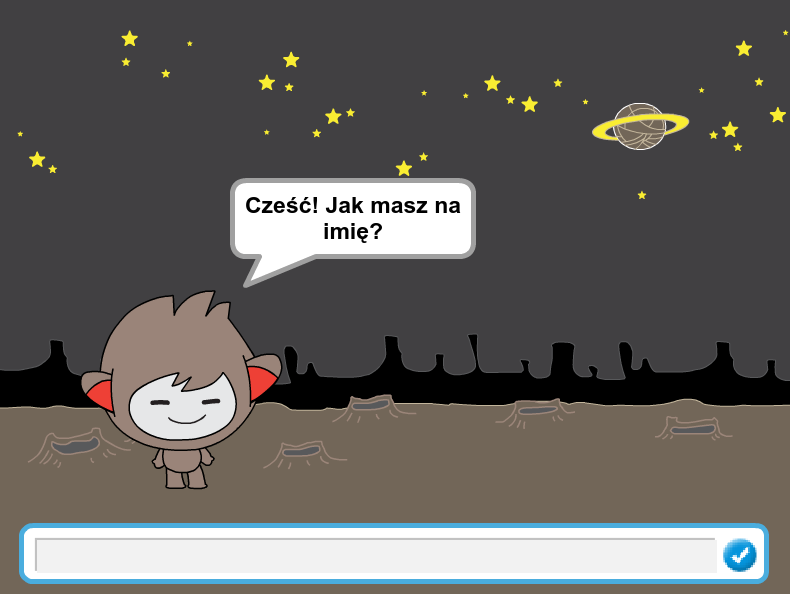
</div>

# Krok 1: Twój robot { .activity }

## Zadania do wykonania { .check }

+ Zanim zaczniesz tworzyć swojego robota musisz zdecydować jaki on będzie.
	+ Jak ma mieć na imię?
	+ Gdzie mieszka?
	+ Czy jest wesoły? poważny? zabawny? nieśmiały? przyjacielski?

+ Rozpocznij nowy projekt Scratcha i usuń duszka kota, aby projekt był pusty. Edytor Scratch online możesz znaleźć tutaj: <a href="http://jumpto.cc/scratch-new">jumpto.cc/scratch-new</a>.

+ Wybierz jednego z poniższych duszków i dodaj go do swojego projektu:

	

+ Wybierz tło pasujące do Twojego duszka. Może być takie, ale możesz wybrać inne, które Ci się spodoba:

	

## Zapisz swój projekt { .save }

# Krok 2: Gadający robot { .activity }

Teraz, kiedy znasz już cechy swojego robota, zaprogramuj go tak, aby do Ciebie mówił.

## Zadania do wykonania { .check }

+ Kliknij na swoim duszku i dodaj do niego poniższy kod:

	```blocks
		kiedy duszek kliknięty
        zapytaj [Cześć! Jak masz na imię?] i czekaj
        powiedz [Ale ładnie!] przez (2) s
	```

+ Kliknij swojego duszka aby go przetestować. Kiedy zostaniesz zapytany o imię, wpisz je do pola znajdującego się na dole sceny.

	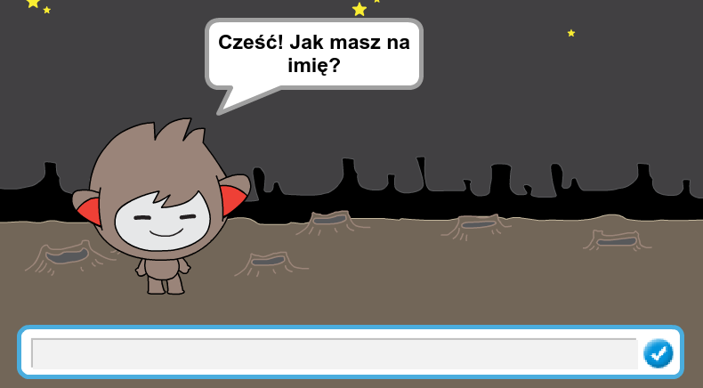

+ Twój robot za każdym razem odpowie `What a lovely name!`. Możesz uczynić odpowiedź bardziej odpowiednią, wykorzystując odpowiedź użytkownika. Zmień swój kod, aby wyglądał jak poniżej:

	```blocks
		kiedy duszek kliknięty
        zapytaj [Cześć! Jak masz na imię?] i czekaj
        powiedz <połącz [Cześć] i (odpowiedź)> przez (2) s
	```

	Aby złożyć ostatni blok, musisz najpierw przeciągnąć zielony blok `połącz` {.blockoperators}, tak, aby umieścić go wewnątrz bloku `powiedz` {.blocklooks}.

	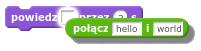

	Następnie możesz zmienić tekst `hello` na `Cześć` i przesuń jasnoniebieski blok `odpowiedź` {.blocksensing} (z sekcji "Czujniki") na napis `world`.

	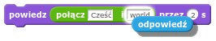

+ Przetestuj swój nowy program. Czy napewno działa tak, jak się spodziewałeś? Czy możesz rozwiązać któryś z problemów który zauważyłeś? (Podpowiedź: możesz dodać gdzieś odstęp ("spację")!)

+ Może się zdarzyć, że będziesz chciał zapisać imię użytkownika, abyś mógł go użyć ponownie później. Utwórz w tym celu nową zmienną `imię` {.blockdata}.

+ Informacja (imię), które wprowadziłeś jest już przechowywana w specjalnej zmiennej `odpowiedź` {.blocksensing}. Zajrzyj do sekcji bloków Czujniki i kliknij na blok odpowiedź, tak aby została ona "odhaczona". Aktualna wartość zmiennej `odpowiedź` {.blocksensing} powinna wtedy wyświetlać się w lewym górnym narożniku sceny.

+ Kiedy już utworzysz nową zmienną, upewnij się że kod Twojego robota wygląda tak:

	```blocks
		kiedy duszek kliknięty
        zapytaj [Cześć! Jak masz na imię?] i czekaj
        ustaw [imię v] na (odpowiedź)
        powiedz <połącz [Cześć] i (imię)> przez (2) s
	```

+ Kiedy po raz kolejny przetestujesz swój program, zobaczysz, że odpowiedź została zachowana w zmiennej `imię` {.blockdata} i jest wyświetlana w lewym górnym rogu sceny. Zmienna `imię` {.blockdata} powinna teraz zawierać tę samą wartość co zmienna `odpowiedź` {.blocksensing}.

	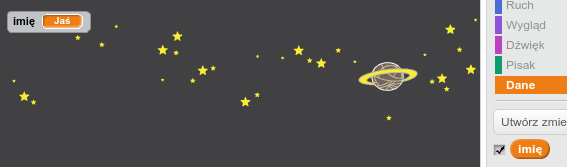

	Jeśli jednak nie chcesz widzieć wartości zmiennych na swojej scenie, możesz odznaczyć zmienne w zakładce "Skrypty" aby je ukryć.

## Zapisz swój projekt { .save }

## Wyzwanie: Więcej pytań { .challenge }

Zaprogramuj swojego Robota Gadułę tak, aby zadawał również inne pytania. Czy możesz zachować w zmiennych odpowiedzi na nie?

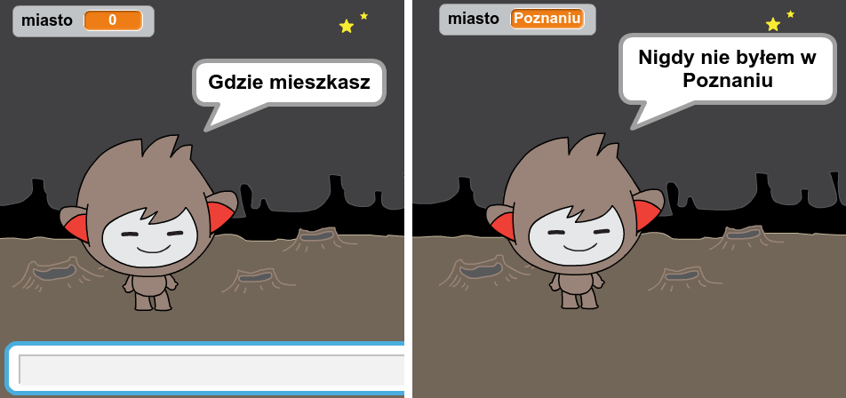

## Zapisz swój projekt { .save }

# Krok 3: Dokonywanie wyborów { .activity }

Możesz zaprogramować robota tak, aby decydował co zrobić na podstawie odpowiedzi użytkownika.

## Zadania do wykonania { .check }

+ Sprawmy aby Twój robot zadał użytkownikowi pytanie, na które można odpowiedzieć  `tak` lub `nie`. Na przykład takie jak poniżej, ale jeśli chcesz, możesz zmienić pytanie:

	```blocks
		kiedy duszek kliknięty
        zapytaj [Cześć! Jak masz na imię?] i czekaj
        ustaw [imię v] na (odpowiedź)
        powiedz <połącz [Cześć] i (imię)> przez (2) s
        zapytaj <połącz [Wszystko w porządku] i (imię)> i czekaj
        jeżeli ((odpowiedź) = [tak]) to
           powiedz [To świetnie!] przez (2) s
        koniec

	```

	Zauważ, że teraz, kiedy zachowałeś imię użytkownika w zmiennej, możesz jej używać kiedy tylko chcesz.

+ Aby przetestować odpowiednio swój program, musisz sprawdzić go dwa razy - raz wpisując odpowiedź `nie` i drugi raz wpisując `tak`. Powinieneś otrzymać odpowiedź tylko `jeżeli` {.blockcontrol} Twoja odpowiedź brzmiała `tak`.

+ Kłopot z Twoim robotem jest taki, że nie odpowiada, jeśli udzieli się odpowiedzi `nie`. Możesz to naprawić zmieniając blok `jeżeli` {.blockcontrol} na blok `jeżeli/w przeciwnym razie` {.blockcontrol}, tak aby Twój kod wyglądał jak poniżej:

	```blocks
		kiedy duszek kliknięty
        zapytaj [Cześć! Jak masz na imię?] i czekaj
        ustaw [imię v] na (odpowiedź)
        powiedz <połącz [Cześć] i (imię)> przez (2) s
        zapytaj <połącz [Wszystko w porządku] i (imię)> i czekaj
        jeżeli ((odpowiedź) = [tak]) to
           powiedz [To świetnie!] przez (2) s
        w przeciwnym razie
           powiedz [O nie!] przez (2) s
        koniec
	```

+ Kiedy przetestujesz swój kod, zobaczysz, że otrzymujesz teraz odpowiedź niezależnie czy odpowiesz `tak` czy `nie`. Twój robot powinien odpowiedzieć `To świetnie!` kiedy odpowiesz `tak`, albo `O nie!` jeśli odpowiesz cokolwiek innego niż `tak`.

	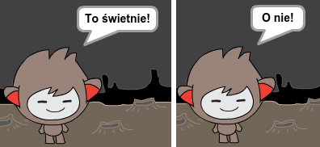

+ Możesz umieścić dowolny kod wewnątrz bloku `jeżeli` {.blockcontrol} lub `w przeciwnym razie` {.blockcontrol}, nie tylko kod, który sprawia, że Twój robot się odzywa. Na przykład, możesz zmienić kostium duszka, tak, aby pasował do odpowiedzi.

	Jeśli spojrzysz na kostiumy swojego duszka, zobaczysz, że jest ich więcej. (A nawet jeśli nie - zawsze możesz dodać własne!)

	

	Możesz użyć tych kostiumów jako część odpowiedzi Twojego robota dodając poniższy kod:

	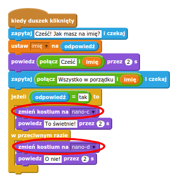

+ Przetestuj swój program, a powinieneś zobaczyć, że wyraz twarzy twojego duszka zmienia się w zależności od odpowiedzi.

	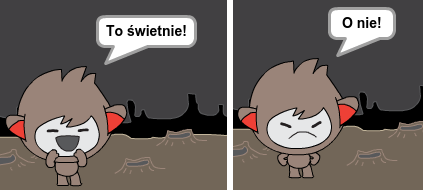

## Zapisz swój projekt { .save }

## Wyzwanie: Więcej decyzji { .challenge }

Oprogramuj swojego Robota Gadułę tak, aby zadawał więcej pytań z możliwymi odpowiedziami `tak` lub `nie`. Czy możesz sprawić, aby robot odpowiedział?

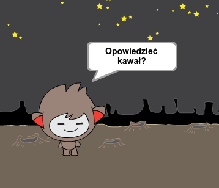

## Zapisz swój projekt { .save }

# Krok 4: Zmiana lokalizacji { .activity }

Możesz także sprawić, aby Twój robot zmieniał lokalizację.

## Zadania do wykonania { .check }

+ Dodaj inne tło do swojej sceny - na przykład "Księżyc" (ang. "moon").

	

+ Możesz teraz oprogramować robota, aby zmieniał lokalizację dodając mu poniższy skrypt:

	```blocks
		zapytaj [Lecę na Księżyc. Chcesz polecieć ze mną?] i czekaj
        jeżeli ((odpowiedź) = [tak]) to
           zmień tło na [moon v]
        koniec
	```

+ Musisz także upewnić się, że Twój robot jeszcze nie jest na Księżycu, kiedy zaczynasz z nim rozmawiać. Dodaj poniższy blok na początek kodu swojego robota:

	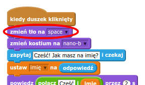

+ Przetestuj swój program, odpowiedz `tak` kiedy zostaniesz zapytany czy chcesz lecieć na Księżyc. Powinieneś zauważyć, że lokalizacja Twojego Robota Gaduły się zmieniła.

	

+ Czy Twój robot zmienia lokalizację, kiedy podasz odpowiedź `nie`? Co jeśli wpiszesz `Nie jestem pewien`?

+ Możesz także dodać poniższy kod wewnątrz bloku `jeżeli` {.blockcontrol}, aby Twój robot podskoczył cztery razy jeśli odpowiesz `tak`:

	```scratch
	powtórz (4) razy
       zmień y o (10)
       czekaj (0.1) s
       zmień y o (-10)
       czekaj (0.1) s
    koniec
	```

	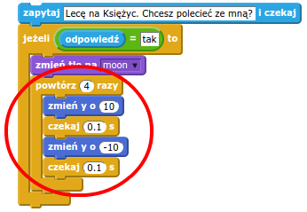

+ Przetestuj ponownie swój kod. Czy Robot Gaduła podskakuje, kiedy odpowiesz `tak`?

## Zapisz swój projekt { .save }

## Wyzwanie: Stwórz swojego własnego Robota Gadułę {.challenge}
Wykorzystaj to, czego się dzisiaj nauczyłeś aby dokończyć swojego interaktywnego robota. Masz tutaj kilka pomysłów: 


Kiedy skończysz tworzyć swojego robota, zaproś swoich kolegów, aby spróbowali z nim porozmawiać! Czy przypadł im do gustu jego charakter? Czy dostrzegli jakieś trudności?

## Zapisz swój projekt { .save }
