---
title: Wyścig Łodzi
level: Scratch 1
language: pl-PL
stylesheet: scratch
embeds: "*.png"
materials: ["Zasoby Lidera Klubu/*.*","Zasobu do Projektu/*.*"]
...

# Wstęp { .intro }

Wykonując ten projekt dowiesz się, jak stworzyć grę, w której będziesz kierował łodzią płynącą na piaszczystą wyspę.

<div class="scratch-preview">
  <iframe allowtransparency="true" width="485" height="402" src="http://scratch.mit.edu/projects/embed/63957956/?autostart=false" frameborder="0"></iframe>
  
</div>

# Krok 1: Planowanie gry { .activity }

## Zadania do wykonania { .check }

+ Rozpoocznij nowy projekt Scratch i usuń duszka-kota, tak żeby Twój projekt był pusty. Edytor Scratch online znajdziesz pod adresem <a href="http://jumpto.cc/scratch-new">jumpto.cc/scratch-new</a>.

+ Kliknij na tło sceny i zaplanuj pierwszy poziom gry. Powinieneś dodać:
	+ Drewniane kłody, które Twoja łódź będzie musiała ominąć.
	+ Piaszczystą wyspę, która będzie celem Twojej łodzi.

	Tak może obecnie wyglądać Twoja gra:

	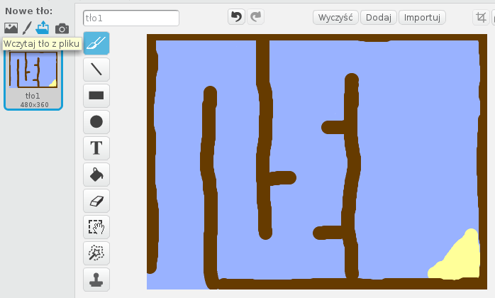 

# Krok 2: Kontrolowanie łodzi { .activity }

## Zadania do wykonania { .check }

+ Jeśli Lider Klubu dostarczył Ci folder z Zasobami, kliknij "Załaduj kostium z pliku" i wybierz plik 'łódź.png'. Zmniejsz nieco duszka i ustaw go na pozycji startowej.

	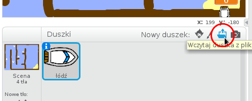

	Jeśli nie posiadasz pliku 'łódź.png', możesz narysować własną łódź!

+ Łodź będzie kontrolowana przez gracza za pomocą myszki. Dodaj następujący kod dla duszka-łodzi:

	```blocks
		kiedy kliknięto zieloną flagę
		ustaw kierunek na (0 v)
		idź do x:(-190) y:(-150)
		zawsze
			ustaw w stronę [wskaźnik myszy v]
			przesuń o (1) kroków
		koniec
	```

+ Przetestuj swoją łódź klikając na zieloną flagę i poruszając myszką. Czy łódź płynie w kierunku kursora?

	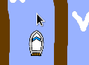

+ Co się dzieje, kiedy łodź dotknie kursora myszy?

	Aby zapobiec temu zachowaniu, musisz dodać blok `jeżeli` {.blockcontrol} do kodu duszka-łodzi. Dzięki temu łódź będzie poruszała się tylko jeśli znajduje się w odległości większej niż `5px` od kursora myszki.

	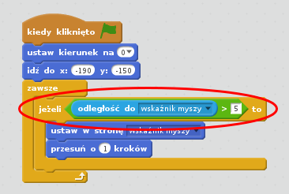	

+ Ponownie przetestuj swoją grę, aby sprawdzić, czy rozwiązałeś problem.

## Zapisz swój projekt { .save }

# Krok 3: Zderzenia! { .activity .new-page }

Póki co Twoja łódź może przepłynąć przez kłody i bariery. Naprawmy to.

## Zadania do wykonania { .check }

+ Będziesz potrzebował dwóch kostiumów dla łodzi, jeden standardowy i jeden dla łodzi po uderzeniu w przeszkodę. Powiel obecny kostium duszka-łodzi i nazwij pierwszy z nich 'normalny' a drugi 'po zderzeniu'.

+ Kliknij na kostium 'po zderzeniu' i wybierz narzędzie 'Zaznaczanie'. Zaznacz kawałek kostiumu i obróć go. Spraw, żeby Twoja łódź wyglądała na zniszczoną.

	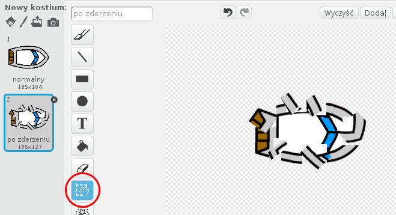

+ Dodaj poniższy kod dla łodzi wewnątrz bloku `zawsze` {.blockcontrol}, dzięki czemu łódż będzie wyglądała na zniszczoną jeśli dotknie brązowego koloru:

	```blocks
		jeżeli <dotyka koloru [#603C15]?> to
			zmień kostium na [po zderzeniu v]
			powiedz [Nieeee!] przez (1) s
			zmień kostium na [normalny v]
			ustaw kierunek na (0 v)
			idź do x:(-215) y:(-160)
		koniec
	```

	Kod znajduje się wewnątrz bloku `zawsze` {.blockcontrol}, więc zawsze będzie sprawdzał czy łódź dotyka kłody.

+ Upewnij się, że kostium 'normalny' jest wybrany po rozpoczęciu gry.

+ Teraz jeżeli spróbujesz wpłynąć na kłodę, łódź powinna ulec zniszczeniu i wrócić na pozycję startową.

	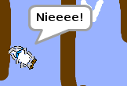

## Zapisz swój projekt { .save }

## Wyzwanie: Zwycięstwo! {.challenge}
Czy potrafisz dodać kolejny blok `jeżeli` {.blockcontrol} do Twojego kodu, dzięki któremu gracz zakończy grę zwycięstwem, kiedy dotknie piaszczystej wyspy?

Kiedy łódź dotrze do wyspy, powinna wykrzynąć 'Tak!', a gra powinna się zatrzymać. Możesz skorzystać z poniższego kodu:

```blocks
	powiedz [Tak!] przez (1) s
	zatrzymaj [wszystko v]
```

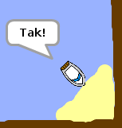

## Zapisz swój projekt { .save }

## Wyzwanie: Efekty dźwiękowe {.challenge}
Czy wiesz jak dodać efekty dziękowe do Twoje gry, kiedy łódź ulegnie zniszczeniu albo dotrze do wyspy? Możesz nawet dodać muzykę w tle (zobacz instrukcję do poprzedniego projektu 'Kapela rockowa', jeśli nie pamiętasz jak to zrobić).

## Zapisz swój projekt { .save }

# Krok 4: Próba czasowa { .activity }

Dodajmy stoper do Twojej gry. Dzięki temu gracz będzie musiał dotrzeć do wyspy najszybciej jak to możliwe.

## Zadania do wykonania { .check }

+ Dodaj nową zmienną dla sceny i nazwij ją `czas`. Możesz równie zmienić sposób wyświetlania zmiennej. Jeśli nie pamiętasz jak to zrobić, zajrzyć do instrukcji dla projektu 'Balony'.

	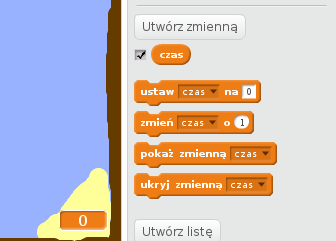

+ Dodaj poniższy kod dla __sceny__, Sprawia on, że licznik czasu będzie się zwiększał aż do momentu dotknięcia przez łódź piaszczystej wyspy:

	```blocks
		kiedy kliknięto zieloną flagę
		ustaw [czas v] na [0]
		zawsze
   			czekaj (0.1) s
   			zmień [czas v] o (0.1)
		koniec
	```

+ To wszystko! Przetestuj swoją grę. Jak szybko potrafisz dotrzeć do piaszczystej wyspy?

	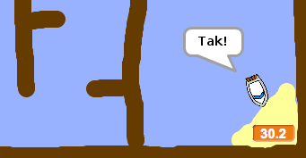

## Zapisz swój projekt { .save }

# Krok 5: Przeszkody i dodatki { .activity }

Ta gra jest _zbyt_ łatwa - dodajmy kilka rzeczy, żeby uczynić ją bardziej interesującą.

## Zadania do wykonania { .check }

+ Najpierw dodajmy 'przyspieszacze', dzięki którym łódź będzie mogła zwiększyć swoją prędkość. Wyedytuj tło sceny i dodaj kilka białych strzałek.

	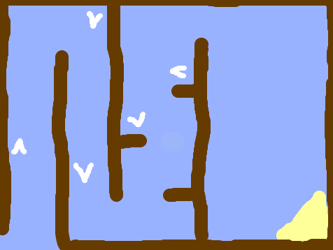

+ Teraz możesz dodać nieco nowego kodu do bloku `zawsze` {.blockcontrol} duszka-łodzi. Dzięki niemu łódź będzie przesuwać się o 2 dodatkowe kroki za każdym razem, gdy dotknie białej strzałki.

	```blocks
		jeżeli <dotyka koloru [#FFFFFF]?> to
   			przesuń o (3) kroków
		koniec
	```

+ Możesz dodać także obrotowe bramy, które Twoja łódź będzie musiała omijać. Dodaj nowego duszka i nazwij go 'brama'. Twój duszek powinien wyglądać tak:

	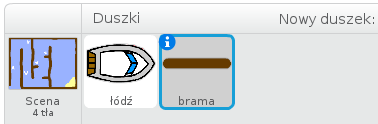

	Upewnij się, że kolor bramy jest taki sami jak kolor drewnianych barier.

+ Ustaw środek duszka na środku jego kostiumu.

	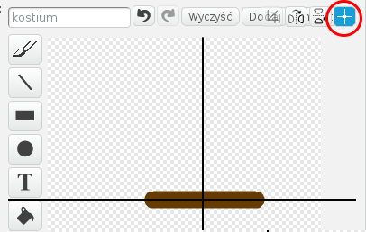

+ Dodaj kod, dzięki któremu duszek będzie się `zawsze` {.blockcontrol} powoli obracał.

+ Przetestuj grę. Powinieneś widzieć obracające się bramy, których musisz unikać.

	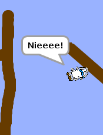

## Zapisz swój projekt { .save }

## Wyzwanie: Więcej przeszkód! {.challenge .new-page}
Potrafisz dodać więcej przeszkód do Twojej gry? Oto kilka pomysłów:

+ Możesz dodać wodorosty do tła sceny, które spowolnią gracza kiedy ich dotknie. Użyj bloku `czekaj` {.blockcontrol} aby osiągnąć ten efekt:

```blocks
	czekaj (0.01) s
````


+ Możesz dodać poruszające się obiekty, np rekiny, które utrudnią Twojej łodzi dotarcie do celu.


Te bloki kodu mogą być pomocne:

```blocks
	przesuń o (1) kroków
	jeżeli na brzegu, odbij się
````

Jeśli dodana przez Ciebie przeszkoda nie jest brązowa (tak jak drewniane bariery), będziesz musiał dodać taki kod dla duszka-łodzi:

```blocks
	jeżeli <<dotyka koloru [#603C15]?> lub <dotyka [shark v]?>> to
	koniec
```

## Zapisz swój projekt { .save }

## Wyzwanie: Więcej łodzi! {.challenge .new-page}
Potrafisz zrobić ze swojej gry grę dla dwóch graczy?

+ Powiel łódź, nazwij ją 'Gracz 2' i zmień jej kolor.

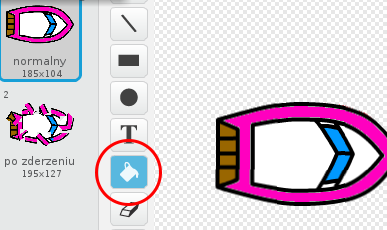

+ Zmień pozycję startową 'Gracza 2' dodając taki kod dla duszka 'Gracz 2':

```blocks
	idź do x:(-190) y:(-150)
```

+ Usuń kod odpowiedzialny za sterowanie łodzią za pomocą myszki:

```blocks
	jeżeli <(odległość do [wskaźnik myszy v]) > [5]> to
   		ustaw w stronę [wskaźnik myszy v]
   		przesuń o (1) kroków
	koniec
```

... i zamień go na kod, dzięki któremu będziesz sterował 'Graczem 2' strzałkami na klawiaturze:

Oto fragment kodu, którego będziesz potrzebował, aby łódź poruszała się naprzód:

```blocks
	jeżeli <klawisz [strzałka w górę v] naciśnięty?> to
   		przesuń o (1) kroków
	koniec
```

Potrzebujesz także kodu do obracania łodzią, kiedy strzałka w lewo lub prawo jest wciśnięta.

## Zapisz swój projekt { .save }

## Wyzwanie: Więcej poziomów! {.challenge .new-page}
Umiesz utworzyć dodatkowe plansze i pozwolić graczom wybrać tę, na której chieliby zagrać?

```blocks
	kiedy klawisz [spacja v] naciśnięty
	następne tło
```

## Zapisz swój projekt { .save }
