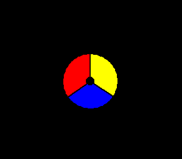
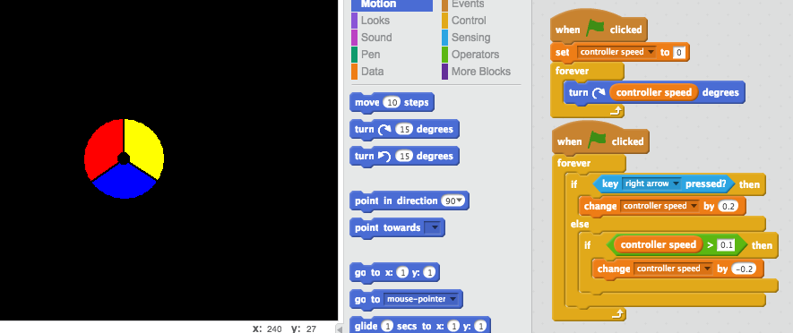
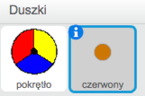
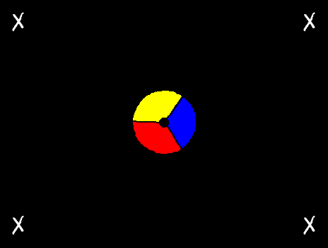
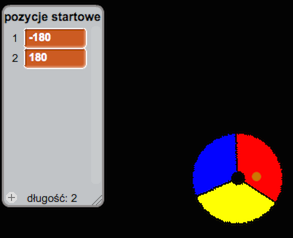
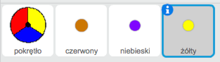
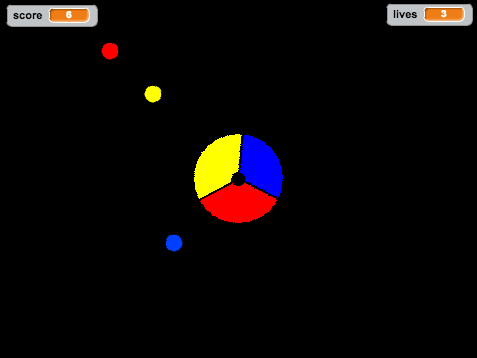
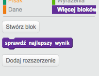
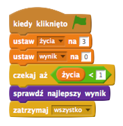

---
title: Catch the Dots
level: Scratch 2
language: pl-PL
stylesheet: scratch
embeds: "*.png"
materials: ["Club Leader Resources/*.*", "Project Resources/*.*"]
beta: true
...

# Wstęp { .intro }

Realizując ten projekt nauczysz się, jak stworzyć grę, w której musisz dopasować kolorowe kulki do odpowiedniej części pokrętła.

<div class="scratch-preview">
	<iframe allowtransparency="true" width="485" height="402" src="http://scratch.mit.edu/projects/embed/44942820/?autostart=false" frameborder="0"></iframe>
	
</div>

# Krok 1: Budowa pokrętła { .activity }

Zacznijmy od zbudowania pokrętła, które będzie używane do zbierania kulek.

## Zadania do wykonania { .check }

+ Stwórz nowy projekt i usuń duszka-kota, aby projekt był pusty.

+ Aby wykonać ten projekt, powinieneś mieć katalog "Zasoby", w którym znajdziesz obrazek pokrętła, który możesz użyć. Upewnij się, że masz ten katalog, a jeśli nie zapytaj o niego prowadzącego.

	

+ Stwórz nowego duszka korzystając z pliku "controller.png", który znajdziesz w katalogu "Zasoby". Jeśli nie masz tego obrazka możesz narysować własny! Zmień nazwę duszka na "pokrętło". Pokoloruj też tło sceny na czarno. Całość powinna wyglądać mniej więćej tak:

	

+ Możesz poruszać pokrętłem w bardzo prosty sposób -- obracając je w lewo lub w prawo kiedy gracz naciska strzałki:

	```blocks
		kiedy kliknięto zieloną flagę
		zawsze
			jeżeli <klawisz [strzałka w lewo v] naciśnięty?> to
				obróc w lewo o (2) stopni
			koniec
			jeżeli <klawisz [strzałka w prawo v] naciśnięty?> to
				obróc w prawo o (2) stopni
			koniec
		koniec
	```

+ Przetestuj swoje pokrętło -- powinno obracać się w lewo i w prawo.

+ Pomimo tego, że ten kod działa, byłoby znacznie lepiej, gdyby porkętło stopniowo przyspieszało i zwalniało. Aby to zrobić, usuń kod pokrętła, który właśnie stworzyłeś i utwórz nową zmienną o nazwie `prędkość pokrętła` {.blockdata}.

+ Dodaj poniższy kod do swojego pokrętła, aby używało zmiennej "prędkość pokrętła" do poruszania nim:

	```blocks
		kiedy kliknięto zieloną flagę
		ustaw [prędkość pokrętła v] na [0]
		zawsze
			obróc w prawo o (prędkość pokrętła) stopni
		koniec
	```

+ Na tą chwilę powyższy kod nie będzie ruszał pokrętłem, ponieważ prędkość została ustawiona na 0! Zbuduj osobny skrypt w swoim pokrętle, aby zwiększać prędkość, kiedy naciśnięto strzałkę w prawo.

	```blocks
		kiedy kliknięto zieloną flagę
		zawsze
			jeżeli <klawisz [strzałka w prawo v] naciśnięty?> to
				zmień [prędkość pokrętła v] o (0.2)
			w przeciwnym razie

			koniec
		koniec
	```

+ Czy zauważyłeś puste miejsce w powyższym kodzie? Będziesz musiał dodać pewien kod by spowolnić pokrętło jeśli strzałka w prawo nie jest naciśnięta. Pamiętaj jednak, że zwalniać chcesz tylko do momentu, gdy prędkość pokrętła osiągnie 0, w przeciwnym razie zacznie się kręcić w drugą stronę.

	Powinieneś dodać taki kod:

	```blocks
		jeżeli <(prędkość pokrętła) > [0.1]> to
			zmień [prędkość pokrętła v] o (-0.2)
		koniec
	```

	Pokrętło powinno wyglądać tak:

	

+ Przetestuj ponownie swój projekt. Gdy trzymasz wciśnięty klawisz ze strzałką w prawo, twoje pokrętło powinno przyspieszać. Kiedy przestaniesz wciskać ten klawisz, pokrętło powinno stopniowo zwalniać.

## Zapisz swój projekt { .save }

## Wyzwanie: Obrót w lewo {.challenge}
Zduplikuj cału skrypt pokrętła odpowiedzialny za obracanie go w prawo. Czy potrafisz zmodyfikować ten zduplikowany kod w taki sposób, by pokrętło obracało się w lewo, kiedy wciśniesz strzałkę w lewo?

Będziesz musiał zmienić niektóre liczby w swoim kodzie! (Podpowiedź: pokrętło będzie obracać się w lewo jeśli zmienna `prędkość pokrętła` {.blockdata} będzie miała wartość ujemną).

## Zapisz swój projekt { .save }

# Krok 2: Łapanie kropek { .activity }

Dodajmy teraz do gry kropki, które gracz będzie musiał łapać obracając odpowiednio pokrętłem.

## Zadania do wykonania { .check }

+ Stwórz nowego duszka i nazwij go "czerwony". Duszek ten powinien być małą czerwoną kropką.

	

+ Dodaj poniższy skrypt do czerwonej kropki, aby co kilka sekund powstawał nowy klon kropki:

	```blocks
		kiedy kliknięto zieloną flagę
		czekaj (2) s
		zawsze
			sklonuj [siebie v]
			czekaj (losuj od (5) do (10)) s
		koniec
	```

+ Każdy klon po stworzeniu powinien pojawić się w jednym z czterech narożników sceny.

	

	Aby to zrobić, najpierw utwórz nową listę i nazwij ją `pozycje startowe` {.blockdata}, następnie kliknij na `(+)` i dodaj do listy wartości `-180` i `180`.

	

+ Możesz użyć tych dwóch elementów listy do wybrania dowolnego narożnika sceny. Po dodaniu poniższego kodu do duszka-czerwonej kropki każdy klon pojawi się w losowym narożniku i będzie powoli leciał w kierunku pokrętła.

	```blocks
		kiedy zaczynam jako klon
		idź do x: (element (losowo v) z [pozycje startowe v]) y: (element (losowo v) z [pozycje startowe v])
		ustaw w stronę [pokrętło v]
		pokaż
		powtarzaj aż <dotyka [pokrętło v]?>
			przesuń o (1) kroków
		koniec
	```

	Powyższy kod wybiera "-180" albo "180" dla pozycji x _oraz_ y. To znaczy, że każdy klon będzie zaczynał w dowolnym narożniku sceny.

+ Przetestuj projekt. Powinieneś zobaczyć mnóstwo czerwonych kropek, które pojawiają się w rogach ekranu i powoli lecą w stronę pokrętła.

	

+ Stwórz dwie nowe zmienne i nazwij je `życia` {.blockdata} i `wynik` {.blockdata}.

+ Dodaj kod do sceny, który na początku gry ustawi `życia` {.blockdata} na 3, a `wynik` {.blockdata} na 0.

+ Teraz musisz dodać kod do duszka-czerwonej kropki na końcu bloku `kiedy zaczynam jako klon` {.blockcontrol}, który będzie albo dodawał 1 do `wyniku` {.blockdata} jeśli kolory się zgdzają, albo odejmował 1 z `życ` {.blockdata} gracza, jeśli kolory się nie zgadzają.

	```blocks
		przesuń o (5) kroków
		jeżeli <dotyka koloru [#FF0000]?> to
			zmień [wynik v] o (1)
			zagraj dźwięk [pop v]
		w przeciwnym razie
			zmień [życia v] o (-1)
			zagraj dźwięk [laser1 v]
		koniec
		usuń tego klona
	```

+ Po dodaniu tego kodu na końcu skryptu sceny gra zakończy się, kiedy gracz straci wszystkie życia:

	```blocks
		czekaj aż <(życia) < [1]>
		zatrzymaj [wszystko v]
	```

+ Przetestuj swoją grę i upewnij się, że kod działa tak, jak się tego spodziewasz.

## Zapisz swój projekt { .save }

## Wyzwanie: Więcej kropek {.challenge}
Zduplikuj duszka-czerwoną kropkę dwa razy i nazwij nowe duszki "żółty" i "niebieski".



Zmień te duszki (pamiętaj też zmienić ich kod) w taki sposób, by każdy kolor kropki pasował do koloru na pokrętle. Pamiętaj, aby przetestować swój projekt i upewnić się, że zdobywasz punkty i tracisz życia w odpowiednim momencie. Sprawdź też, czy gra nie jest przypadkiem za prosta albo za trudna.



## Zapisz swój projekt { .save }

# Krok 3: Zwiększanie trudności { .activity .new-page}

Teraz sprawimy, by gra stawała się coraz trudniejsza w miarę upływu czasu. Zrobimy to zmiejszając opóźnienie z jakim pojawiają się kolejne kropki.

## Zadania do wykonania { .check }

+ Swtórz nową zmienną i nazwij ją `opóźnienie` {.blockdata}.

+ Dodaj nowy skrypt na scenie, który będzie ustawiał opóźnienie na wysoką liczbę, a później powoli ją zmniejszał.

	```blocks
		kiedy kliknięto zieloną flagę
		ustaw [opóźnienie v] na (8)
		powtarzaj aż < (opóźnienie) = (2)>
			czekaj (10) s
			zmień [opóźnienie v] o (-0.5)
		koniec
	```

	Zauważ, że w podobny sposób działa stoper!

+ Teraz możesz użyć zmiennej `opóźnienie` {.blockdata} w skryptach od czerwonej, żółtej i niebieskiej kropki. Usuń kod, który czeka losowy czas pomiędzy tworzeniem kolejnych klonów i zastą go twoją zmienną `opóźnienie` {.blockdata}:

	```blocks
		czekaj (opóźnienie) s
	```

+ Przetestuj nową zmienną `opóźnienie` {.blockdata} i zobacz czy czas pomiędzy nowymi kropkami powoli spada. Czy działa to dla wszystkich trzech kolorów kropek? Widzisz, jak wartość `opóźnienia` {.blockdata} spada?

## Zapisz swój projekt { .save }

## Wyzwanie: Szybsze kropki {.challenge}
Możesz ulepszyć swoją grę dodając zmienną `prędkość` {.blockdata}, która sprawi, że na początku kropki będą ruszać się za każdym razem o jeden krok, ale później będą poruszać się coraz szybciej i szybciej. Będzie to działać bardzo podobnie do tego, jak działa `opóźnienie` {.blockdata}, którego przed chwilą użyliśmy.


## Zapisz swój projekt { .save }

# Krok 4: Najlepszy wynik { .activity }

Zapiszmy najlepszy wynik, by gracze mogli rywalizować.

## Zadania do wykonania { .check }

+ Stwórz zmienną `najlepszy wynik` {.blockdata}.

+ Kliknij na scenę i utwórz nowy blok, który nazwij `sprawdź najlepszy wynik` {.blockmoreblocks}.

	

+ Tuż przed zakończeniem gry dodaj twój nowy blok.

	

+ Dodaj poniższy kod do twojego bloku, aby zapisać aktualny `wynik` {.blockdata} jako `najlepszy wynik` {.blockdata} `jeżeli` {.blockcontrol} jest wyższy niż dotychczasowy:

	```blocks
		definiuj [sprawdź najlepszy wynik]
		jeżeli <(wynik) > (najlepszy wynik)> to
			ustaw [najlepszy wynik v] na (wynik)
		koniec
	```

+ Przetestuj kod, który właśnie dodałeś. Zagraj i sprawdź, czy `najlepszy wynik` {.blockdata} zapisuje się poprawnie.

## Zapisz swój projekt { .save }

## Wyzwanie: Ulepsz swoją grę! {.challenge}
Can you think of ways to improve your game? For example, you could create special dots that:
Masz pomysł jak można jeszcze bardziej ulepszyć grę? Możesz stworzyć na przykład specjalne kropki, które:

+ dają dwa razy więcej punktów,
+ zwalniają kropki
+ ukrywają wszystkie inne kropki na ekranie!

## Zapisz swój projekt { .save }

## Wyzwanie: Game menu {.challenge}
Możesz też dodać menu (z przyciskami) do swojej gry. Możesz dodać stronę z instrukcją i osobny ekran, gdzie wyświetlisz najlepszy wynik. Jeśli nie pamiętasz jak to zrobić zajrzyć do materiałów z projektu "Brain Game".
