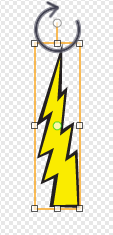
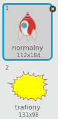
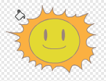
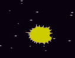
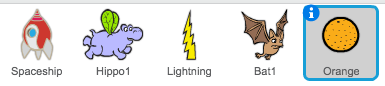
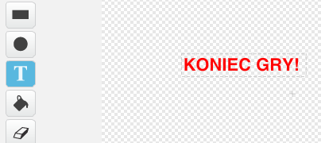

---
title: Clone Wars
level: Scratch 2
language: pl-PL
stylesheet: scratch
embeds: "*.png"
materials: ["Club Leader Resources/*"]
beta: true
...

## Projekt stworzony przez społeczność { .challenge .pdf-hidden }
Ten projekt powstał przy współpracy z Erikiem. Jeśli także chcesz zamieścić swój projekt [skontaktuj się z nami na Githubie](https://github.com/CodeClub).

# Wstęp { .intro }

Wykonując ten projekt nauczysz się, jak stworzyć grę, w której musisz uratować Ziemię przed potworami z kosmosu.

<div class="scratch-preview">
  <iframe allowtransparency="true" width="485" height="402" src="http://scratch.mit.edu/projects/embed/46018140/?autostart=false" frameborder="0"></iframe>
  
</div>

# Krok 1: Budowanie statku kosmicznego {.activity}

Zbudujmy statek kosmiczny, który będzie bronił Ziemi!

## Zadania do wykonania {.check}

+ Utwórz w Scratchu nowy projekt i usuń duszka-kota tak, aby projekt był pusty. Możesz skorzystać ze Scratcha w wersji online, który znajduje się tutaj: <a href="http://jumpto.cc/scratch-new">jumpto.cc/scratch-new</a>.

+ Do projektu dodaj tło 'stars' (gwiazdy) i duszka 'Spaceship' (statek kosmiczny). Zmiejsz statek kosmiczny i przesuń go na dół sceny.

	

+ Dodaj kod, który przesunie statek w lewo, kiedy wciśniesz strzałkę w lewo. Będziesz do tego potrzebował takich bloków:

	```blocks
		kiedy kliknięto zieloną flagę
        zawsze
           jeżeli <klawisz [strzałka w lewo v] naciśnięty?> to
              zmień x o (-4)
           koniec
        koniec
	```

+ Dodaj kod, który przesunie statek w prawo, kiedy wciśniesz strzałkę w prawo.

+ Przetestuj swój projekt i sprawdź czy statek przesuwa się kiedy wciskasz strzałki na klawiaturze.

## Zapisz swój projekt {.save}

# Krok 2: Błyskawice {.activity}

Dodajmy statkowi kosmicznemu możliwość strzelania błyskawicami!

## Zadania do wykonania {.check}

+ Z biblioteki Scratcha dodaj duszka 'Lightning' (błyskawica). Kliknij na kostium duszka i obróc go do góry nogami.

	

+ Na początku gry błyskawica powinna być ukryta. Pokażemy ją dopiero wtedy, kiedy statek kosmiczny wystrzeli ze swoich laserowych działek.

	```blocks
		kiedy kliknięto zieloną flagę
        ukryj
	```

+ Dodaj poniższy kod **do statku kosmicznego**, by utworzyć nową błyskawicę za każdym razem, kiedy wciśnięta zostanie spacja.

	```blocks
		kiedy kliknięto zieloną flagę
        zawsze
           jeżeli <klawisz [spacja v] naciśnięty?> to
              sklonuj [Lightning v]
           koniec
        koniec
	```

+ Kiedy nowy klon zostanie stworzony powinien ustawić się w tym miejscu, gdzie znajduje się statek kosmiczny. Następnie powinien poruszać się w górę sceny dopóki nie dotknie krawędzi. Dodaj poniższy kod **do błyskawicy**:

	```blocks
		kiedy zaczynam jako klon
        idź do [Spaceship v]
        pokaż
        powtarzaj aż <dotyka [krawędź v]?>
           zmień y o (10)
        koniec
        usuń tego klona
	```

  Uwaga: ustawiamy nowy klon błyskawicy na pozycję statku kosmicznego kiedy jeszcze błyskawica jest ukryta, przed jej pokazaniem. Dzięki temu gra będzie lepiej wyglądać.

+ Przetestuj swoją błyskawicę naciskając spację.

## Zapisz swój projekt {.save}

## Wyzwanie: Naprawianie błyskawicy {.challenge}
Co się dzieje, kiedy trzymasz wciśniętą spację? Użyj bloku `czekaj` {.blockcontrol}, aby to naprawić.

## Zapisz swój projekt {.save}

# Krok 3: Latające kosmo-hipcie { .activity }

Dodajmy teraz mnóstwo latających hipopotamów, które będą próbowały zniszczyć statek kosmiczny.

## Zadania do wykonania {.check}

+ Stwórz nowego duszka wykorzystując 'Hippo1' z biblioteki Scracha.

	

+ Ustaw mu styl obrotów tak, aby obracał się tylko w prawo i w lewo. Dodaj mu też poniższy kod, aby ukryć go na początku gry:

	```blocks
		kiedy kliknięto zieloną flagę
        ukryj
	```

+ Stwórz nową zmienną tylko dla tego duszka i nazwij ją `prędkość` {.blockdata}.

	

  Jeśli udało ci się to zrobić poprawnie twoja zmienna będzie miała nazwę duszka obok swojej nazwy, tak jak tutaj:

	

+ Poniższy kod utworzy nowego kosmo-hipcia co kilka sekund. Dodaj ten kod **do sceny**:

	```blocks
		kiedy kliknięto zieloną flagę
        zawsze
           czekaj (losuj od (2) do (4)) s
           sklonuj [Hippo1 v]
        koniec
	```

+ Niech każdy nowy klon kosmo-hipcia na początku porusza się po scenie (z losową prędkością) tak długo, aż nie zostanie zestrzelony przez błyskawicę. Dodaj poniższy kod **do kosmo-hipcia**:

	```blocks
		kiedy zaczynam jako klon
        ustaw [prędkość v] na (losuj od (2) do (4))
        idź do x:(losuj od (-220) do (220)) y:(150)
        pokaż
        powtarzaj aż <dotyka [lightning v]?>
           przesuń o (prędkość) kroków
           obróć w prawo o (losuj od (-10) do (10)) stopni
           jeżeli na brzegu, odbij się
        koniec
        usuń tego klona
	```

+ Przetestuj kod kosmo-hipcia. Co kilka sekund powinien pokazywać się nowy klon kosmo-hipcia, a każdy z nich powinien poruszać się ze swoją prędkością.

	

+ Przetestuj działka laserowe. Czy trafiony błyskawicą kosmo-hipcio znika?

+ Kiedy kosmo-hipcio dotknie twojego statku kosmicznego, statek powinien eksplodować! Aby tak zrobić, najpierw musimy zmienić statek w taki sposób, aby miał dwa kostiumy: "normalny" i "trafiony".

	

  Kostium "trafiony" można wykonać importując z biblioteki Scratcha obrazek "sun" (Słońce), a następnie używając narzędzia "Wypełnij kształt", aby zmienić jego kolor.

	

+ Dodaj ten kod do swojego statku, aby zmienił kostium kiedy tylko zostanie uderzony przez kosmo-hipcia:

	```blocks
		kiedy kliknięto zieloną flagę
        zawsze
           zmień kostium na [normalny v]
           czekaj aż <dotyka [Hippo1 v]?>
           zmień kostium na [trafiony v]
           nadaj [trafiony v]
           czekaj (1) s
        koniec
	```

+ Czy zauważyłeś, że wysyłasz wiadomość "trafiony" w kodzie powyżej? Możesz użyć tej wiadomości, aby ukryć wszystkie kosmo-hipcie, kiedy statek zostanie trafiony przez jednego z nich.

	Dodaj poniższy kod do kosmo-hipcia:

	```blocks
		kiedy otrzymam [trafiony v]
        usuń tego klona
	```

+ Przetestuj ten kod - uruchom nową grę i pozwól, aby uderzył cię kosmo-hipcio.

	

## Zapisz swój projekt {.save}

## Wyzwanie: Życia i punkty {.challenge}
Czy potrafisz dodać `życia` {.blockdata}, `punkty` {.blockdata}, albo nawet `najlepszy wynik` {.blockdata} do swojej gry? Pomocy szukaj w projekcie "Catch the Dots".

## Zapisz swój projekt {.save}

# Krok 4: Owocowe nietoperze! { .activity }

Stworzymy teraz owocowe nietoperze, które będą rzucać pomarańczami w twój statek kosmiczny.

## Zadania do wykonania {.check}

+ Najpierw stwórz nowego duszka - nietoperza, który będzie `zawsze` {.blockcontrol} `przesuwał się` {.blockmotion} wzdłuż górnej krawędzi sceny. Pamiętaj, żeby przetestować swój kod.

	

+ Jeśli spojrzysz na kostiumy nietoperza, to zobaczysz, że są tam już 2 kostiumy:

	

  Użyj bloku `następny kostium` {.blocklooks}, aby nietoperz machał skrzydłami kiedy lata.

+ Stwórz nowego duszka korzystając z 'Orange' (pomarańcza) z biblioteki Scratcha.

	

+ Do nietoperza dodaj kod, który utworzy nowy klon pomarańczy co kilka sekund.

	```blocks
		kiedy kliknięto zieloną flagę
        zawsze
           czekaj (losuj od (5) do (10)) s
           sklonuj [Orange v]
        koniec
	```

+ Kliknij na pomarańczę i dodaj ten kod, aby każdy klon spadał na scenie od nietoperza w kierunku statku kosmicznego:

	```blocks
		kiedy kliknięto zieloną flagę
        ukryj
        
        kiedy zaczynam jako klon
        idź do [Bat1 v]
        pokaż
        powtarzaj aż <dotyka [krawędź v]?>
           zmień y o (-4)
        koniec
        usuń tego klona
        
        kiedy otrzymam [trafiony v]
        usuń tego klona
	```

+ Musisz teraz zmienić swój kod w statku kosmicznym, aby został trafiony, kiedy dotknie albo kosmo-hipcia albo pomarańczy:

	```blocks
		czekaj aż <<dotyka [Hippo1 v]?> lub <dotyka [Orange v]?>>
	```

+ Przetestuj swoją grę. Co się stanie kiedy w statek uderzy pomarańcza?

## Zapisz swój projekt {.save}

# Krok 5: Koniec gry { .activity }

Dodajmy komunikat "Koniec gry".

## Zadania do wykonania {.check}

+ Jeśli nie zrobiłeś tego wcześniej dodaj nową zmienną i nazwij ją `życia` {.blockdata}. Twój statek kosmiczny powinien zaczynać z 3 życiami i tracić po jednym kiedy zostanie trafiony przez wroga. Gra powinna się zakończyć, kiedy skończą ci się życia. Jeśli potrzebujesz pomocy możesz użyć kodu z projektu "Catch the Dots".

+ Narysuj nowego duszka "Koniec gry" używając narzędzia do pisania tekstu.

	

+ Nadaj wiadomość `koniec gry` {.blockevents} na scenie zaraz przed końcem gry.

	```blocks
		nadaj [koniec gry v] i czekaj
	```

+ Dodaj ten kod do duszka "Koniec gry", aby wiadomość pokazała się na końcu gry:

	```blocks
		kiedy kliknięto zieloną flagę
        ukryj
        
        kiedy otrzymam [koniec gry v]
        pokaż
	```

  Ponieważ na scenie użyłeś bloku `nadaj [koniec gry] i czekaj` {.blockevents}, gra poczeka, aż pojawi się duszek "Koniec gry" zanim gra się naprawdę zakończy.

+ Przetestuj swoją grę. Ile punktów udało ci się zdobyć? Jak możesz udoskonalić grę, jeśli jest za prosta albo za trudna?

## Zapisz swój projekt {.save}

## Wyzwanie: Usprawnij swoją grę {.challenge}
Jakie ulepszenia możesz dodać do swojej gry? Oto kilka pomysłów:
+ dodaj apteczki, które możesz zbierać, aby zdobyć dodatkowe życia;


+ Dodaj ruchome skały, które statek kosmiczny musi omijać;


+ Po zdobyciu 100 punktów niech pojawia się więcej przeciwników.

```blocks
	czekaj aż <(punkty) = [100]>
```

## Zapisz swój projekt {.save}
