---
title: Stwórz Własny Świat
level: Scratch 2
language: pl-PL
stylesheet: scratch
embeds: "*.png"
materials: ["Zasoby Lidera Klubu/*.*","Zasoby Projektu/*.*"]
...

# Wprowadzenie { .intro }

W tym projekcie nauczysz się jak stworzyć własną grę przygodową z otwartym światem.

<div class="scratch-preview">
	<iframe allowtransparency="true" width="485" height="402" src="http://scratch.mit.edu/projects/embed/34248822/?autostart=true" frameborder="0"></iframe>
	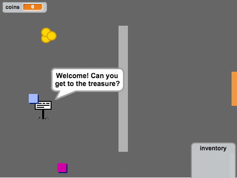
</div>

# Krok 1: Gracz { .activity }

Zacznijmy od utworzenia gracza, który będzie mógł poruszać się po świecie gry.

## Zadania do wykonania { .check }

+ Utwórz nowy projekt i usuń duszka-kota.

+ Do tego projektu będziesz potrzebował 'Zasobów Projektu', które zawierają wszystkie niezbędne grafiki. Upewnij się, że posiadasz ten folder, zapytaj Twojego Lidera Klubu jeśli nie możesz go znaleźć.

	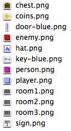

+ Dodaj grafikę 'pokój1.png' jako tło sceny oraz grafikę 'gracz.png' jako nowego duszka. Jeżeli nie posiadasz tych grafik, możesz je narysować własnoręcznie. Oto jak powinien wyglądać obecnie Twoj projekt:

	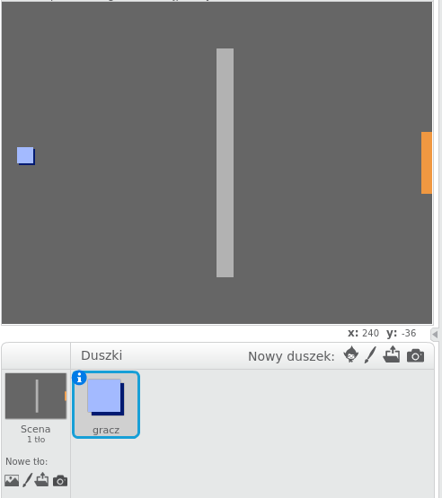

+ Użyjemy strzałek do kierowania duszkiem gracza. Kiedy gracz naciśnie strzałkę w górę, duszek powinien przemieścić się do góry, zmieniając swoją pozycję w osi Y. Dodaj taki kod dla duszka-gracza:

	```blocks
		kiedy kliknięto zieloną flagę
		zawsze
			jeżeli <klawisz [strzałka w górę v] naciśnięty?> to
				zmień y o (2)
			koniec
		koniec
	```

+ Przetestuj zachowanie duszka-gracza klikająć na zieloną flagę i wciskając strzałkę w górę. Czy duszek porusza się do góry?

	

+ Aby poruszyć duszka w lewo, musisz dodać kolejny blok `jeżeli` {.blockcontrol} do skryptu duszka-gracza, dzięki któremu zmieni on położenie w osi X:

	```blocks
		kiedy kliknięto zieloną flagę
		zawsze
			jeżeli <klawisz [strzałka w górę v] naciśnięty?> to
				zmień y o (2)
			koniec
			jeżeli <klawisz [strzałka w lewo v] naciśnięty?> to
				zmień x o (-2)
			koniec
		koniec
	```

## Wyzwanie: Poruszanie się we wszystkich kierunkach {.challenge}
Potrafisz dodać więcej kodu dla duszka-gracza, który umożliwi mu poruszanie się w dół i w prawo? Użyj kodu, który już stworzyłeś.

## Zapisz swój projekt { .save }

+ Przetestuj swoją grę ponownie. Zobacz, że gracz może przejść przez ściany.

	

+ Aby to naprawić, po wciśnięciu strzałki musisz przesunąć duszka, a następnie cofnąć jego ruch, jeśli dotyka jasnoszarej ściany. Oto kod, którego będziesz potrzebował:

	```blocks
		kiedy kliknięto zieloną flagę
		zawsze
			jeżeli <klawisz [strzałka w górę v] naciśnięty?> to
				zmień y o (2)
				jeżeli <dotyka koloru [#BABABA]?> to
					zmień y o (-2)
				koniec
			koniec
		koniec
	```

	Zwróć uwagę, że nowy blok `jeżeli`{.blockcontrol}`dotyka koloru`{.blocksensing} jest wewnątrz bloku `jeżeli`{.blockcontrol}`klawisz [strzałka w górę]`{.blocksensing}

+ Przetestuj nowy kod, nie powinieneś móc przekroczyć ściany poruszając się w górę.

	

+ Zróbmy to samo dla klawisza lewej strzałki. Jeżeli gracz dotyka ściany po ruchu, powinien cofnąć się o krok. Oto jak teraz powinien wyglądać kod dla duszka-gracza:

	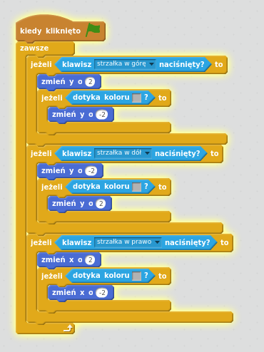

## Wyzwanie: Naprawienie ruchów gracza {.challenge}
Dodaj kod dla duszka-gracza, dzięki któremu nie będzie mógł przejść przez ścianę niezależnie od tego, w jakim porusza się kierunku. Do pomocy użyj kodu, któru już posiadasz.

## Zapisz swój projekt { .save }

# Krok 2: Zakoduj swój świat { .activity }

Sprawmy, żeby gracz mógł przejść do innego pokoju używając drzwi.

## Zadania do wykonania { .check }

+ Dodaj dwa dodatkowe tła dla sceny ('pokój2.png' i 'pokój3.png'). Scena powinna teraz mieć w sumie trzy tła. Upewnij się, że są one ułożone we właściwej kolejności, to będzie pmocne w przyszłości.

	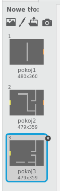

+ Dodaj nową zmienną `pokój` {.blockdata}, w której będziesz przechowywał informację o tym, w którym pokoju obecnie znajduje się gracz.

	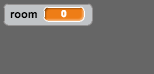

+ Kiedy gracz dotknie pomarańczowych drzwi w pierwszym pokoju, powinieneś wyświetlić kolejne tło sceny, a gracz powinien wrócić na pozycję startową po lewej stronie planszy. Oto kod, którego bedziesz potrzebował, powinien się znaleźć wewnątrz bloku `zawsze` {.blockcontrol}:

	```blocks
		jeżeli <dotyka koloru [#F2A24A]?> to
			zmień tło na [następne tło v]
			idź do x:(-200) y:(0)
			zmień [room v] o (1)
		koniec
	```

+ Dodaj ten kod na początek kody dla duszka-gracza (przed pętle `zawsze` {.blockcontrol}), aby wszystko (pozycja gracza, plansza) zostało zresetowane na początku gry:

	```blocks
		ustaw [room v] na (1)
		idź do x:(-200) y:(0)
		zmień tło na [room1 v]
	```

+ Kliknij zieloną flagę i przemieść gracza do pomarańczowych drzwi. Czy przeszedł on do następnej planszy? Czy zmienna `pokój` zmieniła swoją wartość na `2`?

	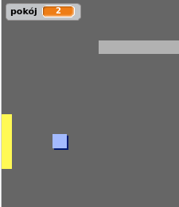

## Wyzwanie: Przejście do poprzedniego pokoju {.challenge}
Czy potrafisz wrócić swoim graczem do poprzedniego pokoju, kiedy dotknie on żółtych drzwi? Pamiętaj, że ten skrypt powinien być bardzo podobny do kodu, dzięki któremu gracz może przejść do następnego pokoju.

## Zapisz swój projekt { .save }

# Krok 3: Znaki { .activity }

Dodajmy znaki, które będą prowadzić Twojego gracza podczas jego podróży.

## Zadania do wykonania { .check }

+ Dodaj nowego duszka z pliku 'znak.png' i nazwij go 'znak - powitanie'.

	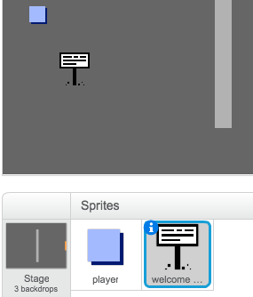

+ Ten znak będzie widoczny tylko w pokoju numer 1, więc dodajmy skrypt, który to spowoduje:

	```blocks
		kiedy kliknięto zieloną flagę
		zawsze
			jeżeli <(room) = [1]> to
				pokaż
			w przeciwnym razie
				ukryj
			koniec
		koniec
	```

+ Przetestuj swój znak przemieszczając się między pokojami. Powinien być widoczny tylko, kiedy jesteś w pokoju numer 1.

	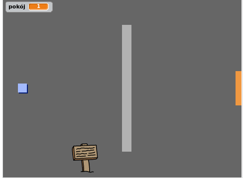
	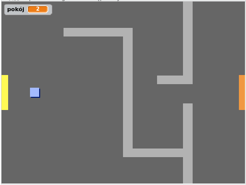

+ Znak nie jest zbyt przydatny, jeśli niczego nie mówi. Dodajmy trochę kodu dla duszka-znaku, aby wyświetlić wiadomości jeśli gracz go dotyka:

	```blocks
		kiedy kliknięto zieloną flagę
		zawsze
			jeżeli <dotyka [player v]?> to
				powiedz [Cześć! Czy potrafisz dotrzeć do skarbu?]
			w przeciwnym razie
				powiedz []
			koniec
		koniec
	```
+ Przetestuj swój znak, powinieneś zobaczyć wiadomość, kiedy gracz go dotknie.

	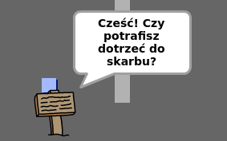

## Zapisz swój projekt { .save }

## Wyzwanie: Skarb! {.challenge}
Czy potrafisz dodać skrzynię ze skarbami, używając pliku 'skrzynia.png'? Skrzynia powinna znaleźć się w pokoju numer 3, i powinna powiedzieć "Dobra robota!", kiedy gracz jej dotknie.

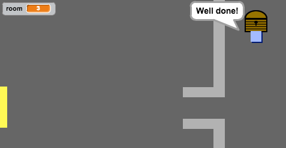

## Zapisz swój projekt { .save }

# Krok 4: Postacie { .activity }

Dodajmy inne postacie do Twojego świata, z którymi będziesz mógł wchodzić w interakcje.

## Zadania do wykonania { .check }

+ Dodaj nowego duszka z pliku. Użyj grafiki 'postac.png'.

	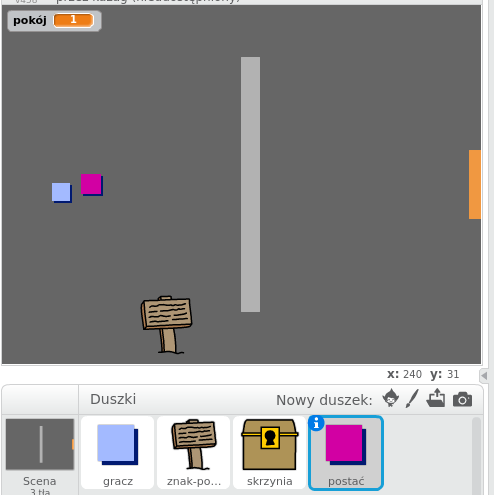

+ Dodaj poniższy kod dla nowego duszka, dzięki czemu postać będzie mogła rozmawiać z graczem. Ten kod jest bardzo podobny do tego, którego dodałeś dla znaku i skrzyni:

	```blocks
		kiedy kliknięto zieloną flagę
		idź do x:(-200) y:(0)
			zawsze
			jeżeli <dotyka [player v]?> to
				powiedz [Czy wiesz, że możesz przejść przez pomarańczowe i żołte drzwi?]
			w przeciwnym razie
				powiedz []
			koniec
		koniec
	```

+ Powinieneś równiez umożliwić postaci poruszanie się, używając poniższych bloków:

	```blocks
		przesuń o (1) kroków
		jeżeli na brzegu, odbij się
	```

	Twoja postać zachowa się różnie, zaleznie od tego czy umieścisz kod wewnątrz pętli `zawsze` {.blockcontrol} czy w bloku `jeżeli` {.blockcontrol}. Spróbuj obu rozwiązań i zobacz, które bardziej Ci się podoba.

	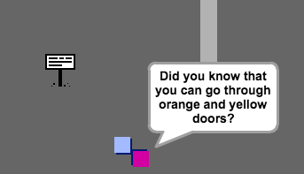

+ Zauważyłeś, że postać obraca się do góry nogami? Aby temu zapobiec, kliknij na ikonę informacji o duszku (`i` {.blockmotion}) i wybierz kropkę aby naprawić problem z obrotem.

	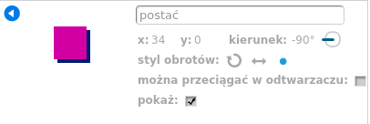

## Wyzwanie: Ulepszanie postaci {.challenge}
Czy potrafisz dodać dla Twoich postaci kod, dzięki któremu będą pojawiać się tylko w pokoju numer 1? Upewnij się, że dobrze przetestowałeś swój nowy skrypt.

## Zapisz swój projekt { .save }

+ Możesz także dodać wrogów patrolujacych okolicę. Jeśli gracz dotknie któregoś z nich - gra się skończy. Dodaj nowego duszka-wroga, zmień sposób jego rotacji tak jak zrobiłeś to dla duszka-postaci.

+ Dodaj kod dla wrogów, który sprawi, że będą pojawiać się tylko w pokoju numer 2.

+ Będziesz musiał dodać trochę nowego skryptu dla wrógow, żeby gra kończyła się, kiedy gracz dotknie któregoś z nich. Będzie łatwiej, jeśli zrobisz to w osobnym bloku kodu. Oto jak powinien wyglądać skrypt dla duszka-wroga:

	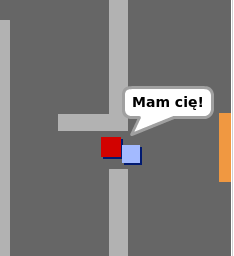

+ Przetestuj swoich wrogów, upewnij się, że:
	+ Są widoczni tylko w pokoju numer 2.
	+ Poruszają się patrolując planszę.
	+ Gra kończy się, kiedy dotkniesz jednego z nich.

## Zapisz swój projekt { .save }

## Wyzwanie: Więcej wrogów {.challenge}
Czy potrafisz dodać więcej wrogów w pokoju numer 3, którzy będą patrolowali planszę poruszając się w górę i w dół poprzez szczeliny w ścianie?


## Zapisz swój projekt { .save }

# Krok 5: Zbieranie monet { .activity }

## Zadania do wykonania { .check }

+ Dodaj nową zmienną `monety` {.blockdata} do projektu.

+ Dodaj nowego duszka z pliku 'moneta.png'.

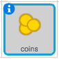

+ Dodaj kod do duszka-monety, dzięki któremu pojawi się on w pokoju numer 1.

+ Stwórz kolejną porcję kodu, który sprawi, że dodasz 3 do zmiennej `monety` {.blockdata}, kiedy gracz podniesie monetę:

	```blocks
		kiedy kliknięto zieloną flagę
		czekaj aż <dotyka [player v]?>
		zmień [coins v] o (3)
		zatrzymaj [inne skrypty duszka v]
		ukryj
	```

	Kod `zatrzymaj inne skrypty duszka` {.blockcontrol} jest potrzebny, aby monety przestały się wyświetlać w pokoju numer 1, kiedy już zostaną zebrane.

+ Powinieneś dodać kod, który ustawi zmienną `monety` {.blockdata} na 0 przy starcie gry.

+ Przetestuj swój projekt - zebranie monety powinno zwiększyć licznik punktów o 3.

## Wyzwanie: Więcej monet {.challenge}
Czy potrafisz dodać więcej monet do gry? Mogą one się znaleźć w innym pokoju, a niektóre z nich mogą być chronione przez wrógów patrolujących planszę.

# Krok 6: Drzwi i klucze { .activity }

## Zadania do wykonania { .check }

+ Dodaj nowego duszka z pliku 'niebieski-klucz.png'. Zmień tło sceny na tło numer 3 i umieść klucz w trudno dostępnym miejscu.

 	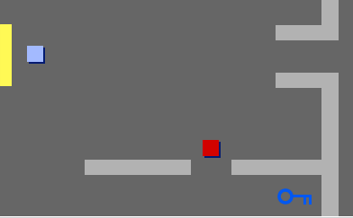

+ Upewnij się, że klucz jest widoczny tylko w pokoju numer 3.

+ Utwórz nową listę i nazwij ją `inwentarz` {.blockdata}. To będzie magazyn wszystkich przedmiotów, które zbierze Twój gracz.

+ Kod do zbierania klucza jest bardzo podobny do kodu zbierania monet. Różnica jest taka, że teraz będziesz dodawał klucz do inwentarza zamiast dodawać punkty do zmiennej `monety`.

	```blocks
		kiedy kliknięto zieloną flagę
		czekaj aż <dotyka [player v]?>
		dodaj [blue key] do [inwentarz v]
		zatrzymaj [inne skrypty duszka v]
		ukryj
	```

+ Przetestuj działanie skryptów dla kluczy, sprawdź czy możesz je zebrać i dodać do inwentarza. Pamiętaj, aby dodać kod dla sceny, który sprawi, że inwentarz będzie pusty po starcie gry.

	```blocks
		usuń (wszystko v) z [inwentarz v]
	```

+ Utwó©z nowego duszka z pliku 'niebieskie-drzwi.png' i umieść go w luce w murze.

	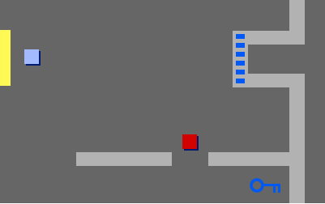

+ Dodaj kod dla drzwi, aby były widoczne tylko w pokoju numer 3.

+ Będziesz musiał schować niebieskie drzwi w momencie, gdy niebieski klucz znajdzie się w inwentarzu gracza.

	```blocks
		kiedy kliknięto zieloną flagę
		czekaj aż <[inventory v] zawiera [blue key]>
		zatrzymaj [inne skrypty duszka v]
		ukryj
	```

+ Przetestuj swój projekt i zobacz czy potrafisz zebrać niebieski klucz aby otworzyć niebieskie drzwi. 

## Zapisz swój projekt { .save }

## Wyzwanie: Stwórz własny świat {.challenge}
Możesz teraz kontynuować tworzenie własnego świata. Oto kilka pomysłów:

+ Zmień niektóre ustawienia gry, dodaj unikatowe grafiki.
+ Dodaj efekty dźwiękowe i muzykę.
+ Dodaj więcej postaci, wrogów, znaków i monet.
+ Dodaj czerwone i żółte drzwi oraz klucze, ktorych będziesz potrzebował, aby je otworzyć.
+ Dodaj więcej pomieszczeń.
+ Dodaj inne użyteczne przedmioty, np. magiczne buty, dzięki którym gracz będzie mógł przemieszczać się szybciej, albo tarczę, która ochroni go na pewien czas przed kontaktem z wrogami.

+ Użyj monet, aby dostać informację od postaci napotkanych w grze.

	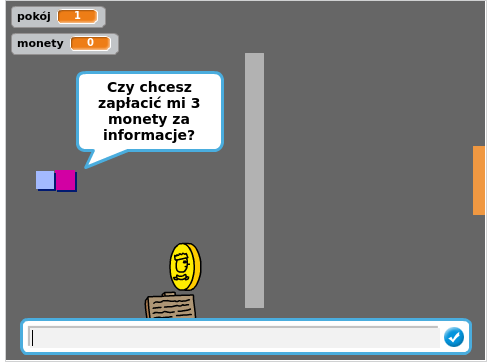

+ Możesz dodać północne i południowe drzwi, dzięki którym Twój gracza będzie mógł się przemieszczać między pomieszczeniami we wszystkich czterech kierunkach. Na przykład jeśli będziesz miał 9 plansz, możesz je ułożyć według siatki 3x3. Dodaj 3 do numeru aktualnego pokoju, aby przejść jeden poziom niżej.

	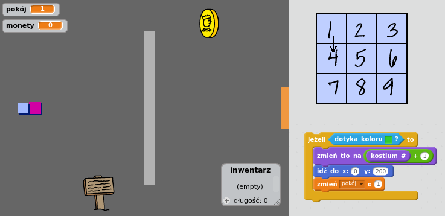

## Zapisz swój projekt { .save }

