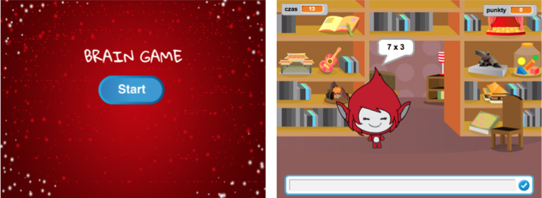
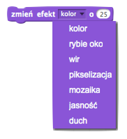

# Wstęp { .intro }

Ten projekt nauczy cię, jak wykonać quiz z tabliczki mnożenia, w którym musisz poprawnie odpowiedzieć jak najwięcej razy w ciągu 30 sekund.

<div class="scratch-preview">
	<iframe allowtransparency="true" width="485" height="402" src="http://scratch.mit.edu/projects/embed/49781348/?autostart=false" frameborder="0"></iframe>
	
</div>

# Krok 1: Przygotowanie pytań { .activity }

Zacznijmy od przygotowania losowych pytań, na które będzie odpowiadał gracz.

## Zadania do wykonania { .check }

+ Stwórz nowy projekt i usuń duszka-kota, aby projekt był pusty.

+ Wybierz postać i tło dla swojej gry. Możesz wybrać co tylko ci się podoba! Na przykład:

		

+ Stwórz dwie nowe zmienne i nazwij je `liczba 1` {.blockdata} i `liczba 2` {.blockdata}. Zmienne te będą przechowywać dwie liczby, które będziemy przez siebie mnożyć.

	

+ Dodaj poniższy kod do swojej postaci, aby ustawić każdej zmiennej `losową` {.blockoperators} liczbę od 2 do 12.

	```blocks
		kiedy kliknięto zieloną flagę
		ustaw [liczba 1 v] na (losuj od (2) do (12))
		ustaw [liczba 2 v] na (losuj od (2) do (12))
	```

+ Teraz możesz zapytać gracza i powiedzieć mu, czy udzielił poprawnej odpowiedzi.

	```blocks
		kiedy kliknięto zieloną flagę
		ustaw [liczba 1 v] na (losuj od (2) do (12))
		ustaw [liczba 2 v] na (losuj od (2) do (12))
		zapytaj (połącz (liczba 1) i (połącz [ x ] i (liczba 2))) i czekaj
		jeżeli <(odpowiedź) = ((liczba 1)*(liczba 2))> to
			powiedz [tak! :)] przez (2) s
		w przeciwnym razie
			powiedz [nie :(] przez (2) s
		koniec
	```

+ Przetestuj całość odpowiadając na jedno pytanie poprawnie i na jedno niepoprawnie.

+ Cały kod umieść w nowym bloku `zawsze` {.blockcontrol} w taki sposób, by gracz odpowiadał w kółko na pytania.

+ Dodaj na scenie stoper używając do tego nowej zmiennej `czas` {.blockdata}. Jeśli potrzebujesz pomocy możesz zajrzeć do instrukcji z projektu "Balony" (krok 6), gdzie robiliśmy stoper.

+ Przetestuj jeszcze raz swój projekt - twoja postać powinna przestać zadawać pytania, kiedy czas się skończy.

## Zapisz swój projekt { .save }

## Wyzwanie: Zmiana kostiumów {.challenge}
Czy możesz zmienić kostium swojej postaci w taki sposób, by pasował do odpowiedzi gracza?


## Wyzwanie: Dodanie punktacji {.challenge}
Czy możesz dodać punkty do swojej gry? Możesz dodawać jeden punkt za każdą poprawną odpowiedź. Jeśli chcesz być złośliwy, możesz nawet zerować punkty, jeśli gracz poda złą odpowiedź.

## Zapisz swój projekt { .save }

# Krok 2: Wiele gier { .activity .new-page}

Dodaj do swojej gry przycisk "Start", abyś mógł uruchomić grę wiele razy.

## Zadania do wykonania { .check }

+ Dodaj duszka-przycisk "Start", w który gracz będzie klikał, aby uruchomić nową grę. Przycisk możesz narysować sam lub zmienić jeden ze biblioteki Scratcha.

	

+ Dodaj poniższy kod do przycisku:

	```blocks
		kiedy kliknięto zieloną flagę
		pokaż

		kiedy duszek kliknięty
		ukryj
		nadaj [start v]
	```

	Ten kod pokazuje przycisk w momencie, gdy uruchomisz projekt. Kiedy gracz w niego kliknie przycisk jest ukrywany, a następnie nadawana jest wiadomość, by włączyć grę.

+ Musisz teraz zmienić kod swojej postaci tak, by uruchamiała grę kiedy otrzyma wiadomość `start`  {.blockevents}, a nie kiedy kliknięto flagę.

	Zamień blok `kiedy kliknięto zieloną flagę` {.blockevents} na `kiedy otrzymam start` {.blockevents}.

	

+ Kliknij na zieloną flagę, a następnie na nowy przycisk "Start", aby przetestować całość. Gra powinna się zacząć dopiero po kliknięciu na przycisk.

+ Czy zauważyłeś, że stoper startuje kiedy klikniesz zieloną flagę, a nie w momencie, kiedy gra się zaczyna?

	

	Czy potrafisz naprawić ten błąd?

+ Kliknij na scenę i zamień blok `zatrzymaj wszystko` {.blockcontrol} na wysłanie wiadomości `koniec` {.blockevents}.

	

+ Teraz możesz dodać kod do przycisku, by ponownie pokazał się na koniec każdej gry.

	```blocks
		kiedy otrzymam [koniec v]
		pokaż
	```

+ Twoja postać powinna także przestać zadawać pytania, kiedy gra się skończyła:

	```blocks
		kiedy otrzymam [koniec v]
		zatrzymaj [inne skrypty duszka v]
	```

+ Przetestuj przycisk "Start" grając kilka razy. Przycisk powinien pokazać się po każdej grze. Aby ułatwić sobie testowanie możesz skrócić czas gry do kilku sekund.

	```blocks
		ustaw [czas v] na [10]
	```

+ Możesz także zmienić wygląd przycisku, kiedy kursor myszy znajdzie się nad nim.

	```blocks
		kiedy kliknięto zieloną flagę
		pokaż
		zawsze
			jeżeli <dotyka [wskaźnik myszy v]?> to
				ustaw efekt [rybie oko v] na (30)
			w przeciwnym razie
				ustaw efekt [rybie oko v] na (0)
			koniec
		koniec
	```

	

## Zapisz swój projekt { .save }

## Wyzwanie: Ekran początkowy {.challenge}
Możesz dodać inne tło do sceny, które będzie ekranem początkowym gry. Do przełączania pomiędzy tłami możesz użyć bloków `kiedy otrzymam start` {.blockevents} i `kiedy otrzymam koniec` {.blockevents}.

Możesz także pokazywać i ukrywać swoją postać, a nawet pokazywać i ukrywać stoper używając poniższych bloków:

```blocks
pokaż zmienną [czas v]
```
```blocks
ukryj zmienną [czas v]
```



## Zapisz swój projekt { .save }

# Krok 3: Dodawanie elementów graficznych { .activity .new-page}

Do tej pory postać w grze informowała gracza jak mu idzie mówiąc "tak! :)" lub "nie :(". Zmieńmy to i dodajmy elementy graficzne, po których gracz będzie widział, czy udzielił poprawnej odpowiedzi.

+ Dodaj nowego duszka i nazwij go "Wynik". Duszek powinien mieć dwa kostiumy "ptaszek" i "krzyżyk".

	

+ Zmień kod postaci tak, by zamiast mówić graczowi, jak mu poszło, nadawał zamiast tego wiadomość `dobrze` {.blockevents} lub `źle` {.blockevents}.

	

+ Możesz teraz wykorzystać te wiadomości do pokazywania odpowiedniego kostiumu - "ptaszka" lub "krzyżyka". Dodaj ten kod do duszka "Wynik":

		

+ Przetestuj grę jeszcze raz. Teraz kiedy odpowiesz poprawnie powinieneś zobaczyć ptaszka, a gdy odpowiesz źle - krzyżyk.

	

+ Czy zauważyłeś, że kod w bloku `kiedy otrzymam dobrze` {.blockevents} i `kiedy otrzymam źle` {.blockevents} jest niemal identyczny? Utwórzmy funkcję, aby wprowadzanie zmian w tym kodzie było łatwiejsze.

	Będąc na duszku "Wynik" kliknij w `Więcej bloków` {.blockmoreblocks}, a następnie "Stwórz blok". Nową funkcję nazwij `animacja` {.blockmoreblocks}.

	

+ Teraz możesz dodać kod animacji do twojej nowej funkcji, a następnie użyć jej w dwóch miejscach:

	

+ Od tej chwili, jeśli będziesz chciał pokazać znaczek ptaszka lub krzyżyk dłużej lub krócej wystarczy, że zmienisz jedno miejsce w swoim kodzie. Spróbuj!

+ Możesz zmienić funkcję animacji w taki sposób, aby zamiast po prostu pokazywać znaczek ptaszka lub krzyżyk, obie grafiki płynnie pojawiały się.

	```blocks
		definiuj [animacja]
		ustaw efekt [duch v] na (100)		
		pokaż
		powtórz (25) razy
			zmień efekt [duch v] o (-4)
		koniec
		ukryj
	```

## Zapisz swój projekt { .save }

## Wyzwanie: Podrasowana animacja {.challenge}
Czy możesz sprawić, żeby animacja była jeszcze bardziej efektowna? Mógłbyś zmienić kod w taki sposób by poza pojawianiem się, znikanie także było płynne. Możesz wypróbować także inne fajne efekty:



## Zapisz swój projekt { .save }

## Wyzwanie: Dźwięk i muzyka {.challenge}
Czy możesz dodać efekty dzwiękowe i muzykę do swojej gry? Na przykład:

+ Zagrać dźwięk kiedy gracz wpisze poprawną lub błędną odpowiedź;
+ Dodać dźwięk do zegara (tik-tak);
+ Zagrać dźwięk kiedy skończy się czas;

	```blocks
		zagraj bębenkiem (10 v) przez (0.1) taktów
	```
 
+ Mógłbyś także ciągle odtwarzać muzykę w pętli (jeśli nie jesteś pewien, jak to zrobić zajrzyj do kroku 4 projektu "Rock Band").

## Zapisz swój projekt { .save }

## Wyzwanie: Zbierz 10 punktów {.challenge}
Możesz zmienić swoją grę w taki sposób, by zamiast odpowiadzieć poprawnie na jak najwięcej pytań w 30 sekund, gracz musiał odpowiedzieć poprawnie na 10 pytań tak szybko, jak potrafi.

Aby to zrobić wystarczy, że zmienisz kod stopera. Czy widzisz, co trzeba zmienić?

```blocks
	kiedy otrzymam [start v]
	ustaw [czas v] na (30)
	powtarzaj aż <(czas) = [0]>
		czekaj (1) s
		zmień [czas v] o (-1)
	koniec
	nadaj [koniec v]
```

## Zapisz swój projekt { .save }

## Wyzwanie: Ekran z instrukcją {.challenge}
Czy możesz dodać ekran z instrukcją, na którym pokażesz graczowi, jak może grać? Będziesz potrzebować przycisku "Instrukcja" i kolejnego tła sceny.


Możesz też potrzebować przycisku "Wstecz", aby wrócić z powrotem do głównego menu.

```blocks
	nadaj [główne menu v]
```

## Zapisz swój projekt { .save }
