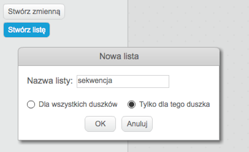
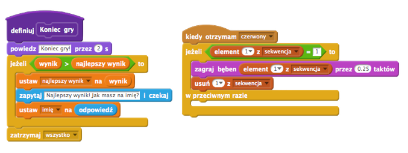

## Projekt stworzony przez społeczność { .challenge .pdf-hidden }
Ten projekt stworzył Erik wraz ze swoją córką Ruth. Jeśli też chcesz podzielić się swoim projektem [odwiedź nas na GitHubie](https://github.com/CodeClub).

# Wstęp { .intro }

Ten projekt polega na stworzeniu gry pamięciowej. Będziesz musiał zapamiętać w jakiej kolejności pokazały się kolory, a następnie powtórzyć tę kolejność.

<div class="scratch-preview">
	<iframe allowtransparency="true" width="485" height="402" src="http://scratch.mit.edu/projects/embed/48304744/?autostart=false" frameborder="0"></iframe>
	
</div>

# Krok 1: Losowe kolory { .activity }

Najpierw stwórzmy postać, która będzie losowo zmieniać kolor. Gracz będzie musiał zapamiętać kolejność tych kolorów.

## Zadania do wykonania { .check }

+ Stwórz nowy projekt i usuń duszka-kota, aby projekt był pusty.

+ Wybirz postać i tło gry. Postać nie musi być osobą, ale powinna wyglądać tak, by mogła zmieniać kolory.

	

+ W grze będziemy używać różnych liczb, które będą odpowiadać poszczególnym kolorom:

	+ 1 = czerwony,
	+ 2 = niebieski,
	+ 3 = zielony,
	+ 4 = żółty.

	Dodaj do twojej postaci kostiumy w taki sposób, by razem było ich 4 - jeden kostium dla każdego koloru. Upewnij się, że kostiumy są ustawione w odpowiedniej kolejności (takiej jak na liście kolorów).

	

+ Aby kolejność kolorów była losowa trzeba stworzyć _listę_. Lista to po prostu zmienna, w której przechowywane są informacje _w odpowiedniej kolejności_. Stwórz nową listę i nazwij ją `sekwencja` {.blockdata}. Tej listy będzie potrzebować tylko twoja postać, więc możesz też zaznaczyć 'Tylko dla tego duszka'.

	

	Teraz lista powinna się pojawić w lewym górnym rogu sceny. Powinny się też pojawić nowe bloki, które pozwolą ci użyć stworzonej właśnie listy.

	

+ Dodaj ten skrypt do twojej postaci, aby dodać losową liczbę do listy (i aby pokazać odpowiedni kostium) 5 razy:

	```blocks
		kiedy kliknięto zieloną flagę
		usuń (wszystko v) z [sekwencja v]
		powtórz (5) razy
			dodaj (losuj od (1) do (4)) do [sekwencja v]
			zmień kostium na (element (ostatni v) z [sekwencja v])
			czekaj (1) s
		koniec
	```

	Zauważ, że na początku cała lista została wyczyszczona.

## Wyzwanie: Dodanie dźwięku {.challenge}
Przetestuj kilka razy swój projekt. Pewnie zauważysz, że czasami losowany jest ten sam kolor dwa (albo więcej) razy pod rząd, przez co trudniej jest zapamiętać kolejność. Czy możesz sprawić, aby przy każdej zmianie kostiumu zagrał bęben?

A może każdy kolor powinien mieć swój dźwięk? Będzie to _bardzo_ podobne do bloku, który zmienia kostium twojej postaci.

## Zapisz swój projekt { .save }

# Krok 2: Powtarzanie sekwencji { .activity }

Dodaj 4 przyciski, które będzie naciskał gracz powtarzając w ten sposób kolejność kolorów, którą zapamiętał.

## Zadania do wykonania { .check }

+ Dodaj do projektu 4 duszki, które będą przyciskami. Zmień każdy z duszków w taki sposób, by każdy z nich odpowiadał jednemu z czterech kolorów.

	

+ Kiedy zostanie kliknięty czerwony bęben musisz nadać wiadomość do twojej postaci, aby wiedziała, że czerwony przycisk został naciśnięty. Dodaj ten kod do czerwonego bębna:

	```blocks
		kiedy duszek kliknięty
		nadaj [czerwony v]
	```

+ Kiedy postać otrzyma wiadomość, powinna sprawdzić, czy liczba 1 jest pierwsza na liście (co znaczy, że czerwony to następny kolor w sekwencji). Jeśli tak, możesz usunąć tę liczbę z listy, ponieważ gracz zgadł poprawnie. W przeciwnym razie gra się kończy!

	```blocks
		kiedy otrzymam [czerwony v]
		jeżeli <(element (1 v) z [sekwencja v])=[1]> to
			usuń (1 v) z [sekwencja v]
		w przeciwnym razie
			powiedz [Koniec gry!] przez (1) s
			zatrzymaj [wszystko v]
		koniec
	```

+ Możesz także wyświetlić jakieś migające światła kiedy lista będzie pusta. Pusta lista oznacza, że gracz zapamiętał poprawnie całą sekwencję kolorów. Dodaj poniższy kod na końcu skryptu rozpoczynającego się od `kiedy kliknięto zieloną flagę` {.blockevents}:

	```blocks
		czekaj aż < (długość [sekwencja v]) = [0]>
		nadaj [wygrana v] i czekaj
	```

+ Kliknij na scenę i dodaj poniższy kod, aby tło zmieniało kolor, kiedy gracz wygra grę:

	```blocks
		kiedy otrzymam [wygrana v]
		zagraj dźwięk [drum machine v]
		powtórz (50) razy
			zmień efekt [kolor v] o (25)
			czekaj (0.1) s
		koniec
		wyczyść efekty graficzne
	```

## Wyzwanie: Dodanie 4 przycisków {.challenge}
Powtórz powyższe kroki dla niebieskiego, zielonego i żółtego przycisku. Które bloki pozostaną takie same, a które trzeba będzie zmienić dla każdego przycisku?

Możesz też dodać dźwięk, który będzie zagrany po naciśnięciu każdego przycisku.

Pamiętaj, aby przetestować kod, który właśnie dodałeś! Czy potrafisz zapamiętać sekwencję pięciu kolorów? Czy sekwencja jest inna za każdym razem?

## Zapisz swój projekt { .save }

# Krok 3: Wiele poziomów { .activity .new-page }

Na razie gracz musi tylko zapamiętać 5 kolorów. Ulepsz swoją grę w taki sposób, by długość sekwencji wzrastała.

## Zadania do wykonania { .check }

+ Stwórz nową zmienną i nazwij ją `wynik` {.blockdata}.

	

+ `wynik` {.blockdata} będzie używany, by zdecydować jakiej długości będzie sekwencja, którą musi zapamiętać gracz. Na początek ustawmy wynik (i długość sekwencji) na 3. Dodaj poniższy blok kodu na początek skryptu zaczynającego się od `kiedy kliknięto zieloną flagę` {.blockevents}:

	```blocks
		ustaw [wynik v] na [3]
	```

+ Zamiast za każdym razem tworzyć sekwencję 5 kolorów, teraz chcemy by zmienna `wynik` {.blockdata} wyznaczyła długość sekwencji. Zmień blok `powtórz` {.blockcontrol} w twojej postaci (który tworzy sekwencję) na poniższy:

	```blocks
		powtórz (wynik) razy
		koniec
	```

+ Jeśli sekwencja została poprawnie odgadnięta, powinieneś dodać 1 do wyniku, by zwiększyć długość sekwencji.

	```blocks
		zmień [wynik v] o (1)
	```

+ Na koniec, musisz dodać pętlę `zawsze` {.blockcontrol} wokół kodu, który generuje sekwencję. W ten sposób sekwencja będzie tworzona dla każdego poziomu. Tak powinien wyglądać kod twojej postaci:

	```blocks
		kiedy kliknięto zieloną flagę
		ustaw [wynik v] na [3]
		zawsze
			usuń (wszystko v) z [sekwencja v]
			powtórz (wynik) razy
				dodaj (losuj od (1) do (4)) do [sekwencja v]
				zmień kostium na (element (ostatni v) z [sekwencja v]
				czekaj (1) s
			koniec
			czekaj aż < (długość [sekwencja v]) = [0]>
			nadaj [wygrana v] i czekaj
			zmień [wynik v] o (1)
		koniec
	```

+ Daj swoim znajomym przetestować twoją grę. Pamiętaj by ukryć listę `sekwencja` {.blockdata} zanim zaczną grać!

## Zapisz swój projekt { .save }

# Krok 4: Najlepszy wynik { .activity }

Zapiszmy najlepszy wynik, abyś mógł rywalizować z twoimi znajomymi.

## Zadania do wykonania { .check }

+ Dodaj dwie nowe zmienne do projektu i nazwij je `najlepszy wynik` {.blockdata} i `imię` {.blockdata}.

+ Kiedy gra się skończy (gdy gracz wybierze nieprawidłowy przycisk), musisz sprawdzić czy wynik grającego jest wyższy niż aktualny najwyższy wynik. Jeśli tak, musisz zapisać jego wynik jako najlepszy wynik i zachować imię gracza. Tak powinien powinien wyglądać skrypt czerwonego przycisku:

	```blocks
		kiedy otrzymam [czerwony v]
		jeżeli <(element (1 v) z [sekwencja v])=[1]> to
			usuń (1 v) z [sekwencja v]
		w przeciwnym razie
			powiedz [Koniec gry!] przez (1) s
			jeżeli < (wynik) > (najlepszy wynik) > to
				ustaw [najlepszy wynik v] na [wynik v]
				zapytaj [Najlepszy wynik! Jak masz na imię?] i czekaj
				ustaw [imię v] na (odpowiedź)
			koniec
			zatrzymaj [wszystko v]
		koniec
	```

+ Powinieneś dodać nowy kod także do trzech pozostałych przycisków! Czy zauważyłeś, że fragment kodu z blokiem "Koniec gry" w każdym z czterech przycisków jest identyczny?

	

+ Jeśli będziesz chciał zmienić ten fragment, np. dodając dźwięk albo zmieniająć tekst "Koniec gry!", będziesz musiał zmienić to cztery razy! To na pewno uciążliwe, a poza tym to strata czasu.

	Zamiast tego, możesz zdefiniować własny blok i użyć go w swoim projekcie! Aby to zrobić kliknij na `Więcej bloków` {.blockmoreblocks}, a następnie `Stwórz blok`. Nowy blok nazwij "Koniec gry".

	

+ Do nowego bloku dodaj kod, który do tej pory był umieszczony pod blokiem `w przeciwnym razie` {.blockcontrol}:

	

+ Właśnie stworzyłeś nową _funkcję_, która nazywa się `Koniec gry` {.blockmoreblocks}. Możesz jej użyć gdzie tylko chcesz. Przeciągnij blok `Koniec gry` {.blockmoreblocks} do czterech skryptów przycisków.

	

+ Teraz dodaj dźwięk, który usłyszy gracz po wciśnięciu złego przycisku. Musisz dodać ten kod tylko _raz_ w bloku `Koniec gry` {.blockmoreblocks}, a nie cztery razy w każdym z przycisków!

	

## Wyzwanie: Stwórz nowe bloki {.challenge}
Zauważyłeś inne fragmenty kodu, które powtarzają się w każdym z czterech przycisków?


Czy możesz stworzyć inny wspólny blok, który będzie używany przez wszystkie przyciski?

## Zapisz swój projekt { .save }

## Wyzwanie: Końcowy kostium {.challenge}
Czy zauważyłeś, że na początku gry postać ma jeden z czterech kolorów, a na koniec, gdy gracz powtarza sekwencję, zawsze ma ostatni kolor z sekwencji?

Czy możesz dodać swojej postaci inny, biały kostium, który będzie wyświetlany na początku gry i wtedy, gdy gracz próbuje odgadnąć kolejność kolorów?


## Zapisz swój projekt { .save }

## Wyzwanie: Poziom trudności {.challenge}

Możesz udostępnić graczowi wybór jednego poziomu trudności: "prosty" (dostępne są tylko bębny czerwony i niebieski), "normalny" (wszystkie cztery bębny).

Możesz nawet dodać poziom "trudny", gdzie do dyspozycji będzie jeszcze piąty bęben!

## Zapisz swój projekt { .save }
