---
title: Mergulhador
level: Scratch 1
language: pt-BR
stylesheet: scratch
embeds: "*.png"
materials: ["Club Leader Resources/*","Project Resources/*"]
...

# Introdução { .intro }

Neste projeto, você irá fazer um jogo com vários níveis!
O mergulhador deverá cruzar o mar, e não tocar nos seres marinhos que o ameaçam. Ao atravessar, ele troca de nível no jogo.

# Passo 1: Acrescentando o mergulhador e suas fantasias { .activity }

+ Comece um novo projeto Scratch, e delete o ator gato, de forma que seu projeto fique vazio. Você pode encontrar o editor online do Scratch em <a href="http://jumpto.cc/scratch-new">jumpto.cc/scratch-new</a>.

+ Adicione o ator mergulhador ao seu projeto.

+ Você pode importar o ator mergulhador já com as duas fantasias necessárias da pasta de Recursos de Projetos, se o líder do Clube tiver disponibilizado. O arquivo é:

+ mergulhadorSprite.sb2

+ Se você não tiver essa pasta, acrescente o ator mergulhador ao seu projeto e siga os passos abaixo.

+ Para dar movimento, duplique a fantasia. Depois corte os pés, as pernas e parte do tronco. Agora espelhe verticalmente a parte do meio. Por fim, reencaixe as 3 partes:

	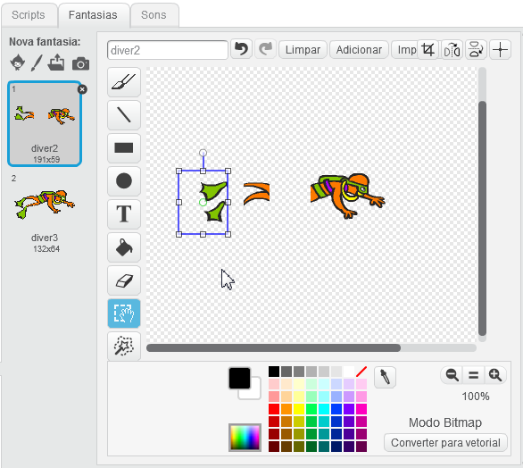
	
+ No final, verifique se o centro das duas  fantasias está no olhar do mergulhador.

	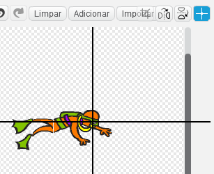
	

# Passo 2: Movimentação do mergulhador { .activity }
	
+ Defina esta movimentação para o mergulhador:

	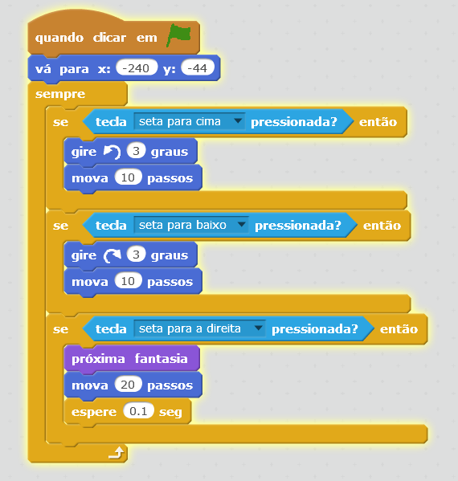

  Teste seu código.

# Passo 3: Acrescentando o ator Polvo { .activity }
	
+ Acrescente um ator polvo, para tornar a movimentação dele mais interessante, espelhe verticalmente uma das fantasias:

	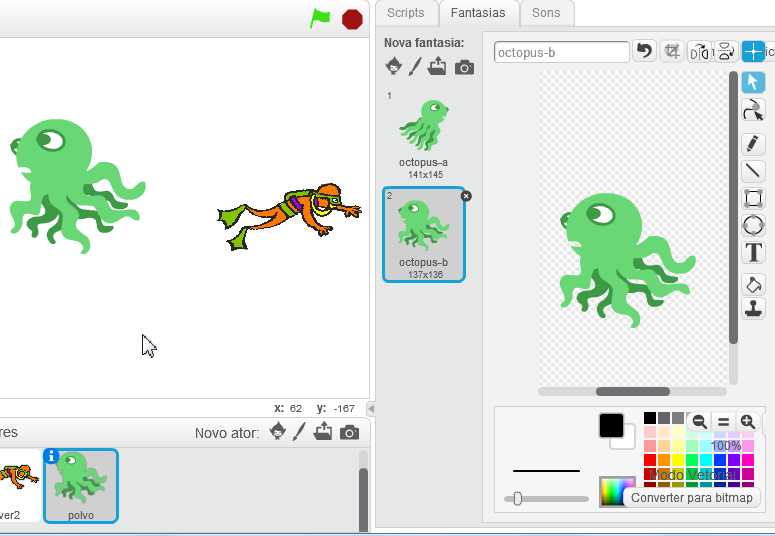

+ Defina essa movimentação para o polvo:

	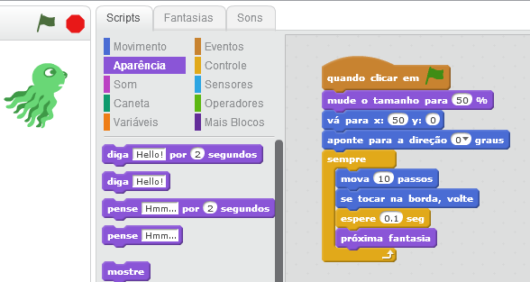

	Se ele estiver inclinado, verifique a configuração abaixo.
	Aproveite e chame seu ator de “polvo”.
	
	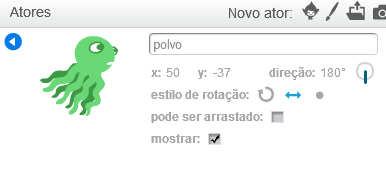

	Teste a movimentação do polvo.
	
# Passo 4: Volte para o início se tocar o polvo

	Se o mergulhador encostar no polvo, ele deve voltar ao ponto de início.
	Acrescente o código destacado ao seu script:
	
	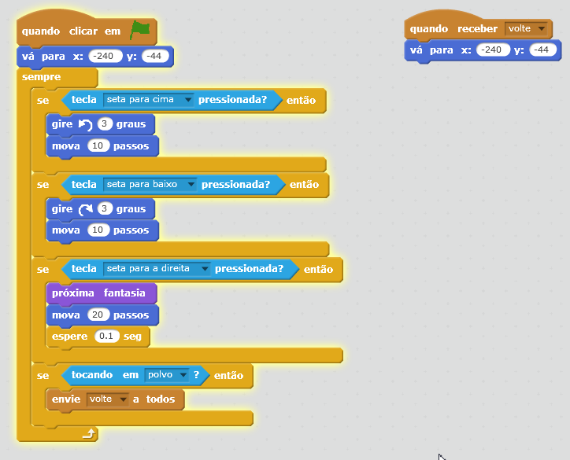
	
	Teste se está funcionando.

# Passo 5: Definindo vários níveis e seus cenários

+ Acrescente os panos de fundo da figura abaixo e os chame de nivel1, nivel2, nivel3, nivel4 e final.

	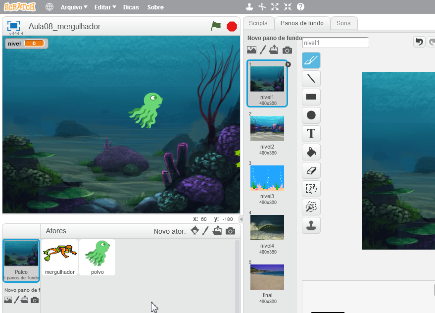
	
+ Defina o código abaixo para o pano de fundo. Desta maneira, a troca de níveis fica mais padronizada.

	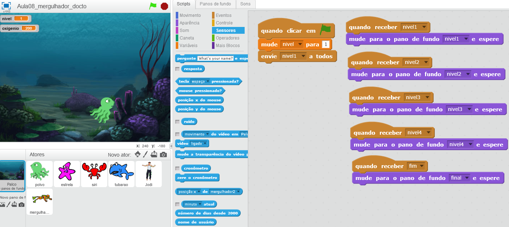

	
# Passo 6: Trocando de nível se o mergulhador atravessar o cenário

+ Se o mergulhador conseguir nadar até o lado direito do cenário, ele mudará de nível. Sabemos que ele atravessou todo o cenário quando a coordenada x é maior que 240.
	
	Acrescente o código abaixo no final do laço sempre do mergulhador:
	
	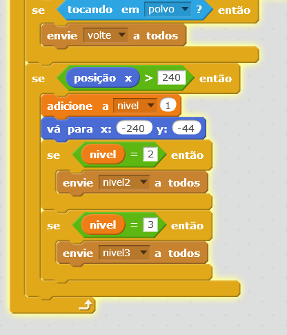

+ Verifique se a troca de nível ocorre corretamente.
	
# Passo 7: O ator polvo não deverá aparecer no nível 2

+ Para que o polvo não apareça no nivel 2, entre o código abaixo, e depois teste!
	
	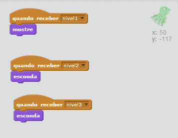
	
# Passo 8: Acrescentando mais atores
	
+ Ao acrescentar novos atores, brinque com as opções de espelhamento mostradas nas figuras para que os atores fiquem virados para o mergulhador.
	
	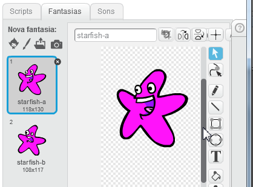
	
+ Copie o código do polvo para a estrela. Lembre-se de ajustar os detalhes, como abaixo:
	
	
	
	Se sua estrela estiver em uma posição estranha como esta:

	

	Acerte a configuração abaixo. Lembre de acertar também o nome do ator!
	
	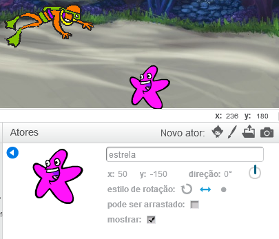
	
	Teste se ela aparece corretamente.
	
# Passo 9: O mergulhador volta para o início ao se chocar com a estrela?
	
+ Para que a estrela faça o mergulhador voltar, acrescente o código abaixo.
	
	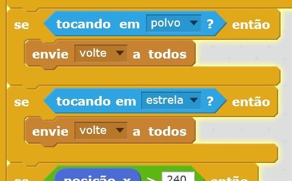
	
# Passo 10: Acertando cenários e personagens de cada nível

	Os alunos devem trabalhar sozinhos para garantir os seguintes resultados em cada um dos níveis:
	
	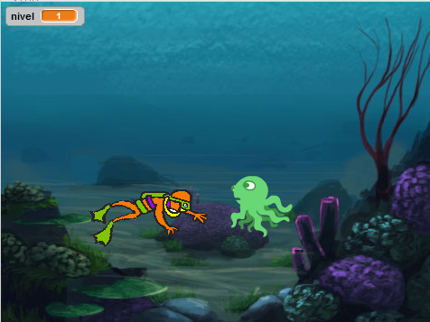
	
	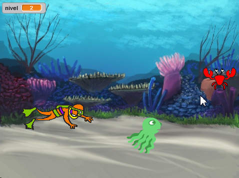
	
	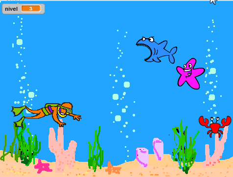
	
	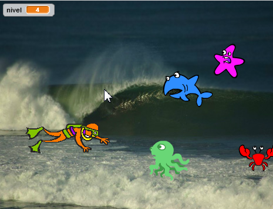
	
	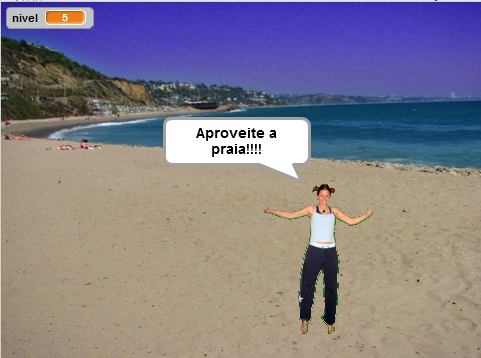
	
# Passo 11: Oxigênio

	Quando o jogo começar, o mergulhador deverá ter 200 de oxigênio.
	Cada vez que ele voltar devido à uma trombada, ele deve perder 10 de oxigênio.
	Se ele ficar sem oxigênio, uma tela de Fim de Jogo deverá aparecer!
	
	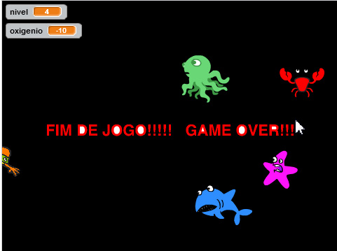

# Passo 12: Como não escapar pelas coordenadas y < -170 e y> 170

	Perceba que se o jogador subir bastante, ele consegue escapar dos seres marinhos fugindo pela parte superior ou inferior da tela.
	
	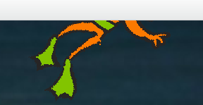
	
	Para que o mergulhador seja penalizado, caso ele queira "roubar", vamos diminuir seu oxigênio, caso ele tente fugir por baixo ou por cima. Acrescente este código ao mergulhador:
	
	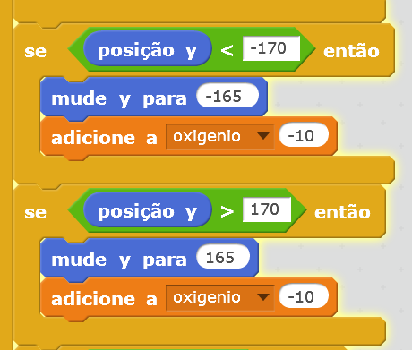
	
	Teste tentando fazer o mergulhador fugir por cima! Veja o efeito no oxigênio!
	
	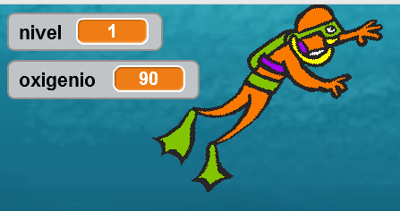
	
# Passo 13: Verifique seu código final

	Confira se o código do seu mergulhador está assim:
	
	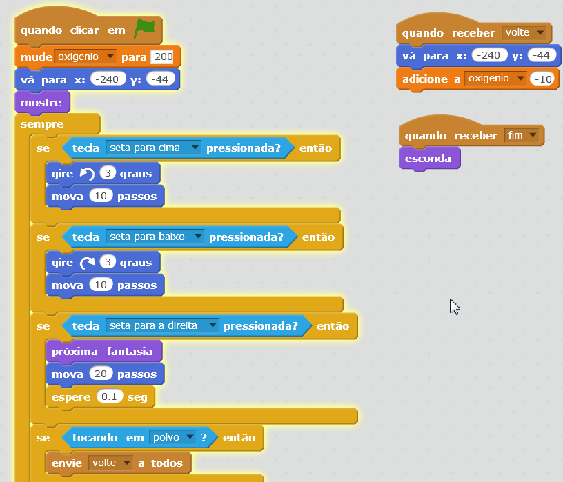
	
	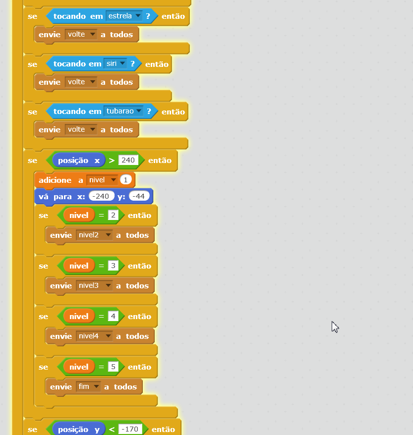
	
	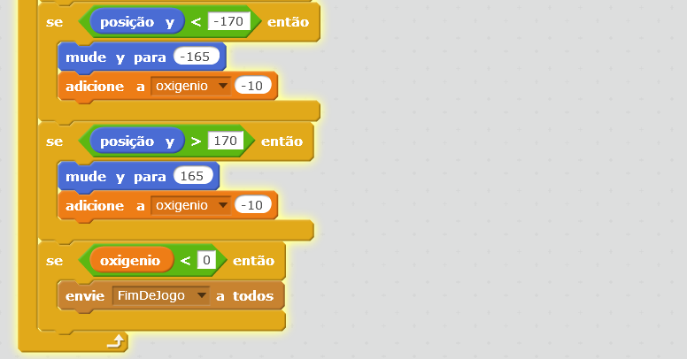
	
	Confira se o código do seu polvo está assim:
	
	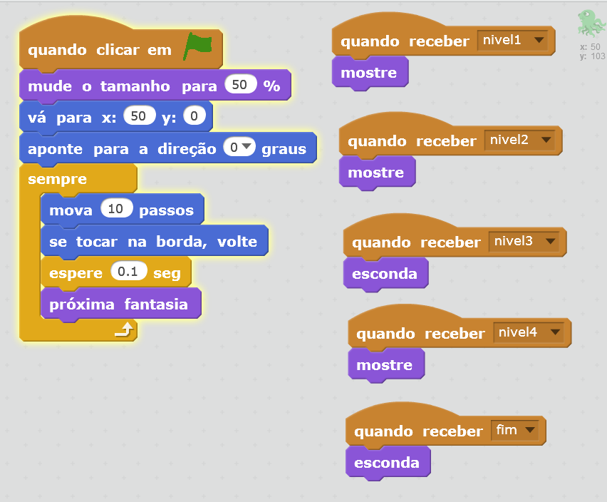
	
	Lembre-se que o código dos outros seres marinhos deve estar equivalente a este.
	
	Confira se o código das pessoa na praia está assim:
	
	
	