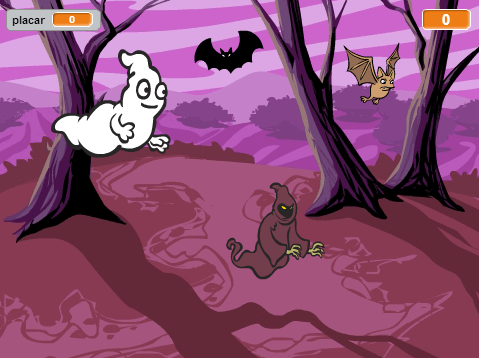
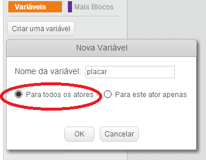
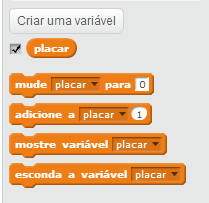
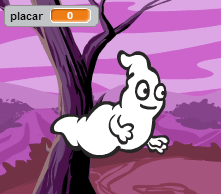
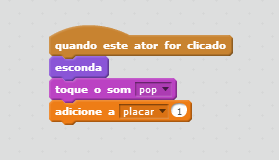
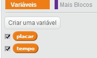
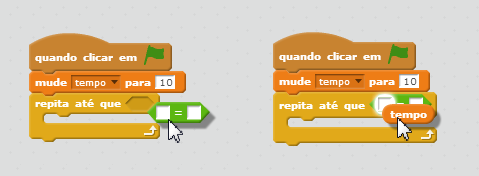
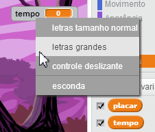

---
title: Caça fantasmas
level: Scratch 1
language: pt-BR
stylesheet: scratch
embeds: "*.png"
materials: ["Club Leader Resources/*"]
...

## Nota: { .challenge .pdf-hidden }
O projeto 'Balloons' foi movido para a seção [Additional Scratch Projects](http://projects.codeclub.org.uk/en-GB/03_scratch_bonus/index.html).

# Introdução { .intro }

Você fará um jogo de caça fantasmas!

<div class="scratch-preview">
  <iframe allowtransparency="true" width="485" height="402" src="http://scratch.mit.edu/projects/embed/60787262/?autostart=false" frameborder="0"></iframe>
  
</div>

# Passo 1: Animando um fantasma { .activity }

## Lista de Atividades { .check }

+ Comece um novo projeto Scratch, e delete o ator gato para que seu projeto fique vazio. Você pode encontrar o editor online do Scratch aqui <a href="http://jumpto.cc/scratch-new">jumpto.cc/scratch-new</a>.

+ Crie um novo ator fantasma e um pano de fundo adequado.

	

+ Acrescente este código ao seu fantasma, assim ele vai aparecer e desaparecer repetidamente:

	```blocks
		quando clicar em ⚑
		sempre
			esconda
			espere (1) seg
			mostre
			espere (1) seg
		end
	```

+ Teste seu código do fantasma clicando na bandeira verde.

## Salve seu projeto { .save }

# Passo 2: Fantasmas aleatórios { .activity }

É muito fácil pegar seu fantasma, porque ele não se move!

## Lista de Atividades { .check }

+ Ao invés de ficar na mesma posição, você pode deixar o Scratch escolher coordenadas x e y aleatoriamente. Acrescente um bloco `vá para` {.blockmotion} ao código do seu fantasma, ele vai ficar assim:

	```blocks
		quando clicar em ⚑
		sempre
			esconda
			espere (1) seg
			vá para x:(escolha número entre (-150) e (150)) y:(escolha número entre (-150) e (150))
			mostre
			espere (1) seg
		end		
	```

+ Teste seu fantasma novamente, você deve notar que ele aparece cada vez em um lugar diferente.

## Salve seu projeto { .save }

## Desafio: Mais aleatório {.challenge}
Você consegue fazer que seu fantasma `espere` {.blockcontrol} por um intervalo de tempo aleatório antes de ele aparecer?  Você consegue usar um bloco `mude o tamanho` {.blocklooks} para fazer seu fantasma ter tamanhos aleatórios cada vez que ele aparece?

## Salve seu projeto { .save }

# Step 3: Pegando fantasmas { .activity }

Vamos permitir que o jogador pegue fantasmas!

## Lista de atividades  { .check }

+ Para permitir que o jogador pegue o fantasma, acrescente este código:

	```blocks
		quando este ator for clicado
		esconda
	```

+ Teste seu projeto. Você consegue pegar os fantasmas quando eles aparecem? Se você achar difícil pegar os fantasmas, você pode jogar em modo de tela cheia clicando neste botão:

	

## Desafio: Adicionando som { .challenge }
Você consegue fazer um som cada vez que o fantasma é pego?

## Salve seu projeto { .save }

# Step 4: Acrescentando um placar { .activity .new-page }

Vamos deixar o jogo mais interessante mantendo um placar.

## Lista de Atividades { .check }

+ Para manter o placar dos jogadores, você precisa de um local para armazenar esta informação. Uma __variável__ é o local onde armazenamos dados que podem mudar, por exemplo, nosso placar.

	Para criar uma nova variável, clique na aba 'Scripts', selecione `Variáveis` {.blockdata} e entao clique em 'Criar uma variável'.

	

	Digite 'placar' que será o nome da variável, tenha certeza que ela estará disponível para todos os atores e clique em 'OK' para criá-la. Você verá vários blocos de código que podem ser usados com sua variável `placar` {.blockdata}.

	

	Você verá o placar no alto e à esquerda no seu pano de fundo. 

	

+ Quando um novo jogo é iniciado (clicando na bandeira), você deve zerar o placar do jogador:

	```blocks
	quando clicar em ⚑
	mude [score v] para [0]
	```

+ Sempre que um fantasma for pego você precisa acrescentar 1 ao placar do jogador:

	

+ Rode seu programa novamente e pegue alguns fantasmas. Seu placar muda?

## Salve seu projeto { .save }

# Step 5: Acrescentando um tempo { .activity }

Você pode tornar o jogo mais interessante, dando apenas 10 segundos para o jogador pegar o maior número possível de fantasmas.

## Lista de atividades { .check }

+ Você pode usar outra variável para armazenar a quantidade de tempo restante. Clique no pano de fundo e crie uma nova variável chamada 'tempo':

	

+ É assim que o temporizador deve funcionar:

	+ O temporizador deve começar em 10 segundos;
	+ O temporizador deve diminuir o valor a cada segundo;
	+ O jogo deve terminar quando o temporizador chegar em 0.

	Aqui está o código que faz isto e ele pode ser acrescentado ao seu  __stage__:

	```blocks
		quando clicar em ⚑
		mude [time v] para [10]
		repita até que <(time) = [0]>
			espere (1) seg
			adicione a [time v] (-1)
		end
		pare [todos v]
	```

	É assim que você adiciona o código `repita até que`{.blockcontrol}`tempo`{.blockdata}`= 0`{.blockoperators} :

	

+ Arraste sua variável 'tempo' para o lado direito da página. Você também pode clicar com o botão direito do mouse na variável e escolher 'letras grandes' para mudar o jeito como o tempo é mostrado.

	

+ Peça a um amigo para testar seu jogo. Quantos pontos eles fizeram? Se seu jogo estiver muito fácil, você pode:

	+ Dar menos tempo ao jogador;
	+ Fazer com que os fantasmas apareçam com uma frequência menor;
	+ Fazer os fantasmas menores.

	Teste seu jogo algumas vezes até que você esteja satisfeito com o nível de dificuldade.

## Salve seu projeto { .save }

## Desafio: Mais obstáculos {.challenge}
Você consegue acrescentar outros objetos ao seu jogo?


Você precisa pensar a respeito dos objetos que você está acrescentando. Pense sobre:

+ Ele é muito grande?
+ Ele vai aparecer com um frequência maior ou menor que os fantasmas?
+ Como ele vai aparentar e que barulhos vai fazer quando for capturado?
+ Quantos pontos o jogador ganha ou perde ao pegar esse objeto?

Se você precisar de ajuda para acrescentar outros objetos, você pode reusar os passos acima!

## Salve seu projeto { .save }

## Community Contributed Translation { .challenge .pdf-hidden }

This project was translated by Luciana Bezerra. Our amazing translation volunteers help us give children around the world the chance to learn to code.  You can help us reach more children by translating a Code Club project via [Github](https://github.com/CodeClub/curriculum_documentation/blob/master/contributing.md) or by getting in touch with us at hello@codeclubworld.
