---
title: Lousa Mágica
level: Scratch 1
language: pt-BR
stylesheet: scratch
embeds: "*.png"
materials: ["Club Leader Resources/*","Project Resources/*"]
...

# Introdução { .intro }

Neste projeto, você irá fazer seu próprio programa de pintura!

<div class="scratch-preview">
  <iframe allowtransparency="true" width="485" height="402" src="http://scratch.mit.edu/projects/embed/63473366/?autostart=false" frameborder="0"></iframe>
  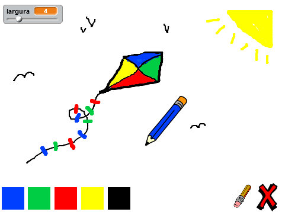
</div>

# Passo 1: Fazendo um lápis { .activity }

Vamos começar criando um lápis, que pode ser usado para desenhar no palco.

## Lista de Atividades { .check }

+ Comece um novo projeto Scratch, e delete o ator gato de forma que seu projeto fique vazio. Você pode encontrar o editor online do Scratch em <a href="http://jumpto.cc/scratch-new">jumpto.cc/scratch-new</a>.

+ Adicione o ator lápis no seu projeto.

	

+ Clique em 'Fantasias', e delete a fantasia 'lapis-b'.

	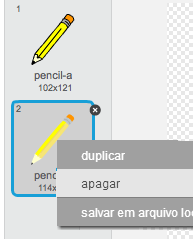

+ Renomeie sua fantasia para 'lapis-azul', e use a ferramente 'Colorir uma forma' para deixar o lápis azul.

	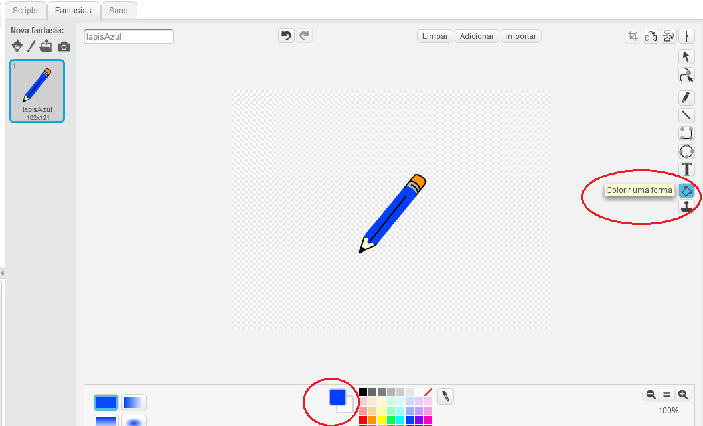

+ Como você usará o mouse para desenhar, você irá querer que o lápis siga o mouse `sempre` {.blockcontrol}. Adicione este código para o lápis:

	```blocks
		quando clicar em ⚑
		sempre
  	 		vá para [mouse pointer v]
		end
	```

+ Teste esse código clicando na bandeira e então mova o mouse em volta do palco. Funcionou como esperado?

+ Você notou que é o centro da lápis, e não a ponta, que segue o ponteiro do mouse?

	

	Para arrumar isso, clique na fantasia 'lapis-azul' do ator lápis, e clique em 'Especificar centro de fantasia'.

	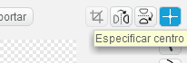

+ Você deve perceber que uma mira aparece na fantasia. Agora você pode clicar logo abaixo da ponta do lápis, para definir este ponto como centro da fantasia.

	

+ Clique na aba 'Scripts', e teste seu lápis novamente - ele funciona melhor que antes?

+ Agora, vamos fazer seu lápis desenhar `se` {.blockcontrol} se o mouse tiver sido clicado. Adicione este código para o seu lápis:

	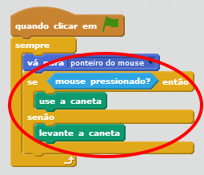

+ Teste seu código novamente. Agora, mova o lápis pelo palco e pressione o botão do mouse. Você consegue desenhar com seu lápis?

	

## Salve seu projeto { .save }

# Passo 2 2: Lápis coloridas { .activity }

Vamos adicionar diferentes cores de lápis para seu projeto, e permitir que o usuário escolha entre elas!

## Lista de Atividades { .check }

+ Clique no ator lápis, clique em 'Fantasias' e duplique a fantasia 'lapis-azul'.

	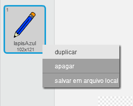

+ Renomeie sua nova fantasia para 'lapis-verde', e colore o lápis verde.

	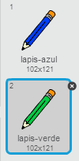

+ Crie dois novos atores, os quais você usará para selecionar o lápis azul ou verde.

	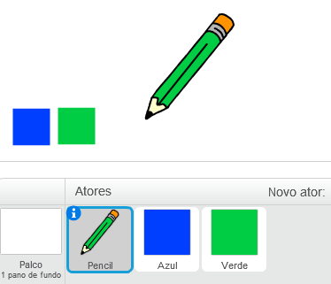

+ Quando o o seletor verde é clicado, você precisa `enviar` {.blockevents} uma mensagem para o ator lápis, dizendo para ele mudar sua fantasia e a cor do lápis.

	Para fazer isso, primeiro adicione este código para o ícone do seletor verde:

	```blocks
		quando este ator for clicado
		envie [verde v] a todos
	```

	Para criar o bloco `envie` {.blockevents}, clique na seta para baixo e selecione 'nova mensagem...'.

	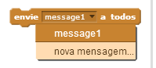

	Você pode digitar 'verde' para criar sua nova mensagem.

	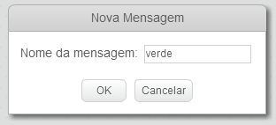

+ Você precisa contar para seu ator lápis o que fazer quando ele receber a mensagem. Adicione este código para o lápis:

	```blocks
		quando eu ouvir [verde v]
		mude para a fantasia [pencil-green v]
		mude a cor da caneta para [#00ff00]
	```

	To set the pencil to colour to green, click the coloured box in the `set color` {.blockpen} block, and click on the green selector icon to choose green as your pencil colour.

+ Você pode, agora, fazer o mesmo para o ícone do lápis azul, adicionando este código para o seletor azul:

	```blocks
		quando este ator for clicado
		envie [azul v] a todos
	```

	...e adicionando esté código para o lápis:

	```blocks
		quando eu ouvir [azul v]
		mude para a fantasia [pencil-blue v]
		mude a cor da caneta para [#0000ff]
	```

+ Finalmente, você precisa contar para o lápis qual fantasia e cor escolher, bem como limpar a tela, quando seu projeto é iniciado. Adicione esté código no começo do  código do lápis `when flag clicked` {.blockevents} (antes do loop `sempre` {.blockcontrol}):

	```blocks
		apague tudo
		mude para a fantasia [blue-pencil v]
		mude a cor da caneta para [#0000ff]
	```

	Se você quiser, você pode começar com uma cor diferente de lápis

+ Teste seu projeto. Você pode mudar entre as cores azul e verde?

	

## Salve seu projeto { .save }

# Passo 3: Fazendo erros { .activity .new-page }

Sometimes mistakes happen, so let's add a 'clear' button and an eraser to our project!

## Lista de Atividades { .check }

+ Let's add a button to clear the stage. To do this, add the 'X-block' letter sprite to the stage, and colour it in red.

	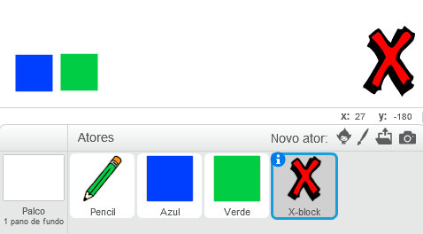

+ Add code to your new cancel button to clear the stage when it's clicked.

	```blocks
		quando este ator for clicado
		apague tudo
	```

	Notice that you don't need to send a message to clear the stage, as any sprite can do it!

+ You can also create an eraser. If your club leader has given you a 'Resources' folder, click 'Upload costume from file' and add the 'eraser.svg' image.

	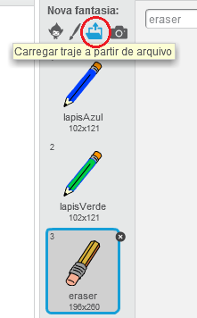

	If you don't have the eraser.svg image, just create a new white pen instead!

+ You should also add the eraser image as a new selector sprite. This is how your stage shoud look:

	

+ You can then add code to the eraser selector sprite, to tell the pencil to switch to an eraser.

	```blocks
		quando este ator for clicado
		envie [borracha v] a todos
	```

+ When the pencil receives this message, you can create an eraser by switching the pencil costume to the eraser, and switching the pencil colour to the same colour as the stage!

	```blocks
		quando eu ouvir [borracha v]
		mude para a fantasia [eraser v]
		mude a cor da caneta para [#FFFFFF]
	```

+ Teste seu projeto, veja se você consegue limpar e apagar o seu cenário. 
	 

+ Há mais um problema com o nosso lápis, você pode desenhar em qualquer local do cenário, inclusive no painel de seleção! 

	

	Para arrumar isso, você tem que dizer para o lápis para apenas desenhar quando o mouse estiver clicado _e_ se a posição y (vertical) do mouse for maior do que -120 (`posição y do mouse`{.blocksensing}`> -120` {.blockoperators}). Mude o `se` {.blockcontrol} do seu lápis para ficar parecido com isso: 

	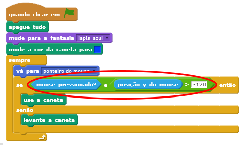

+ Teste seu projeto, você não deve conseguir desenhar nos botões de seleção agora. 

	

## Salve seu projeto { .save }

# Step 4: Mudando o tamanho do lápis { .activity .new-page }

Vamos permitir o usuário desenhar usando diverso tamanhos diferentes de lápis.

## Lista de Atividades { .check }

+ Primeiro, adicione uma nova variável chamada 'largura'. Se você não tiver certeza de como fazer isso, o projeto 'Balloons' ajudará você.

+ Adicione estla linha _dentro_ do loop `sempre` {.blockcontrol} do código do seu lápis:

	```blocks
		mude o tamanho da caneta para (largura)
	```

	A largura do seu lápis agora irá repetidamente ter o valor da variável 'width'.

+ Você pode mudar o valor armazenado nessa variável clicando com o botão direito na sua varíavel e clicando em 'slider'.

	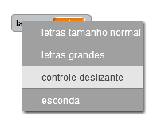

	Agora, você pode arrastar o slider abaixo da variável para mudar seu valor.

	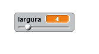

+ Teste seu projeto, e veja se você consegue modificar a largura do lápis.

	

	Se você preferir, você pode escolher um valor minimo e máximo para a variável 'width'. Para fazer isso, clique com o botão direito novamente na sua variável e clique em' set slider min and max'. Escolha os valores minimo e máximo para sua variável para valores mais sensíveis, como 1 e 20.
	
	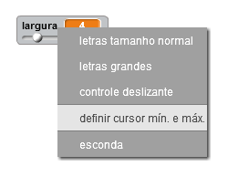

	Continue testando sua variável 'width' até você ficar feliz.

## Salve seu projeto { .save }

## Desafios: Atalhos { .challenge }
Você consegue criar novos atalhos de teclado para seus comandos? Por exemplo:

+ b = mudar para azul
+ g = mudar para verde
+ e = mudar para borracha
+ c = limpar tela

Você também poderia permitir ao usuário mudar o tamanho do lápis com as setas do teclado!

## Salve seu projeto { .save }

## Desafio: Mais canetas { .challenge }
Você consegue adicionar canetas vermelhas, amarelas e pretas para seu programa de desenhar? Você encontrará todas as imagens que precisar na pasta 'Resources'. Lembre de adicionar atalhos de teclado para essas novas cores!

Você consegue usar suas canetas para desenhar uma foto?


