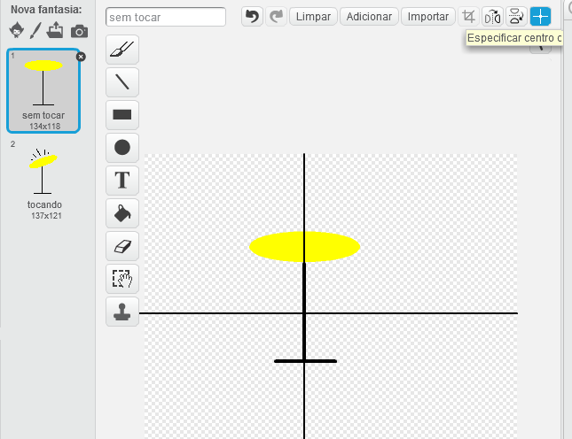

---
title: Banda de Rock —  Nota para Líderes de Clubes
language: pt-BR
embeds: "*.png"
materials: [""]
...

#Introdução:
Neste projeto as crianças vão aprender como adicionar som e música em seus projetos, bem como a mudança de trajes e de programação de sprite.

#Recursos
Para este projeto o Scratch 2 deve ser usado. Scratch 2 pode ser usado online em [jumpto.cc/scratch-on](http://jumpto.cc/scratch-on) ou pode ser baixado de [jumpto.cc/scratch-off](http://jumpto.cc/scratch-off) e usado offline.

Você pode encontrar uma versão completa deste projeto <a href="http://scratch.mit.edu/projects/26741186/#editor">online</a>, ou ele pode ser baixado clicando no ligação do projeto 'Download Project Materials'. Conteúdo:

+ RockBand.sb2

#Objetivos de aprendizagem
+ Sprites;
+ Trajes;
+ Blocos de código sequenciais;
+ Eventos;
+ Som e música.

#Desafios
+ "Melhorar o seu tambor" - Alterar sons do Sprite e adicionar eventos;
+ "Mudando o traje de seu cantor" - adicionar e controlar trajes de sprite;
+ "Faça a sua própria banda" - usar as habilidades aprendidas para criar novos instrumentos.

#Perguntas frequentes
+ Ao criar os seus próprios sprites as crianças podem achar que seu sprite fez "saltos" quando clicado, conforme muda de fantasia. Isto acontece porque os dois trajes não são centrados no mesmo lugar.

	Para corrigir isso clique em 'Especificar centro da fantasia' em _ambos_ sprites, e verifique se eles estão centradas no mesmo ponto em ambos os trajes.

	

+ No Linux, clicando com o botão direito para apagar um sprite pode não funcionar. Se este for o caso, segurando shift e clicando com o botão esquerdo fará com que o menu apareça para apagar um sprite.
