---
title: Rock Band
level: Scratch 1
language: pt-BR
stylesheet: scratch
embeds: "*.png"
materials: ["Club Leader Resources/*.*"]
...

# Introdução { .intro }

Neste projeto você vai aprender como codificar os seus próprios instrumentos musicais!

<div class="scratch-preview">
  <iframe allowtransparency="true" width="485" height="402" src="http://scratch.mit.edu/projects/embed/26741186/?autostart=false" frameborder="0"></iframe>
  
</div>

# Passo 1: Atores { .activity }

Antes que você possa começar a animar, você precisa adicionar uma 'coisa' para animar. No Scratch, estas "coisas" são chamados __atores__. 

## Lista de atividades { .check }

+ Primeiro, abra o editor do Scratch. Você pode encontrar o editor Scratch on-line em <a href="http://jumpto.cc/scratch-new">jumpto.cc/scratch-new</a>. A aparência é como este:

	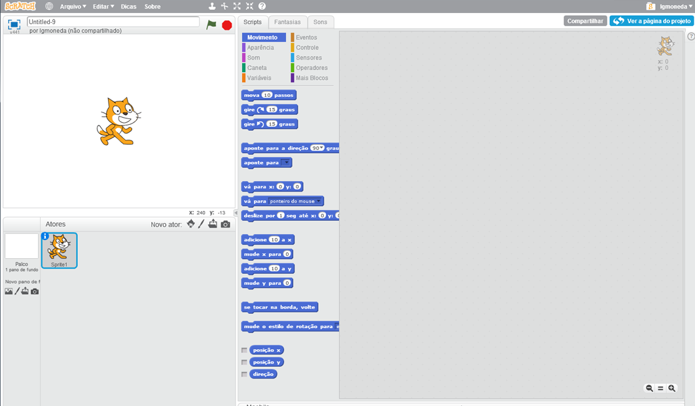

+ O ator que você pode ver (um gato), é o mascote do Scratch. Vamos nos livrar dele, clicando com o botão direito e, em seguida, clicando em 'apagar'.

	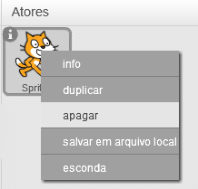

+ Em seguida, clique 'Escolher ator da biblioteca' para abrir uma lista de todos os atores presentes no Scratch.

	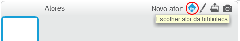

+ Role para baixo até ver a imagem de um tambor. Clique no tambor, e clique 'OK' para adicioná-lo ao seu projeto.

	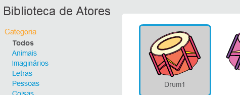

+ Clique o ícone 'reduzir', e em seguida, clique no tambor algumas vezes para reduzir o seu tamanho.

	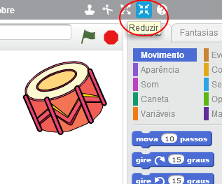

## Salve o seu projeto { .save }

Dê a seu programa um nome, digitando o nome na caixa de texto acima do 'palco'.

Você pode, em seguida, clicar em "Arquivo" e depois "Salvar agora" para salvar seu projeto.

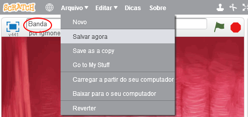

# Passo 2: Palco { .activity }

O __palco__ é a área à esquerda, e é o lugar onde o seu projeto ganha vida. Pense nisso como uma área de atuação, assim como em um filme, peça de teatro ou o cenário de um jogo!

## Checklist do atividade { .check }

+ No momento, o palco é branco e parece muito chato! Vamos adicionar um pano de fundo para o palco, clicando 'Escolher pano de fundo da biblioteca'.

	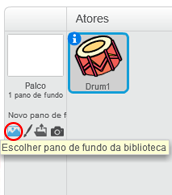

+ Clique em 'interior' à esquerda, e em seguida, clique em uma cortina de fundo e clique 'OK'.

	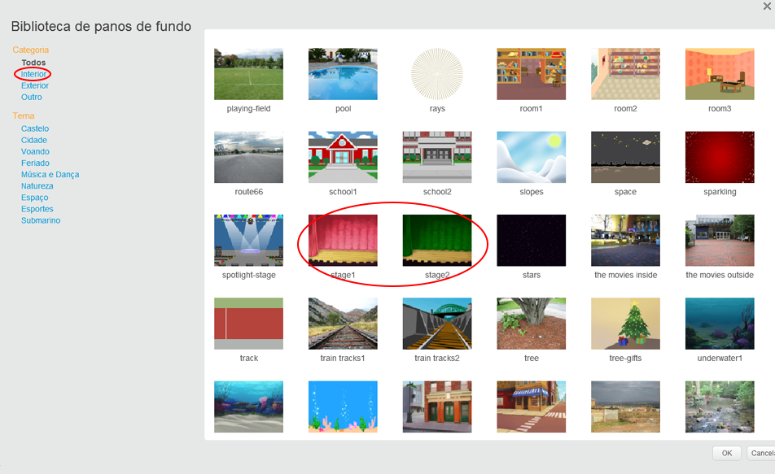

+ Seu palco deve agora estar como este:

	

# Passo 3: Fazendo um tambor { .activity }

Vamos codificar seu tambor para fazer um som quando é atingido.

## Lista de atividades { .check }

+ Você pode encontrar os blocos de código na aba 'Scripts', e todos eles são codificados por cores! 

	Clique no ator do tambor, e em seguida arraste estes 2 blocos na área do código à direita. Verificar se eles estão ligados entre si (como blocos de Lego):

	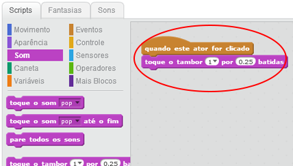

+ Clique no tambor para experimentar o seu novo instrumento!

+ Você também pode alterar a forma como o tambor fica quando este é clicado, criando uma nova Fantasia. Clique na aba 'Fantasias', e você verá a imagem do tambor.

	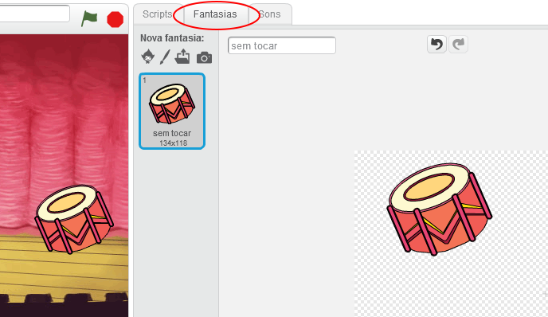

+ Clique com o botão direito do mouse sobre o Fantasia e clicar em 'duplicar' para criar uma cópia da Fantasia.

	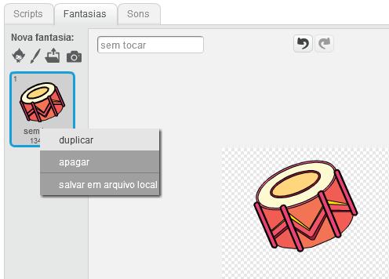

+ Clique na nova Fantasia (chamada 'drum2') e em seguida selecione a ferramenta de linha. E você pode desenhar linhas para fazer parecer que o tambor está fazendo um som.

	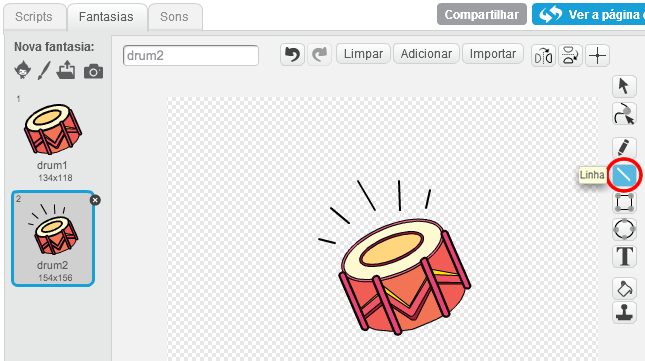

+ Os nomes dos Fantasias não são muito úteis no momento. Mude o nome das 2 Fantasias para 'sem tocar' e 'tocando'. Você pode digitar o novo nome de cada Fantasia na caixa de texto.

	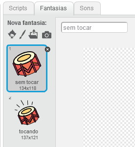

+ Agora que você tem 2 Fantasias diferentes para su tambor, você pode escolher qual Fantasia é exibida! Adicione 2 blocos para o seu tambor:

	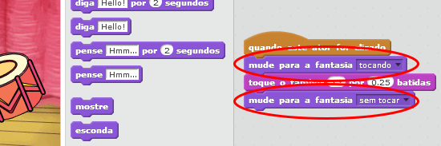

	O bloco de código para alterar o Fantasia é na secção `Aparência` {.blocklooks}.

+ Teste o seu tambor. Quando clicado, o tambor deve agora parecer como se tivesse sido tocado!

## Salve o seu projeto { .save }

##Desafio: Melhorar o seu tambor { .challenge }

+ Você pode alterar o som que o tambor faz quando é clicado?

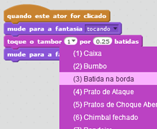

+ Você também pode fazer um som quando a barra de espaço é pressionada? Você vai precisar usar este bloco da secção `Eventos` {.blockevents}:

```blocks
	quando a tecla [espaço v] for pressionada
  end
```

Você pode copiar seu código existente clicando com o botão direito sobre ele e clique 'duplicar'.

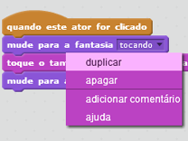

## Save your project { .save }

# Passo 4: Fazendo um cantor { .activity .new-page }

Vamos adicionar um cantor a sua banda!

## Checklist do atividade { .check }

+ Adicionar mais 2 atores para o seu palco: um(a) cantor(a) e um microfone.

	

+ Antes de poder fazer o seu cantor cantar, você precisa adicionar um som para o seu ator. Certifique-se de que você selecionou o seu cantor, em seguida, clique na aba 'Sons', e clique em 'Escolher som da biblioteca':

	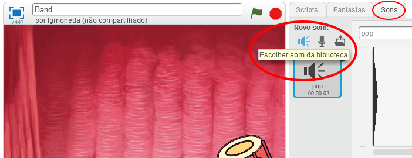

+ Se você clicar 'Vocais' do lado esquerdo, então você vai ser capaz de escolher um som adequado para adicionar ao seu ator.

	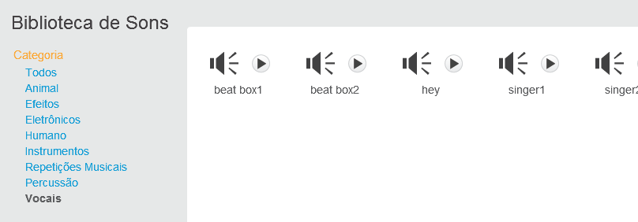

+ Agora que foi adicionado o som, você pode adicionar este código ao seu cantor(a):

	```blocks
		Quando este ator for clicado
        toca o som [singer1 v] até terminar
	```

+ Clique na sua cantora, para testar se ela canta quando clicada.

## Salve o seu projeto { .save }

##Desafio: Mudando a Fantasia do cantor { .challenge }
Você pode fazer com que o seu cantor pareça que está cantando quando você clica nele? Se você precisar de ajuda, você pode usar as instruções  acima para a criação da fantasia extra do tambor.


Lembre-se de testar seu novo código!

## Salve o seu projeto { .save }

##Desafio: Faça a sua própria banda { .challenge }
Use o que você aprendeu neste projeto para fazer a sua própria banda! Você pode criar muitos instrumentos que você gosta, olhe para os sons e instrumentos para obter algumas idéias legais.

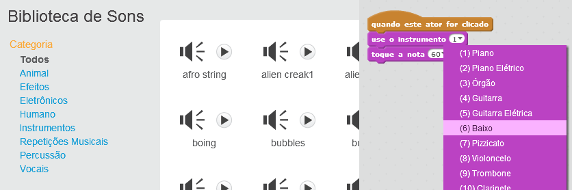

Os seus instrumentos não tem que fazer sentido. Por exemplo, você poderia fazer um piano feito de bolinhos!


Bem como a utilização de atores existentes, você também pode criar seus próprios atores.

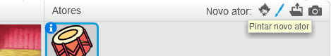

Se você tiver um microfone você pode gravar os seus próprios sons, ou mesmo usar uma webcam para fazer seus instrumentos!

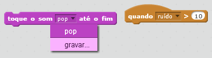

## Salve o seu projeto { .save }

## Community Contributed Translation { .challenge .pdf-hidden }

This project was translated by Silvio Casagrande and Luis Moneda. Our amazing translation volunteers help us give children around the world the chance to learn to code.  You can help us reach more children by translating a Code Club project via [Github](https://github.com/CodeClub/curriculum_documentation/blob/master/contributing.md) or by getting in touch with us at hello@codeclubworld.

