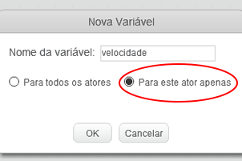
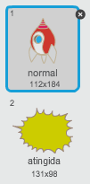
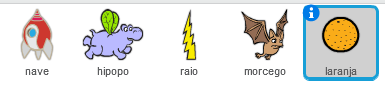
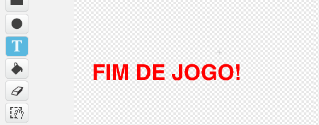

---
title: Guerra dos Clones
level: Scratch 2
language: pt-BR
stylesheet: scratch
embeds: "*.png"
materials: ["Club Leader Resources/*"]
beta: true
...

## Projeto elaborado pela Comunidade! { .challenge .pdf-hidden }
Este projeto foi criado com o Erik. Se você gostaria de contribuir com um projeto feito por você, então [visite o nosso repositório no Github](https://github.com/CodeClub).

# Introdução { .intro }

Neste projeto você aprenderá a criar um jogo no qual você terá que salvar a Terra de monstros espaciais. 

<div class="scratch-preview">
  <iframe allowtransparency="true" width="485" height="402" src="http://scratch.mit.edu/projects/embed/46018140/?autostart=false" frameborder="0"></iframe>
  
</div>

# Passo 1: Construindo a nave { .activity }

Vamos construir a nave que defenderá a Terra! 

## Lista de atividades { .check }

+ Comece um novo projeto no Scratch e apague o ator do gato, assim o seu projeto estará vazio. Você pode encontrar o editor do Scratch online em <a href="http://jumpto.cc/scratch-new">jumpto.cc/scratch-new</a>.

+ Adicione o pano de fundo das 'stars' (estrelas) e o ator 'Spaceship' (nave) ao seu projeto. Reduza o tamanho da nave e coloque-a na parte de baixo do cenário. 

	

+ Adicione o código que fará a sua nave voar para a esquerda quando o jogador apertar a seta esquerda, você usará esses blocos: 

	```blocks
		quando clicar em ⚑
		sempre
		   se <tecla [seta para a esquerda v] pressionada?> então
		      adicione (-4) a x
		   end
		end
	```

+ Adicione o código para mover a sua nave para a direita quando a seta direita for pressionada. 

+ Teste seu projeto para ver se o controle da sua nava está funcionando corretamente com as setas direcionais. 

## Salveu seu projeto { .save }

# Passo 2: Descargas elétricas { .activity }

Vamos dar à nossa nave a habilidade de disparar raios elétricos! 

## Lista de atividades { .check }

+ Adicione o ator 'Lightning' (relâmpago) da biblioteca do Scratch, mude o nome dele para "raio" ou algo parecido. Clique na fantasia do ator e mude-a para ficar de cabeça para baixo. 

	

+ Quando o jogo tiver começado, o raio deve estar escondido até que a nave o dispare. 

	```blocks
		quando clicar em ⚑
		esconda
	```

+ Adicione o código seguinte ao script da sua nave para que seja criado um novo raio toda vez que a tecla espaço for pressionada.


	```blocks
		quando clicar em ⚑
		sempre
		   se <tecla [espaço v] pressionada?> então
		      crie clone de [raio v]
		   end
		end
	```

+ Toda vez que um clone é criado, ele deve aparecer no mesmo local da nave e então subir até que toque a beirada do cenário. Adicione o seguinte código ao seu ator "raio":

	```blocks
		quando eu começar como clone
		vá para [nave v]
		mostre
		repita até que <tocar em [borda v]?>
		   adicione (10) a y
		end
		apague este clone
	```

Perceba que nós movemos o novo clone até a nave enquanto ele continua escondido, antes dele aparecer no jogo. Pois assim fica mais legal. 

+ Teste seus raios apertando a tecla espaço. 

## Salve seu projeto { .save }

## Desafio: Arrumando os raios {.challenge}
O que acontece se você segurar a tecla espaço pressionada? Você pode usar o bloco `espere` {.blockcontrol} para arrumar isso?

## Salve seu projeto { .save }

# Passo 3: Hipopótamos espaciais { .activity }

Vamos adicionar vários hipopótamos espaciais que tentarão destruir a nossa nave. 

## Lista de atividades { .check }

+ Crie um novo ator chamado "hipopo" importando da biblioteca do Scratch a imagem 'Hippo1'.

	

+ Defina o seu estilo de rotação como esquerda-direita apenas, e adicione o seguinte código para escondê-lo quando o jogo começa:

	```blocks
	quando clicar em ⚑
	esconda
	```

+ Crie uma nova variável chamada `velocidade` {.blockdata}, ela será apenas para o ator "hipopo".

	

	Você saberá se tiver feito isso da maneira correta, pois a variável terá o nome do ator ao seu lado, desta forma: 

	

+ O seguinte código irá criar um novo hipopótamo de tempos em tempos. **O palco** é um bom local para colocar esse script!

	```blocks
		quando clicar em ⚑
		sempre
		   espere (escolha número entre (2) e (4)) seg
		   crie clone de [hipopo v]
		end
	```

+ Quando cada clone do hipopótamo começa, faça com que ele fique zanzando pelo cenário (com uma velocidade aleatória, ou seja, cada hipopótamo com uma velocidade diferente) até que ele seja atingido pelo raio da nave. Adicione esse código ao ator **hipopo**:

	```blocks
		quando eu começar como clone
		mude [speed v] para (escolha número entre (2) e (4))
		vá para x:(escolha número entre (-220) e (220)) y:(150)
		mostre
		repita até que <tocar em [raio v]?>
		   mova (velocidade) passos
		   gire ↻ (escolha número entre (-10) e (10)) graus
		   se tocar na borda, volte
		end
		apague este clone
	```

+ Teste o código do seu hipopótamo. Você deve ver um novo clone dele aparecer a em intervalos de alguns segundos, cada um se movendo com uma velocidade diferente. 

	

+ Teste a sua arma de raio elétrico. Se você acerta um hipopótamo, ele desaparece? 

+ Quando um hipopótamo encosta na sua nave, você precisa fazer com que ela exploda! Para fazer isso, primeiro vamos fazer com que a nave tenha duas fantasias, uma chamada 'normal' e 'atingida'.

	

	A fantasia  'atingida' da nave deve ser feita importando da biblioteca do Scratch a imagem 'Sun' (sol), e usando a ferramenta 'Colorir uma forma' para mudar a cor dela.

	

+ Adicione esse código para a nave, assim ela mudará de fantasia sempre que um hipopótamo voador encostar nela: 

	```blocks
		quando clicar em ⚑
		sempre
		   mude para a fantasia [normal v]
		   espere até <tocar em [hipopo v]?>
		   mude para a fantasia [atingida v]
		   envie [atingida v] a todos
		   espere (1) seg
		end
	```

+ Você notou que há o envie de uma mensagem 'atingida' no código acima? Você pode usar essa mensagem para fazer com que todos os hipopótamos desapareçam quando a nave for atingida. 

	Adicione este código ao "hipopo":

	```blocks
		quando eu ouvir [atingida v]
		apague este clone
	```

+ Teste o seu código iniciando um novo jogo e deixando um hipopótamo tocar a sua nave. 

	

## Salve seu projeto { .save }

## Desafio: Vidas e pontuação {.challenge}
Você pode consegue adicionar `vidas` {.blockdata}, `pontuação` {.blockdata} ou até mesmo `melhor pontuação` {.blockdata} ao seu jogo? Você pode usar o projeto "Capturando Bolinhas" para te ajudar. 

## Salve seu projeto { .save }

# Passo 4: Morcegos fruteiros! { .activity }

Vamos fazer um morcego fruteiro que atira laranjas na sua nave! 

## Lista de atividades { .check }

+ Primeiramente, faça um novo ator para o morcego (importe a imagem da biblioteca do Scratch) e que irá `mover-se` {.blockmotion} ao longo do topo do palco `sempre` {.blockcontrol}. Lembre-se de testar o seu código.

	

+ Se você reparar nas fantasias do morcego, você verá que ele já vem com duas: 

	

	Use o bloco `próxima fantasia` {.blocklooks} para fazer com que o morcego bata as suas asas enquanto se movimenta.

+ Crie um novo ator 'Orange' (laranja) utilizando a bilioteca do Scratch

	


+ Adicione este código ao morcego, então ele criará um novo clone de laranja dentro de intervalos de tempo de alguns segundos: 

	```blocks
		quando clicar em ⚑
		sempre
		   espere (escolha número entre (5) e (10)) seg
		   crie clone de [laranja v]
		end
	```

+ Clique no ator da laranja e adicione esse código, que faz com que cada clone da laranja caia do morcego e vá na direção da nave: 

	```blocks
		quando clicar em ⚑
		esconda

		quando eu começar como clone
		vá para [morcego v]
		mostre
		repita até que <tocar em [borda v]?>
		   adicione (-4) a y
		end
		apague este clone

		quando eu ouvir [atingida v]
		apague este clone
	```

+ Para a sua nave, você precisará modificar o código para que ela seja atingida tanto pelo hipopótamo quanto pela laranja: 

	```blocks
		espere até <<tocar em [hipopo1 v]?> ou <tocar em [laranja v]?>>
	``` 

+ Teste seu jogo. O que acontece se você é atingido por uma laranja? 

## Salve seu projeto { .save }

# Passo 5: Game over - Fim de jogo { .activity }

Vamos adicionar uma mensagem de fim de jogo, o 'game over'.

## Lista de atividades { .check }

+ Se ainda não tiver feito, crie agora uma variável chamada `vidas` {.blockdata}. Sua nave deve começar com 3 vidas e perder uma delas sempre que colidir com algum dos inimigos. Seu jogo também deve parar quando você tiver perdido todas as vidas. Se precisar de ajuda, você pode usar o projeto "Capturando bolinhas" para te ajudar. 

+ Desenhe um novo ator chamado 'Fim de jogo' (ou 'Game Over', o que preferir), utilizando a ferramenta de texto.

	

+ No seu palco, envie a mensagem `fim de jogo` {.blockevents} pouco antes do jogo terminar.

	```blocks
		envie [fim de jogo v] a todos e espere
	```

+ Adicione este código ao ator 'Game Over', assim a mensagem aparecerá no final do jogo:

	```blocks
		quando clicar em ⚑
		esconda

		quando eu ouvir [fim de jogo v]
		mostre
	```

	Por você ter usado um bloco `envie [fim de jogo] a todos e espere` {.blockevents} no seu palco, ele irá esperar o ator 'Fim de Jogo' aparecer antes que o jogo termine.

+ Teste seu jogo. Quantos pontos você consegue fazer? Você consegue pensar em uma maneira de melhorar o seu jogo, caso ele esteja muito fácil ou muito difícil? 

## Salve seu projeto { .save }

## Desafio: Melhore seu jogo {.challenge}
Que melhorias você pode fazer ao seu jogo? Aqui estão algumas idéias: 
+ Adicione poções de vida para que o jogador ganhe vidas extras; 


+ Adicione meteoros que a sua nave deve evitar de colidir; 


+ Crie mais inimigos que devem aparecer somente quando o jogador fizer 100 pontos. 

```blocks
	espere até <(pontuação) = [100]>
```

## Salve seu projeto { .save }
