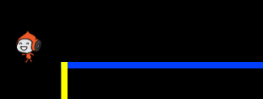
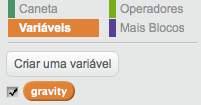
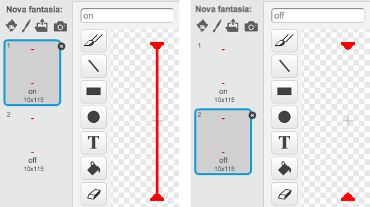
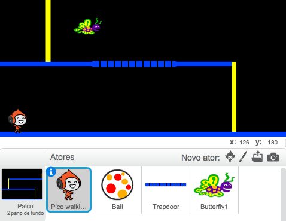
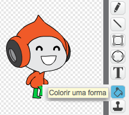

---
title: EsquivaBol
level: Scratch 2
language: pt-BR
stylesheet: scratch
embeds: "*.png"
materials: ["Club Leader Resources/*","Project Resources/*"]
...

# Introdução { .intro }

Neste projeto você vai aprender como fazer um jogo de plataforma, em que você tem que se esquivar das bolas em movimento e chegar ao final do nível.

<div class="scratch-preview">
  <iframe allowtransparency="true" width="485" height="402" src="http://scratch.mit.edu/projects/embed/39740618/?autostart=false" frameborder="0"></iframe>
  
</div>

# Passo 1: Movimento do personagem { .activity }

Vamos começar criando um personagem que pode se mover para a esquerda e direita, e também escalar os postes.

## Lista de atividades { .check }

+ Inicie um novo projecto Scratch, e excluir o ator do gato para que seu projeto esteja vazio. Você pode encontrar o editor Scratch on-line em <a href="http://jumpto.cc/scratch-new">jumpto.cc/scratch-new</a>. 

+ Para este projeto, você deve ter uma pasta 'Project Resources'. Ele contém a imagem de fundo que você precisa. Certifique-se de que você pode encontrar esta pasta, e pergunte ao seu líder do clube, se você não consegue encontrá-la.

	

+ Adicione a imagem 'background.png' como pano de fundo do palco, ou desenhe o seu próprio! Se você está desenhando seu próprio nível, certifique-se de que os postes e os pisos são de cores diferentes, e que há uma porta (ou algo similar) que o jogador tem que chegar. Seu projeto deve ficar parecido com algo assim:

	

+ Adicionar um novo ator, que será o seu personagem. É melhor se você escolher um ator com várias fantasias, de modo que você pode fazer com que pareça que ele está andando.

	

+ Vamos usar as teclas de setas para mover o personagem. Quando o jogador pressiona a seta para a direita, você quer que seu personagem vire-se para a direita, dê alguns passos e mude para a próxima fantasia:

	```blocks
quando clicar em ⚑
sempre
   se <tecla [seta para a direita v] pressionada?> então
      aponte para a direção (90 v) graus
      mova (3) passos
      próxima fantasia
   end
end
	```

+ Teste seu personagem clicando a bandeira e, em seguida, mantendo pressionada a tecla de seta direita. Será que o seu jogador irá se mover para a direita? Será que o seu personagem parece estar andando?

	

+ Para mover o seu personagem para a esquerda, você vai precisar adicionar outro bloco `se` {.blockcontrol} dentro de laço `sempre` {.blockcontrol}, que move o seu personagem para a esquerda. Lembre-se de testar o seu novo código para certificar-se de que ele funciona!

+ Para escalar um poste, seu personagem deve mover-se ligeiramente quando a seta para cima é pressionada e ele estiver tocando a cor correta (a do poste!). Adicione este código dentro de laço `sempre` {.blockcontrol} de seu personagem:

	```blocks
se <<tecla [seta acima v] pressionada?> e <tocou na cor [#FFFF00]?>> então
   adicione (4) a y
end
	```

+ Teste o seu personagem - você consegue escalar os postes amarelos e chegar ao fim do seu nível?

	

## Salve o seu projeto { .save }

## Desafio: Completar o nível {.challenge}
Você consegue adicionar mais código para o seu personagem para que ele diga alguma coisa `se` {.blockcontrol}  chegar à porta marrom?


## Salve o seu projeto { .save }

# Passo 2: Gravidade e saltando { .activity }

Seu personagem pode se mover de forma mais realista se você adicionar gravidade e a capacidade de saltar.

## Checklist do atividade { .check }

+ Você deve ter notado que o seu personagem pode andar fora de uma plataforma, meio "voando". Tente andar meio fora de uma plataforma e ver o que acontece.

	

+ Para corrigir isso, vamos adicionar a gravidade para o seu jogo. Crie uma nova variável chamada `gravidade` {.blockdata}. Você pode esconder esta variável do seu estágio, se você quiser.

	

+ Adicione este novo bloco de código, que define a gravidade como um número negativo, e depois é utilizada para mudar várias vezes a coordenada y (posição vertical) de seu personagem.

	```blocks
quando clicar em ⚑
mude [gravity v] para [-4]
sempre
   adicione (gravidade) a y
end
	```

+ Clique na bandeira, e depois arraste o seu personagem para o topo do cenário. O que acontece? A gravidade age como você esperava?

	

+ A gravidade não deve mover o seu personagem através de uma plataforma ou um poste! Agregue un bloco `se` {.blockcontrol}, de modo que a gravidade só funciona quando seu personagem está no ar. O código de gravidade deve ficar como este:

	```blocks
	quando clicar em ⚑
	mude [gravidade v] para [-4]
	sempre
	   se <não <<tocou na cor [#0000FF]?> ou <tocou na cor [#FFFF00]?>>> então
	      adicione (gravidade) a y
	   end
	end
	```

+ Teste a gravidade novamente. Será que o seu personagem para quando ele está em uma plataforma ou um poste? Você pode andar fora da borda da plataformas para o nível inferior?

	

+  Vamos também fazer o seu personagem saltar quando o jogador pressionar a barra de espaço. Uma maneira muito fácil de fazer isso é mover seu personagem para cima algumas vezes, usando este código:

	```blocks
	quando pressionar tecla [espaço v]
	repita (10) vezes
	   adicione (4) a y
	end
	```

	Como a gravidade está constantemente empurrando seu personagem para baixo em 4 pixels, você precisa escolher um número superior a 4 em seu bloco `adicione (4) a y` {.blockmotion}. Altere esse número até que você esteja contente com o tamanho do salto do seu personagem.

+ Se você testar este código, você vai notar que ele funciona, mas o movimento não é muito bom. Para fazer o salto mais suave, você precisará mover o seu personagem em quantidades cada vez menores, até que não esteja saltando mais.

+ Para fazer isso, criar uma outra variável chamada `altura pulo` {.blockdata}. De novo, você pode esconder esta variável, se você preferir.

+ Apagar o código de salto que você adicionou ao seu personagem, e substituí-lo com este código:

	```blocks
	quando pressionar tecla [espaço v]
	mude [altura pulo v] para [8]
	repita até que <(altura pulo) = [0]>
	   adicione (altura pulo) a y
	   adicione a [altura pulo v] (-0.5)
	end
	```

	Este código move o seu personagem por 8 pixels, em seguida, 7,5 pixels, em seguida, 7 pixels e assim por diante, até que seu personagem tenha terminado de saltar. Isso faz o salto parecer muito mais suave.

+ Alterar o valor inicial de sua variável `altura pulo` {.blockdata} e testá-lo até que você esteja feliz com o salto de seu personagem.

## Salve o seu projeto { .save }

## Desafio: salto melhorado! {.challenge}
Seu personagem é capaz de saltar quando a barra de espaço é pressionada, mesmo se ele já estiver no ar. Você pode testar isso mantendo pressionada a barra de espaço. Você pode corrigir isso, para que o personagem só possa saltar `se` {.blockcontrol} ele estiver tocando uma plataforma azul, ou seja, o chão do cenário?

## Salve o seu projeto { .save }

# Passo 3: Esquivando das bolas { .activity .new-page}

Agora que você tem o seu personagem se movendo pelo cenário, vamos adicionar algumas bolas. É delas que o seu personagem vai se esquivar no nosso EsquivaBol!

## Lista de atividades { .check }

+ Crie um novo ator para a bola. Você pode escolher qualquer tipo de bola que você preferir.

	

+ Redimensione a sua bola, de modo que seu personagem pode saltar sobre ela. Tente saltar na frente da bola para testar. 

	

+ Adicione este código à sua bola:

	

	Esse código cria uma nova bola a cada 3 segundos. Cada nova bola se move ao longo da plataforma superior.

+ Clique na bandeira para testar.

	

+ Adicione mais código para seu ator, de modo que elas se movam em todas as 3 plataformas.

	

+ Finalmente, você precisará de código para quando seu personagem é atingido por uma bola! Repare que aqui o nosso ator do personagem continuou com o nome "Pico Walking" que veio da biblioteca, caso tenha mudado o nome dele. faça a alteração! Adicione este código ao ator da bola:

	```blocks
quando eu começar como clone
sempre
   se <tocar em [Pico walking v]?> então
      envie [atingido v] a todos
   end
end
	```

+ Você também vai precisar adicionar código para o seu personagem. Assim, quando atingido, o personagem vai voltar para o início:

	```blocks
quando eu ouvir [hit v]
aponte para a direção (90 v) graus
vá para x:(-210) y:(-120)
	```	

+ Teste o seu personagem e veja se ele vai voltar para o início quando for atingido por uma bolas.

## Salve o seu projeto { .save }

## Desafio: bolas aleatórias {.challenge}
As bolas que seu personagem tem que evitar têm a mesma aparência, e sempre aparecem a cada 3 segundos. Você pode melhorá-las? De modo a que as bolas:

+ Nem todas tenham a mesma aparência?
+ Apareçam depois de um período de tempo aleatório?
+ Sejam de tamanho aleatório?


## Salve o seu projeto { .save }

# Passo 4: Lasers! { .activity .new-page}

Vamos fazer o seu jogo um pouco mais difícil para concluir, através da adição de lasers!

## Lista de atividades { .check }

+ Adicionar um novo ator para o seu jogo, chamado 'Laser'. Ele deve ter 2 fantasias, chamados 'ligado' e 'desligado'.

	

+ Coloque o novo laser em qualquer lugar que você goste, entre 2 plataformas.

	

+ Adicione código para o seu laser, para alterná-lo entre as 2 fantasias.

	```blocks
quando clicar em ⚑
sempre
   mude para a fantasia [ligado v]
   espere (2) seg
   mude para a fantasia [desligado v]
   espere (2) seg
end

	```

	Se preferir, você pode esperar (`espere` {.blockcontrol}) um período de tempo aleatório (`número aleatório` {.blockoperators}) entre mudanças.

+ Finalmente, adicione o código para o seu raio laser, de modo que a mensagem 'atingido' seja transmitida quando o laser atingir o seu personagem. Este código será o mesmo que você adicionou à seu bola.

	Você não precisa adicionar mais código para o seu personagem - ele já sabe o que fazer quando é atingido!

+ Teste o seu jogo para ver se você pode passar o laser. Mude `espere` {.blockcontrol} em seu código para ajustar o laser, caso esteja muito fácil ou muito difícil.

## Desafio: Mais obstáculos {.challenge}
Se você acha que seu jogo ainda é muito fácil, você pode adicionar mais obstáculos ao seu nível. Você pode adicionar qualquer coisa que quiser, mas aqui estão algumas idéias:

+ A borboleta assassina;
+ Plataformas que aparecem e desaparecem;
+ Bolas de tênis que devem ser evitadas.



Você pode até mesmo criar mais de um pano de fundo, e passar para o nível seguinte quando seu personagem alcança a porta marrom:

```blocks
se <tocou na cor [#714300]?> então
   mude para o pano de fundo [próximo pano de fundo v]
   vá para x:(-210) y:(-120)
   espere (1) seg
end
```

## Salve seu projeto { .save }

## Desafio: Gravidade melhorada {.challenge}
Há outro pequeno erro no seu jogo: a gravidade não puxa para baixo o seu personagem se alguma parte dela está tocando uma plataforma azul - mesmo que seja a cabeça! Você pode testar isso escalando a maior parte do caminho até um poste e, em seguida, movendo-se para a esquerda.


Você pode corrigir este erro? Para fazer isso, você precisa dar ao seu personagem diferentes calças (lembre-se de modificar todas as fantasias dele!)...



...e substitua o código: 

```blocks
tocou na cor [#0000FF]?
```

por:

```blocks
	a cor [#00FF00] está tocando na cor [#0000FF]?
```

Lembre-se de testar suas melhorias para se certificar de que você tenha corrigido o erro!

## Salve o seu projeto { .save }

## Desafio: Mais vidas {.challenge}
Você pode dar ao seu personagem 3 `vidas` {.blockdata}? Ao invés de enviá-los de volta para o início sempre que é atingido? Veja como o seu jogo poderia trabalhar:

+ Seu jogador começa com 3 vidas;
+ Sempre que o jogador é atingido, uma vida é perdida e eles vão voltar para o início;
+ Se não houver vidas, o jogo termina.

## Salve o seu projeto { .save }
