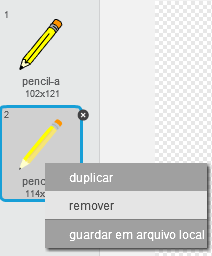
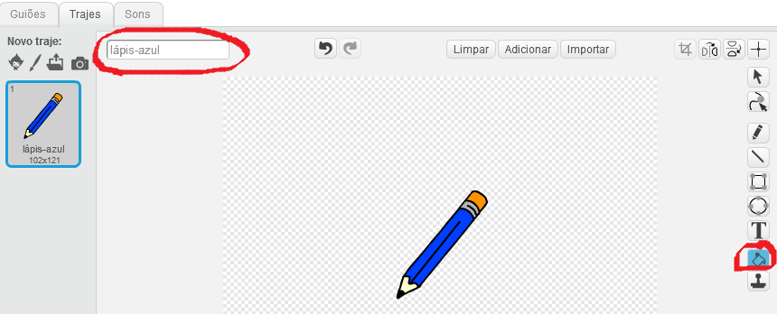
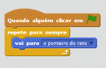
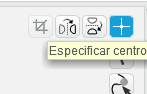
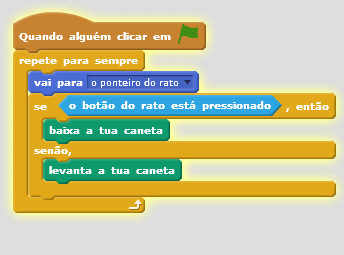
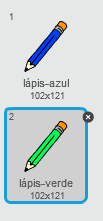
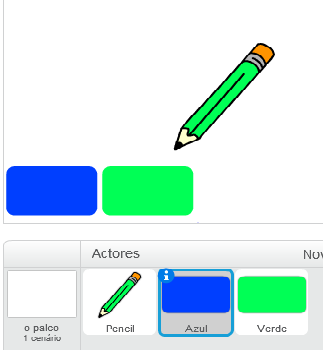
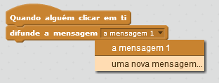
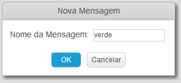
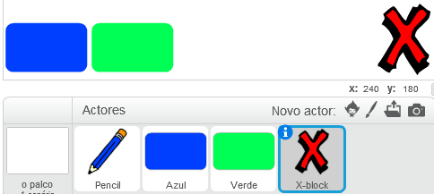

---
title: Caixa de Pintura
level: Scratch 1
language: pt-PT
stylesheet: scratch
embeds: "*.png"
materials: ["Recursos Clube Líder/*","Recursos do Projeto/*"]
...

# Introdução { .intro }

Neste projeto vais criar o teu proprio programa de desenho!

<div class="scratch-preview">
  <iframe allowtransparency="true" width="485" height="402" src="http://scratch.mit.edu/projects/embed/63473366/?autostart=false" frameborder="0"></iframe>
  
</div>

# 1ºPasso: Criar um lápis { .activity }

Vamos começar por criar um lápis, que utilizaremos para desenhar no palco.

## Lista de tarefas da atividade { .check }

+ Cria um novo projeto no Scratch, e apaga o objeto gato de maneira a que o projeto fique totalmente vazio. Podes encontrar o editor online do Scratch em <as href="http://jumpto.cc/scratch-new">jumpto.cc/scratch-new</a>.

+ Insere o objeto lápis no teu projeto.

	

+ Faz clique em “Trajes”, e apaga o traje “lápis-b”.

	

+ Troca o nome do traje por “lápis-azul”, e usa a ferramenta “colorir uma forma” para fazer que o lápis seja azul.

	

+ Como vais utilizar o rato para desenhar, vais querer que o lápis siga o rato `sempre` {.blockcontrol}. Insere este código ao teu lápis:

	

+ Experimenta o código fazendo clique na bandeira e logo movendo o rato pelo palco. Funciona como esperavas?

+ Já reparas te que é o meio do lápis, e não a ponta, o que segue o ponteiro do rato?

	

	Para reparar isso, faz clique no traje “lápis-azul” do objeto lápis, e depois faz clique em "Especificar centro do traje".

	

+ Deveras ver uma cruz que aparece no traje. Agora faz clique debaixo da ponta do lápis para fixar esse ponto como o meio do traje.

	

+ Faz clique na janela “Giões”, e experimenta o teu lápis mais uma vez. Funciona melhor do que antes?

+ Agora faremos que o lápis desenhe `se` {.blockcontrol} fizermos clique no rato. Insere este código ao objeto lápis:

	

+Experimenta o teu código novamente. Esta vez mexe o lápis pelo palco e mantem apertado o botão do rato. Consegues desenhar melhor com o lápis?

	

## Guarda o teu projeto { .save }

# 2ºPasso: Lápis de cores { .activity }

Vamos inserir lápis de cores diferentes ao teu projeto e vamos permitir que o usuário possa escolher entre eles!

## Lista de tarefas da atividade { .check }

+ Faz clique no objeto lápis, faz clique em “trajes” e duplica o traje “lápis-azul”.

	

+ Renomeia o novo traje para “lápis-verde” e pinta o lápis de cor verde.

	

+ Cria dos novos objetos que utilizaras para selecionar o lápis azul ou o verde.

	

+ Ao fazer clique sobre o item de seleção verde, precisas de `enviar` {.blockevents} uma mensagem ao objeto lápis, dizendo lhe que tem de trocar o seu traje e a cor do lápis.

	Para fazer isto, insere este código ao objeto de seleção verde:

	```blocks
		when this sprite clicked
		broadcast [green v]
	```

	Para criar o bloco `enviar` {.blockevents} faz clique na seta para baixo e seleciona “nova mensagem…”.

	

	Depois escreve “Verde” para criar a tua nova mensagem.

	

+ Agora precisas de dizer ao teu objeto lápis o que tem de fazer quando recebe a mensagem. Insere este código ao objeto lápis:

	```blocks
		when I receive [green v]
		switch costume to [pencil-green v]
		set pen color to [#00ff00]
	```

	Para fazer que o lápis pinte de cor verde, faz clique na caixa da cor do bloco `fixar cor` {.blockpen} , e depois faz clique no ícone de seleção verde para escolher o verde como a cor para o teu lápis.

+ Agora podes fazer o mesmo para o lápis azul,  inserindo este código ao objeto de seleção azul:

	```blocks
		when this sprite clicked
		broadcast [blue v]
	```

	…e insere este código ao objeto lápis:

	```blocks
		when I receive [blue v]
		switch costume to [pencil-blue v]
		set pen color to [#0000ff]
	```

+ Por ultimo precisas de dizer ao objeto lápis que traje e que cor de lápis deve escolher, e que depois deve limpar o ecrã quando começar o projeto. Insere este código ao objeto lápis no começo do código `ao pressionar a bandeira verde` {.blockevents} (antes do bloco `por sempre` {.blockcontrol} ):

	```blocks
		clear
		switch costume to [blue-pencil v]
		set pen color to [#0000ff]
	```

	Se quiseres, podes começar com uma cor de lápis diferente!

+ Experimenta o teu projeto. Podes trocar entre o lápis azul e o verde?

	

## Guarda o teu projeto { .save }

# 3ºPasso: Cometer erros { .activity .new-page }

As vezes cometem se erros, por isso vamos inserir um botão de “limpar” e uma borracha ao nosso projeto!

## Lista de tarefas da atividade { .check }

+ Vamos inserir um botão para limpar o palco. Para fazer isto inserimos o objeto da letra ‘X-block’ ao palco e depois pintamos a letra de vermelho.

	

+ Insere este código ao teu novo botão de cancelar para limpar o palco ao pressionar nele.

	```blocks
		when this sprite clicked
		clear
	```

	Repara que não precisas de enviar uma mensagem para limpar o palco já que qualquer objeto pode faze lo!

+ Também podes criar uma borracha. Se o líder do club te deu um portefólio de “Recursos” faz clique em “carregar traje deste arquivo” e insere a imagem “eraser.svg”.

	

	Se não tens a imagem eraser.svg cria no seu lugar um novo lápis branco!

+ Também deves inserir a imagem da borracha como um novo objeto de seleção. O teu palco deveria se parecer com este:

	

+ A continuação podes inserir este código ao objeto de seleção borracha para dizer ao lápis que se convirta numa borracha.

	```blocks
		when this sprite clicked
		broadcast [eraser v]
	```

+ Quando o lápis receber está mensagem podes criar uma borracha fazendo que se troque o traje do lápis ao da borracha, e trocar a cor do lápis pela mesma cor do palco!

	```blocks
		when I receive [eraser v]
		switch costume to [eraser v]
		set pen color to [#FFFFFF]
	```

+ Prova o teu projeto para ver se consegues limpar e apagar no palco.

	

+ Há outro problema com o lápis – podes desenhar em qualquer parte do palco, até perto dos ícones de seleção!

	

	Para configurar isto tens que dizer ao lápis que so desenhe se se faz clique no rato _e_ se a posição do rato for maior que -110 (`mouse y`{.blocksensing}`> -120` {.blockoperators}). Troca a instrução `se` {.blockcontrol} do teu lápis para que seja como esta:

	

+ Experimenta o teu projeto. Agora não deverias poder desenhar perto dos blocos de seleção.

	

## Guarda o teu projeto { .save }

# 4ºPasso: Trocar a grossura do lápis { .activity .new-page }

Vamos fazer que o usuário possa desenhar utilizando diferentes tamanhos de lápis.

## Lista de tarefas da atividade { .check }

+ Primeiro insere uma nova variável que se chame “grossura”. Se não te lembras como se faz o projeto “Globos” pode te ajudar.

+ Insere esta linha _dentro_ do bloco de código `para sempre` {.blockcontrol} do teu lápis:

	```blocks
		set pen size to (width)
	```

	 Agora a grossura do teu lápis fixara se repetidamente ao valor da variável “grossura”.

+ Podes trocar o valor guardado nesta variável fazendo clique com o botão direito sobre a variável (no palco) e selecionando “deslizador”.

	

	Agora podes arrastar o deslizador que há debaixo da variável para trocar o seu valor.

	

+ Experimenta o teu projeto e comprova se podes modificar a   grossura do teu lápis.

	

	Se preferires podes fixar o valor mínimo e máximo de “grossura” permitido. Para fazer isso faz clique de novo com o botão direito sobre a variável e seleciona “fixar rango do deslizador”. Fixa os valores mínimos e máximos da tua variável entre 1 e 20.

	

	Segue provando a tua variável grossura até estares satisfeito.

## Guarda o teu projeto { .save }

## Desafio: Acessos diretos { .challenge }
Podes criar acessos diretos no teclado para os teus comandos.Por exemplo:

+ a = Trocar para o lápis azul
+ v = Trocar para o lápis verde
+ b =  Trocar para a borracha
+ l = Limpar ecrã

Incluso poderias fazer que o usuário pode se trocar a grossura do lápis com as teclas das setas!

## Guarda o teu projeto { .save }

## Desafio: Mais lapises { .challenge }
Podes inserir lápis de cor vermelho, amarelo e preto ao teu programa para pintar. Encontraras todas as imagens necessárias no portefólio “Recursos”. Lembra te de inserir os acessos diretos no teclado paras estos novos lapises.

Podes usar os teus lapises para fazer um desenho?


