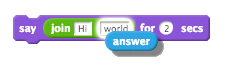

---
title: ChatBot
level: Scratch 1
language: en-GB
stylesheet: scratch
embeds: "*.png"
materials: ["Club Leader Resources/*.*"]
...

# Introducere { .intro }

Acum vom învăța cum să programăm propriul nostru robot vorbitor!

<div class="scratch-preview">
  <iframe allowtransparency="true" width="485" height="402" src="http://scratch.mit.edu/projects/embed/26762091/?autostart=false" frameborder="0"></iframe>
  
</div>

# Pasul 1: Robotul vostru vorbitor { .activity}

## Lista de Activități { .check }

+ Înainte de a începe să construim robotul vorbitor trebuie să hotărâm care sunt trăsăturile sale.
	+ Care este numele robotului?
	+ Unde locuiește robotul?
	+ Cum este robotul? Este vesel? Este amuzant? Timid? Prietenos?

+ Porniți un nou proiect Scratch și ștergeți sprite-ul pisică astfel încât proiectul vostru să fie gol. Puteți găsi editorul online Scratch la adresa <a href="http://jumpto.cc/scratch-new">jumpto.cc/scratch-new</a>.

+ Alegeți un personaj dintre cele de mai jos și adăugați-l la proiectul vostru:

	

+ Alegeți un fundal care se potrivește cu personalitatea robotului. Mai jos aveți un exemplu, dar fundalul voastru nu trebuie să arate la fel:

	

## Salvează proiectul { .save }	

# Pasul 2: Un robot care vorbește { .activity }

Acum că avem un robot cu personalitate, haideți să îl programăm să vorbeasca cu noi.

## Lista de Activități { .check }

+ Faceți click pe personajul robot și adăugați codul următor:

	```blocks
		cand se da click pe acest sprite
		întreabă [Salut! Care e numele tău?] și așteaptă
		spune [Ce nume frumos!] pentru (2) sec
	```
+ Faceți clic pe robot pentru a-l testa. După ce sunteți întrebați despre numele vostru, introduceți răspunsul în cutia din partea de jos a scenei.

	

+ Robotul va răspunde "Ce nume frumos!" de fiecare dată. Puteți să personalizați răspunsul robotului folosindu-vă de răspunsul dat de utilizator. Modificați codul robotului ca să arate în felul următor: 

	```blocks
		cand se da click pe acest sprite
		întreabă [Salut! Care e numele tău?] și așteaptă
		spune <imbina [Salut] (răspuns)> pentru (2) sec
	```
	
	Pentru a crea ultimul bloc de cod trebuie să faceți clic pe un bloc verde 'imbina' {.blockoperators} și să îl trageți peste blocul 'spune' {.blocklooks}.
	
	
	
	Acum putem să modificăm textul 'hello', înlocuindu-l cu 'Salut', și să tragem blocul albastru deschis 'răspuns' {.blocksensing} peste textul 'world'.


	

+ Testați acest nou program. Funcționează cum ne așteptam? Vedeți vreo problemă la el și puteți să o rezolvați? (Indiciu: puteți încerca să adăugați un spațiu undeva!)	

+ Poate doriți să păstrați numele utilizatorului într-o variabilă, pentru a-l folosi din nou mai târziu. Creați o nouă variabilă numită 'nume' {.blockdata}. Dacă ați uitat cum se creează o variabilă, proiectul 'Balloons' vă va ajuta.

+ Informația introdusă de voi este deja păstrată într-o variabilă specială numită 'răspuns' {.blocksensing}. Mergeți la grupul de blocuri Detectie și faceți clic pe blocul răspuns astfel încât să apară o bifă. Valoarea curentă a variabilei 'răspuns' {.blocksensing} ar trebui să fie afișată în partea din stânga sus a scenei.

+ Odată ce ați creat variabila nouă, codul robotului vostru ar trebui să arate cam așa:

	```blocks
		cand se da click pe acest sprite
		întreabă [Salut! Care e numele tău?] și așteaptă
		modifică [nume v] cu (răspuns)
		spune <imbina [Salut ] (nume)> pentru (2) sec
	```

+ Dacă testați programul din nou veți observa că răspunsul dat este păstrat în variabila 'nume' {.blockdata} și este afișat în partea din stânga sus a scenei. Variabila 'nume' {.blockdata} ar trebui să conțină acum aceeași valoare ca și variabila 'răspuns' {.blocksensing}.

	
	
	Dacă nu doriți să vedeți variabilele afișate pe scena voastră puteți să faceți clic pe bifa alăturată numelui variabilei din secțiunea 'Script-uri' pentru a le ascunde.


## Salvează proiectul { .save }

## Provocare: Mai multe întrebări { .challenge }

Programați robotul vostru să pună altă întrebare. Puteți păstra răspunsul utilizatorului într-o variabilă?


## Salvează proiectul { .save }

# Pasul 3: Să luăm decizii { .activity }

Puteți programa robotul să decidă ce să facă, în funcție de răspunsurile utilizatorului.

## Lista de Activități { .check }

+ Haideți să facem robotul să pună o întrebare la care să răspundem cu 'da' sau 'nu'. Aici aveți un exemplu, dar puteți schimba întrebarea dacă vreți:

	```blocks
		cand se da click pe acest sprite
		întreabă [Salut! Care e numele tău?] și așteaptă
		modifică [nume v] cu (răspuns)
		spune <imbina [Salut ] (nume)> pentru (2) sec
		întreabă <imbina [Te simți bine ] (nume)> and wait
		dacă ((răspuns)=[Da]) atunci
			spune [Mă bucur să aud asta!] pentru (2) sec
		end
	```
	
	Observați că acum ați păstrat numele utilizatorului într-o variabilă și puteți să o folosiți cât de des vreți.

+ Pentru a testa acest program cum trebuie, va trebui să îl testați de două ori - o dată răspunzând cu 'Nu' și o dată cu 'Da'. Robotul ar trebui să răspundă doar 'dacă' {.blockcontrol} răspunsul dat este 'Da'.

+ Problema cu robotul vostru este că nu dă nici o replică dacă utilizatorul răspunde cu 'Nu'. Puteți să rezolvați această problemă modificând blocul 'dacă' {.blockcontrol} într-un block 'dacă/altfel' {.blockcontrol}, astfel încât codul vostru să arate așa:

	```blocks
		cand se da click pe acest sprite
		întreabă [Salut! Care e numele tău?] și așteaptă
		modifică [nume v] cu (răspuns)
		spune <imbina [Salut ] (nume)> pentru (2) sec
		întreabă <imbina [Te simți bine ] (nume)> and wait
		dacă ((răspuns)=[Da]) atunci
			spune [Mă bucur să aud asta!] pentru (2) sec
		altfel
			spune [Oh nu!] pentru (2) sec
		end
	```

+ Dacă testați codul acum, veți observa că primiți o replică atât atunci când răspundeți cu 'Da' cât și cu 'Nu'. Robotul ar trebui să spună `Mă bucur să aud asta!` când răspundeți cu 'da', dar va spune `Oh nu!` dacă răspundeți orice altceva decât 'da' ('altfel' {.blockcontrol} înseamnă 'în caz contrar')
	
	

+ Puteți pune orice cod în cadrul unui block 'dacă' {.blockcontrol} sau 'altfel' {.blockcontrol}, nu doar cod ce face robotul să vorbească. De exemplu puteți să schimbați înfățișarea robotului în așa fel încât să se potrivească cu răspunsul primit.
	
	Dacă vă uitați la costumele robotului, veți vedea că sunt mai multe. (Dacă nu sunt mai multe, puteți să le adăugați voi!)

	

	Puteți să folosiți aceste costume ca parte a răspunsului robotului adăugând acest cod:

	```blocks
		cand se da click pe acest sprite
		întreabă [Salut! Care e numele tău?] și așteaptă
		modifică [nume v] cu (răspuns)
		spune <imbina [Salut ] (nume)> pentru (2) sec
		întreabă <imbina [Te simți bine ] (nume)> and wait
		dacă ((răspuns)=[Da]) atunci
			switch costume to [nano-c]
			spune [Mă bucur să aud asta!] pentru (2) sec
		altfel
			switch costume to [nano-d]
			spune [Oh nu!] pentru (2) sec
		end
	```

+ Testați din nou programul. Ar trebui să vedeți cum fața robotului se schimbă în funcție de răspunsul pe care îl dați.

	

## Salvează proiectul { .save }

## Provocare: Mai multe decizii { .challenge }

Programați robotul să pună o altă întrebare - din nou o întrebare la care se răspunde cu 'da' sau 'nu'. Puteți să faceți robotul să reacționeze la răspunsul primit?


## Salvează proiectul { .save }

# Pasul 4: Să schimbăm locația { .activity }

Puteți programa robotul să își schimbe și locația.

## Lista de Activități { .check }

+ Adăugați un nou fundal scenei voastre, de exemplu fundalul 'lună'

	

+ Acum puteți să programați robotul să își schimbe locația, adăugând această bucată de cod:

	```blocks
		întreabă [Mă duc pe lună. Vrei să vii cu mine?] și așteaptă
		dacă ((răspuns) = [da]) atunci
			switch backdrop to [moon v]
		end
	```
+ De asemenea trebuie să ne asigurăm că robotul nostru este afară când începem să vorbim cu el. Adăugați acest bloc la începutul codului robotului:

	

+ Testați programul și răspundeti 'da' când sunteți întrebați dacă vreți să mergeți pe Lună. Ar trebui să vedeți cum locația robotului se modifică.

	

+ Își va schimba robotul locația dacă răspundeți 'nu' la întrebarea lui? Dar dacă răspundeți 'nu sunt sigur'?

+ Puteți să adăugați și acest cod in blocul 'dacă' {.blockcontrol} pentru a-l face pe robot să sară în sus de 4 ori dacă răspundeți cu 'da' la întrebarea lui:

	```scratch
	repeta (4)
		modifică y cu (10)
		asteapta (0.1) sec
		modifică y cu (-10)
		asteapta (0.1) sec
	end
	```

	

+ Testați-vă codul din nou. Robotul vostru sare dacă răspundeți cu 'da'?

## Salvează proiectul { .save }

## Provocare: Construiți propriul vostru robot {.challenge}
Folosiți ce ați învățat în această lecție pentru a termina robotul vostru interactiv. Iată câteva idei pe care le puteți folosi:


Odată ce ați terminat de programat robotul vostru, chemați-vă prietenii să povestească cu el! Le place robotul vostru? Au găsit vreo problemă la el?

## Salvează proiectul { .save }
